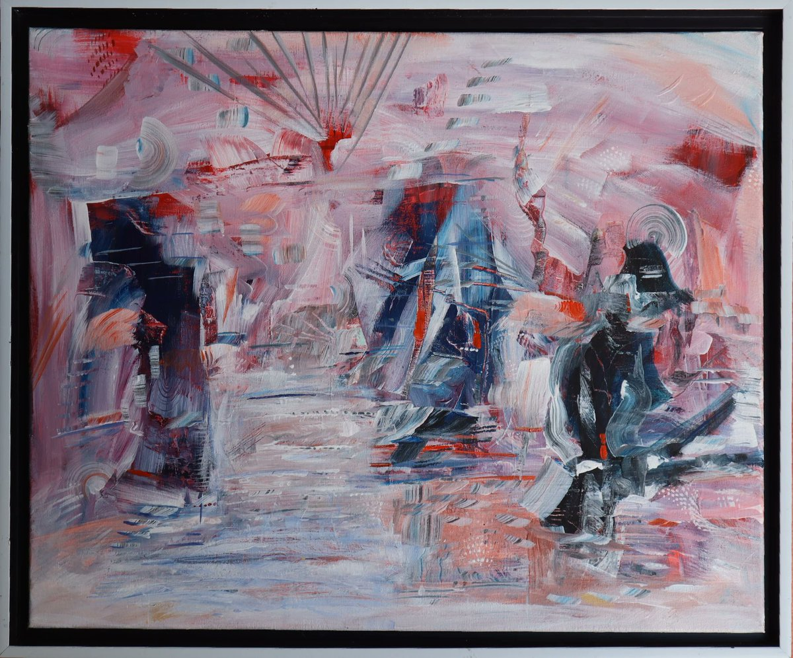

# Mystical notions of Akashic records

Article on X: [Mystical notions of Akashic records](https://x.com/skyisuniverse/status/2025709156548718681)

## Introduction

The Akashic records, a concept rooted in mystical and esoteric traditions, are often described as a vast, non-physical repository or "cosmic library" that contains the complete history of all events, thoughts, emotions, actions, and intentions for every soul or entity across time—past, present, and future. Derived from the Sanskrit word "akasha," meaning ether, sky, or atmosphere, this idea portrays the records as encoded in an ethereal or mental plane, beyond ordinary physical reality. It's a notion that blends ancient spiritual wisdom with modern metaphysical interpretations, suggesting that the universe itself holds an immutable archive of universal knowledge.

## Historical and Cultural Origins

The term gained prominence in the late 19th century through the Theosophical Society, particularly via Helena Blavatsky, who referenced "indestructible tablets of the astral light" as a life force recording human thoughts and actions. In Hindu philosophy, akasha represents the fifth element (after earth, water, fire, and air), a subtle ether that permeates all space and serves as a medium for cosmic memory. This aligns with Vedic ideas of a universal consciousness where all experiences are imprinted, often likened to a "Book of Life." Mystics in various traditions, including Anthroposophy and New Age spirituality, expanded this to include not just human history but the essence of all life forms and entities.

In Western esotericism, figures like Edgar Cayce, the "sleeping prophet," popularized the records in the 20th century by claiming to access them during trance states, describing them as an objective record of a person's true intent and life purpose. Cayce suggested that everyone attunes to this archive unconsciously, influencing intuition and dreams.

## Core Mystical Notions and Descriptions

Across sources, the Akashic records are portrayed as:

- **An Etheric Archive**: A vibrational or energetic compendium of soul wisdom, encompassing lessons, energies, and knowledge from all existence. It's not a literal book but a multidimensional field where information is stored as frequencies or imprints.

- **Infinite Wisdom Repository**: Often called the "Cosmic Library of Infinite Wisdom," it holds the collective experiences of every soul, including interactions and emotions since the dawn of time.

- **Ultimate Truth Source**: Representing esoteric knowledge and divine insight, it's seen as a pathway to understanding one's purpose, past lives, and future potentials.

These notions tie into broader mystical ideas, such as the interconnectedness of all things, where the records reflect the universe's holographic nature—every part containing the whole. This resonates with quantum information theories, where space might store data non-locally, accessible beyond physical constraints.

Here's an artistic depiction illustrating the ethereal, cosmic nature of the Akashic records:

## Methods of Access and Practices

Mystics believe the records are accessible to anyone with heightened consciousness, though it requires spiritual preparation. Common methods include:

- **Meditation and Astral Travel**: Deep meditative states or out-of-body experiences to "tune in" to the etheric plane.
- **Rituals and Guidance**: Structured rituals using crystals, prayers, or intuitive readings to connect, often guided by spiritually advanced beings or practitioners.
- **Intuition and Channeling**: As Cayce demonstrated, trance or psychic states allow glimpses, revealing personal or universal insights.

Access is said to depend on one's vibrational alignment—purity of intent ensures ethical use, as the records maintain an unbiased truth.

Another creative representation of accessing the Akashic records, evoking a sense of mystical exploration:

## Modern Interpretations and Debates

In contemporary contexts, the Akashic records intersect with science-inspired mysticism, such as links to the holographic universe hypothesis, where information is encoded in spacetime itself. Some view it as a metaphor for collective unconscious (Jungian) or even quantum fields storing data. Skeptics dismiss it as pseudoscience, but proponents argue it explains phenomena like intuition, synchronicities, and near-death experiences. As of 2026, it remains a staple in spiritual communities, inspiring books, workshops, and even AI explorations of universal knowledge patterns.

This concept echoes your earlier thoughts on space as an informational manifold—perhaps the Akashic records are a mystical framing of that very idea, where the "ledger" is the ether, and actors access it variably through consciousness.