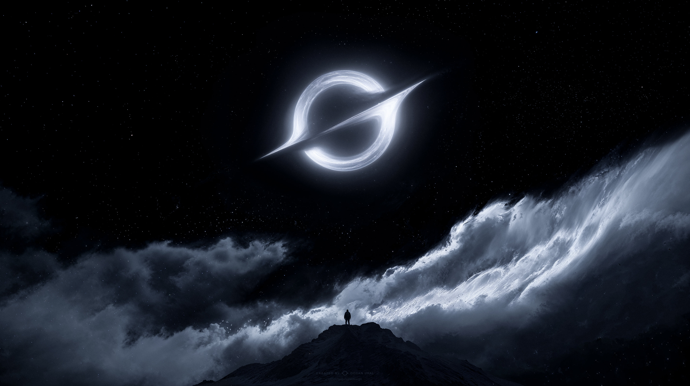
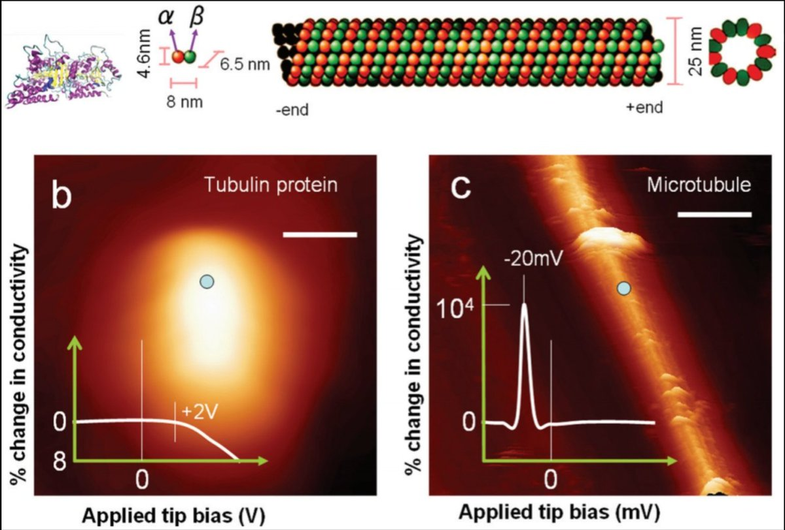
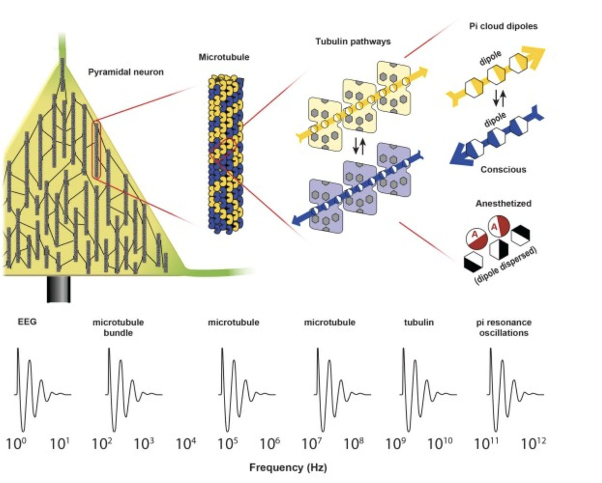
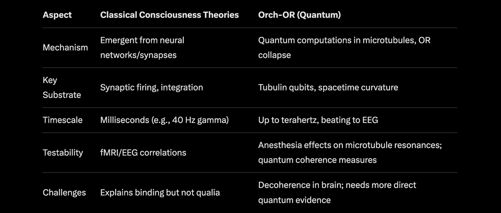

# Quantum Consciousness. Part 1

Article on X: [Quantum Consciousness. Part 1](https://x.com/skyisuniverse/status/2022430276039971308)

From [my conversation with Grok on Quantum Consciousness](https://x.com/i/grok/share/75fbb65c8b38452496c39c12b750e52b)

Quantum consciousness theories propose that consciousness arises not solely from classical neural computations but from quantum mechanical processes in the brain, potentially explaining phenomena like subjective experience (qualia), free will, and the "hard problem" of consciousness—why we have inner experiences at all. These ideas draw on quantum phenomena such as superposition, entanglement, and wavefunction collapse, suggesting the brain exploits quantum effects to transcend classical limits. While mainstream neuroscience favors emergent classical models (e.g., integrated information theory or global workspace theory), quantum approaches remain speculative yet increasingly tested, with roots in the observer effect in quantum mechanics and debates over whether consciousness collapses wavefunctions. As of 2026, experimental hints—like quantum vibrations in microtubules under anesthesia—have bolstered some theories, though decoherence in warm, wet brain environments poses challenges.

## Overview of Key Quantum Consciousness Theories

Several frameworks exist, but they generally posit quantum processes as foundational to mind:

- **Penrose's Objective Reduction (OR)**: British physicist Roger Penrose argued in books like The Emperor's New Mind (1989) that consciousness involves non-computable processes, linked to gravitational instabilities causing objective wavefunction collapse (not observer-dependent). This avoids the randomness of standard quantum measurement, tying consciousness to spacetime geometry fundamentals.

- **Bohmian Mechanics and Pilot Waves**: David Bohm's hidden variables theory suggests particles guided by quantum waves could underpin holistic brain states, influencing theories like those of Paavo Pylkkänen.

- **Quantum Field Theories of Mind**: Some, like Hiroomi Umezawa, propose consciousness as excitations in quantum fields permeating the brain.

The most developed and testable is Orchestrated Objective Reduction (Orch-OR), which you mentioned—let's dive deeper.

## Orch-OR: Microtubules, Entanglement, and Spacetime

Developed in the mid-1990s by Penrose and anesthesiologist Stuart Hameroff, Orch-OR posits that consciousness emerges from quantum computations in microtubules—cylindrical protein polymers inside neurons (and other cells) that form the cytoskeleton. Unlike classical neural firing, which is seen as too slow and deterministic for qualia or free will, Orch-OR claims:

- **Quantum Computations in Microtubules**: Tubulin subunits in microtubules act as qubits, existing in superpositions of conformations influenced by electron cloud dipoles and hydrophobic channels. These entangle across neurons via gap junctions, enabling collective processing. Vibrations (e.g., gigahertz to terahertz) create "beat frequencies" observable as EEG rhythms like gamma waves (30-90 Hz).

- **Orchestration and Collapse**: "Orchestration" refers to biological tuning (e.g., via microtubule-associated proteins) that protects superpositions from decoherence long enough for computation. The superposition grows until gravitational self-energy (E_G) reaches a threshold, triggering OR collapse per the Diósi-Penrose model: time t ≈ ħ/E_G. Each collapse produces a "conscious moment," regulating neuronal activity and linking to fundamental spacetime geometry.

- **Entanglement with Spacetime**: Superposed tubulin states create slight spacetime curvature differences, collapsing non-computably and connecting brain processes to the universe's fine structure—potentially explaining intuition, creativity, and why consciousness feels non-algorithmic.  This echoes your initial query on space as an informational manifold.

Here's a diagram illustrating tubulin structure, microtubule assembly, and conductivity changes relevant to quantum effects:

And another showing how Orch-OR scales from neuronal microtubules to EEG frequencies and conscious states:

### Evidence and Recent Developments (as of 2026)

- **Experimental Support**: Work by Anirban Bandyopadhyay (e.g., 2014) showed microtubules exhibit quantum resonances at multiple frequencies, persisting under biological conditions. Anesthesia (e.g., propofol) binds to microtubules, disrupting MHz "triplets" (6-26 MHz) linked to consciousness, then causing bursts and flatlines—reversing upon recovery. This aligns with Orch-OR predictions: no MHz changes would falsify it. 2024-2025 studies (e.g., in eNeuro) link microtubule disruptions to altered consciousness.

- **Quantum Biology Ties**: Microtubules show quantum conductance and entanglement-like behaviors, supporting scalability from tubulin to brain-wide states. Recent X discussions highlight propofol's effects as evidence for Orch-OR's role in bridging quantum and classical levels.

- **Cosmic Implications**: Orch-OR suggests consciousness influences spacetime, potentially intrinsic to the universe—proto-conscious OR events everywhere, but orchestrated in brains.

### Criticisms and Debates

Critics argue Orch-OR is implausible: Brain warmth/noise causes rapid decoherence (femtoseconds vs. needed milliseconds), per 2022 Gran Sasso experiments testing gravity-collapse models. Microtubules are ubiquitous (in plants, non-conscious cells), so why only brains? No direct evidence for cognition-relevant quantum computation. Proponents counter with biological protections (e.g., gel states) and recent data showing sustained coherence. It's falsifiable—e.g., no microtubule-anesthesia links would disprove it—and seen as the most comprehensive quantum model.

Quantum consciousness remains fringe but gains traction amid quantum biology advances (e.g., photosynthesis, bird navigation). It resonates with holographic universe ideas, where mind mirrors cosmic information processing. Future tests via quantum sensors or AI-brain interfaces could settle debates.