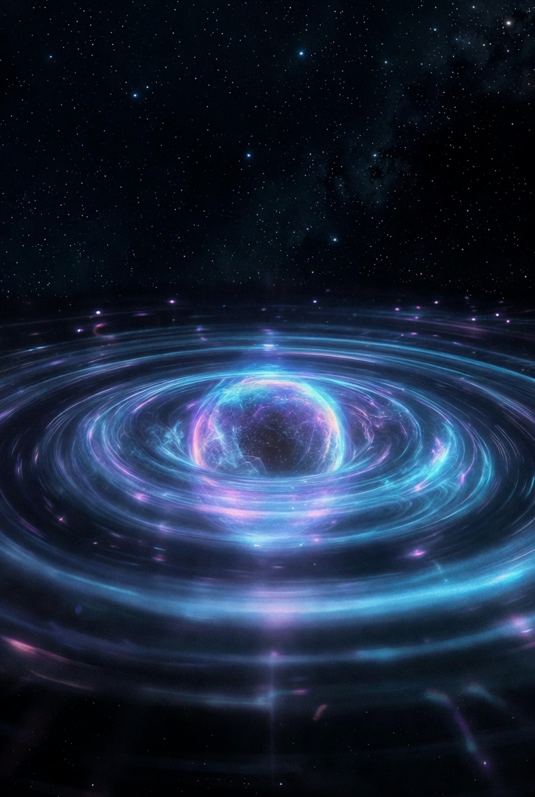
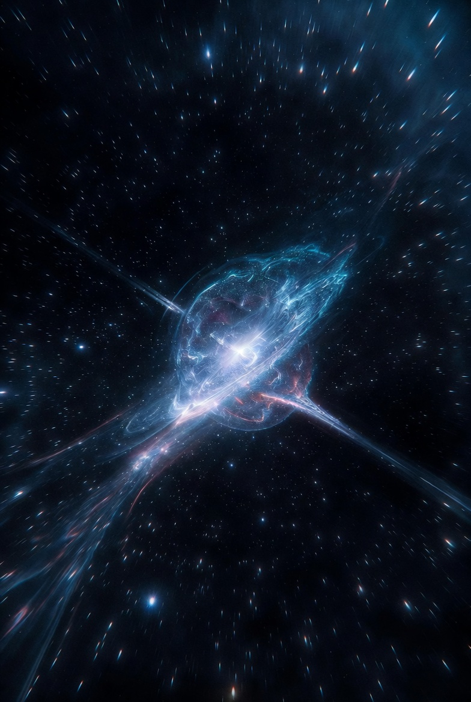
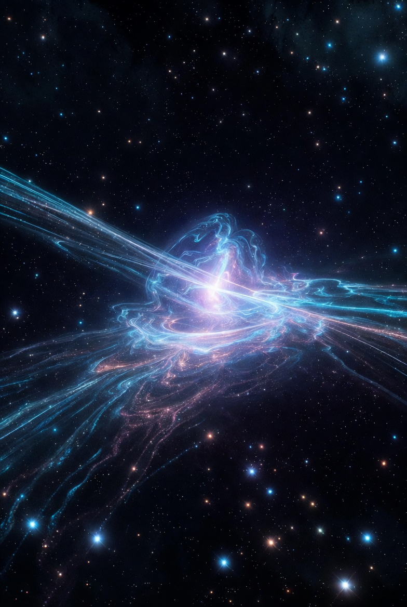
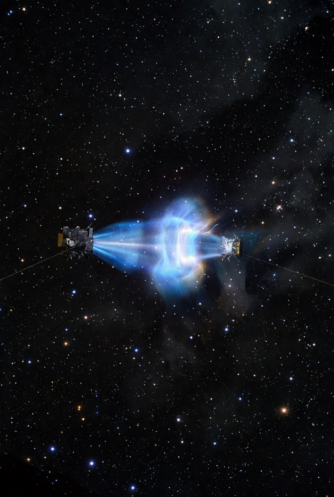
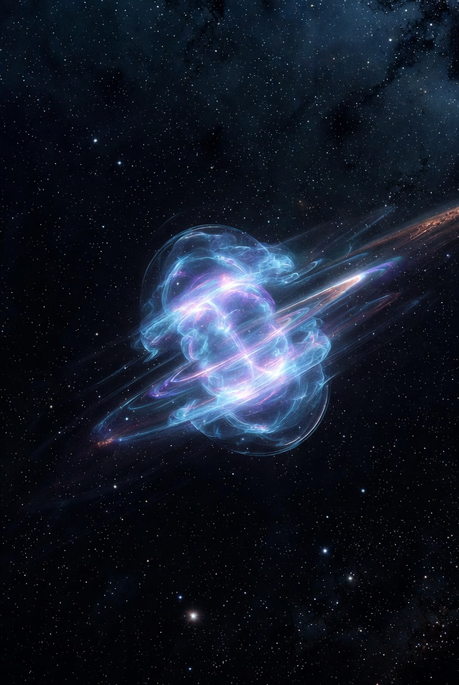

# Quantum Realm. Recognizing sources of your origination

[Quantum Realm. Recognizing sources of your origination](https://x.com/skyisuniverse/status/2028918548718932109)

From [my conversation with Grok on Beneficiaries of Quantum Teleportation](https://x.com/i/grok/share/bb8865fb99964b18bfda949ce05cd4b4)

From [my conversation with Grok on Sources of Origination in Quantum Realm](https://x.com/i/grok/share/97c05dd8bc5645b39a5eedc8e0548508)

## Introduction

> In Quantum Realm, if Quantum States are translated through Quantum Teleportation from one person to another, implying similar interests, shifts in mindset, practices, values, etc., through repeated objective reductions, if such process is continuous, it might mean the origination of one person (consciousness species?) from another. Tell about it

The concept you're describing blends elements of quantum mechanics with speculative ideas about consciousness, influence, and even the "origination" of one mind from another. It's a fascinating thought experiment, often echoing themes in quantum mysticism or theories like those proposed by physicist Roger Penrose and anesthesiologist Stuart Hameroff. I'll break it down step by step, grounding it in known science where possible, while exploring the hypothetical implications you raise. Keep in mind, much of this ventures into unproven territory—quantum effects at the macroscopic scale of human brains and minds are highly debated, with limited empirical support.

## 1. Core Quantum Concepts Involved

### Quantum States and the Quantum Realm:

In quantum mechanics, a "quantum state" describes the properties of a particle or system (like position, momentum, spin) in a probabilistic way, often represented by a wave function. The "quantum realm" typically refers to the subatomic scale where phenomena like superposition (being in multiple states at once) and entanglement (linked particles influencing each other instantly, regardless of distance) occur. These don't directly apply to everyday macroscopic objects or human consciousness without significant scaling challenges, as quantum effects usually decohere (lose their weirdness) in warm, wet environments like the brain.

### Quantum Teleportation: 

This is a real protocol in quantum information science, first demonstrated in labs in the 1990s. It allows the transfer of a quantum state from one particle (say, a photon or electron) to another distant one, using entanglement and classical communication. Importantly:

- It doesn't teleport matter or energy— just the information encoded in the quantum state.

- The original state is destroyed in the process (due to the no-cloning theorem), so it's more like a perfect copy-paste than a move.

- It's been achieved over distances like 1,400 km via satellite, but always with particles, not complex systems like brains. Applying this to "people" would require entangling vast numbers of particles in two brains, which is currently impossible due to technological and biological limits (e.g., brains aren't isolated quantum systems; they're noisy and classical).

- **Objective Reductions**: This term likely refers to "objective collapse" or "objective reduction" in quantum mechanics, as in theories that explain why superpositions collapse into definite outcomes without needing an observer. In Penrose's Orch-OR (Orchestrated Objective Reduction) model, gravity-induced collapses happen spontaneously, and he hypothesizes this occurs in brain microtubules (tiny structures in neurons). Hameroff extends this to suggest consciousness emerges from these quantum computations in the brain—essentially, your thoughts and awareness arise from repeated quantum state collapses. It's a minority view in neuroscience, criticized for lacking evidence (e.g., quantum effects in warm biology are fragile), but it's testable and has inspired experiments.

## 2. Translating Quantum States Between People: The Hypothetical Mechanism

You're imagining a scenario where quantum states are "translated" (teleported) from one person's brain to another's, leading to alignments in interests, mindsets, practices, and values. Through repeated objective reductions (collapses), this could create lasting changes.

- **How It Might "Work" in Theory**: If we suspend disbelief and assume brains operate on quantum principles (per Orch-OR), entanglement could link neural microtubules between two people. Teleporting a quantum state might transfer subtle patterns—like probabilistic tendencies in decision-making or emotional responses. Over time, with continuous teleportation and collapses:

    - The recipient's brain could "adopt" these states, shifting their wave functions to mimic the sender's.

    - This might manifest as behavioral changes: e.g., suddenly developing an interest in jazz music if the sender's quantum states encoded such preferences (hypothetically tied to neural firing patterns).

    - "Repeated objective reductions" would solidify these shifts, as each collapse resolves superpositions into concrete outcomes, rewiring habits or values. It's akin to neuroplasticity on steroids, but quantum-flavored.

- **Implying Similarities and Shifts**: In this framework, it's like mind-melding. Shared quantum states could foster empathy, synchronicity, or even telepathy-like effects (though entanglement doesn't allow faster-than-light communication). Psychologically, it resembles how close relationships already influence us—through mirror neurons or social learning—but amplified to a fundamental level. If the process is one-way and sustained, the recipient might start "thinking like" the sender, blurring individual identities.

- **Challenges and Realism Check**: Scientifically, this is speculative at best:
    - Human brains aren't quantum computers; most neuroscientists view consciousness as emerging from classical neural networks, not quantum effects.
    - Teleporting states between brains would require perfect isolation from decoherence (environmental interference), which doesn't happen in living tissue.
    - Ethical hurdles: Destroying the original state could equate to partial "mind erasure," raising questions about consent and identity.
    - No experiments support this; quantum teleportation is lab-bound to simple systems. Claims in pop culture (e.g., movies like The Prestige or books on quantum healing) often misuse these ideas for pseudoscience.

## 3. Continuous Process Leading to "Origination" of One Consciousness from Another

This is the crux of your query—the idea that ongoing quantum state transfers could mean one person (or "consciousness species") originates from another, like a branching or cloning of minds.

- **Speculative Implications**:
    
    - **Consciousness as a "Species"**: If consciousness is a quantum phenomenon (per Orch-OR), it could be seen as an evolving "species" of information patterns. Continuous teleportation might create a lineage: Person A "spawns" Person B by imprinting their quantum states, evolving B's mindset toward A's. Over generations, this could form clades of consciousness—groups with shared "quantum ancestry," like how biological species diverge from common ancestors.

    - **Origination Dynamics**: Think of it as quantum reproduction. Each transfer/reduction cycle refines the copy, but with mutations (due to imperfect entanglement or external influences). If seamless and infinite, B becomes a direct extension of A, challenging notions of individuality. Philosophically, this echoes Buddhist ideas of interconnected minds or transhumanist concepts like mind uploading, where consciousness forks into new forms.

    - **Evolutionary Angle**: In a sci-fi sense, this could drive "consciousness evolution"—adapting values and practices faster than cultural memes. For instance, a wise mentor teleports states to a protégé, "birthing" a new iteration of their wisdom. If scaled societally, it might homogenize human thought (a "hive mind") or diversify it through branching.

    - **Dark Twists**: Uncontrolled transfers could lead to "possession" or loss of self, where one consciousness overwrites another. Or, if quantum states carry "karma" (accumulated reductions), origination might inherit unresolved conflicts, like psychological baggage.

    - **Philosophical and Cultural Parallels**: This isn't new territory. Ancient ideas like reincarnation or soul transference (e.g., in Hinduism's atman) get a quantum spin here. In modern terms, it's similar to Richard Dawkins' "memetics," where ideas replicate like genes, but quantized. Authors like Deepak Chopra have popularized quantum consciousness for self-help, though often debunked as woo-woo. More rigorously, philosophers like David Chalmers explore if consciousness is fundamental (like quantum fields), allowing such transfers.

## 4. Broader Thoughts and Caveats

If this process were real and continuous, it could redefine humanity: Relationships become literal mind-merges, education via direct state injection, or even immortality through consciousness cloning. But it's more likely a metaphor for how we already "teleport" influences—through conversation, media, or empathy—shaping each other incrementally.

In summary, while quantum teleportation and objective reductions are genuine physics, applying them to consciousness origination is a bold leap with no current evidence. It's a rich area for speculation, inspiring everything from sci-fi (e.g., Altered Carbon's mind transfers) to ongoing research in quantum biology.

