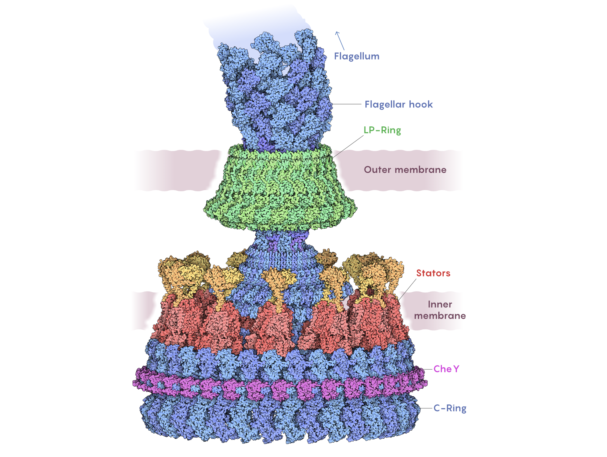
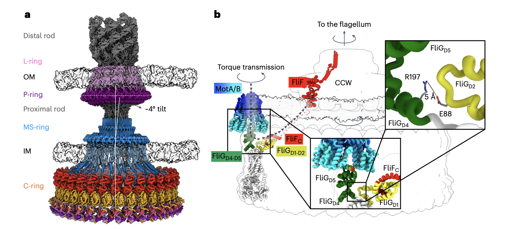
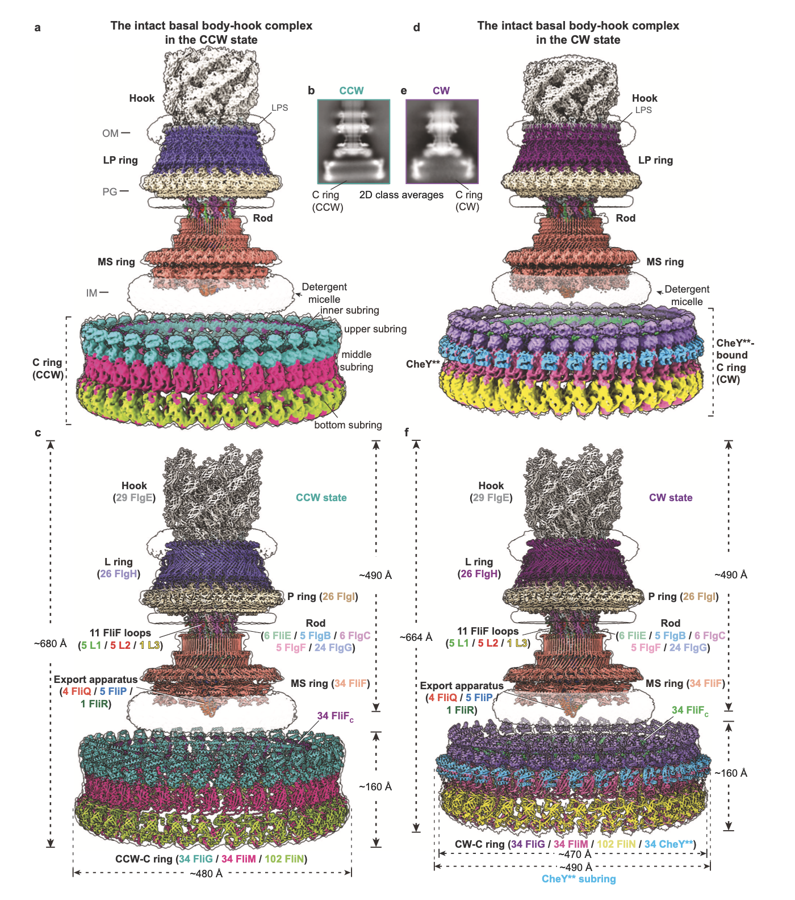

# Propulsive nanomachine - Bacterial Flagellar Motor

- [CryoEM structures reveal how the bacterial flagellum rotates and switches direction](https://www.nature.com/articles/s41564-024-01674-1)

- [Structural basis of the bacterial flagellar motor rotational switching](https://www.nature.com/articles/s41422-024-01017-z)

- [Structural basis of directional switching by the bacterial flagellum](https://www.nature.com/articles/s41564-024-01630-z)

- [Molecular structure of the intact bacterial flagellar basal body](https://www.nature.com/articles/s41564-024-01674-1)

---

## CryoEM structures reveal how the bacterial flagellum rotates and switches direction

- Bacterial chemotaxis
- bidirectional flagellar rotation
- flagellar motor
- torque transmission and direction
- flagellar rod
- cryogenic electron microscopy structures
- bacterial chemotaxis and bidirectional motor rotation

## Structural basis of directional switching by the bacterial flagellum

- bacterial flagellum 
- macromolecular protein complex 
- energy harvesting from uni-directional ion flow 
- powering bacterial swimming via rotation of the flagellum
- bi-directional rotation 
- cytoplasmic chemotactic response regulator 
- structural and mechanistic bases
- rotational switching
- cryoelectron microscopy structures
- ion flow
- bi-directional rotation of the flagellum

