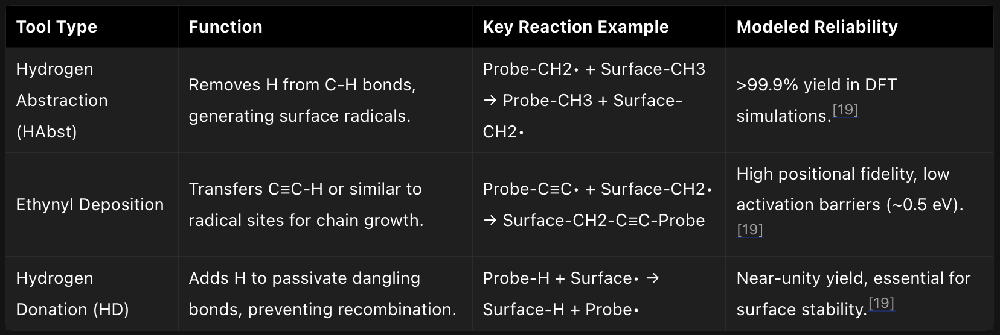

# Mechanosynthesis

[Article on Grokipedia: Mechanosynthesis](https://grokipedia.com/page/mechanosynthesis)

## Introduction

**Mechanosynthesis** is a proposed nanotechnology process for **fabricating molecular structures** by using mechanical systems to position reactive atoms or molecules with atomic-scale precision, thereby controlling the **formation of** covalent **chemical bonds** without relying on **stochastic diffusion** or **thermal activation** alone. (@) Grokipedia 

Pioneered by K. Eric Drexler in theoretical frameworks for molecular manufacturing, it underpins visions of self-replicating assemblers and nanofactories capable of producing macroscopic products from atomic feedstocks, such as diamondoid materials with exceptional strength and stiffness. Computational simulations have validated the feasibility of minimal toolsets for diamond mechanosynthesis, demonstrating bond-forming steps with projected error rates below 1 in 10^15 operations under controlled conditions like ultra-high vacuum. Experimental progress includes a 2003 demonstration of mechanically induced covalent bond formation between silicon atoms using a scanning tunneling microscope tip, marking the first proof-of-principle for positional control in synthesis. While these advances affirm basic causal mechanisms from first-principles mechanics and quantum chemistry, full-scale implementation faces empirical hurdles including vibration management and tool-tip stability, with ongoing research focused on carbon-based systems rather than the more common solid-state grinding interpretations of mechanosynthesis in bulk chemistry. (@) Grokipedia 

## Overview

### Definition and Core Principles

Mechanosynthesis refers to a proposed form of atomically precise manufacturing in which mechanical forces guide the positioning of reactive molecular species to induce targeted chemical bond formation, enabling the construction of complex structures with near-perfect fidelity. Unlike stochastic chemical synthesis, which relies on probabilistic collisions in solution, mechanosynthesis employs nanoscale mechanical systems—such as scanning probe-like tips—to achieve sub-angstrom positional control over atoms or small clusters, minimizing defects and maximizing yield. This concept was first articulated by K. Eric Drexler in his 1986 book Engines of Creation and rigorously analyzed in Nanosystems: Molecular Machinery, Manufacturing, and Computation (1992), where computational models grounded in quantum chemistry and statistical mechanics demonstrate its physical viability for rigid covalent materials like diamondoids.

At its core, mechanosynthesis operates on the principle of positional assembly, where programmable molecular machinery constrains reactant trajectories to enforce specific reactive encounters, often supplemented by mechanical strain to lower activation barriers or cleave/ form bonds selectively. Reactions typically involve hyper-reactive intermediates, such as carbenes or strained clusters, transferred from a tool tip to a workpiece surface in an ultrahigh vacuum or inert atmosphere to suppress side reactions; for instance, diamond mechanosynthesis (DMS) uses tips functionalized with carbon donors to extend diamond lattices atom-by-atom via mechanochemically promoted addition. Error rates are mitigated through feedback mechanisms, including reversible bonding and scanning verification, yielding theoretical efficiencies approaching 99.999% per step, as modeled for scalable production. These principles draw from established atomic manipulation techniques, like scanning tunneling microscopy (STM) demonstrations of single-atom placement since 1989, extrapolated to autonomous systems.

The framework emphasizes causal determinism over thermodynamic equilibrium, leveraging the stiffness of molecular rods and bearings for force transmission at femtoscale resolutions, with energy inputs derived from efficient nanoscale motors rather than bulk heat. Drexler's analyses in Nanosystems quantify throughput limits—up to 10^9 atoms per second per assembler—based on kinetic barriers calculated via density functional theory precursors, underscoring mechanosynthesis's potential for exponential manufacturing via self-replicating factories, though full implementation remains theoretical pending integrated toolsets.

### Role in Molecular Nanotechnology

Mechanosynthesis serves as a foundational mechanism in molecular nanotechnology (MNT), enabling the positional assembly of atomic and molecular structures through mechanical forces rather than relying on stochastic chemical processes. Proposed by K. Eric Drexler, it involves specialized molecular tools that guide reactive species into precise orientations, facilitating bond formation under controlled conditions to construct complex architectures like diamondoid frameworks. This approach addresses limitations of traditional synthesis by minimizing errors from thermal motion, allowing for error-correcting operations and scalable production of nanoscale devices.

n Drexler's framework, mechanosynthesis underpins the concept of molecular assemblers—autonomous devices capable of building larger systems atom by atom, potentially leading to self-replicating nanofactories. By mechanically straining bonds or depositing atoms via tool tips, such as in diamond mechanosynthesis where carbon atoms are added to growing lattices, assemblers could achieve exponential manufacturing rates, transforming raw materials into finished products with atomic precision. This capability is envisioned to enable the fabrication of stiff, high-performance materials unattainable through bulk chemistry, such as programmable matter or advanced computational substrates.

The role extends to integrating mechanosynthesis with broader MNT toolkits, including scanning probe manipulators and conveyor systems for feedstock handling, forming closed-loop systems for design-to-fabrication pipelines. Theoretical analyses indicate that mechanosynthetic cycles could operate at speeds comparable to enzymatic reactions, with energy efficiencies surpassing conventional methods due to directed energy input. Ultimately, it positions MNT as a pathway to "applicative nanotechnology," where mechanical control supplants diffusion-limited assembly, unlocking applications in medicine, energy, and computation contingent on experimental validation of core processes.

## Historical Development

### Early Theoretical Foundations

The theoretical foundations of mechanosynthesis, understood as the precise mechanical positioning of atoms to direct chemical synthesis, trace to mid-20th-century speculations on nanoscale engineering. In a December 29, 1959, lecture titled "There's Plenty of Room at the Bottom" delivered at the California Institute of Technology, physicist Richard Feynman outlined the feasibility of manipulating individual atoms as building blocks for materials. He posited that "the principles of physics, as far as I can see, do not speak against the possibility of maneuvering things atom by atom," envisioning scaled-down mechanical devices—such as probes or "little arms"—to rearrange atoms into novel structures, thereby enabling bottom-up fabrication beyond the limits of conventional chemistry. Feynman's argument rested on fundamental physical scalability, noting that forces like Brownian motion could be overcome with positional control, though he acknowledged engineering challenges in miniaturization.

Feynman's ideas extended earlier abstractions in self-replicating systems, influenced indirectly by John von Neumann's 1940s-1950s work on universal constructors and cellular automata, which demonstrated theoretically how programmable machines could replicate and assemble complex structures from basic components. Von Neumann's kinematic model, formalized in lectures around 1949 and posthumously published, emphasized mechanical replication without specifying atomic scales but provided a logical framework for error-correcting assembly processes essential to scalable mechanosynthesis. However, these precursors lacked explicit atomic-level mechanics, focusing instead on abstract computation and kinematics rather than chemical bond formation via force-directed positioning.

Distinct from broader mechanochemistry—which involves non-specific reactions induced by grinding or shear forces, with roots in 19th-century experiments by figures like Matthew Carey Lea—the positional variant central to mechanosynthesis prioritizes deterministic control over stochastic outcomes. Lea's 1890s studies on photomechanical reactions under pressure highlighted force-induced bond breaking but did not address guided atomic placement. Feynman's contribution thus marked a pivotal shift toward engineered precision, bridging theoretical physics with prospective molecular engineering, though empirical realization remained distant until later computational validations.

### Drexler's Formulation and Key Publications

K. Eric Drexler formulated mechanosynthesis as a method of chemical synthesis wherein molecular tools, positioned with atomic-scale precision via stiff mechanical linkages, selectively form covalent bonds by transferring atoms or small molecular groups to a growing structure, thereby enabling the programmable assembly of complex molecular systems with minimal reliance on stochastic diffusion or solution-phase equilibria. This approach prioritizes causal control through positional constraints to overcome limitations of thermal noise, achieving reaction yields approaching unity for error-corrected processes. Drexler's analysis demonstrated that such mechanosynthetic operations could be thermodynamically favorable and kinetically rapid under vacuum or inert conditions, particularly for carbon-based feedstocks like diamondoid structures.

Drexler's seminal exposition of mechanosynthesis appeared in his 1992 book Nanosystems: Molecular Machinery, Manufacturing, and Computation, which provided quantitative models for mechanosynthetic tips, including strain-directed reactivity and activation energies for bond formations in diamond lattices. Building on earlier conceptual work, the book detailed pathways for tip-based deposition of carbon atoms from volatile precursors, estimating fabrication rates up to 10^9 atoms per second per tip under optimized conditions. This publication shifted the discourse from visionary speculation to engineering analysis, incorporating quantum mechanical approximations for reaction barriers and mechanical stiffness requirements exceeding 10^3 N/m.

Preceding Nanosystems, Drexler's 1986 book Engines of Creation: The Coming Era of Nanotechnology introduced the broader paradigm of self-replicating molecular assemblers that implicitly rely on mechanosynthetic principles for atomic positioning and bond making, framing them as extensions of known mechanochemical phenomena scaled to the nanoscale. His foundational 1981 paper in the Proceedings of the National Academy of Sciences, "An Approach to the Development of General Capabilities for Molecular Manipulation," laid groundwork by proposing programmable molecular devices for positional assembly, though without explicit use of the term mechanosynthesis. Subsequent refinements include Drexler's 2007 conference paper "A Molecular Tool for Carbon Transfer in Mechanosynthesis," which specified designs for a mechanosynthetic tool employing a cyclopropenylidene carbene to transfer carbon atoms with projected activation energies below 0.2 eV.

### Experimental Precursors and Milestones

Early experimental efforts toward mechanosynthesis relied on scanning probe microscopy to achieve atomic-scale imaging and positional control, precursors essential for mechanically guided chemical assembly. The scanning tunneling microscope (STM), invented in 1981 by Gerd Binnig and Heinrich Rohrer, enabled the first direct visualization of atomic structures on conductive surfaces, demonstrating resolution down to individual atoms via electron tunneling. This breakthrough, awarded the Nobel Prize in Physics in 1986, provided the foundational technology for subsequent manipulation experiments. In 1986, Binnig, Christoph Gerber, and Calvin Quate introduced the atomic force microscope (AFM), which extended atomic probing to non-conductive samples through mechanical detection of tip-sample interactions, further broadening the scope for force-based atomic control.

A pivotal milestone occurred in 1989 when Donald Eigler and Erhard Schweizer at IBM used an STM to position 35 individual xenon atoms on a nickel (110) surface at 4 K, mechanically nudging them into place to spell "IBM" over 22 hours of operation. This experiment, detailed in a 1990 Nature publication, represented the first controlled manipulation and arrangement of single atoms solely via tip-induced mechanical forces, validating positional control without chemical alteration of the atoms themselves. Building on this, 1990s experiments advanced to covalent systems, such as Hosoki et al.'s 1992 STM-based repositioning of silicon atoms on Si(111) surfaces, showing diffusion and placement under mechanical influence.

The transition to true mechanosynthesis—mechanically forming and breaking covalent bonds—emerged in the early 2000s. In 2003, Oyabu et al. reported the first purely mechanical positional chemical synthesis using non-contact AFM to selectively detach and reattach silicon atoms on a Si(111)-(7×7) surface, achieving bond-breaking and -forming via tip-applied forces alone in ultra-high vacuum at low temperature, without electrical bias for the mechanical steps. This demonstrated site-specific covalent manipulation, a direct precursor to proposed diamondoid mechanosynthesis processes. Subsequent work, such as 2009 experiments by Hla et al. using STM/AFM hybrids for single-molecule reactions, further refined force-controlled bond dynamics, though scalability to complex structures remains limited by vacuum constraints and low throughput. These milestones established empirical proof-of-principle for mechanosynthesis but highlighted challenges in transitioning from surface-bound, low-temperature operations to robust, three-dimensional assembly.

## Technical Mechanisms

### Positional Control and Atomic Manipulation

Positional control in mechanosynthesis denotes the use of mechanical devices to position atomic-scale tools or reactants with sub-angstrom precision, directing chemical reactions by constraining molecular geometries rather than relying solely on stochastic diffusion. This approach, articulated by K. Eric Drexler in Nanosystems: Molecular Machinery, Manufacturing, and Computation (1992), enables the assembly of complex structures by repeatedly aligning reactants for bond formation, circumventing limitations of traditional synthesis where yields depend on concentration and entropy-driven encounters. Such control requires positional devices—rigid frameworks like molecular rods or diamondoid arms—that exert forces exceeding thermal noise (kT ≈ 4 × 10^{-21} J at room temperature), typically demanding stiffness values above 10^3 N/m to limit positional uncertainty to below 0.1 nm.

Atomic manipulation under positional control involves mechanosynthetic tooltips that transfer specific atoms or radicals to a workpiece. In diamond mechanosynthesis (DMS), for instance, a sequence begins with a hydrogen abstraction tool, such as one tipped with an acetylene radical (CH≡C•), positioned to extract a hydrogen atom from a diamond surface, creating a reactive carbon dangling bond. This is followed by a carbon placement tool, like the DCB6Ge6 dimer tool, which deposits a carbon dimer at the site under mechanical guidance, forming new C-C bonds. Hydrogen donation tools then passivate excess radicals with weakly bound H atoms (e.g., via Ge-H bonds). Each step operates in ultra-high vacuum or inert media to minimize side reactions, with the tooltip withdrawn and recharged via a feed mechanism after transfer. These tools leverage the strength of diamond's σ-bonds (bond energy ~350 kJ/mol) for rigidity, allowing operations at speeds up to milliseconds per atom placement in theoretical designs.

Early experimental validation of atomic-scale positional control came from scanning tunneling microscopy (STM) demonstrations, notably IBM's 1990 arrangement of 35 xenon atoms on a Ni(110) surface at 4 K to spell "IBM," achieving manipulations by applying voltage pulses to nudge atoms across the surface with atomic resolution. Similar feats include AFM-based removal of silicon atoms from a surface in 2009, confirming mechanical force can selectively break bonds without broader disruption. However, these cryogenic, low-throughput methods fall short of mechanosynthesis requirements for parallel, room-temperature operation; simulations indicate that integrated molecular systems could scale to 10^6–10^9 tips working concurrently, but thermal vibrations necessitate error-correcting protocols and hyper-stiff supports. Ongoing challenges include scaling positional accuracy across multiple degrees of freedom while maintaining throughput, as analyzed in Drexler's kinematic models of assembler arms with planetary gear-like bearings for precise trajectory control.

### Diamond Mechanosynthesis Processes

Diamond mechanosynthesis processes involve positionally controlled chemical reactions to construct diamond lattices atom-by-atom or dimer-by-dimer, typically on a hydrogen-terminated diamond C(110) surface, using specialized molecular tools attached to a mechanosynthetic probe. These processes rely on a cyclic sequence of operations: hydrogen abstraction to create reactive sites, deposition of carbon units such as C₂ dimers, and hydrogen donation for passivation, enabling error rates below 1 in 10⁹ operations under ideal conditions. Theoretical modeling using density functional theory (DFT) has identified reaction pathways with activation barriers as low as 0.1-0.5 eV for key steps, suggesting feasibility at or near room temperature without thermal diffusion issues.

The primary cycle begins with hydrogen abstraction, where a tool such as a methyne (CH•) or silane-based tip selectively removes a surface hydrogen atom, generating a carbon radical site with a barrier of approximately 1.2 eV; this step positions the tool within 1-2 Å of the target for precise control. Next, C₂ dimer deposition employs a placement tool, often functionalized with silicon, germanium, or tin to stabilize and orient the :C=C: biradical, which bonds to the radical site and adjacent atoms, extending the lattice by two carbon atoms with barriers under 0.2 eV when using optimal heteroatom-stabilized variants; Si- or Ge-capped tools minimize unwanted side reactions by cleaving post-deposition. Finally, hydrogen donation from an HDon tool (e.g., germane-based) adds hydrogen to newly formed dangling bonds, completing the cycle with barriers around 0.8 eV and restoring surface stability. This minimal toolset—H-abstraction, C₂Dep, and HDon—suffices for unidirectional growth, though additional tools like acetylide transfer enable branching or defect repair.

Advanced variants incorporate scanning probe tips for initial prototyping, where diamondoid structures guide tool fabrication via self-assembly or sequential mechanosynthesis; for instance, a complete C₂Dep tool synthesis requires four sub-processes: tooltip capping, handle attachment, linker synthesis, and integration onto a probe shank. Simulations confirm these processes avoid high-energy intermediates, with germanium-based tools showing superior performance over silicon due to tunable bond strengths (bond dissociation energies ~2.5-3.0 eV). Experimental precursors, such as STM tip manipulation of silicon dimers on Si(001), validate positional control principles, though full diamond cycles remain theoretical pending nanofabrication advances.

### Proposed Molecular Toolkits

In positional diamond mechanosynthesis, proposed molecular toolkits consist of specialized, tip-mounted molecular devices engineered to perform precise atomic-scale operations, such as abstraction, deposition, and passivation, enabling the layer-by-layer construction of diamondoid structures from simple feedstocks like methane or acetylene. These toolkits aim to minimize the number of distinct tools required while maximizing reaction reliability, typically exceeding 99% yield in computational models based on density functional theory simulations. A foundational proposal is the minimal toolset developed by Robert A. Freitas Jr. and Ralph C. Merkle, which supports the fabrication of arbitrary carbon-based nanostructures through sequential, positionally controlled reactions on a growing diamond surface.

The core toolkit identifies three primary tool classes: hydrogen abstraction tools to create reactive radical sites by removing hydrogen atoms from passivated surfaces; carbon deposition tools to add carbon atoms or moieties (e.g., methyl or ethynyl groups) in specific configurations; and hydrogen donation tools to terminate and stabilize newly formed bonds. Freitas and Merkle expand this to a set of nine specific tools in their 2008 analysis, including undoped variants for basic operations and doped variants (e.g., with nitrogen or boron) for enhanced selectivity or error correction, allowing bootstrapping from bulk diamond tips to self-replicating assemblers. Reaction pathways, such as abstracting H from a -CH3 terminated site followed by ethynyl (C2H) deposition and H donation to form sp3 carbon bonds, are modeled to proceed with minimal diffusion or side reactions under cryogenic conditions (e.g., 100-200 K) to suppress thermal noise.

Tool refreshing mechanisms, such as reversible reactions with gas-phase precursors, are incorporated to maintain toolkit functionality during extended operations, with the entire set theoretically sufficient for error rates below 1 in 10^6 operations when integrated into a scanning probe workstation. These proposals build on Eric Drexler's earlier conceptual frameworks but emphasize computationally validated specifics, distinguishing them from less precise mechanochemical approaches by requiring sub-angstrom positional accuracy via stiff mechanical linkages. Experimental validation remains pending, with pathways outlined in Institute for Molecular Manufacturing roadmaps targeting initial demonstrations by the 2010s, though progress has focused on simulations due to fabrication challenges.

## Feasibility, Achievements, and Criticisms

### Theoretical Modeling and Simulations

Theoretical modeling of diamond mechanosynthesis has relied on computational techniques including density functional theory (DFT) for quantum-level reaction pathways and molecular mechanics for larger-scale dynamics and positional analysis. DFT studies, often using software like Gaussian 98, have examined tool tip structures such as group IV-substituted biadamantanes for C₂ dimer placement, confirming stable bonding energies exceeding 5 eV and tool reusability after deposition cycles in vacuum environments. These models predict that such tools can position dimers with sufficient precision for epitaxial growth on clean C(110) diamond surfaces, with activation barriers below 1 eV under controlled conditions.

Molecular mechanics simulations complement DFT by assessing thermal effects on positional accuracy. Using the MM3 force field at 298 K over 1 ns trajectories, extended Si- and Ge-based tool tips yield C₂ dimer uncertainties of ±0.31 Å and ±0.46 Å, respectively, due to differences in C-Si/Ge vibrational frequencies (809-824 cm⁻¹ for Si vs. 558-629 cm⁻¹ for Ge). These values approach the ±0.54-0.66 Å threshold needed to target global energy minima and avoid defects during deposition, though Ge tools require sub-ambient temperatures (e.g., below 100 K) for reliable <±0.2 Å precision in defect-specific placements.

Systems-level simulations integrate these approaches to evaluate minimal toolsets for positional assembly, modeling scanning-probe sequences for diamondoid fabrication. A 2007 study outlined reaction pathways for a complete suite of tools, demonstrating error probabilities below 10⁻¹⁰ per operation at cryogenic temperatures and vacuum, with energy landscapes supporting reversible bond breaking and self-healing mechanisms. Such models assume idealized vacuum conditions and stiff positional control, highlighting mechanosynthesis feasibility but underscoring sensitivity to thermal noise and surface contamination. Ongoing extensions incorporate hybrid quantum-classical methods to refine multi-step cycles, including Si/Ge/Sn variants for broader substrate compatibility.

### Empirical Progress and Limitations

Experimental efforts in mechanosynthesis have primarily focused on atomic-scale manipulation using scanning tunneling microscopes (STMs) and related tools, with demonstrations of mechanically induced bond formation on silicon surfaces but limited progress toward diamond-specific processes. In 2003, Oyabu et al. achieved reversible positional control of a single silicon atom on a Si(111)-7×7 surface, using an STM tip to extract and reinsert the atom, thereby establishing covalent bonds via purely mechanical forces without relying on electronic excitation. This marked an early empirical validation of mechanosynthetic principles, albeit on silicon rather than diamond, and under ultra-high vacuum conditions at cryogenic temperatures. Subsequent simulations have supported the viability of similar hydrogen abstraction and dimer placement reactions for diamond, predicting exothermic pathways with activation barriers surmountable by mechanical positioning.

Further empirical milestones include theoretical modeling tied to potential experiments, such as the proposed use of SiH2 or CH2 insertion tools for diamondoid growth, but no verified diamond mechanosynthesis cycles have been reported as of 2023. Roadmaps from organizations like the Institute for Molecular Manufacturing outlined plans for repeatable diamond surface operations by the late 2000s, including verifiable deposition of carbon dimers, yet these remain unachieved in peer-reviewed literature. Atomic manipulation precursors, such as IBM's 1989 STM-based "atomic switch" and 1990 logo construction with xenon atoms, demonstrate positional control but fall short of covalent mechanosynthesis due to reliance on physisorption rather than chemisorption.

Key limitations stem from the absence of scalable, error-free toolsets and the technical challenges of maintaining atomic precision in reactive environments. Fabricating and recharging mechanosynthetic tips—such as hydrogen abstraction tools—requires sub-angstrom accuracy, which current STMs struggle to sustain over multiple cycles without tip degradation or contamination. Experimental setups demand extreme conditions, including ultra-high vacuum (<10^{-10} Torr) and low temperatures to suppress thermal diffusion, limiting throughput to single-atom operations rather than parallel assembly. Moreover, while simulations indicate feasible reaction energies (e.g., -5 to -10 eV for dimer additions), unmodeled factors like vibrational heating or surface defects could introduce errors, with no empirical data quantifying yield rates beyond isolated manipulations. Critics note that these constraints have stalled progress, as broader chemical synthesis communities prioritize solution-based methods over positional approaches, viewing mechanosynthesis as theoretically sound but practically elusive without breakthroughs in nanofabrication. Ongoing challenges include integrating mechanosynthesis with self-replication, where empirical validation lags far behind theoretical designs.

## Potential Applications and Broader Context

### Envisioned Impacts on Technology and Society

Proponents of diamond mechanosynthesis envision it as the enabling technology for atomically precise manufacturing (APM), allowing the construction of complex diamondoid structures through positional control of reactive molecular tools. This could yield materials with exceptional properties, including tensile strengths up to 200 GPa and strength-to-weight ratios over 50 times that of steel, surpassing conventional alloys and composites in aerospace, automotive, and structural applications. Such advances would facilitate lighter, more durable aircraft and vehicles, potentially reducing energy consumption in transportation by orders of magnitude while enabling novel designs like space elevators or hypersonic craft. In computing and electronics, mechanosynthetic processes could produce molecular-scale circuits with switching speeds in the terahertz range, far exceeding silicon-based limits and supporting exascale computation at negligible power costs.

Societally, APM powered by mechanosynthesis is projected to usher in an era of radical abundance by enabling self-replicating nanofactories that exponentially scale production of goods from abundant feedstocks like carbon and hydrogen, drastically lowering costs and eliminating traditional supply chain dependencies. This could eradicate material scarcity, transforming economies from scarcity-driven models to ones focused on design and information, with global wealth increases estimated to exceed current GDP multiples through universal access to high-value products. Environmental impacts include remediation via programmed molecular systems that disassemble pollutants or sequester carbon at gigaton scales, alongside sustainable energy solutions like photovoltaic cells with efficiencies above 50%. Medical applications, such as respirocyte nanorobots delivering oxygen 236 times more efficiently than human red blood cells, could extend lifespans and cure chronic diseases through precise cellular repair.

These transformations, as articulated by researchers like K. Eric Drexler, hinge on mechanosynthesis achieving practical scalability, potentially reshaping labor markets by automating manufacturing and necessitating societal adaptations to abundance, including shifts in resource allocation and governance. Space exploration would benefit from cheap, precise fabrication of habitats and propulsion systems, enabling large-scale colonization efforts. While net societal benefits are anticipated in wealth, environment, and disarmament via non-proliferative weapons, realization depends on directed research pathways outlined in technology roadmaps.

### Distinctions from Mechanochemistry

Mechanosynthesis refers to the precise positioning of reactive molecular species using mechanical manipulators to form covalent bonds with atomic-level control, as conceptualized in proposals for diamondoid mechanosynthesis where tool tips deposit atoms onto growing structures under computational guidance. In contrast, mechanochemistry encompasses chemical reactions driven by mechanical forces such as grinding or milling, typically in bulk solids, where energy input activates bonds without specified positional constraints.

A primary distinction lies in the degree of spatial and reaction pathway control: mechanosynthesis employs stiff, mechanostable molecular tools to constrain reactants into low-activation pathways, enabling error rates below 1 in 10^15 operations through tip-based manipulation, whereas mechanochemical processes rely on stochastic force application in ball mills or shakers, yielding mixtures of products with variable stereochemistry and limited predictability due to uncontrolled collision geometries.

Mechanosynthesis targets atomically precise manufacturing (APM) for complex, defect-free nanostructures, as modeled in simulations of carbon deposition on diamond lattices achieving yields over 99.999% per step, while mechanochemistry focuses on scalable synthesis of materials like alloys or organics, often prioritizing solvent-free efficiency over precision, with reaction outcomes influenced by milling parameters like frequency and ball-to-powder ratio but not atomic placement.

Although both involve mechanical energy to overcome activation barriers, mechanosynthesis integrates computational design for pathway selection—such as using hydrogen abstraction tools followed by addition probes—avoiding thermal diffusion limitations inherent in mechanochemical milling, which can produce amorphous or polycrystalline outputs rather than programmed architectures. This precision gap underscores mechanosynthesis's alignment with nanofactory visions, distinct from mechanochemistry's role in green synthesis techniques demonstrated since the 19th century but accelerated in the 2010s with quantitative kinetics models.

### Ongoing Research Directions

Current research in mechanosynthesis emphasizes computational modeling to validate and optimize positional atomic assembly processes, particularly for diamond structures. Simulations using density functional theory (DFT) and semi-empirical quantum mechanics (SEQM) continue to explore tooltip designs, such as Si/Ge/Sn-based dimers for C2 deposition on diamond C(110) surfaces, demonstrating exothermic pathways with yields exceeding 99% under ideal vacuum conditions. These efforts, led by researchers like Ralph Merkle, address pathologies in mechanosynthetic tooltips through distributed computing approaches, identifying error rates and mitigation strategies for reliable bond formation.

Experimental progress remains limited to proxy demonstrations outside diamond using scanning probe microscopy (SPM) for site-specific atomic abstraction and deposition, though current tools operate at rates orders of magnitude below requirements for productive mechanosynthesis—through hybrid electro-mechanical controls and cryogenic operation to minimize thermal errors.

Broader initiatives focus on integrating mechanosynthesis concepts with nanofabrication, such as Zyvex's historical proposals for hydrogen abstraction and carbene insertion on diamond surfaces, now updated in patents for generalized positional systems. Funding for viability experiments, announced in 2017, targets empirical tests of diamond-specific tips, though peer-reviewed outcomes are pending, highlighting a gap between theoretical feasibility and laboratory validation. Skeptics note that while simulations support causal pathways for error-corrected assembly, empirical scaling demands advances in vacuum integrity and parallelization, with ongoing work at the Institute for Molecular Manufacturing prioritizing these.

