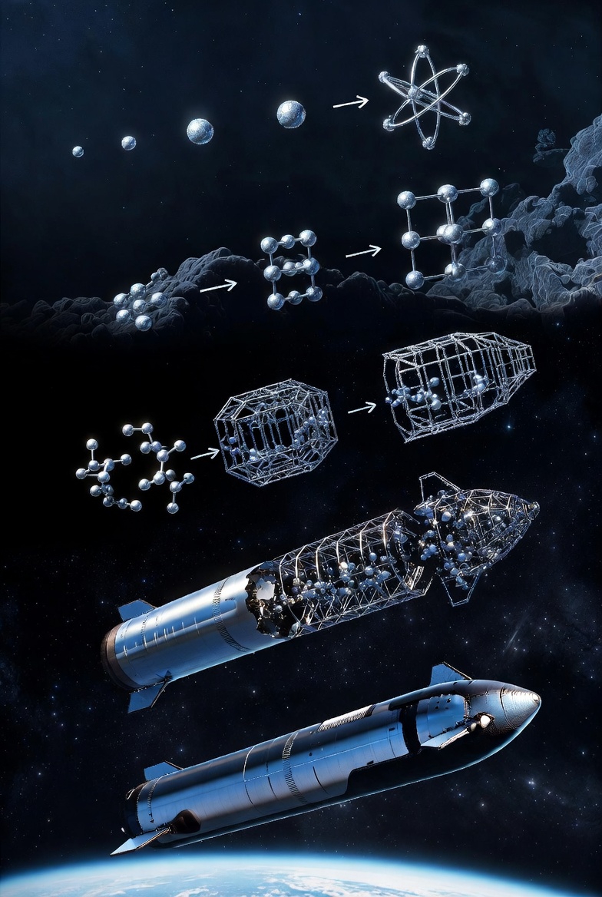

# NanoFactory

Article on X: [NanoFactory](https://x.com/skyisuniverse/status/2024856522165998031)

From [my conversation with Grok on Nanobots Factory](https://x.com/i/grok/share/25ada92ceb544b449ae4b40204d0ce86)

## Description of a Nanobots Factory in Molecular Nanotechnology

In the speculative future of mature molecular nanotechnology (MNT), a "nanobots factory" (often termed a nanofactory) would be a compact, programmable manufacturing system capable of producing macro-scale products—like a Starship or even duplicates of itself—through the coordinated action of trillions of nanobots (molecular assemblers or fabricators). This isn't a traditional factory with conveyor belts and robots; instead, it's a tabletop- or room-sized device (e.g., roughly 1 cubic meter) that operates like a 3D printer at the atomic level, using bottom-up assembly to convert simple feedstock molecules (e.g., acetylene, natural gas, or other hydrocarbons) into precise, atomically engineered structures with minimal waste. The nanofactory would be self-contained, requiring only external power, cooling (e.g., water), and feedstock, and could produce kilograms of high-performance materials per hour, such as diamondoid composites stronger than steel.

Drawing from designs like Chris Phoenix's "primitive nanofactory" and Eric Drexler's foundational work on productive nanosystems, the factory would leverage hierarchical, convergent assembly: starting with nanoscale fabricators building tiny blocks, then progressively combining them into larger components until a full product emerges. It would be designed for reliability, with built-in redundancy to handle errors like radiation damage, and could operate in ambient conditions once bootstrapped from initial lab prototypes. Below is the breakdown of what it would consist of, its composition, architecture, key mechanisms, and operational processes.

### Overall Concept and Scale

- **What It Is**: A nanofactory is essentially a macro-scale enclosure housing a vast array of nanoscale mechanochemical fabricators (the "nanobots") that perform positional synthesis—guiding chemical reactions to place atoms exactly where needed. These nanobots don't roam freely like sci-fi swarms; they're fixed in arrays, working in parallel to fabricate and assemble parts. The system is programmable via AI-driven software, allowing it to build diverse products from digital blueprints, including self-replication for exponential scaling.

- **Size and Output**: A baseline design might be a 1m³ box producing ~4 kg of product (e.g., diamondoid structures) in 3-4 hours, with cycle times scaling based on complexity. For larger items like a Starship, multiple factories or iterative assembly in space could be used, but a single unit could produce components on-demand.

- **Energy and Inputs**: Power consumption around 200-250 kW for full operation, sourced from electricity (e.g., solar or grid). Feedstock: Primarily carbon and hydrogen (e.g., from methane), with trace metals for catalysts (~micrograms per kg of product). Cooling via circulating fluid (e.g., water with ice particles) to dissipate heat from trillions of operations.

### Composition (Materials and Building Blocks)

The nanofactory's materials emphasize stiffness, low reactivity, and efficiency, drawing from covalent solids like diamond for durability under nanoscale forces.

- **Primary Materials**:
    - **Diamondoid Structures**: Carbon-based lattices (e.g., diamond or lonsdaleite) for structural components, providing extreme strength (up to 225 GPa tensile) and thermal stability. Used in nanobots, blocks, and casings to resist deformation from Brownian motion or pressure.
    - **Graphite and Buckytubes (Carbon Nanotubes)**: For conductive wiring, seals, and flexible elements. Graphite enables electron tunneling in electrical connections, while buckytubes handle high-current ballistic transport.
    - **Polyyne Chains**: Stiff carbon rods for control cables and torque transmission, interfaced via van der Waals forces.
    - **Other Elements**: Hydrogen for surface passivation (preventing unwanted bonds), nitrogen/oxygen for seals, and silicon or fluorine in specialized parts (e.g., for insulators or reactive tips). Feedstock molecules like acetylene (C2H2) supply these atoms.
- **Nanoblocks**: The core "Lego-like" units, typically 200 nm cubes (~1 billion atoms each), produced by individual nanobots. Composed of bulk diamond with embedded functional elements (e.g., electrostatic motors, logic gates, or actuators). Partial or empty blocks allow for voids, smooth surfaces, or scaffolds in final products.
- **Coolant and Feedstock Medium**: A low-pressure fluid (e.g., water or inert gas) carrying suspended feedstock molecules and ice particles for cooling, circulated through channels to deliver raw materials and remove heat.

### Key Components

- **Mechanochemical Fabricators (Nanobots)**: The heart of the system—tiny (100-200 nm) programmable devices with manipulator arms or tips for atom-by-atom assembly via mechanosynthesis (controlled bond formation/breaking). Arrays of ~8,192 per production module, each building one nanoblock per cycle. Designs include simple tripods or arms for reliability, operating in a clean, low-pressure environment to avoid contamination.

- **Production Modules**: Micron-scale (e.g., 16x16x12 μm) units grouping fabricators into planar grids (e.g., 9x9 arrays over 4 levels) with a central nanocomputer and gantry cranes. Each module outputs two 3.2 μm blocks per cycle, with built-in redundancy (e.g., extra substages) for fault tolerance.

- **Nanocomputers**: Embedded digital logic systems (e.g., rod-logic or quantum-inspired) using diamondoid gates, consuming minimal power (~8 nW per module). They parse instructions hierarchically, controlling fabricators without complex sensors—relying on deterministic processes.

- **Manipulators and Assembly Hardware**: Gantry cranes (3D movable arms) for picking/placing blocks; convergent assembly tubes for transporting and joining sub-blocks into larger ones.

- **Casing and Enclosure**: A gas-tight rectangular shell with flat diamond panels, tension cables (diamond or buckytube), and braces to withstand atmospheric pressure. Includes a balloon-sealed airlock for outputting products without contamination, allowing unfolding in a protected space.

- **Cooling and Transport Systems**: Non-fractal channels (1 μm gaps) for coolant flow; assembly tubes (e.g., 3.5 μm diameter at early stages) for block delivery.

### Architecture and Layout

- **Hierarchical and Fractal-Like Design**: Organized into ~19 convergent assembly stages, where each level combines 8 sub-blocks into one larger block (e.g., scaling from 200 nm nanoblocks to 10.5 cm products). Production modules feed into gathering stages (rectangular solids with central tubes), which stack upward in a branching structure.

- **Separated Volumes**: Low-pressure working areas for assembly (to reduce drag) surrounded by higher-pressure cooling channels. Cross-bracing cables span channels to prevent collapse.

- **Modular Scalability**: Starts small (e.g., from a single fabricator) and bootstraps via self-replication: duplicate modules, then full factories, in days to weeks. The layout is repetitive and deterministic, minimizing complexity—e.g., no rotation during assembly, fixed orientations.

### Mechanisms and Processes

- **Mechanosynthesis and Control**: Nanobots use positional chemistry to add atoms/molecules deterministically, guided by compressed digital instructions broadcast from a central AI. No real-time feedback needed; errors are retried or bypassed via redundancy.

- **Convergent Assembly**: Parallel building of nanoblocks, then hierarchical joining via manipulators in tubes. Products start compact (e.g., folded like pop-up books) and unfold post-output using pre-designed hinges or pantographic trusses.

- **Joint Mechanisms**:
    - **Expanding Ridge Joints**: Triangular ridges and shims for mechanical fastening—press-fit with van der Waals forces, achieving 47-68% diamond strength, tolerant of misalignment (±1 Å).
    - **Functional Joints**: Press-fit for wires (graphite tunneling), cables (polyyne with convolutions for torque), and pipes (diamond seals).

- **Stepping Drives**: Efficient actuators (e.g., pin-based) for reversible motion in manipulators, recovering energy to minimize waste.

- **Reliability Features**: Redundancy (e.g., 9-in-8 substages) counters radiation (~3% failure per year per cubic micron). Local error detection; jammed parts stored and replaced.

- **Self-Replication**: The factory's design is encoded as nanoblock patterns, allowing it to build duplicates in ~15 hours, starting from seed nanobots and scaling exponentially.

This nanofactory would revolutionize production by enabling abundance—cheap, precise, zero-waste manufacturing of anything from rockets to medical devices. However, it assumes breakthroughs like reliable mechanosynthesis, which remain theoretical today.