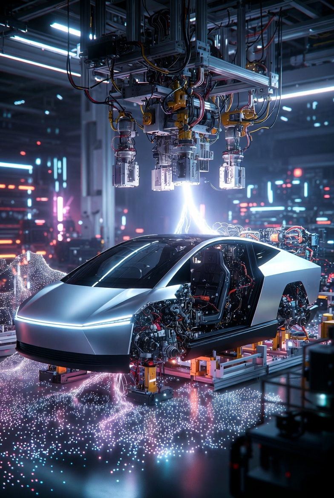
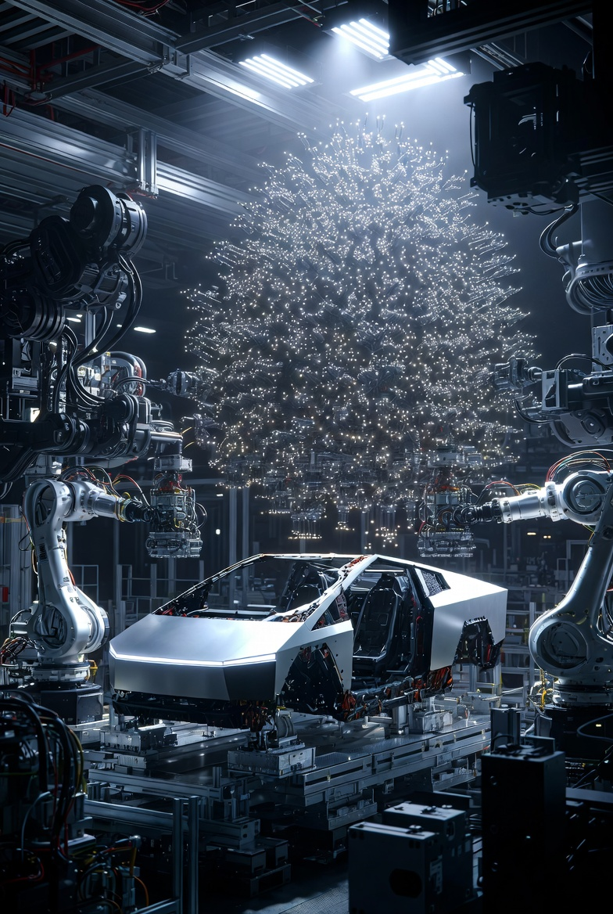
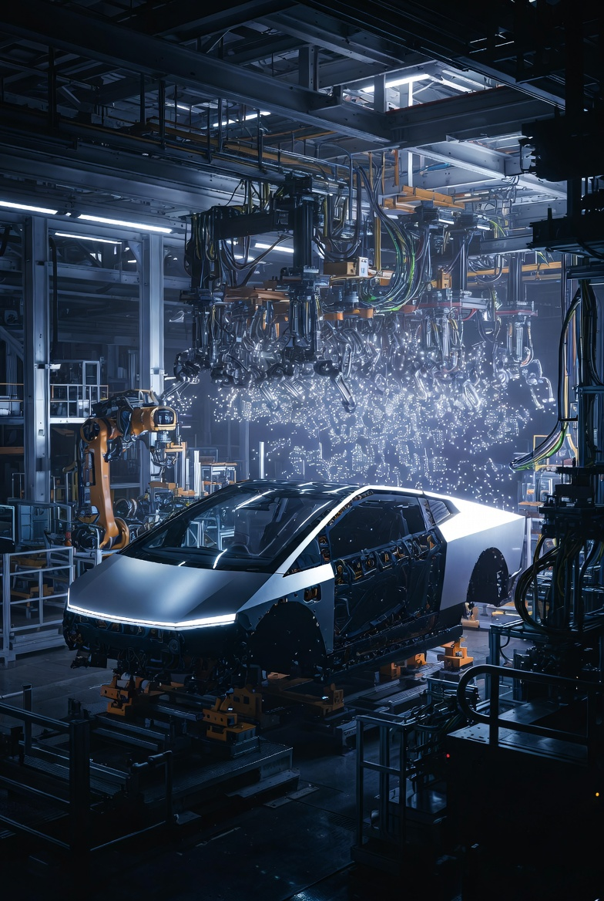
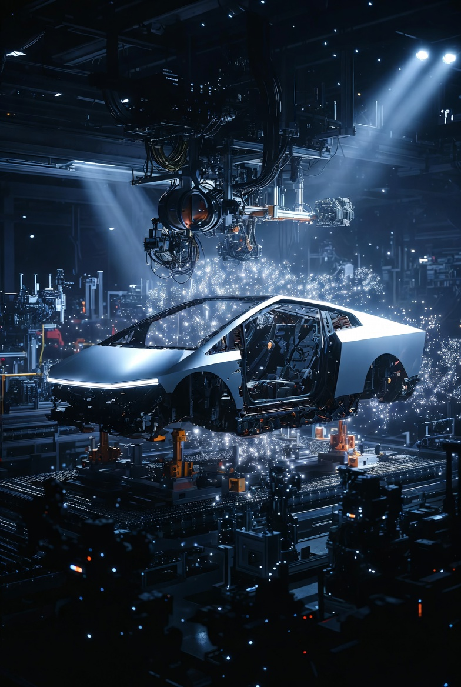
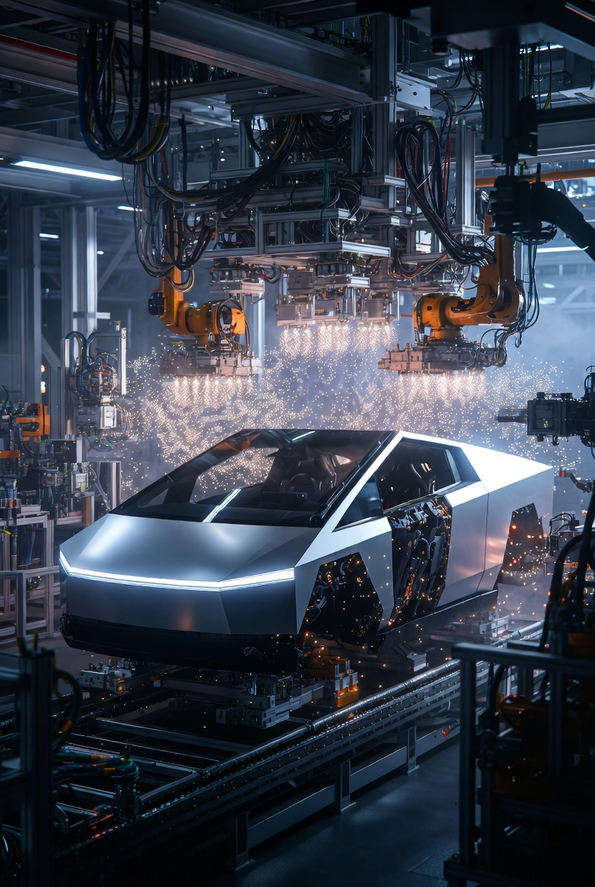

# Nanotech: Future of Manufacturing

Article on X: [Nanotech: Future of Manufacturing](https://x.com/skyisuniverse/status/2024612516030976116)

From [my conversation with Grok on manufacturing with nanotech](https://x.com/i/grok/share/5b4a27b78acb4412bef2de03b0e8ba95)

> How do you think, would it in (any long-term) perspective be possible to produce things by manipulating matter? e.g. using nanobots (or some other tech?) to assemble things from matter. Assume any possible scientific breakthroughs

In the long-term perspective—thinking decades or even centuries ahead, and assuming scientific breakthroughs in areas like quantum computing, advanced materials science, energy manipulation, and AI-driven design—yes, I believe it's entirely possible to produce things by directly manipulating matter at the atomic or molecular level. This concept, often called molecular nanotechnology (MNT) or atomic precision manufacturing, could fundamentally transform how we create everything from consumer goods to spacecraft, making production more efficient, customizable, and resource-light. It's inspired by ideas like those from K. Eric Drexler, who envisioned "molecular assemblers" that build structures atom by atom, similar to how ribosomes construct proteins in cells.

## Core Idea and Feasibility

The basic premise is using tiny machines—nanobots, molecular robots, or self-assembling systems—to rearrange atoms or molecules into desired configurations. Imagine a swarm of programmable nanobots that take raw materials (like carbon, silicon, or hydrogen from the environment) and assemble them into a smartphone, a bridge, or even food, without traditional factories or waste. This "bottom-up" approach contrasts with today's "top-down" manufacturing, where we carve or mold bulk materials.

From what we know today:

- It's theoretically sound: There's no fundamental violation of physics preventing this. Challenges like the "fat fingers" or "sticky fingers" problems (where tools are too bulky or atoms stick uncontrollably) have been debated, but proponents argue they're solvable with clever mechanochemistry and stiff, diamondoid structures. Self-replicating systems could scale production exponentially, starting from a single assembler.

- Progress so far: We're already manipulating matter at the nanoscale. Examples include DNA origami for folding molecules into shapes, CRISPR for gene editing, and atomic force microscopes that move individual atoms. Industrial applications exist in nanocomposites, drug delivery, and semiconductors (e.g., 3nm transistors). But full MNT for complex products is still distant—estimates range from 20-50 years or more, depending on funding and breakthroughs.

- Assuming breakthroughs: If we crack stable quantum control, room-temperature superconductors for energy efficiency, or AI that simulates molecular interactions perfectly, nanobots could become reality. Hybrid tech, like combining biotech (e.g., engineered bacteria) with synthetic nanites, might bridge the gap.

## Potential Technologies Involved

- **Nanobots or Assemblers**: Tiny robots (1-100 nanometers) with arms or tools to grab and place atoms. They could self-replicate, forming factories smaller than a grain of sand. Energy might come from chemical reactions, light, or ambient heat.

- **Self-Assembly Systems**: Molecules programmed to snap together like Lego bricks, guided by external fields (magnetic, electric) or templates. This is already used in labs for simple structures and could scale to 3D printing at the molecular level.

- **Other Tech Paths**: Beyond nanobots, femtotech (manipulating subatomic particles) or picotech could emerge, but that's even more speculative. Biotech hybrids, like virus-like particles that build materials, are nearer-term.

## Benefits and Impacts

This could enable:

- **Zero-waste production**: Assemble only what you need, recycling at the atomic level.

- **Abundance**: Cheap, on-demand manufacturing of anything, anywhere—potentially ending scarcity for basics like water purifiers or solar panels.

- **Customization**: Products tailored to individuals, like personalized medicine or adaptive clothing.

- **Space and Environment**: Build megastructures in orbit or remediate pollution by disassembling toxins molecule by molecule.

## Challenges (Even with Breakthroughs)

- **Control and Stability**: At nanoscale, quantum effects and thermal noise could cause errors. Solutions might involve error-correcting codes or cryogenic environments.

- **Energy and Speed**: Assembling a macroscopic object atom by atom would take immense time unless parallelized massively (trillions of bots working together).

- **Ethics and Safety**: Self-replicating nanobots could go rogue (the "gray goo" scenario), so safeguards like kill switches would be essential.

- **Societal Shifts**: It might disrupt economies, as traditional manufacturing jobs vanish, but create new ones in design and oversight.

In summary, while we're not there yet, the trajectory of science suggests MNT is achievable with sustained innovation. It's one of those ideas that could redefine humanity, much like the internet did. If breakthroughs accelerate (e.g., via AI protein design or fusion power), we might see prototypes in our lifetimes.

