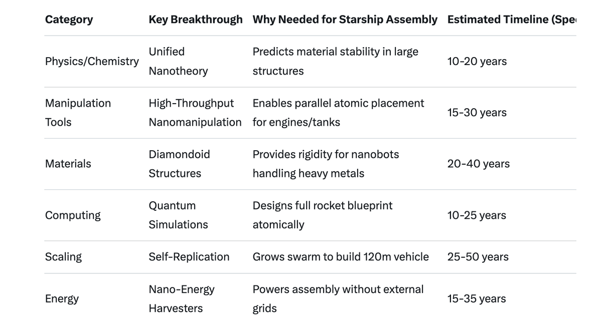

# Scientific breakthroughs for Nano-Assembly

Article on X: [Scientific breakthroughs for Nano-Assembly](https://x.com/skyisuniverse/status/2024749537152115174)

From [my conversation with Grok on Scientific breakthroughs for Nano-Assembly](https://x.com/i/grok/share/223de0aa590a489ab5ed1a4cdf3228bb)

## Introduction to Required Breakthroughs for Molecular Nanotechnology in Large-Scale Assembly

Assembling a massive structure like SpaceX's Starship using molecular nanotechnology (MNT) would require transforming speculative concepts into practical engineering. MNT, as envisioned by pioneers like K. Eric Drexler, involves programmable nanobots or molecular assemblers that manipulate atoms and molecules to build complex objects bottom-up, with atomic precision. While current nanotechnology excels in areas like drug delivery and semiconductors, scaling to macroscopic manufacturing (e.g., a 120-meter rocket) demands breakthroughs across physics, chemistry, materials science, computing, and systems engineering. These aren't just incremental improvements but paradigm shifts, potentially taking decades. Below, I detail the key breakthroughs needed, grouped by category for clarity. This draws from expert analyses of MNT challenges, emphasizing the gaps between today's lab-scale demos and industrial-scale reality.

### 1. Fundamental Understanding of Nanoscale Physics and Chemistry

To build reliably at the atomic level, we need a deeper grasp of how matter behaves in the "mesoscopic" regime—bridging quantum weirdness and classical mechanics.

- **Unified Nanotheory**: Develop a comprehensive theory that integrates quantum mechanics, continuum mechanics, and molecular dynamics to predict nanoscale material behavior accurately. Current models struggle with multiscale simulations (from atoms to meters), leading to errors in large assemblies. Breakthrough: A "nanotheory" that reliably forecasts properties like strength, conductivity, and reactivity in hybrid quantum-macro systems, enabling design without endless trial-and-error. This could involve advanced quantum field theories or AI-augmented models.

- **Mechanosynthesis Mastery**: Achieve controlled, positional chemical synthesis where tools mechanically guide atomic bonds, avoiding random collisions in solution chemistry. Today's chemistry relies on probabilistic reactions; MNT needs deterministic ones. Breakthrough: Demonstrating repeatable mechanosynthesis for complex molecules (e.g., diamondoid structures) using stiff, non-reactive tools to place atoms with sub-angstrom precision, solving issues like "sticky fingers" where atoms adhere uncontrollably.

- **Quantum Effects at Macro Scales**: Harness and control quantum phenomena (e.g., superposition, entanglement) in larger systems without decoherence. For Starship's materials, this means creating macroscopic quantum materials for ultra-strong alloys or sensors. Breakthrough: Room-temperature quantum coherence in nanomaterials, extending quantum dots or nanowires to bulk scales, perhaps via topological insulators.

### 2. Advanced Manipulation and Imaging Tools

Current tools like atomic force microscopes (AFM) can move single atoms, but they're slow and limited to surfaces.

- **High-Throughput Nanomanipulation**: Create parallel, automated systems for manipulating trillions of atoms simultaneously. Breakthrough: Scalable arrays of nanoscale probes (e.g., enhanced STM or AFM tips) that operate in 3D environments, not just 2D, with feedback loops for real-time correction. This would allow building volumetric structures like rocket tanks.

- **Atomic-Resolution Imaging in Dynamic Environments**: Improve imaging to visualize and control reactions in real-time under ambient conditions (not just vacuum or cryo). Breakthrough: Next-gen scanning tunneling microscopy (STM) or electron microscopy with femtosecond resolution, integrated with AI for interpreting noisy data, enabling oversight of nanobot swarms during assembly.

### 3. Materials Science Innovations

MNT relies on "exotic" materials that don't exist yet for assemblers and products.

- **Diamondoid and Stiff Nanostructures**: Engineer ultra-rigid, low-friction materials (e.g., carbon-based diamondoids) for nanobot components to withstand thermal vibrations (Brownian motion). Breakthrough: Synthesis of large-scale diamondoid lattices via MNT itself, providing the stiffness needed for precise atomic placement without deformation.

- **Self-Healing and Adaptive Materials**: Develop nanomaterials that repair assembly errors autonomously. For Starship, this means heat shields or engines that self-correct defects. Breakthrough: Integration of smart polymers or nanocomposites that respond to stimuli (e.g., heat, light) for in-situ repairs, scaling from lab demos to industrial volumes.

- **Novel Feedstock Processing**: Efficiently extract and purify atoms from raw sources (e.g., air, soil) without energy waste. Breakthrough: Nanoscale refineries that disassemble molecules selectively, producing pure elemental streams for assembly.

### 4. Computing and AI Breakthroughs

Designing and controlling MNT requires immense computational power.

- **Quantum Computing for Simulations**: Simulate molecular interactions for entire Starship designs at atomic fidelity. Current supercomputers can't handle the complexity. Breakthrough: Fault-tolerant quantum computers with millions of qubits, running algorithms to model mechanosynthesis pathways and predict emergent properties.

- **AI-Driven System Design**: Automate the blueprinting of nanobot behaviors and assembly sequences. Breakthrough: Advanced AI (e.g., integrating machine learning with genetic algorithms) that designs self-replicating systems, optimizes for efficiency, and incorporates error correction codes, drawing from structural biology.

- **Swarm Intelligence Algorithms**: Coordinate trillions of nanobots without central failure points. Breakthrough: Decentralized control systems using bio-inspired algorithms (e.g., ant colonies) or quantum entanglement for communication, ensuring synchronized assembly over large areas.

### 5. Self-Replication and Scaling Mechanisms

To build something as large as Starship, nanobots must multiply exponentially.

- **Reliable Self-Replication**: Create nanobots that copy themselves with near-zero error rates. Biology does this via DNA; MNT needs synthetic equivalents. Breakthrough: Programmable replicators with built-in fidelity checks, using mechanosynthesis to assemble copies from feedstock, scaling from micrograms to tons without mutations.

- **Hierarchical Assembly Protocols**: Transition from nano to macro scales seamlessly. Breakthrough: Multi-level systems where nanobots build micro-bots, which build macro-components, with interfaces for energy and data transfer.

### 6. Energy and Sustainability Advances

Assembly at atomic scales is energy-intensive.

- **Efficient Nano-Energy Sources**: Power nanobots without bulky batteries. Breakthrough: Miniaturized energy harvesters (e.g., piezoelectric or photovoltaic at nanoscale) or chemical fuels converted with 99% efficiency, perhaps using ambient heat or light.

- **Zero-Waste Recycling**: Disassemble and reuse materials at atomic level. Breakthrough: Reversible mechanosynthesis for deconstruction, enabling closed-loop manufacturing.

### 7. Bio-Nano Interfaces and Safety

While not core to Starship, these ensure viability.

- **Integration with Biological Systems**: For hybrid tech (e.g., bio-inspired assemblers). Breakthrough: Seamless bio-nano interfaces, like those in cells, for robust designs.

- **Safety Protocols**: Prevent "gray goo" scenarios. Breakthrough: Intrinsic kill switches and containment fields in nanobots.

These breakthroughs are interdependent—MNT might bootstrap itself once initial assemblers exist. Risks include ethical concerns and unintended consequences, but the payoff could revolutionize manufacturing beyond space travel.