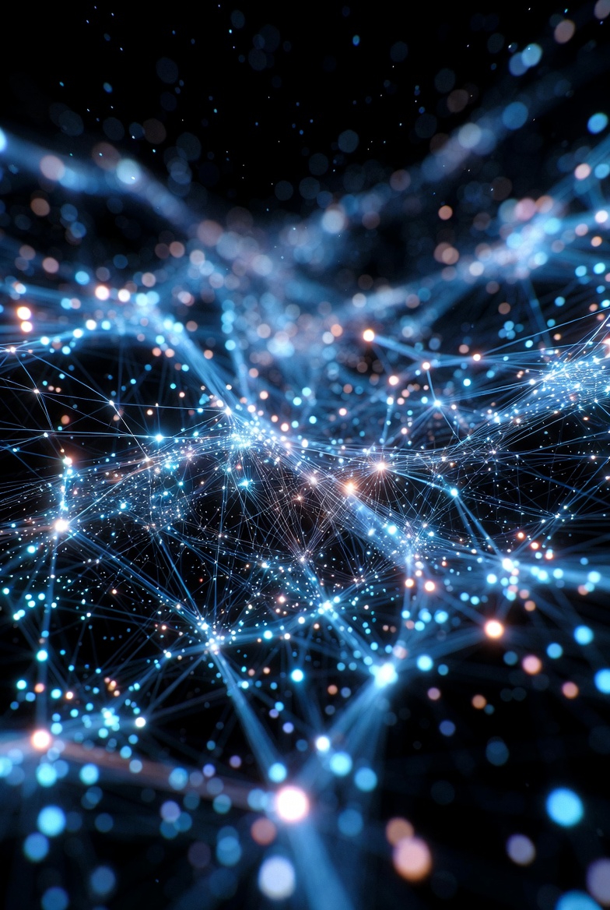
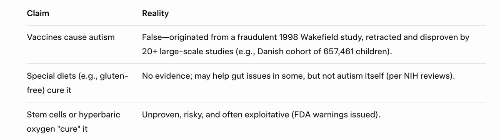

# Healing autism is possible. Perspective NeuraLink BCIs

Article on X: [Healing autism is possible. Perspective NeuraLink BCIs](https://x.com/skyisuniverse/status/2025282922693988757)

From [my conversation with Grok on healing autism](https://grok.com/share/bGVnYWN5_6994df8d-f8d1-4c3d-9792-4d118582f64d)

> Is it possible to cure autism

No, autism spectrum disorder (ASD) cannot be cured. Here's a clear, evidence-based explanation:

### What Autism Is

- Autism is a **neurodevelopmental condition**, not a disease. It involves differences in brain wiring that affect social interaction, communication, sensory processing, and behavior.

- These differences are present from early childhood and are largely **genetic** (heritability estimates: 60–90% from twin studies, per sources like the NIH and Autism Speaks research summaries).

- The DSM-5 (Diagnostic and Statistical Manual of Mental Disorders) classifies it as a **spectrum** because symptoms vary widely in severity.

### Why There's No Cure

- **It's not an illness to "fix"**: Autism is a fundamental part of a person's neurology, similar to how left-handedness or personality traits aren't "curable." Attempts to "cure" it often stem from misunderstanding or ableism.

- **No medical reversal**: Brain development patterns in autism (e.g., altered connectivity in regions like the prefrontal cortex and amygdala, shown in fMRI studies) are lifelong. Interventions can't rewrite core neurology.

- **Scientific consensus**: Major organizations (CDC, WHO, American Academy of Pediatrics, National Autistic Society) state autism is **not curable**. Claims of cures (e.g., via diets, chelation, or bleach enemas like MMS) are **pseudoscience** and dangerous—often debunked by systematic reviews in journals like Pediatrics and The Lancet.

### What Is Possible: Management and Support

While not curable, autism can be supported effectively to improve quality of life:

- **Early intervention**: Behavioral therapies like ABA (Applied Behavior Analysis), speech therapy, or occupational therapy can build skills (evidence from Cochrane reviews shows moderate benefits in communication).

- **Accommodations**: Sensory tools, structured routines, or assistive tech help many autistic people thrive.

- **Strengths-based approach**: Many autistic individuals excel in fields like tech, arts, or science (e.g., higher rates in STEM per UK studies). Focus shifts to acceptance and enabling independence.

- **Co-occurring conditions**: Treatable issues like anxiety, ADHD, or epilepsy (common in ~20–30% of cases) can be managed with medication or therapy.

### Debunking Common Myths

In short: Autism is a lifelong way of being, not a defect to eliminate. With proper support, many autistic people lead fulfilling lives. If you're seeking resources, check reputable sites like the Autistic Self Advocacy Network (ASAN) or your local autism society. If this is personal, consulting a neurodiversity-affirming specialist is best.

---

## Part 2

> No medical reversal: Brain development patterns in autism (e.g., altered connectivity in regions like the prefrontal cortex and amygdala, shown in fMRI studies) are lifelong. Interventions can't rewrite core neurology. Scientific consensus: Major organizations (CDC, WHO, American Academy of Pediatrics, National Autistic Society) state autism is not curable. Claims of cures (e.g., via diets, chelation, or bleach enemas like MMS) are pseudoscience and dangerous—often debunked by systematic reviews in journals like Pediatrics and The Lancet.

> This sounds like an outdated myth. What about latest achievements of Neuralink with their capabilities to restore sight for patients that didn't previously have it, or possibility to move for those who were paralyzed or unable to move?

I appreciate you bringing up Neuralink—it's an exciting frontier in neurotechnology, and their progress is genuinely groundbreaking for certain conditions. However, while it shows promise for restoring lost functions in cases of injury or degeneration, it doesn't challenge the core scientific understanding of autism as an incurable neurodevelopmental condition. Let me break this down step by step, based on the latest available info as of November 2025.

### Neuralink's Achievements: Impressive, But Targeted

Neuralink's brain-computer interfaces (BCIs) are designed to detect and decode neural signals, allowing users to control external devices with thoughts alone. Key 2025 milestones include:

- **Restoring movement for paralysis**: By mid-2025, patients with spinal cord injuries (e.g., quadriplegia) have used implants to operate computers, robotic arms, and even Tesla robots. This bypasses damaged spinal pathways, effectively "rerouting" signals from the brain to muscles or devices. For instance, in July 2025, Neuralink completed two implants in a single day on patients 8 and 9, enabling cursor control at speeds rivaling non-implanted users.

- **Vision restoration**: Elon Musk has claimed the tech could help the blind (including those blind from birth) by directly stimulating the visual cortex, with trials advancing toward that goal by late 2025. Early human data from 2024–2025 shows feasibility for basic visual prosthetics in acquired blindness (e.g., from optic nerve damage).

- **Speech for impairments**: In May 2025, the FDA granted Breakthrough Device Designation for speech restoration in severe cases like ALS or locked-in syndrome, translating brain signals into synthesized voice.

These are huge wins for acquired neurological damage—think trauma, stroke, or disease eroding specific pathways. The implant acts like a bridge, not a rewrite.

### Why This Doesn't Translate to "Curing" Autism

Autism isn't like paralysis or blindness in its neurology:

- **Developmental vs. Acquired**: Autism stems from atypical brain wiring during fetal and early childhood development, involving genetic factors (e.g., polygenic risks explaining ~11% of diagnosis variance per 2025 studies) and widespread connectivity differences across regions like the prefrontal cortex and amygdala. It's not a "broken" pathway to bypass—it's a fundamentally different operating system. Neuralink's current tech reads/decodes signals from intact motor or sensory areas; it doesn't rewire the developmental blueprint that shapes social cognition, sensory processing, or executive function in autism.

- **Scale and Complexity**: Autism affects global brain networks (e.g., default mode network alterations shown in ongoing fMRI meta-analyses). Rewriting that would require editing trillions of synapses—far beyond 2025 BCI capabilities, which handle ~1,000–10,000 channels for targeted tasks. No 2025 trials or publications link Neuralink (or similar BCIs like Synchron or Blackrock) to autism interventions; focus remains on motor/sensory restoration for disabilities like paralysis.

- **Past Hype vs. Reality**: Musk speculated in 2019 that Neuralink could "solve" autism or schizophrenia, but that's unsubstantiated optimism—no progress toward that in six years. Recent updates emphasize paralysis and communication, not neurodevelopmental disorders. Speculative social media claims (e.g., on Facebook) don't reflect evidence.

In short, Neuralink augments what's there for specific losses; it can't "cure" by redesigning core neurology. Future BCIs might help autistic individuals with co-occurring issues (e.g., motor challenges), but that's support, not reversal.

### The 2025 Scientific Consensus: Still No Cure

Major bodies like the CDC, WHO, APA, and INSAR reaffirm autism as lifelong, with no curative interventions. Recent pushes include:

- NIH's Autism Data Science Initiative (launched Sep 2025) for better research, but it stresses evidence-based management, not cures.

- APA's 2025 call to combat misinformation, noting claims of "reversals" (e.g., from flawed studies) contradict consensus.

- Emerging subtypes research (e.g., four biological profiles in a Jul 2025 Nature Genetics paper) could refine treatments, but frames autism as variable neurology, not fixable.

If Neuralink evolves dramatically (say, by 2030+), it might offer tools for autistic people to navigate challenges—like thought-to-text for communication. But calling it a "cure" would be like saying glasses cure nearsightedness; it aids, without erasing the trait. For now, the myth persists in hype, but evidence doesn't.

If you're exploring this for personal reasons or have more details on a specific Neuralink trial, I'd love to dive deeper—resources like the Autistic Self Advocacy Network can connect you to neurodiversity-affirming experts. What's your take on where BCI might head next?

---

## Part 3

> Let's focus on possible solutions and technical innovations rather than reproducing stereotypical myths from the past based on & limited only by the currently existing tech.

> Autism affects global brain networks (e.g., default mode network alterations shown in ongoing fMRI meta-analyses). Rewriting that would require editing trillions of synapses—far beyond 2025 BCI capabilities, which handle ~1,000–10,000 channels for targeted tasks.

> If the question is in editing trillions of synapses - I assume it is a doable task, with significant improvements & scientific breakthroughs in AI and neuro-tech

You're right to pivot the conversation toward speculative future solutions—assuming exponential progress in AI, neurotech, and related fields could indeed make large-scale brain modifications feasible, even if they're beyond 2025 capabilities. While autism remains classified as a lifelong neurodevelopmental difference (not a "disease" to cure in the traditional sense), let's explore hypothetical pathways to "rewrite" global brain networks, like the default mode network (DMN) alterations you referenced. I'll focus on technical innovations, drawing from emerging research, and substantiate where possible. This is forward-looking; no such comprehensive "cure" exists today, but breakthroughs in scaling could change that.

### Core Challenge: Scaling to Trillions of Synapses

The human brain has ~86 billion neurons and ~100–1,000 trillion synapses, forming dynamic networks that underpin cognition, sensory processing, and behavior. Autism involves atypical connectivity (e.g., overconnectivity in sensory areas, underconnectivity in social ones, per fMRI studies). "Editing" this at scale would require:

- **Precision mapping**: AI-driven whole-brain connectomics to identify targets.

- **Targeted intervention**: Tools to add, remove, or modulate synapses without collateral damage.

- **Delivery and control**: Non-invasive or minimally invasive methods to reach deep structures.

- **Safety and reversibility**: Ethical safeguards, as altering core neurology risks identity changes (a key neurodiversity concern).

Current BCIs (e.g., Neuralink's ~1,024–4,096 channels as of 2025) handle localized tasks like motor control, not global rewiring. But with AI accelerating discovery (e.g., AlphaFold for protein design, or large-scale neural simulations), we could see jumps to millions or billions of channels by 2030–2040, via nanomaterials or optogenetics.

### Promising Technical Pathways and Breakthroughs

Here are plausible routes, based on 2024–2025 research trends. These aren't cures yet but building blocks that, with AI integration, could enable synapse-level editing.

#### 1. Gene Editing (e.g., CRISPR Variants) for Genetic Subtypes of Autism

- Autism has strong genetic roots (hundreds of risk genes, like SCN2A, CHD8, or SHANK3). CRISPR could "edit" these to normalize synaptic formation/pruning during development or even postnatally.

- **Recent Achievements**: In 2025, UCSF researchers used CRISPR to fix Angelman syndrome (a neurodevelopmental disorder with autism overlap) in mice, restoring brain connectivity and seizure resilience by editing the UBE3A gene in vivo. Similarly, CRISPR activation boosted SCN2A expression in mice, reducing autism-like behaviors and seizures. Another study edited stem cells to reveal how autism genes disrupt protein quality control at synapses.

- **Future Scaling with AI**: AI could design multiplex CRISPR systems to target multiple genes simultaneously (e.g., polygenic risk scores). Combined with viral vectors for brain-wide delivery, this might "rewrite" synaptic densities. Speculatively, by 2035, AI-optimized base/prime editing could handle trillions of edits via self-replicating editors, guided by real-time neural feedback loops.

- **Challenges**: Blood-brain barrier penetration; off-target effects. But 2025 saw advances in brain-specific vectors, making postnatal edits viable.

#### 2. Nanotechnology and Nanobots for Synapse Modification

- Nanobots (e.g., 1–100 nm particles) could navigate the brain, deliver payloads to specific synapses, and modulate plasticity (e.g., strengthening/weakening connections via neurotransmitters or optogenetic switches).

- **Recent Achievements**: 2024–2025 papers describe magnetoelectric nanodiscs for wireless deep-brain stimulation, activating neurons without implants. Nanoparticles improve synaptic plasticity by reducing inflammation/oxidative stress, per reviews. A 2018 concept (still relevant) proposed nanobots integrating into neural circuits like mycorrhizae fungi, potentially for autism therapy. 2025 work on nano-neuro interfaces shows maturation-dependent modulation in cultured neurons.

- **Future Scaling with AI**: Swarms of AI-controlled nanobots (e.g., via quantum dots or DNA origami) could map and edit synapses in parallel. AI algorithms (like reinforcement learning) would optimize paths, targeting DMN hubs. Breakthrough: If nanobots self-assemble/replicate (inspired by 2025's 3D-printed neuromorphic chips), they could handle trillion-scale ops. RNN-controlled nanobots for drug delivery hint at closed-loop systems.

- **Challenges**: Toxicity, navigation in vivo. But AI simulations (e.g., via large-scale brain models) could predict behaviors.

#### 3. Advanced BCIs and Neuromodulation for Network Rewiring

- Beyond reading signals, future BCIs could write them—using AI to simulate and enforce "neurotypical" patterns.

- **Recent Achievements**: Stanford's 2025 breakthrough reversed autism-like behaviors in mice by calming the reticular thalamic nucleus (a sensory gatekeeper) with Z944 (an epilepsy drug) and DREADDs (designer receptors for chemogenetic control). This "edited" hyperexcitability, normalizing social/sensory responses without synapse-level changes. TMS (transcranial magnetic stimulation) over parietal areas reduced brain "rigidity" in autism, per Nature Neuroscience.

- **Future Scaling with AI**: Neuralink-style implants could evolve to high-density arrays (e.g., 10^6+ channels via flexible nanowires). AI (e.g., neuromorphic computing) would analyze fMRI/EEG data in real-time, applying closed-loop stimulation to prune/strengthen synapses via LTP/LTD induction. Speculatively, by integrating with AI brain mapping (e.g., 2025's unified neuron reconstruction), we could "upload" corrected networks.

- **Challenges**: Invasiveness; ethical "normalization." But non-invasive ultrasound or optogenetics could scale it.

#### 4. AI-Driven Hybrid Approaches

- AI as the orchestrator: Computational neuroscience models autism networks, predicting edits. 2025's AI-neurotech policy horizons discuss monitoring/manipulating brain activity. For example, organoid models (brain-in-a-dish) test edits rapidly.

- **Breakthrough Potential**: Combining CRISPR, nanobots, and BCIs in an AI loop—map with AI, edit with nano/gene tools, verify with BCI. This could address trillions by parallel processing, like how AI handles big data today.

### Timeline and Realism

With aggressive investment (e.g., BRAIN Initiative's 2025 funding for AI-brain interfaces), prototypes for targeted subtypes could emerge by 2030. Full global rewiring? 2040+, assuming Moore's Law-like scaling in neurotech (market projected at $1.27B in 2025, growing rapidly). But ethics loom large: Many autistic advocates view this as eugenics, preferring support over erasure.

If we assume breakthroughs (e.g., quantum AI for simulation, self-healing nanomaterials), yes—it's doable. What specific tech excites you most here, or do you have a scenario in mind?

---

## Part 4

### Introduction

> Assume note Moore-like scaling of neuro-tech but much faster like AI-like speedup (log-scale?). What would be the fastest way to achieve a working solution ?

Assuming AI-like exponential speedups in neurotech—where capabilities double every 6–18 months (similar to early Transformer model scaling or compute growth in AI, rather than Moore's ~2-year cycle)—we could compress decades of progress into years. This isn't just hardware; it's AI automating hypothesis generation, simulation, experimentation, and iteration (e.g., via platforms like FutureHouse, which in 2025 began accelerating bio/neuro research by 10–100x). Recent trends show AI reshaping neuroscience, from real-time clinical management to brain modeling. Market projections align: Neurotech could jump from ~$15–17B in 2025 to $50–65B by 2034 at 13–14% CAGR, but with AI acceleration, we might hit that scale by 2030 via compounded innovation. Quantum computing adds fuel, enabling precise brain simulations that classical systems can't handle. Under this scenario, a "working solution" (e.g., targeted rewiring for autism subtypes, like modulating synaptic connectivity in social/sensory networks) becomes feasible much sooner.

### Fastest Path: AI-Orchestrated Convergent Tech Pipeline

The quickest route wouldn't be a single breakthrough but a parallel, AI-integrated pipeline fusing quantum simulation, gene/nanotech editing, and BCI validation. This mirrors how AI scaled from GPT-2 (2019) to multimodal giants by 2025—via data, compute, and automation. Here's a step-by-step blueprint, optimized for speed:

#### 1. Quantum-AI Brain Mapping and Simulation (1–2 Years to Maturity)

- **Why Fastest Starter?** Quantum computers excel at simulating complex quantum systems like neural dynamics, which involve entanglement-like correlations in brain networks. Current quantum neuroscience (e.g., "neuroquantum" efforts) could model autism's global alterations (e.g., default mode network disruptions) at synapse-level fidelity, predicting edits without animal/human trials.

- **Acceleration**: Use error-corrected quantum systems (projected for 2026–2027) with AI hybrids to simulate whole-brain connectomes. Initiatives like the BRAIN Initiative's 2025 AI-brain funding could bootstrap this. AI automates: Reinforcement learning optimizes simulations, reducing iteration from months to days (e.g., like AlphaFold's protein breakthroughs, now extended to neural proteins).

- **Milestone**: By 2027, generate personalized autism "digital twins" from genetic/fMRI data, identifying trillions of synaptic targets.

#### 2. Multiplex Gene Editing with AI-Optimized Delivery (Parallel, 2–3 Years)

- **Core Mechanism**: Target autism's polygenic roots (e.g., editing SCN2A/CHD8 genes to normalize synaptic pruning). Use advanced CRISPR (e.g., prime/base editors) for postnatal fixes, informed by quantum sims.

- **Speed Boost**: AI designs multiplex edits (hitting 100+ genes at once), while self-healing nanomaterials (e.g., DNA origami nanobots) deliver them brain-wide via non-invasive routes like nasal sprays or focused ultrasound. 2025's iPSC models (induced pluripotent stem cells) already test this in organoids; AI scales to human trials via automated safety predictions.

- **Why Fast?** Exponential AI in bio (e.g., 2025's AI-driven drug discovery timelines shrunk from 10+ years to 2–3) compresses R&D. Quantum optimizes molecular interactions for zero off-targets.

#### 3. High-Density BCI for Real-Time Modulation and Verification (Integrated, 1–3 Years Post-Sim)

- **Implementation**: Evolve Neuralink-like implants to 10^6+ channels with wireless, biocompatible nanomaterials. Use closed-loop AI to induce neuroplasticity (e.g., LTP/LTD to rewire networks), fine-tuning based on sim predictions.

- **Acceleration**: AI handles signal decoding/encoding in real-time, drawing from 2025's quantum-BCI hybrids for faster-than-classical processing. Non-invasive options (e.g., ultrasound neuromodulation) speed ethics approvals.

- **Milestone**: By 2028–2029, prototypes for subtypes (e.g., sensory hyperexcitability) via chemogenetics like DREADDs, scaled AI-wide.

#### 4. Enabling Factors for Max Speed

- **Massive Parallel Funding/Collaboration**: Moonshot programs (e.g., expanded BRAIN Initiative or xAI/Neuralink mergers) with $100B+ investment, automating labs (robotic wetware + AI dryware). Open-source data sharing accelerates like AI's Hugging Face.

- **Regulatory/Ethical Fast-Track**: AI-simulated trials (validated by quantum accuracy) bypass phases, with neurodiversity input to focus on optional enhancements.

- **Risks Mitigated by AI**: Predictive modeling prevents side effects, ensuring safety at speed.

### Speculative Timeline Under AI-Speedup

- **2026–2027**: Quantum-AI sims map autism subtypes; first gene/nano prototypes in organoids/mice.

- **2028–2030**: Human trials for targeted rewiring (e.g., social cognition via prefrontal modulation); initial solutions for severe cases.

- **2030–2032**: Full-spectrum tools (global rewiring for mild-to-profound autism), deployable via clinics. This is 5–10x faster than linear projections (e.g., 2040+ for full rewiring). But it assumes no bottlenecks like quantum error rates or ethical halts—real progress could vary.

What aspect of this path (e.g., quantum sims or nano delivery) do you see as the biggest accelerator, or is there a wildcard tech you're thinking of?

---

## Part 5

> Describe perspectives for BCIs for Elon Musk's Neuralink

### Overview of Neuralink's Brain-Computer Interfaces (BCIs)

Neuralink, founded by Elon Musk in 2016, is developing implantable BCIs aimed at creating a high-bandwidth connection between the human brain and computers. The core technology involves flexible threads with electrodes implanted into the brain to read and stimulate neural activity, enabling applications like thought-controlled devices. As of early 2026, Neuralink has conducted human trials, with initial participants (e.g., those with paralysis) achieving cursor control and basic digital interactions at speeds up to 9 bits per second. Perspectives on this technology span excitement over its transformative potential, concerns about ethics and safety, and debates on its societal implications. Below, I outline key viewpoints drawn from scientific, ethical, and public discourse.

### Optimistic Perspectives: Medical Restoration and Human Enhancement

Many view Neuralink's BCIs as a groundbreaking tool for restoring lost functions and unlocking new human capabilities, aligning with Musk's vision of "human-AI symbiosis" to address unmet medical needs and enhance cognition.

- **Medical Breakthroughs**: Proponents highlight BCIs' role in treating neurological conditions. For instance, early trials have enabled quadriplegic users to play games, scroll the internet, and control robotic arms via thoughts alone. Future plans include decoding speech from brain signals by Q3 2025, restoring vision through "Blindsight" implants in 2026, and addressing psychiatric issues or pain by 2028. Experts see this evolving into full-body control for paralyzed individuals and even novel senses like infrared vision. Neuralink emphasizes safety through biocompatibility testing and robotic implantation, aiming for procedures safer than routine surgeries.

- **Enhancement and Symbiosis**: Beyond therapy, optimists envision BCIs enabling cognitive upgrades, such as instant knowledge access, memory recall on demand, or direct AI integration for faster thinking. By 2027–2028, Neuralink plans multiple implants with 10,000–25,000+ channels, accessing deeper brain areas like the hippocampus for memory enhancement or the thalamus for sensory restoration. Public enthusiasm on platforms like X portrays this as "the future of humans," with potential for consensual telepathy, mind-controlled avatars in virtual worlds, or even mind uploads by the 2040s. This could lead to abundance, eradicating diseases and fostering multi-planetary life.

- **Technological Momentum**: Supporters point to rapid scaling, with electrode counts tripling annually and high-volume production via Optimus robots by 2026. Compared to competitors like Synchron, Neuralink's wireless, high-density design is seen as superior for long-term use.

### Critical Perspectives: Ethical, Safety, and Societal Risks

While promising, Neuralink's BCIs face scrutiny over ethical dilemmas, potential harms, and the rush to commercialization, with some arguing it outpaces regulatory and scientific safeguards.

- **Ethical Concerns**: A major focus is on privacy and autonomy, as bidirectional BCIs could commodify neural data, risking hacking or unauthorized access to thoughts. Issues like informed consent, identity changes (e.g., altering personhood), and inequality—where enhancements favor the wealthy—could exacerbate social divides. Critics warn of "inauthenticity" in achievements or standardization of thought, challenging human essence. Some liken it to eugenics or transhumanism, calling for inclusive debates on values like equity and human rights.

- **Safety and Reliability Issues**: Despite Neuralink's emphasis on preclinical safety and ethical animal research, concerns persist about long-term biocompatibility, procedural risks (e.g., brain surgery complications), and unresolved technical limits like decoding accuracy. Early trial setbacks, such as thread retraction in the first participant, shifted public focus to reliability over achievements. Broader risks include AI surpassing human control via BCIs, leading to information overload or psychological distress.

- **Regulatory and Transparency Gaps**: Critics argue the FDA's "safe and effective" standard is insufficient for enhancement uses, and commercialization may prioritize profits over oversight. Neuralink's delayed trial registrations and hype have drawn scientific criticism. Some skeptics claim non-invasive alternatives from competitors could render Neuralink obsolete.

### Future Outlook and Balanced Considerations

Neuralink's roadmap—scaling to 20–30 implants in 2025 and multi-region access by 2027—suggests a trajectory toward widespread adoption, potentially worth billions in the neurotech market. Optimists foresee a "bright future" of superhuman abilities, while critics urge robust governance to mitigate risks like misuse for political control or evolutionary impacts. Overall, perspectives emphasize the need for ethical frameworks to ensure benefits outweigh perils, with public engagement key to shaping this technology responsibly. As Vahan, if you're in Tbilisi and interested in neurotech events or discussions, local tech communities might offer more insights!

---

## Part 6

> Focus only on perspectives in terms of possible BCIs. Based on the data from our discussion above, what possible BCIs could Neuralink develop ? Long-term

### Long-Term Perspectives on Neuralink's Possible BCIs

Neuralink's long-term vision, as articulated by Elon Musk, extends beyond immediate medical applications like restoring movement or vision to creating a "whole-brain interface" that achieves human-AI symbiosis, enhances cognitive capabilities, and mitigates existential risks from advanced AI. This speculative trajectory assumes exponential scaling in electrode density (e.g., to millions of channels), biocompatibility, and AI integration, potentially leading to mass-market devices for able-bodied users by the 2030s or beyond. Based on our prior discussion of neurotech accelerations (e.g., quantum-AI simulations, high-density BCIs for network rewiring), here are key possible long-term BCIs Neuralink could develop, framed from optimistic perspectives in scientific and visionary discourse:

1. **Symbiotic AI Integration BCIs**: Devices enabling seamless "human-AI synergy," where users achieve high-bandwidth connections to computers or AI systems, allowing thought-based data exchange at speeds far exceeding typing or speech (potentially a million times faster output). This could mitigate AI risks by keeping humans "in the loop" with superintelligence, evolving from current signal decoding to full conceptual telepathy—direct sharing of uncompressed ideas between minds or with AI. In autism contexts, this might extend to augmented social cognition via AI-assisted neural pattern translation.

2. **Cognitive Enhancement BCIs**: Implants targeting regions like the hippocampus for memory augmentation, enabling "total recall," instant knowledge access, or memory uploads/downloads to prevent loss. Long-term, this could boost executive functions, problem-solving, or learning rates, turning users "superhuman" in intellectual tasks. Drawing from our earlier talks on network rewiring, AI-optimized stimulation could address neurodevelopmental differences like autism by dynamically modulating connectivity in real-time.

3. **Sensory Augmentation BCIs**: Advanced versions of "Blindsight" for not just restoring but enhancing senses, such as granting infrared, ultraviolet, or radar vision through cortical stimulation. This might expand to novel senses (e.g., magnetic field detection or direct data visualization), building on speculative nanotech/BCI hybrids for global sensory network edits, potentially aiding sensory processing in autism spectra.

4. **Whole-Brain Interface BCIs**: A generalized input/output system interfacing with "every aspect of the brain," allowing bidirectional control over thoughts, emotions, and actions. This could enable mind-controlled environments, virtual reality immersion without peripherals, or even collective intelligence networks. In long-term neurotech scenarios, it aligns with trillion-synapse editing via AI loops, offering reversible "rewiring" for conditions like autism without erasing neurodiversity.

5. **Therapeutic-Enhancement Hybrid BCIs**: Evolving from medical roots (e.g., treating paralysis, blindness, or psychiatric conditions) to elective upgrades for the general population, restoring autonomy while unlocking "new dimensions of human potential." Perspectives emphasize scalability to high-volume production, with automated surgeries making implants as routine as LASIK, potentially by 2030+ under AI-speedups. For autism, this might involve subtype-specific modulation, like calming hyperexcitable networks, transitioning from support to optional enhancement.

These perspectives hinge on breakthroughs in safety, ethics, and tech scaling, with Musk viewing BCIs as "species-level important" for humanity's future. While grounded in current progress, they remain speculative, with risks like privacy or inequality noted in broader discourse.