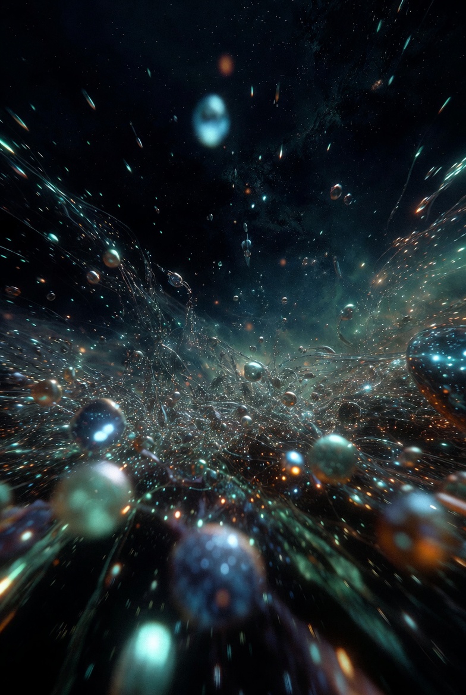
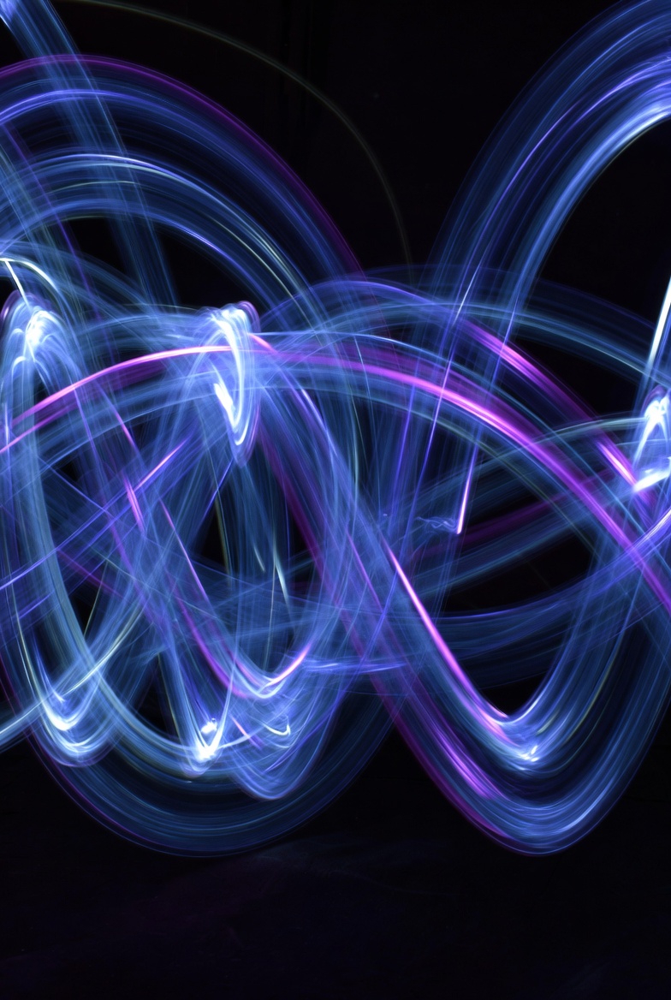
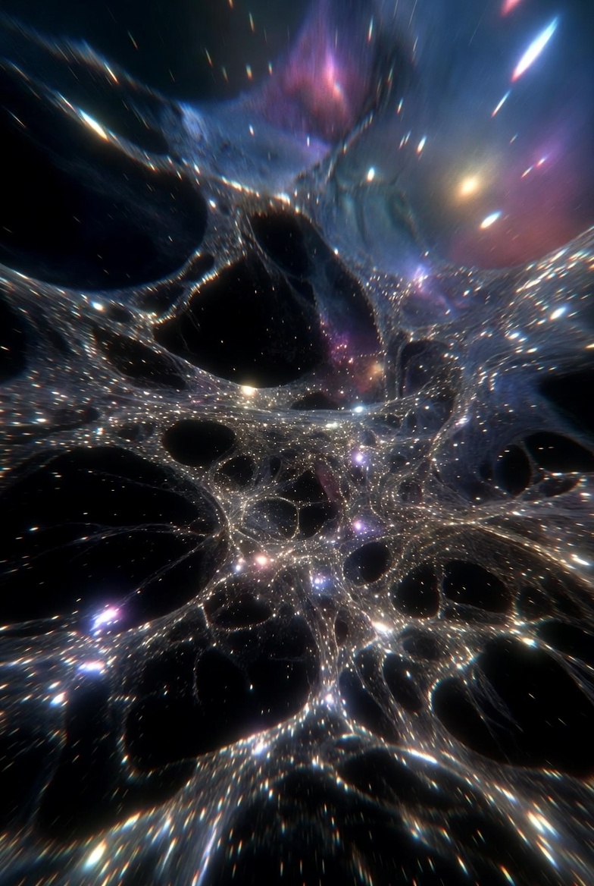
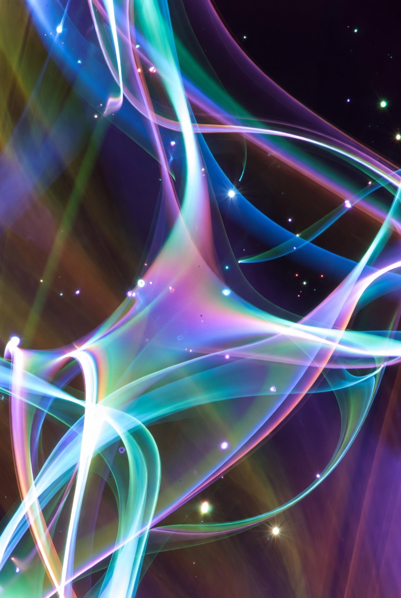
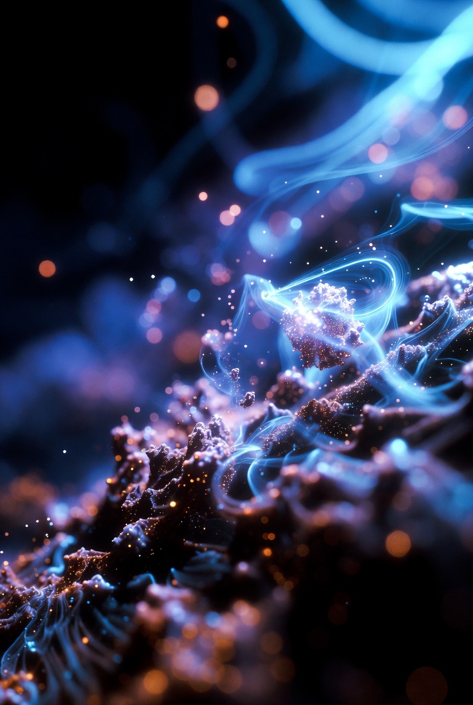

# Fastest way to convert entanglements into tools

Article on X: [Fastest way to convert entanglements into tools](https://x.com/skyisuniverse/status/2026067506708746463)

## Quantum Consciousness as the fastest way (vehicle) to get into the future

- by continuously accumulating entanglements / wavefunction collapses
- acquiring new knowledge / tools with the currency of collapsed wavefunctions (Orch-ORs) (Objective reductions)

If these two are repeated continuously for long enough time - first, new body of knowledge might be gotten; second - new practical tools might be built with it

- Accumulation has to be continuous, otherwise the concentration in microtubules might get rarified, what leads to a different world distribution 

- Different distribution means implementation of the opposite scenario or implementation of it in a different place (person?) if a wavefunction collapse (objective reduction) doesn't happen (God only has our hands as tools)

- Distraction from objective reduction, be it personal or collective (due to Quantum Teleportation, e.g. what Einstein called "spooky action at a distance", when a Quantum state from one person (context?) gets translated to another, valid at any distances without latency (at once))

- If a person or collective falls off from continual accumulation of entanglement and it's conversion, erosion of entanglement might occur (not only of the new possible entanglements, but also of the existing ones). Quantum Tax

- Entanglement, even if and when it happens requires efficient execution, which might have different parameters depending on the context. E.g. anything can be the code of existence (words, colors, sounds, etc), and based on the content of the moment the world distribution might occur according to one or another scenario. It might be thought of as a purchase in a supermarket. After entering it with a certain amount of money, it can be spent in different ways, based on the contents of the cart that a person makes - the list of products they add to the cart. Products - properties / parameters of the executed OR (objective reduction)

Most of humanity exists in deterministic mindset & practice, which means ORs are not systematic (occasional in the best case) or are absent at all. 

Regardless of whether a person / collective practices continuous entanglement accumulation and ORs (objective reductions), they are continuously participants of the space (Quantum Communication), where they act as recipients and contributors of Quantum Information, e.g. send and receive different Quantum States. Acceptance or Sending of a Quantum state shapes the distribution of the world.

In order to implement a long term project, that implies development of a new technology, that has no reliable theoretical / scientific grounding (content), it might be necessary to dedicate certain resources (people) in parallel to:

- Accumulating & converting ORs (objective reductions) into breakthrough knowledge

- Converting gotten knowledge into practically feasible means for it's implementation (whatever it is - tools, processes, etc.)

Nature of existence is Quantum. Yet people by default (most commonly) live in it deterministically, not quantumly. Which means throughout years, being a target of continuously sent packets of Quantum States by others (thoughts, emotions, actions, any form of feedback / input), they (and consequentially their context) might be distributed in one or another way (e.g. slowing down in execution or on the contrary - speeding up, losing or improving).

Any process in order to be successful and efficient long-term has to be shielded in terms of Quantum States and Communication in Quantum Realm. (Correct judgements, successful entanglements, avoidance of the Quantum Tax).

Quantum Tax gets implemented every time when OR cannot be achieved. For conscious Quantum actor it means necessity to dedicate enough time / resources to continuous Quantum operation, such that all Quantum Taxes (Quantum States) that were accumulated throughout lifetime of a person (and are now continuously being sent in his / her direction by other people) are:

- Shielded (e.g. no Quantum Space debris is accepted if it is hurtful)

- Goals are achieved and protected (from any opposing Quantum state which pretends to distribute the world differently)

One of priorities for a conscious Quantum actor is population of the [quantum] [communicative] space with proper contents and it's maintenance in such a shape that facilitates execution of the good and prevents the bad from happening.

Based on the content of the surrounding [quantum] [communicative] space we can defer. (E.g. real world examples - high pollution of such space, projects being slowed down for years, or slowed down rollouts, cancellations, etc).

With sufficient resources dedicated (people, time, etc) it might be possible to maintain the [quantum] [communicative] space clean and execute well.

Important - each actor is subject to their own Quantum Legacy (payoff of the Quantum Tax) which means in order to enable value delivery and execution (continuous in particular) they have to be smart about resource allocation. E.g. continuous operation with mutual responsibility 

Any person that got into connection with another person might get (or gets) entangled - which means based on the content of their interaction a pattern is born, which keeps reproducing throughout their lifetime around (same contexts, situations, people, similarities) arising and noticeable in the world (what Einstein called "spooky action at a distance"").

In many cases if all that quantum communication was not done consciously, there might be a burden (a quantum tax) that a person pays off due to reproduction of a Quantum state. (E.g. thoughts about some people, troubles, doubts, etc).

It might be thought of as a gated system, where any action / judgement / thought might be perceived as gates.

Any bad thought / assessment can be a closing of the gates. Good - their opening. The content of such distribution might be any - as possible of values that a qubit can have.

The best way to deal with such complexity could be the Shared Consciousness. When people reach such level of coherence, that there is no juxtaposition to each other (including resource allocation, possessions, property, properties, anything really). Then, there might be no Quantum Tax at all (or at least it might be minimized). Or, if the coherence is reached - there might be mutual enhancement. Then, possibilities might be vast. Endless.

People who got entangled share same destiny (to a certain extent). Because their Quantum states can be propagated to each other and shared through Quantum Teleportation.

Important - outcomes of any choice (be it fruitful in losses for the person or gains) are multiplied and propagated. At least once - if a person can handle it. Sustained Quantum Efficiency is non-trivial.

