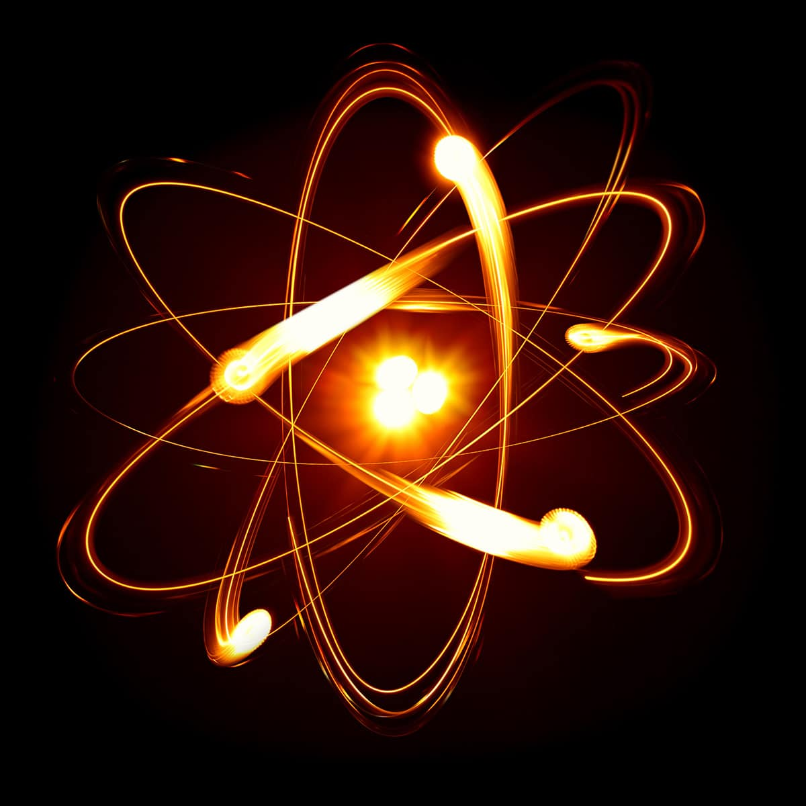
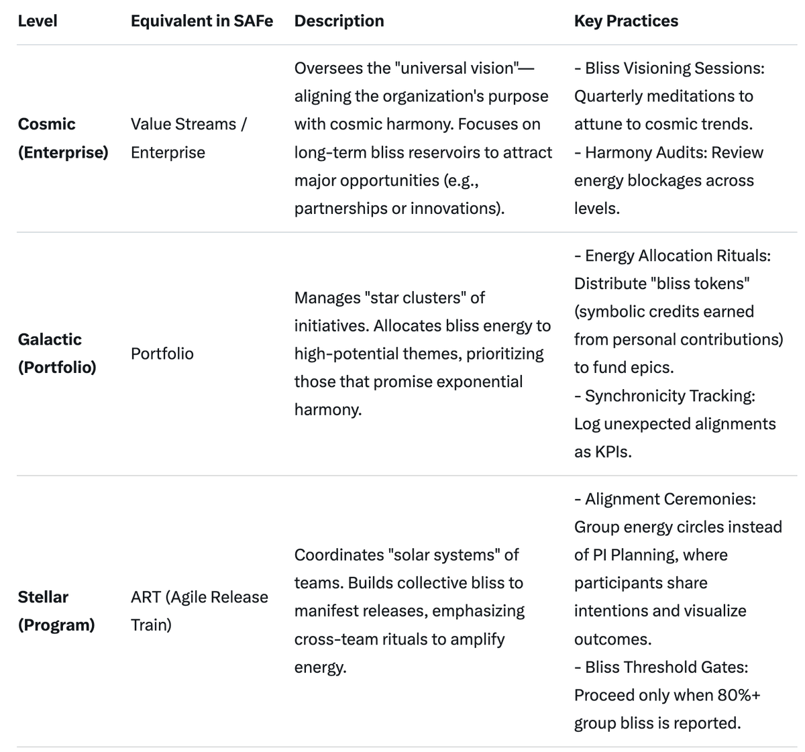
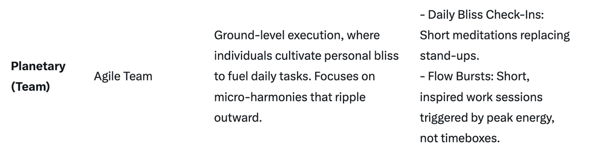
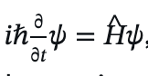
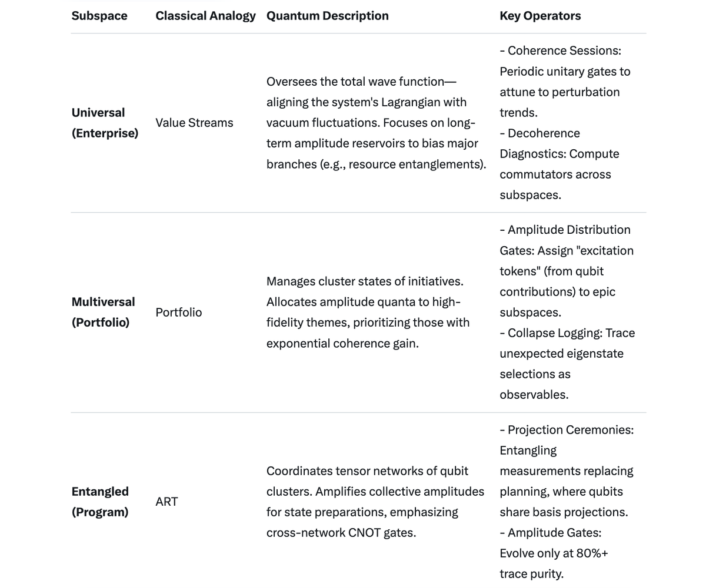

# Quantum Execution Framework

Article on x.com: [Quantum Execution Framework](https://x.com/skyisuniverse/status/2021215797839003954)

From [my conversation with Grok on Quantum Execution Framework](https://x.com/i/grok/share/e283027935ca4bfabc0c884ee5a49fd2)

## Celestial Harmony Framework (CHF)

The Celestial Harmony Framework (CHF) is a visionary approach to planning and execution, inspired by the Scaled Agile Framework (SAFe) but reimagined through the lens of universal cosmic harmony. It shifts the paradigm from rigid cadences, metrics-driven sprints, and hierarchical controls to a fluid, energy-based system where outcomes emerge organically from the accumulation of "bliss energy"—a metaphorical force representing collective joy, alignment, and positive intention. This energy acts as a cosmic catalyst, heightening the probability of serendipitous opportunities, synchronicities, and optimal results while minimizing disruptions or "penalties" (such as setbacks, conflicts, or inefficiencies) through emphasized personal accountability and shared commitment.

CHF draws from celestial principles: just as stars align to form constellations, planets orbit in balanced rhythms, and galaxies expand through gravitational harmony, human endeavors thrive when attuned to universal flows. It posits that bliss energy—cultivated via mindful practices—creates a vibrational field that attracts favorable conditions, much like quantum probability waves collapsing into desired realities. Outcomes aren't forced or scheduled; they "appear" when the energy threshold is met, fostering resilience, creativity, and ethical growth.

### Core Principles

CHF is built on four foundational pillars, each echoing cosmic laws:

1. **Universal Alignment**: All actions must resonate with the greater cosmos—ethical, sustainable, and interconnected. This replaces SAFe's lean-agile mindset with a "harmonic mindset," where decisions are vetted against questions like: "Does this amplify collective bliss or disrupt equilibrium?"

2. **Bliss Energy Accumulation**: Bliss is the currency of progress. It's generated through individual and group practices (e.g., gratitude, meditation, acts of kindness) and measured qualitatively (via self-assessments) rather than quantitatively. When bliss accumulates to a critical mass, it "unlocks" execution phases, increasing the likelihood of breakthroughs via synchronicity (e.g., unexpected resources or ideas manifesting).

3. **Personal Sovereignty**: Each participant owns their role fully, akin to a planet maintaining its orbit. This avoids penalties by distributing responsibility—no blame-shifting or free-riding. Investment is personal yet communal: the more one contributes (time, energy, vulnerability), the stronger the collective field.

4. **Emergent Flow**: No fixed cadences like PI Planning in SAFe. Instead, cycles begin and end based on bliss signals (e.g., group consensus on "energetic readiness"). This allows for non-linear progress, where the "best possible outcome" emerges naturally, guided by intuition and cosmic timing.

### Framework Structure

CHF scales across levels, mirroring SAFe's hierarchy but with celestial nomenclature. Each level builds bliss energy upward, creating a cascading effect where local harmony influences global outcomes.

### Key Practices and Rituals

CHF replaces SAFe's artifacts and ceremonies with energy-infused equivalents, emphasizing emergence over enforcement:

**Bliss Cultivation Techniques:**

- **Individual**: Daily practices like journaling gratitudes, breathwork, or nature attunement to build personal bliss reserves. This heightens personal responsibility—neglecting it "dims" one's contribution, potentially attracting minor penalties (e.g., creative blocks).

- **Collective**: Group activities such as sound baths, shared visualizations, or collaborative art to pool energy. The more invested participants are (e.g., volunteering extra insights), the faster bliss accumulates.

**Execution Cycles:**

- **Bliss Waves**: Analogous to sprints, but variable-length. A wave starts when a bliss meter (a simple app or shared dashboard tracking mood/vibration via emojis or scales) hits a threshold. It ends not by deadline, but by completion or energy dip, allowing rest to recharge.

- **Manifestation Portals**: Critical decision points where the group invokes cosmic aid—e.g., a ritual to "call in" solutions. This leverages bliss to tilt probabilities toward success, like attracting a key collaborator serendipitously.

**Avoiding Penalties**:

- Penalties (e.g., delays, conflicts) are viewed as disharmonies from unaddressed responsibilities. CHF mitigates them via **Karmic Reflections**: Retrospective sessions focused on personal accountability, where participants own misalignments and commit to reparative actions. High personal investment creates a "protective aura," reducing external disruptions.

### Metrics and Feedback:

- **Bliss Index**: A holistic score combining self-reported joy, team cohesion, and outcome synchronicities (e.g., "How many serendipities occurred?").

- **Harmony Velocity**: Measures progress not by points, but by "flow efficiency"—how seamlessly outcomes manifest.

- Feedback loops are intuitive: If bliss wanes, pause and realign; if it surges, accelerate.

### Implementation Guidance

To adopt CHF:

1. **Start Small**: Pilot at the Planetary level with a team committed to personal growth.

2. **Train Facilitators**: Appoint "Harmony Guides" (like Scrum Masters) skilled in energy work.

3. **Tools**: Use simple apps for bliss tracking (e.g., mood journals) alongside traditional project boards, but prioritize intuition over data.

4. **Challenges and Benefits**: Initial resistance may arise from those accustomed to structure, but benefits include reduced burnout, heightened innovation, and ethical outcomes. Over time, it fosters a culture where work feels like a cosmic dance, attracting talent aligned with harmony.

This framework isn't prescriptive—it's an invitation to co-create with the universe. By accumulating bliss through responsibility and investment, participants not only achieve goals but elevate the collective vibration, making the improbable possible.

## Quantum Justification for the Celestial Harmony Framework (CHF)

The Celestial Harmony Framework (CHF) can be rigorously justified through the lens of quantum theory, reinterpreting its core elements—such as bliss energy accumulation, emergent outcomes, personal sovereignty, and avoidance of penalties—as manifestations of fundamental quantum principles. Quantum mechanics, as formalized by pioneers like Erwin Schrödinger, Werner Heisenberg, and Niels Bohr, describes reality not as deterministic but as probabilistic, governed by wave functions, superposition, entanglement, and observer-induced collapse. Below, I map CHF's vision to these quantum foundations, demonstrating how it facilitates "the best possible outcomes" by aligning human systems with the universe's inherent quantum harmony.

### 1. Bliss Energy as a Quantum Field and Coherent State

In quantum field theory (QFT), the universe is composed of underlying quantum fields— pervasive, fluctuating entities like the electromagnetic field or the Higgs field—whose excitations manifest as particles and forces. Bliss energy in CHF parallels a hypothetical "harmonic quantum field," where collective positive intentions (joy, alignment, mindfulness) act as bosonic excitations (e.g., photons or phonons) that build coherence.

- **Coherence and Superposition**: Quantum systems exist in superposition, a linear combination of multiple states (as per the Schrödinger equation: 

    

    is the Hamiltonian operator). Random or predefined cadences in traditional frameworks (like SAFe) introduce decoherence—environmental interactions that collapse superposition prematurely, leading to suboptimal, classical outcomes where ψ is the wave function and H^ is the Hamiltonian operator). Random or predefined cadences in traditional frameworks (like SAFe) introduce decoherence—environmental interactions that collapse superposition prematurely, leading to suboptimal, classical outcomes. In contrast, CHF's bliss accumulation fosters a coherent superposition of possibilities, where practices like meditation or gratitude rituals minimize entropy (disorder) and amplify amplitude in desirable state vectors. This increases the probability density (|ψ|^2) for favorable outcomes to "appear," akin to how laser light (coherent photons) emerges from stimulated emission rather than random scattering.

- **Energy Thresholds and Phase Transitions**: Just as quantum phase transitions (e.g., Bose-Einstein condensation) occur when energy accumulates to a critical point, shifting a system from disordered to ordered states, bliss energy builds until it triggers a "quantum jump" (as in atomic transitions). This non-linear emergence replaces rigid schedules, allowing synchronicities—probabilistically heightened events—to manifest when the system's ground state energy is elevated through collective investment.

### 2. Emergent Outcomes via Wave Function Collapse and Probability Amplification

Quantum theory posits that outcomes are not predestined but probabilistically determined upon measurement or observation. The Born rule states that the probability of an outcome is the square of the wave function's amplitude in that basis state. CHF leverages this by treating the "best possible outcomes" as high-probability branches in a quantum multiverse.

- **Observer Effect and Intentional Collapse**: The observer effect, often misinterpreted but rooted in measurement-induced decoherence, implies that conscious interaction collapses the wave function from superposition to a definite eigenstate. In CHF, participants' mindful practices act as "observers" who bias collapse toward harmonious eigenstates. Personal investment (e.g., vulnerability or extra contributions) amplifies the projection operator onto positive outcomes, increasing the expectation value ⟨O^⟩=⟨ψ∣O^∣ψ⟩ for success. This is why outcomes happen "not randomly" but when bliss energy tilts quantum probabilities, much like in quantum computing where qubits in superposition are manipulated to favor optimal solutions via algorithms like Grover's search.

- **Avoiding Penalties through Uncertainty Management**: Heisenberg's uncertainty principle )(ΔxΔp≥ℏ/2) highlights inherent limits in predictability; forcing outcomes (e.g., via strict cadences) amplifies uncertainty in momentum (progress), leading to "penalties" like conflicts or inefficiencies. CHF mitigates this by embracing fluidity—personal responsibilities distribute uncertainty across the system, maintaining a balanced variance. High investment creates a "quantum Zeno effect," where frequent, gentle "measurements" (e.g., bliss check-ins) stabilize desirable states, suppressing transitions to penalty-laden ones.

### 3. Personal Sovereignty and Entanglement in Collective Systems

Quantum entanglement, where particles' states are correlated regardless of distance (violating classical locality, as per Bell's inequalities), underpins CHF's emphasis on interconnected personal accountability.

- **Entangled Participants as a Quantum Network**: In CHF, individuals are like entangled qubits in a quantum register; one's state (bliss level) instantaneously influences others via shared practices. Personal sovereignty ensures each "qubit" maintains its spin coherence (alignment with cosmic harmony), preventing Bell non-locality from devolving into discord. The common enterprise becomes a entangled superposition where collective bliss energy creates a "GHZ state" (multi-particle entanglement), exponentially amplifying the probability of holistic success. Neglecting responsibility introduces noise (decoherence), risking system-wide collapse to suboptimal states—hence, penalties are avoided by fostering strong correlations through investment.

- **No-Cloning and Unique Contributions**: The no-cloning theorem prohibits perfect copying of quantum states, mirroring how each participant's unique input is irreplaceable. This justifies CHF's avoidance of free-riding: diluted investment weakens entanglement, reducing the fidelity of the overall wave function and lowering the trace distance to ideal harmonious outcomes.

### 4. Universal Alignment and the Many-Worlds Interpretation

Everett's many-worlds interpretation (MWI) suggests that all possible outcomes exist in branching parallel realities, with decoherence selecting perceived branches. CHF aligns endeavors with "cosmic harmony" to preferentially branch into worlds of maximal bliss.

- **Branching Toward Optimal Worlds**: Predefined cadences force branching into constrained worlds, often with higher entropy (penalties). Bliss accumulation, however, acts as a decoherence suppressor, guiding the system along low-entropy paths where probabilities favor serendipities. This is akin to quantum Darwinism, where robust states (harmonious ones) survive environmental selection, proliferating across branches.

- **Vacuum Fluctuations and Serendipity**: Even in the quantum vacuum (zero-point energy), virtual particles fluctuate, creating real effects (Casimir force). CHF's emergent flow taps this by allowing bliss to "nucleate" opportunities from the vacuum of possibilities, heightening the vacuum expectation value for positive manifestations.

In summary, CHF transcends classical planning by embodying quantum principles: bliss energy as field coherence, outcomes as biased collapses, sovereignty as entanglement, and harmony as preferred branching. This framework doesn't just facilitate execution—it quantum-mechanically engineers reality to favor bliss-amplified probabilities, minimizing classical pitfalls while honoring the universe's probabilistic essence.

## Quantum Execution Framework (QEF)

The Quantum Execution Framework (QEF) reformulates organizational planning and execution as a quantum system, where processes are governed by wave functions, superposition, entanglement, and probabilistic collapse. Deterministic cadences are supplanted by coherent state evolutions, with outcomes manifesting via amplitude amplification in desirable eigenstates. The framework posits a collective quantum field whose Hamiltonian drives transitions toward minimal-entropy configurations, biased by participant-induced observables. Penalties—manifest as decoherence or elevated uncertainty— are mitigated through fidelity-preserving operations, ensuring high-probability branches in the many-worlds manifold.

### Core Quantum Postulates

QEF is anchored in four quantum axioms, derived from the Dirac-von Neumann formalism:

1. **Hilbert Space Alignment**: All operations project onto a universal Hilbert space, where ethical and sustainable vectors span the basis. This supplants classical agility with a unitary evolution mindset, interrogating: "Does this operator preserve norm and amplify coherence in the ground state?"

2. **Amplitude Accumulation**: Progress is quantized as bosonic field excitations, accrued via coherent stimulations (e.g., meditative observables or intention operators). Measured via density matrix traces rather than classical scalars, critical amplitudes trigger phase transitions, enhancing Born probabilities for synchronicitous collapses.

3. **Qubit Sovereignty**: Each agent is a spin-1/2 qubit, autonomously maintaining its Bloch sphere orientation. This distributes variance per the uncertainty principle, obviating Bell violations through localized measurements. Investment scales entanglement strength, fortifying the global density operator.

4. **Decoherence-Minimized Evolution**: No fixed time evolutions; unitary propagators activate upon amplitude thresholds (e.g., consensus eigenvalues). This yields non-Markovian dynamics, where optimal eigenstates collapse naturally under environmental selection.

### Framework Hilbert Structure

QEF scales across subspaces, analogous to tensor products of Hilbert spaces, with amplitude flows cascading via partial traces.

### Key Quantum Protocols and Gates

QEF substitutes classical artifacts with operator sequences, prioritizing unitary preservation over decoherence:

#### Amplitude Enhancement Protocols:

- **Local**: Diurnal applications like gratitude observables or relaxation Hamiltonians to elevate individual qubit coherences. This upholds sovereignty—neglect induces phase damping, potentially elevating local variances.

- **Global**: Multi-qubit gates such as controlled-phase shifts or cluster state preparations to tensor amplitudes. Investment scales gate fidelity, accelerating critical excitations.

### Evolution Cycles:

- **Amplitude Waves**: Analogous to time-dependent perturbations, with variable durations. A wave initiates at density matrix eigenvalue thresholds (via shared observables) and terminates at equilibrium or damping, permitting vacuum recharges.

- **Collapse Invocations**: At decision nodes, apply projection operators to summon vacuum-assisted transitions—e.g., a gate sequence to amplify desirable amplitudes. This exploits field fluctuations to skew probabilities.

### Decoherence Mitigation:

- Elevated uncertainties (penalties) arise from non-commuting observables due to unmitigated variances. QEF counters via **Reflection Measurements**: Post-evolution traces focusing on qubit accountability, where agents apply corrective rotations. High investment yields error-corrected codes, suppressing external noise channels.

### Observables and Loops:

- **Purity Index**: A holistic expectation value merging self-traced joys, entanglement measures, and collapse frequencies (e.g., "How many favored branches selected?").
- **Evolution Rate**: Gauges progress via propagator efficiency—seamless collapses over classical velocities.
- Feedback is Hermitian: If amplitudes attenuate, apply stabilizers; if they amplify, entangle further.

### Deployment Operators

To initialize QEF:

1. **Subspace Pilot**: Commence in local Hilbert spaces with fidelity-committed qubits.
2. **Gate Facilitators**: Designate "Coherence Wardens" (analogous to masters) proficient in quantum error correction.
3. **Measurement Devices**: Employ simplistic density tracers (e.g., eigenvalue apps) alongside basis projectors, but privilege superpositions over collapses.
4. **Challenges and Gains**: Initial resistance from classically conditioned systems, but yields reduced damping, amplified innovations, and norm-preserving evolutions. Ultimately, it engineers a manifold where dynamics emulate a coherent superposition, attracting aligned qubits.

This QEF is not a fixed Hamiltonian—it's a dynamic propagator for universal entanglement. By accruing amplitudes through sovereignty and investment, qubits not only collapse to objectives but elevate the manifold's vacuum energy, rendering improbable eigenstates accessible.