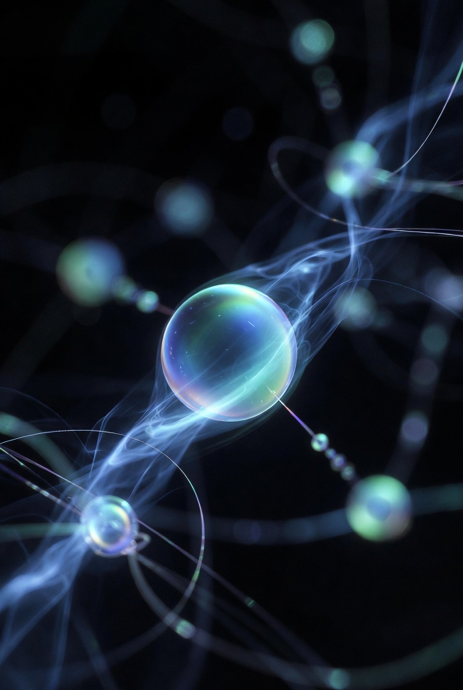
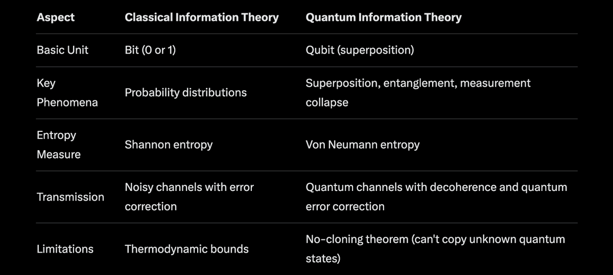
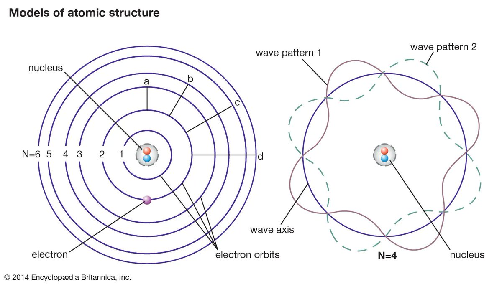
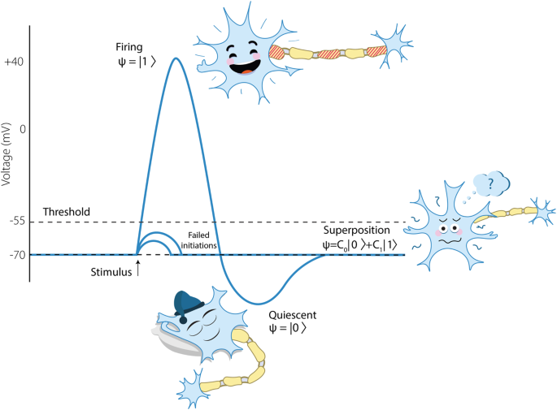
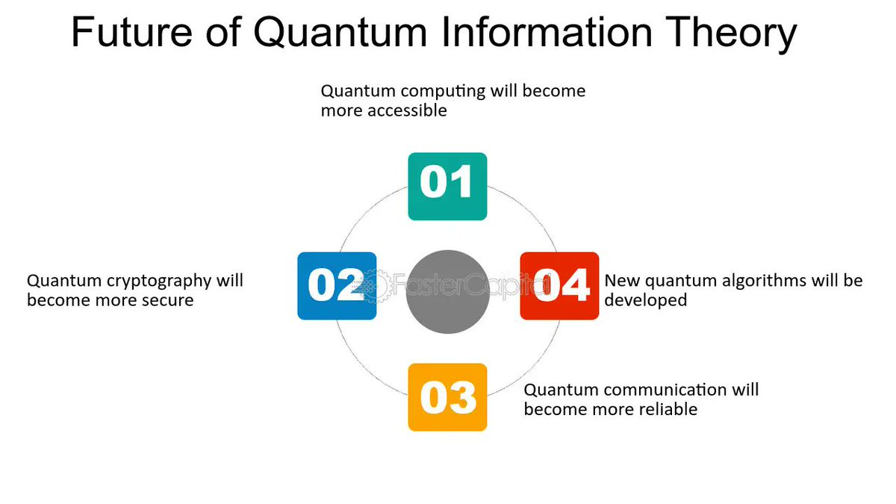

# Quantum Information Theories

Article on X: [Quantum Information Theories](https://x.com/skyisuniverse/status/2025701977397543180)

From [my conversation with Grok on Space as Information Manifold](https://x.com/i/grok/share/dc6738177aca4d8e9a5945482a565659)

## Introduction

Quantum information theories encompass a fascinating interdisciplinary field that merges quantum mechanics with classical information theory, exploring how information is stored, processed, and transmitted in quantum systems. Unlike classical bits, which are strictly 0 or 1, quantum information leverages phenomena like superposition and entanglement, enabling capabilities that surpass classical limits, such as secure communication and exponential computational speedups. This field has roots in the 20th century but exploded in the 1990s with advances in quantum computing and cryptography, and as of 2026, it continues to drive innovations in quantum technologies.

## Foundations and Key Concepts

At its core, quantum information theory (often abbreviated QIT) treats information as a physical entity governed by quantum laws. The basic unit is the qubit (quantum bit), which can exist in a superposition of states—represented mathematically as a vector in a two-dimensional Hilbert space. For example, a qubit might be in the state α|0⟩ + β|1⟩, where |α|² + |β|² = 1, allowing it to hold more information probabilistically than a classical bit.

Another cornerstone is **quantum entanglement**, where two or more particles become correlated such that the state of one instantly influences the other, regardless of distance—a phenomenon Einstein famously called "spooky action at a distance." This enables protocols like quantum teleportation, where the state of a qubit is transferred without physically moving it.

Information in quantum systems is quantified using von Neumann entropy, an extension of Shannon entropy from classical theory, measuring uncertainty or "mixedness" in quantum states. Quantum channels model how information travels through noisy environments, leading to studies on capacities—like how much reliable data can be sent over a quantum link.

Here's a simple comparison table between classical and quantum information:

Quantum theory introduces unique theorems, such as the no-cloning theorem, which prevents perfect duplication of arbitrary quantum states, underpinning quantum cryptography's security.

To illustrate atomic models foundational to quantum mechanics (which underpins QIT):

## Differences from Classical Information Theory

Classical information theory, pioneered by Claude Shannon in 1948, deals with bits and focuses on compression, error correction, and channel capacities. QIT extends this but reveals non-classical behaviors: for instance, quantum systems can exhibit non-additive capacities, where combining channels yields synergies not possible classically. It also incorporates philosophy, questioning the nature of reality and information—e.g., is information physical?

## Applications and Examples

QIT powers **quantum computing**, where algorithms like Shor's for factoring large numbers threaten classical encryption, and Grover's for faster searches. In **quantum cryptography**, protocols like BB84 enable unhackable key distribution via quantum key distribution (QKD). 

Other highlights include:

- **Superdense coding**: Sending two classical bits using one qubit with entanglement.

- **Quantum teleportation**: Transferring quantum states over classical channels with pre-shared entanglement.

- **CHSH inequality**: Demonstrates quantum non-locality, useful in games and tests of Bell's theorem.

In neuroscience, some theories explore quantum effects in decision-making, like superposition in neuronal states:

## Current Developments and Future Outlook

As of 2026, QIT is advancing rapidly with quantum networks, error-corrected quantum computers, and integrations with AI. Challenges include decoherence (loss of quantum states due to environment) and scaling up systems. Books like "Quantum Computation and Quantum Information" by Nielsen and Chuang remain seminal, while resources from IBM Quantum Learning offer practical introductions.

A diagram outlining the future of quantum information theory:

This field not only promises technological revolutions but also deepens our understanding of the universe's informational fabric.

