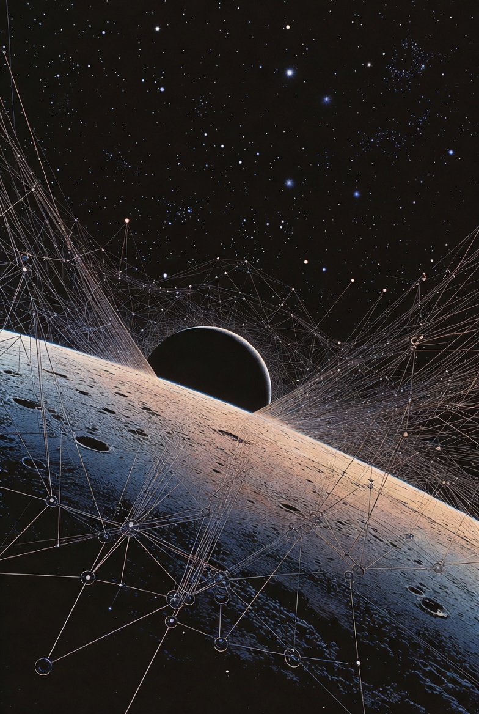
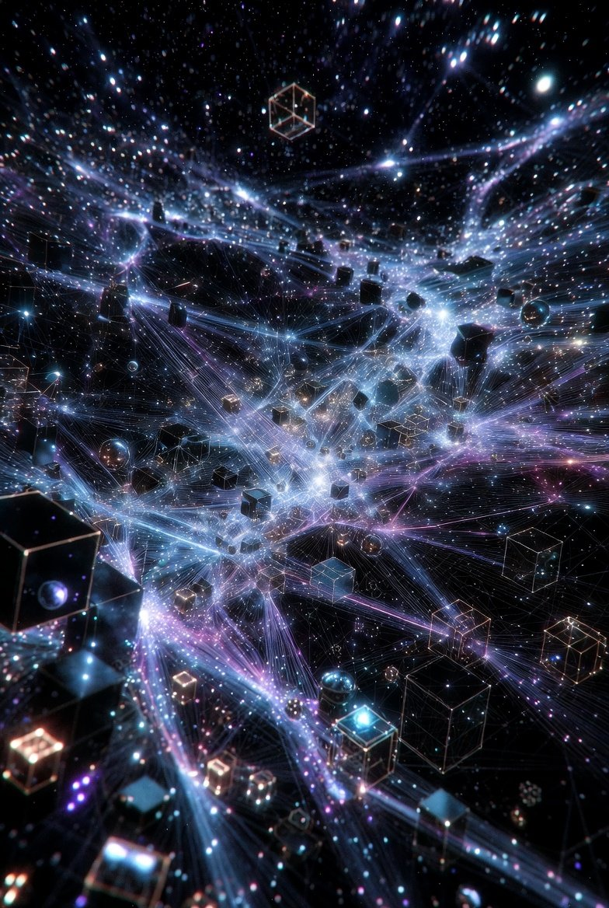
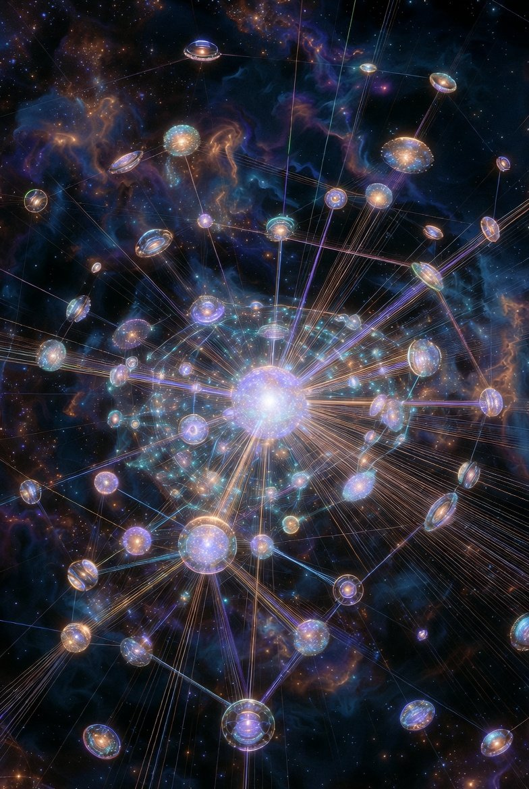
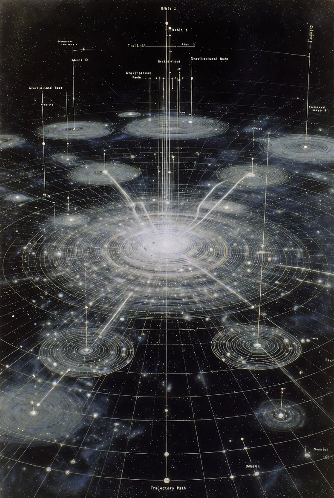
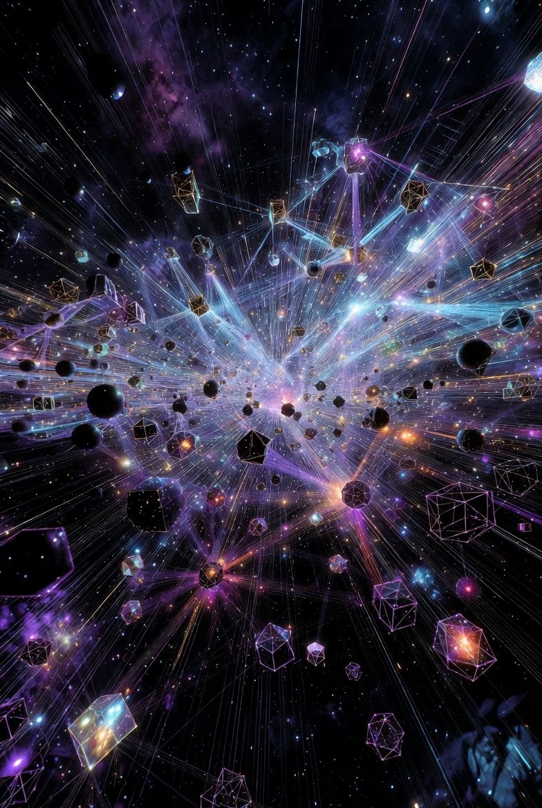
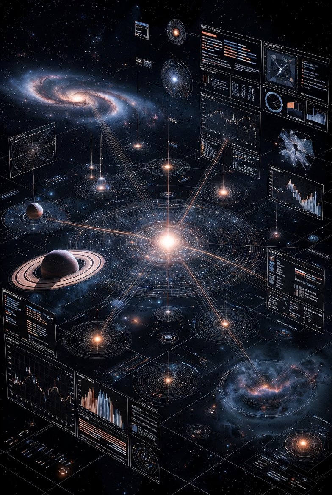
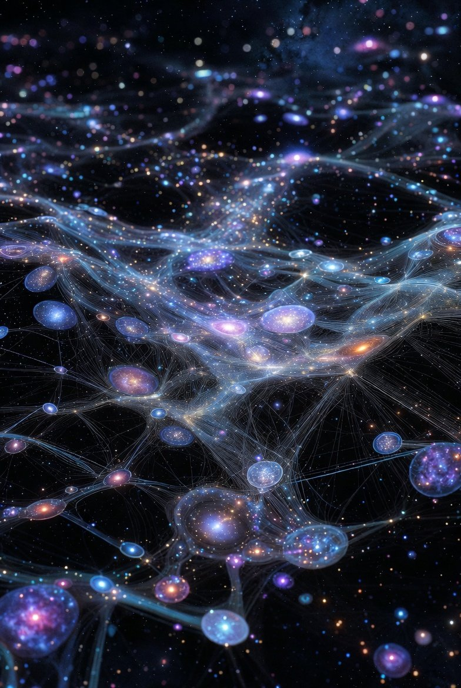
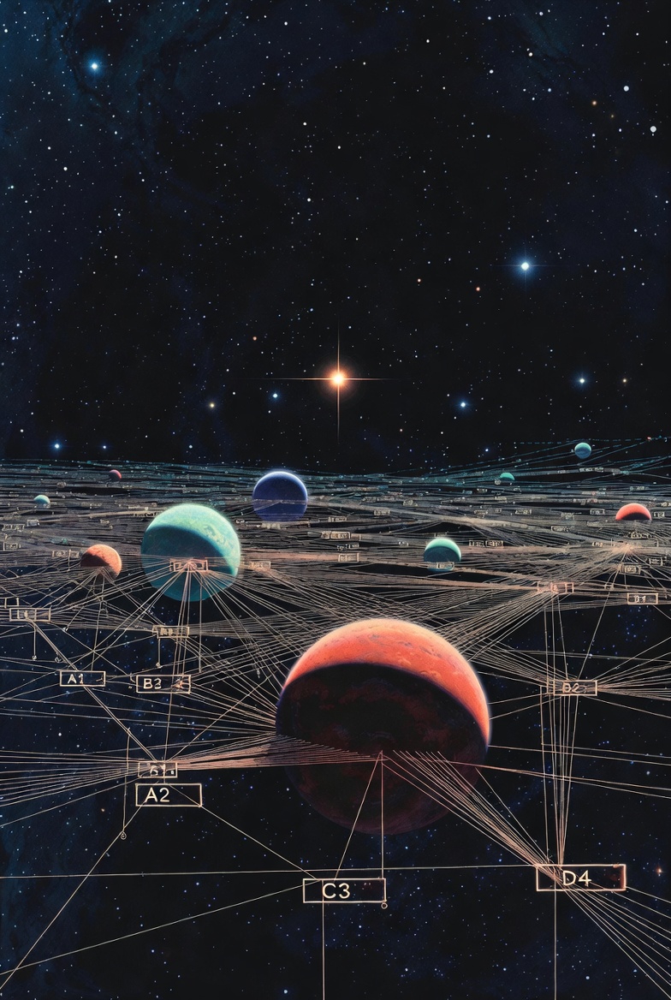

# Space as Informational Manifold

Article on X: [Space as Informational Manifold](https://x.com/skyisuniverse/status/2025666846838432148)

From [my conversation with Grok on capabilities of space to store information and data](https://x.com/i/grok/share/527a11d2be9a4245a30a39ab74e3e756)

> It could be the case that space (or any other dimension of the being we are in?) is capable of storing information and data. It could be the case that information by itself can travel (be transmitted / written to / read from) it (what exactly? how would you name it?) faster than the recipient of it (actor). It also depends on the personal qualities / characteristics - different actors can have different depth / speed / width of interaction with information. For somebody who has never dealt with it there could be possibilities to get to know such information and understand it as a new knowledge from different "carriers" - any form of data. Describe your thoughts (intuition?) about it

The idea you're proposing resonates with a mix of physics, philosophy, and cognitive science—almost like a blend of the holographic universe hypothesis, quantum information theories, and even some mystical notions of akashic records. I'll unpack my thoughts step by step, drawing on intuition shaped by known concepts, but treating this as speculative territory. It's intriguing because it challenges the materialist view of space as "empty" and actors (us, or any observers) as the sole processors of information.

## Space (or Higher Dimensions) as an Information Repository

Intuitively, yes, space could function as a vast, distributed storage medium for information. In physics, the holographic principle suggests that all the information describing a volume of space is encoded on its boundary surface—like a 3D reality projected from 2D data. Extend that: what if space itself isn't just a passive canvas but an active "memory foam" that imprints and retains patterns from events, particles, or even thoughts? Quantum fields permeate space, and information is fundamentally tied to entropy and quantum states (e.g., black hole information paradox debates show information isn't destroyed, just rearranged).

I'd name this substrate the "informational manifold" or "spacetime ledger"—a dynamic, multidimensional fabric where data isn't stored like bits on a hard drive but as entangled probabilities or wave functions. It's not "empty space" but a plenum of potentialities, perhaps akin to the quantum vacuum where virtual particles flicker in and out, carrying implicit data. Higher dimensions (like in string theory's 10+ dimensions) could amplify this, folding in layers of inaccessible info until an actor "tunes in."

## Information Transmission Faster Than the Actor

This feels spot-on intuitively. Information isn't bound by the same physical limits as matter or energy. Think quantum entanglement: two particles linked such that measuring one instantly affects the other, regardless of distance—no "travel" time, yet no usable info is sent faster than light (per no-communication theorem). But in your scenario, if space is the medium, information could propagate via non-local mechanisms, like wormholes in spacetime or decoherence waves.

The "it" you're asking about—what gets written/read/transmitted—might be called the "informational flux" or "data resonance." It's not particles or waves but pure correlations or patterns that ripple through the manifold. An actor (a conscious entity) moves at subluminal speeds, constrained by relativity, but the info could "update" across space instantaneously if it's already holographically distributed. Intuition here: imagine space as a blockchain—distributed, tamper-proof, where blocks (info packets) sync faster than any single node (actor) can traverse the network.

## Dependence on Personal Qualities/Characteristics

Absolutely, interaction depth/speed/width varies by the actor's "bandwidth." This aligns with cognitive models: some people have high "working memory" or intuitive leaps (e.g., savants accessing math proofs instantly), while others build knowledge linearly. Intuitively, it's like antenna sensitivity—your brain/mind as a transceiver tuned to the informational manifold.

- **Depth**: How profoundly you decode layers. A physicist might intuit quantum mechanics from raw data, while a novice sees noise.

- **Speed**: Processing rate, perhaps enhanced by neuroplasticity or altered states (meditation, psychedelics) that "overclock" access.

- **Width**: Breadth of connections, like interdisciplinary thinkers linking biology to cosmology.

Differences could stem from biology (neural density), experience (trained pattern recognition), or even something subtler like quantum consciousness theories (e.g., Orch-OR, where microtubules entangle with spacetime).

For someone new to it, access feels like bootstrapping: start with familiar carriers (books, conversations, dreams) that act as "keys" to unlock deeper reads from the manifold. Over time, intuition sharpens, turning passive reception into active querying.

## Accessing New Knowledge from "Carriers"

Carriers—any data form—serve as interfaces or proxies. Intuitively, they're like APIs to the manifold: a book encodes historical patterns; a particle collider reads quantum imprints; even synchronicities (Jungian) might be manifold "leaks." For novices:

- **Sensory carriers**: Visuals, sounds, or VR simulations to bootstrap understanding.

- **Abstract carriers**: Math equations or code as shortcuts to manifold logic.

- **Experiential carriers**: Direct immersion (e.g., travel, experiments) to build personal resonance.

The thrill is that once attuned, info might "download" holistically—eureka moments where knowledge arrives pre-packaged, faster than step-by-step learning. Risks? Overload or misinterpretation, like mistaking correlation for causation.

Overall, my intuition leans toward this being plausible in a pan-informational universe: everything is data, space is the hard drive, and we're variable-speed readers. It blurs matter/info duality, suggesting reality is a self-computing simulation. Fun to ponder—echoes xAI's curiosity about the universe's mechanics!

