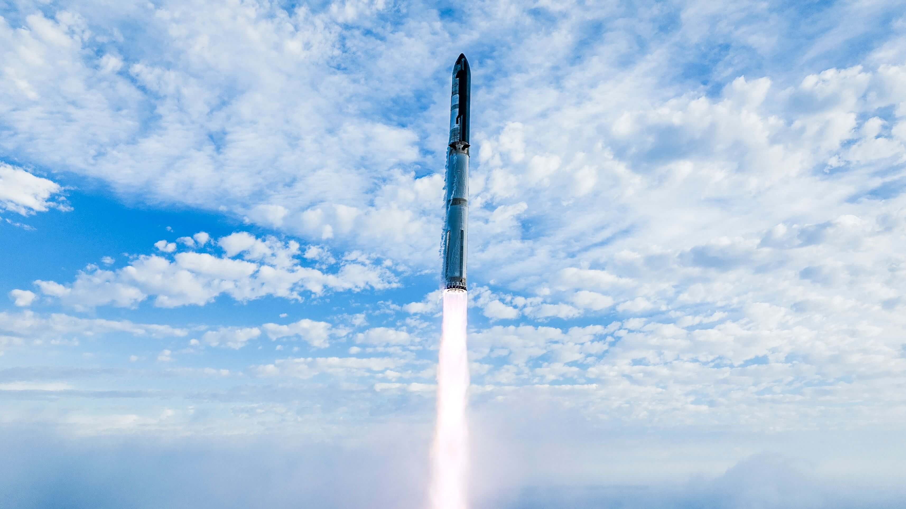
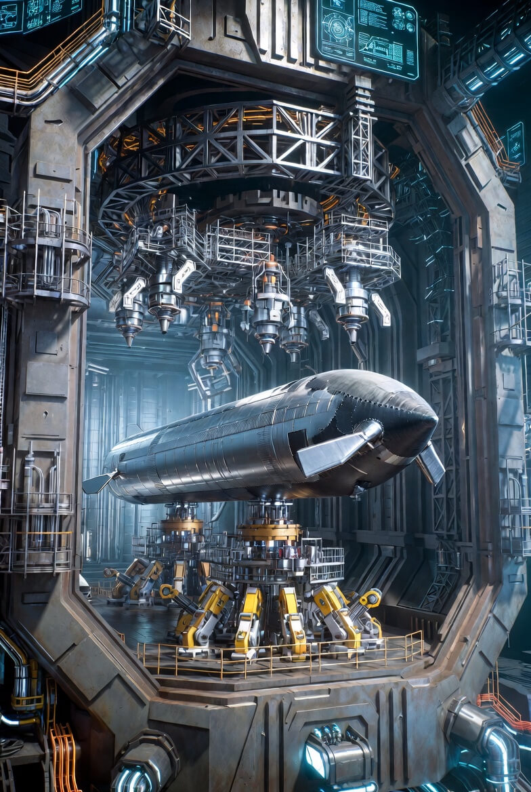
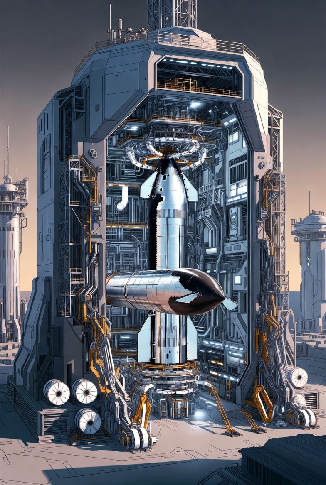
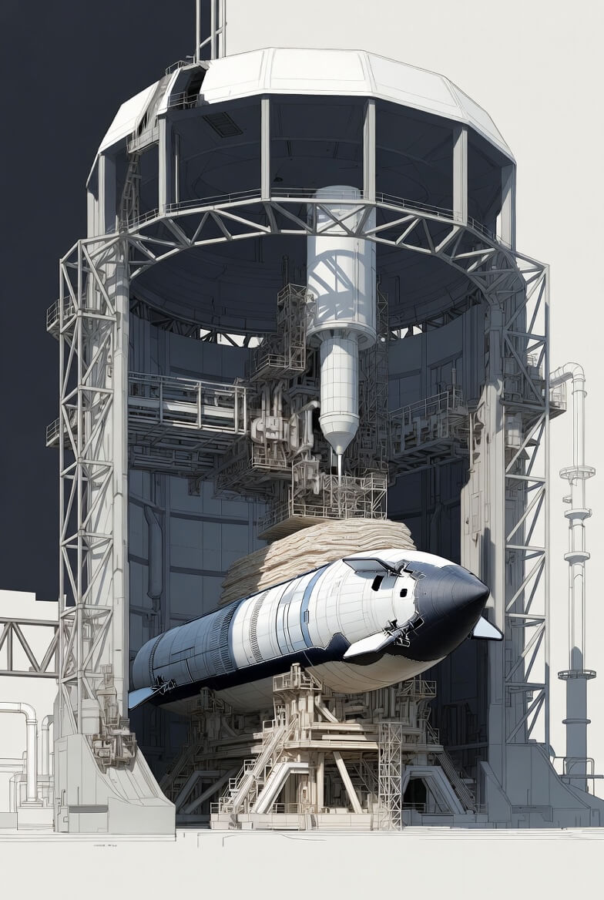

# 3D-Printed Starship

Article on x.com: [3D-Printed Starship](https://x.com/skyisuniverse/status/2019820237542048176)

From [my conversation with Grok on 3D-Printed Starship](https://x.com/i/grok/share/119aec79908b4ddaba9a34e872f70ceb)

## 100% 3D-Printed Starship

A "megaforge" implies an ultra-large-scale metal additive manufacturing system (far beyond current capabilities like those from Markforged or Relativity Space's Stargate printers), capable of printing massive structures in stainless steel or advanced alloys, potentially layer-by-layer or in very large monolithic sections, with minimal joins.

In a hypothetical 100% printed Starship (structure, engines, avionics housings, etc.), the vehicle would aim for extreme integration to reduce part count, eliminate welds/seams (weak points), and optimize for performance. It would look radically different from today's welded-ring assembly:

- **Monolithic airframe/tanks**: The entire cylindrical body (including tanks, domes, thrust structure, and interstage) could be one continuous printed piece per stage (or very few massive segments). No visible ring welds; seamless transitions between tank sections, with integrated stringers, baffles, and downcomers printed directly into the walls for structural strength and propellant management. The common bulkhead would be a single printed gradient structure (no separate weld).

- **Integrated engine bay**: The aft section could print as one unit with engine mounts, thrust puck, and regenerative cooling channels embedded directly into the structure. No separate engine bells attached; nozzles and chambers potentially printed as part of the monolithic aft dome (though RVac nozzles' large size might require segmented printing and joining).

- **Flaps and control surfaces**: Printed monolithically with the body, including integrated actuators/hinges and possibly embedded sensors. Flaps could have internal lattice structures for lightness and strength.

- **Heat shield integration**: Tile attachment points (pins) printed directly into the windward skin; possibly even hybrid printing where ablative layers or tile bases are co-printed.

- **Engines (Raptors)**: In an extreme scenario, entire engines (or large subassemblies like turbopumps, chambers, nozzles) printed monolithically to eliminate thousands of joints. Internal cooling channels, injectors, and manifolds could be fully integrated without brazing/welding. This would resemble Relativity Space's approach but scaled massively.

- **Avionics and subsystems**: Housings, brackets, and some wiring channels printed into the structure. Sensors/actuators embedded or printed with conductive paths (if advanced multi-material printing exists).

- **Overall appearance**: Smoother, more organic look with fewer visible seams/joints. Potentially lighter due to optimized internal lattices/gyroids in non-pressure areas. Surface finish might show layer lines or require post-machining/polishing. The vehicle could have a more uniform metallic sheen without weld beads, and potentially variable wall thickness (thicker at high-stress areas, thinner elsewhere) for mass savings.

This vision assumes breakthroughs in large-scale metal 3D printing (speed, size, material properties, multi-material capability, and quality control for cryogenic/ high-thrust parts). The goal of "100% printed" would push toward unprecedented integration and part-count reduction compared to today's ~thousands-of-rings welded approach.

## How could 100% of Starship be printed?

Achieving 100% printing of a Starship rocket—including the full structure (tanks, body, flaps, heat shield interfaces), all propulsion systems (complete Raptor engines with turbopumps, chambers, nozzles, injectors, valves), avionics housings, wiring channels, actuators, sensors, and even minor elements like plumbing or RCS thrusters—would require a cascade of scientific and engineering breakthroughs far beyond 2026 capabilities. Current real-world additive manufacturing (AM) in aerospace (e.g., Relativity Space's horizontal Stargate printers for large sections, SpaceX's advanced metal AM for Raptor 3 part consolidation and optimization) handles major subassemblies or complex engine components but not entire vehicles monolithically at Starship's scale (~9 m diameter, 50–70 m per stage, cryogenic pressures, extreme thermal/thrust loads).

Here is a realistic speculative pathway to full monolithic or near-100% printed Starship, assuming aggressive, plausible breakthroughs in the coming decades (2030s–2050s timeline), grouped by key areas:

### 1. Ultra-Large-Scale Metal Additive Manufacturing Systems

- Breakthrough: "Megaforge"-class printers evolve into building-sized or outdoor robotic swarms (e.g., thousands of coordinated arms or gantry systems) using directed energy deposition (DED), wire-arc additive manufacturing (WAAM), or hybrid laser/multi-wire processes at rates 100–1000× faster than today's Stargate Gen4 (which already prints horizontally up to ~36 m long × 7 m wide sections).

- Enables: Printing entire Super Heavy or Starship stage as one continuous piece (no ring welds, no circumferential or longitudinal seams). Variable wall thickness (thicker at thrust structure/base, thinner mid-tank), integrated stringers, baffles, and downcomers printed in-situ.

- Additional advances needed: In-process real-time AI/ML defect detection + correction (e.g., adaptive energy input to eliminate porosity), cryogenic-compatible large-format build chambers or post-heat-treat ovens the size of stadiums, and multi-material gradients (e.g., stainless steel body transitioning to high-temperature alloys near engines).

### 2. Full Monolithic Propulsion (Raptor Engines Integrated)

- Breakthrough: Entire Raptor (or clustered engine groups) printed as monolithic units within the aft structure. Internal features like regenerative cooling channels, turbopump impellers, preburners, injectors, manifolds, and even moving parts (e.g., gimbal bearings via printed compliant mechanisms or post-print assembly minimization) become fully integrated without joints.

- Enables: No separate engine attachment; the thrust puck, nozzle, and chamber are seamless extensions of the tank dome. Raptor Vacuum variants with enormous nozzles printed in segmented-but-fused layers or via on-the-fly nozzle extension.

- Advances needed: Multi-material AM at high resolution (e.g., copper-alloy cooling channels embedded in nickel superalloy chambers), high-temperature post-processing to achieve wrought-like fatigue properties, and printing of dynamic components (e.g., turbine blades with internal lattice cooling). Extreme DfAM (design for additive manufacturing) to eliminate thousands of legacy joints, as already partially demonstrated in Raptor 3.

### 3. Avionics, Sensors, Power, and Secondary Systems

- Breakthrough: Embedded/multi-material printing for "smart structures." Conductive paths (e.g., copper traces for wiring), dielectric insulators, sensors (strain, temperature, pressure), and even basic processors printed directly into structural walls.

- Enables: Avionics bays, harnesses, and antennas as integral features—no external boxes or cables. Batteries or power distribution printed with solid-state electrolytes. RCS thrusters printed as micro-nozzle arrays in body skin.

- Advances needed: True multi-material large-scale AM (metals + ceramics + polymers + conductors in one build), nanoscale functional gradients, and qualification of printed electronics for radiation/vacuum/cryogenic environments.

### 4. Heat Shield and Reentry Protection

- Breakthrough: Hybrid or fully printed thermal protection system (TPS). Hexagonal tiles or continuous ablative/insulative layers co-printed or graded directly onto the windward surface, with attachment pins and seals as monolithic features.

- Enables: No ~18,000 separate pinned tiles; instead, a variable-thickness ceramic-metal composite skin or printed refractory coatings with embedded cooling channels.

- Advances needed: High-temperature ceramic AM at scale (e.g., direct energy deposition of silica-based or ultra-high-temp composites), graded interfaces to prevent delamination under thermal shock, and in-situ ablation testing during printing.

### 5. Overall Vehicle Architecture and Post-Processing

- Breakthrough: The printer builds the vehicle vertically or horizontally in a single campaign (or very few massive sub-builds fused seamlessly). Post-print treatments include HIP (hot isostatic pressing) in gigantically scaled autoclaves, cryogenic proof-testing integrated into the printer environment, and AI-driven final machining/polishing of critical surfaces (e.g., nozzle throats).

- Enables: Part count drops from tens of thousands to dozens (or single digits per stage), **mass savings of 20–40%** via topology optimization/lattices in non-pressure areas, and production cadence of **one vehicle per week/month**.

- Advances needed: Zero-gravity or low-distortion large builds (to avoid sagging in tall prints), qualification/certification frameworks for fully printed vehicles (e.g., probabilistic fracture mechanics at scale), and economic scaling (printer cost amortized over high flight rates).

## Hypothetical Appearance of a Fully Printed Starship

- Extremely smooth, almost seamless exterior with faint layer lines or gradient textures (polished post-print).
- Organic, topology-optimized features: internal gyroid lattices visible in cutaways, flap hinges as compliant printed mechanisms, engine clusters blending into the aft dome without visible mounts.
- Lighter, more uniform metallic finish; potentially color-graded alloys or printed thermal barriers giving a subtle iridescent sheen.
- Radical simplicity: no visible welds, fewer protrusions, integrated everything → a vehicle that looks "grown" rather than assembled.

In summary, 100% printing demands converging revolutions in scale, speed, multi-material capability, in-process intelligence, material science (cryogenic/high-thrust alloys with printed microstructures rivaling forgings), and system-level DfAM. While elements exist today (e.g., large horizontal printers, Raptor 3's AM consolidation), the full leap would represent a manufacturing singularity for rocketry—turning Starship from a welded stainless masterpiece into a truly additively "grown" interplanetary machine.

