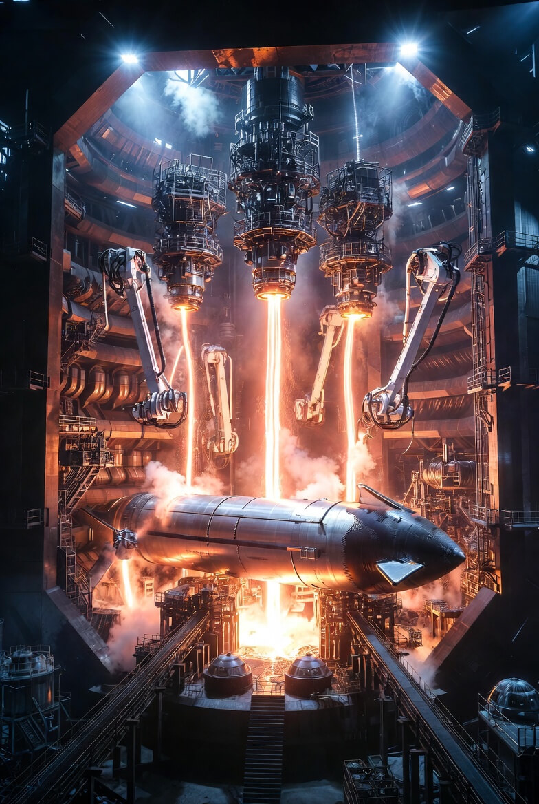
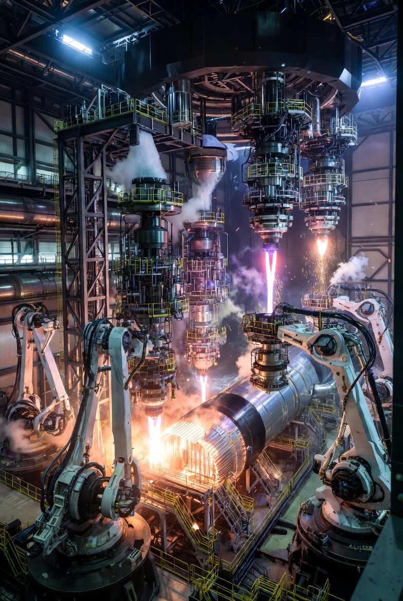
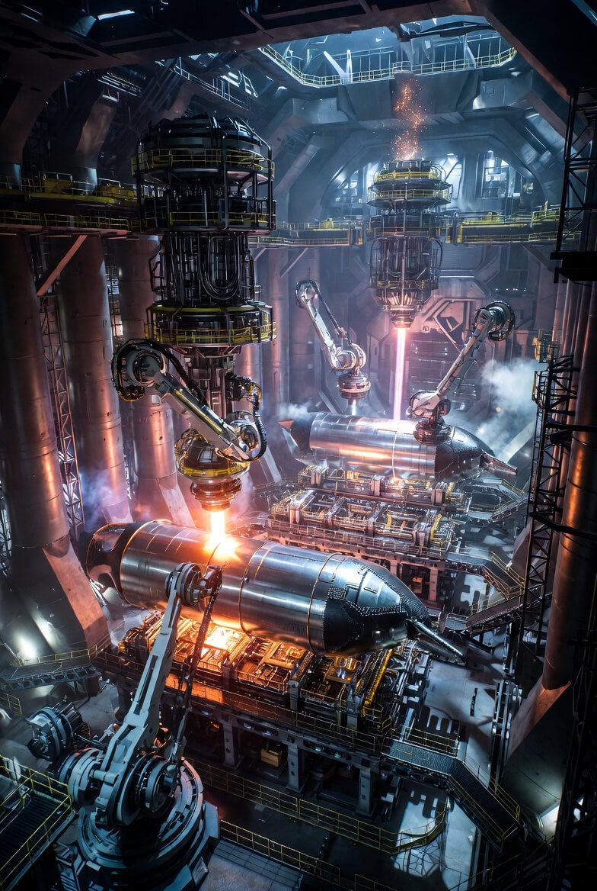

# 3D-Printer for Starships

Article on x.com: [3D-Printer for Starships](https://x.com/skyisuniverse/status/2019815201009250756)

From [my conversation with Grok on 3D-Printing Starships](https://x.com/i/grok/share/9cabdf47152941de806cc400527c9af4)

Assuming all **conceivable scientific breakthroughs** applicable by the 2030s–2040s (or whenever such maturity is reached), a **single 3D printer** capable of printing an entire Starship-scale rocket (≈120 m tall, ≈9 m diameter, full stainless-steel pressure-vessel tanks + domes + thrust structures + aero surfaces + integrated features) would represent the ultimate evolution of large-scale metal additive manufacturing.

This hypothetical machine — let's call it a "**MegaForge**" **class monolithic printer** for descriptive purposes — would no longer resemble today's gantry robots or even Relativity Space's Stargate 4th Generation (which, as of 2026, prints horizontally up to ≈36–37 m long × ≈7 m wide, with deposition rates improved 7–12× over prior gens via multi-wire heads). Instead, it would be a purpose-built, factory-filling mega-system optimized for extreme scale, speed, precision, and autonomy.

## Core Architecture & Scale

- **Type: Horizontal, ultra-large-format multi-head directed energy deposition (DED)** system, likely a hybrid of **multi-wire laser/arc/plasma + electron-beam** for maximum deposition flexibility and quality.
    - a) Horizontal build orientation is mandatory: Vertical printing at 120+ m heights is physically impractical (gravity sag, powder/atmosphere management, structural supports). The rocket is printed lying on its side (or in very long near-monolithic segments).
- **Build envelope** — Effectively **150–250 m long × 20–30 m wide × 20–30 m high** (or dynamically extendable via rail-mounted expansion). This dwarfs 2026's largest systems (e.g., Sciaky EBAM 300 at ~19 ft / 5.8 m length or Stargate at ~120 ft / 37 m).
- Physical footprint — The entire "printer" occupies a covered industrial hall or semi-outdoor structure the size of several football fields (e.g., 300+ m × 100 m), with massive overhead gantry cranes, linear rails spanning the length, and climate-controlled shielding (inert gas atmosphere to prevent oxidation in stainless/cryo alloys).

## Print Head & Deposition System (Breakthrough Level)

- **Deposition heads** — Not one head, but **a synchronized swarm of 50–200+ independent robotic print heads** mounted on a massive overhead gantry array. Each head:
    - a) Feeds **multiple wires simultaneously** (10–20+ wires per head in advanced configs) of stainless, Inconel, refractory, or functionally graded alloys.
    - b) Uses **hybrid energy sources** (high-power lasers 50–100+ kW, electron beams, plasma arcs) switchable in real time for speed vs. precision.
    - c) Deposition rate: **200–1,000+ kg/hour aggregate** (today's best ~10–25 kg/h per head; breakthroughs via parallel multi-wire, AI-optimized melt pools, and plasma/laser combos achieve 20–50× improvement).
- **Layer-by-layer parallelism** — Heads work in coordinated zones: e.g., 20 heads building the tank barrel in parallel strips, others simultaneously printing domes or thrust puck reinforcements, enabling near-simultaneous deposition across the 120 m length.

## Enabling Breakthrough Technologies Integrated

- **Real-time, closed-loop AI control & quality assurance** — Thousands of in-situ sensors (multi-spectral cameras, X-ray/μCT imaging, ultrasonic phased arrays, thermal/LIDAR scanners) feed a massive onboard AI/digital twin system. It predicts, detects, and auto-corrects defects (porosity, cracking, residual stress) at the millisecond level — achieving near-zero defects in cryo-critical structures without post-inspection scrappage.
- **Functionally graded & multi-material printing** — Seamless transitions between alloys (e.g., high-strength cryo stainless outer → lattice-filled core → refractory inner near hot sections) in a single pass.
- **Integrated post-processing** — While printing, secondary robotic subsystems perform localized heat treatment (induction/laser), precision machining of interfaces, surface finishing, and even embedded sensor/wiring channels.
- **Support & fixturing** — The build platform is a massive, actively cooled/rotating/tilting turntable + linear rail system that slowly rotates or indexes the growing rocket to manage gravity-induced distortion and allow even deposition on all sides.
- **Energy & feedstock** — Gigawatt-scale power draw (**solar**?), with automated wire feedstock delivery from km-scale spools of recycled/virgin metal.

## Operational Workflow for One Starship

- AI generative design → optimized topology/lattice model uploaded.
- Printer initializes: Heads swarm into position over the starting thrust puck/base.
- Parallel deposition begins: Tank sections grow outward at high rate, with internal lattices/baffles forming simultaneously.
- Domes printed integrally or in adjacent zones, then seamlessly blended.
- Flaps, stringer-like reinforcements, and thrust interfaces emerge as organic, flowing structures.
- Print completes in **days to 1–2 weeks** (vs. months today), with embedded features ready.
- Autonomous robotic fleets (Optimus-evolved) detach, inspect, vertically assemble if needed, integrate engines/avionics, and prepare for rollout.

## Appearance & Feel

Externally, it looks like a colossal, high-tech industrial cathedral: towering gantries spanning football-field lengths, dozens of articulated robotic arms/heads moving in eerie synchrony like a living organism, brilliant laser/plasma glows pulsing along the emerging silver rocket form, surrounded by coolant lines, sensor arrays, and feedstock conveyors. Minimal human presence — mostly supervisory AI oversight.

In this breakthrough future, such a single printer isn't just a tool; it's the **manufacturing singularity** for large metallic aerospace structures — turning raw metal feedstock directly into near-complete, ultra-optimized vehicles with minimal joints, waste, or human labor.

(Could be interesting in this context: Stargate, Sciaky EBAM, NASA RAMPT blown-powder DED and ongoing large-format advances).

