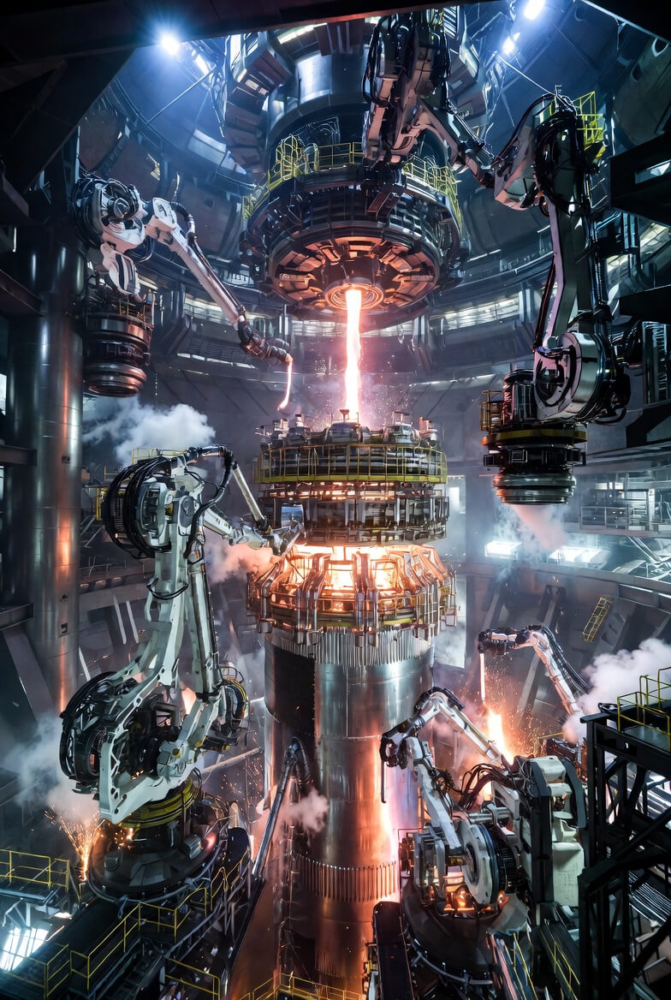
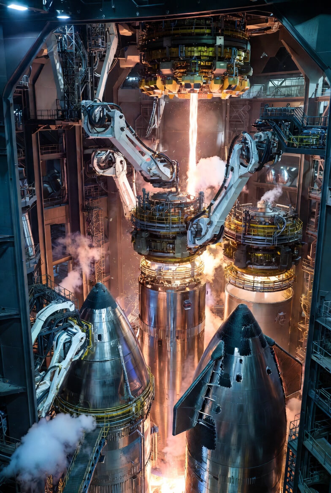

# 3D-Printing Starships

Article on x.com: [3D-Printing Starships](https://x.com/skyisuniverse/status/2019810803084304430)

From [my conversation with Grok on 3D-Printing Starships](https://x.com/i/grok/share/9cabdf47152941de806cc400527c9af4)

---

Printing an entire rocket like Starship (a massive, ~120-meter-tall, stainless-steel vehicle with ~5,000 tons of propellant capacity when fully fueled) solely via 3D printing (additive manufacturing, or AM) plus Optimus-like humanoid robots for assembly/handling is theoretically possible in the long term.

## Potential Efficiency Gains If Fully 3D-Printed (with Optimus Robots)

A hypothetical fully AM-based process (advanced large-format metal printers + AI/Optimus robots for post-processing, assembly, inspection, integration) could offer major improvements over today's mix of traditional + partial AM methods. Estimates draw from aerospace AM trends (NASA, Relativity, general industry data):

- **Cost** — Potentially **30–70% lower** per vehicle at high production rates. AM reduces material waste (near-net-shape vs. subtractive machining from forgings), part count (consolidating 100s of pieces into 1–few monolithic structures), and labor. NASA RAMPT projects ~70% cost cuts for some rocket components; Northrop Grumman reports up to 90% for optimized parts. For full rockets, savings could reach 40–60% long-term via fewer suppliers, less tooling, and robotic automation. Starship's current goal is ~$10M–$20M per vehicle at scale; full AM + robots might push toward <$10M.

- **Speed / Lead Time** — **50–90% faster** for complex parts (days/weeks vs. months). Full vehicle production could drop from months to weeks at maturity. Relativity aims for rapid iteration; AM enables "print → test → iterate" cycles 5–10x faster. Robots (Optimus-style) could handle 24/7 assembly, welding inspection, and transport, reducing human bottlenecks.

- **Easiness / Complexity** — Much easier for intricate geometries (e.g., optimized cooling channels, lattice structures for weight savings). Fewer joints mean higher reliability and easier certification. Robots enable lights-out factories with minimal human oversight.

- Other Gains — **Weight reduction** (**10–40%** in some components via topology optimization), better performance (e.g., higher thrust-to-weight), and scalability for mass production (thousands of Starships/year for Mars colonization).

## Best Scientific Breakthroughs to Enable This

Several advances could make full 3D-printed + robotic Starship-like production viable:

1. **Ultra-large-scale, high-speed metal AM** (e.g., next-gen Stargate-like systems or hybrid directed energy deposition + AI control) — Printing 10m+ sections in hours/days instead of weeks. Contribution: 10–50x speed-up, enabling economic full-vehicle printing.

2. **In-situ alloy development and real-time monitoring** (e.g., advanced sensors + ML for defect detection during printing) — Ensuring zero-defect large parts under extreme conditions. Contribution: Dramatically higher reliability, reducing inspection/scrappage costs.

3. **Advanced materials** (e.g., printable high-strength stainless steels, refractory alloys, or composites withstanding cryo + reentry) — Better than current 304L/30X stainless. Contribution: Lighter, stronger structures → more payload or lower fuel needs.

4. **AI-driven generative design + simulation** — Optimizing entire vehicles for AM (lattices, integrated functions). Contribution: 20–50% weight savings, higher efficiency.

5. **Swarm robotics / advanced humanoid bots (Optimus evolution)** — Fully autonomous factories with fleets handling printing, assembly, testing. Contribution: Near-zero labor costs, 24/7 operation, rapid scaling.

6. **In-space or on-Mars AM** (recycling + printing from regolith/asteroids) — Long-term for Starship fleets. Contribution: Reduces Earth launch mass dramatically for colonization.

Partial/full AM for key sections + robotic assembly could yield significant (30–70%+) gains in cost/speed over traditional methods. Relativity Space shows the path forward for smaller-to-medium rockets; scaling that to Starship would require the breakthroughs above. SpaceX prioritizes rapid, cheap reusability over full AM today, but the tech could complement their approach in the 2030s+.

---

Assuming the best possible scientific breakthroughs in additive manufacturing (AM), materials science, AI-driven optimization, robotics, and propulsion (e.g., by the 2030s–2040s), full-vehicle 3D printing + advanced robotic assembly could push Starship-like systems far beyond today's capabilities. Here's a breakdown with realistic-but-optimistic estimates grounded in current trends extrapolated aggressively.

### 1. Better performance example: Higher thrust-to-weight ratio in engines.

Current **Raptor 3** specs include 280 tons-force (2,750–2,800 kN) thrust, dry mass ~1,525–1,720 kg (including interfaces), yielding a thrust-to-weight ratio (TWR) of **~183–184** (one of the highest for any operational rocket engine). Specific impulse (Isp) is ~350 s at sea level and higher in vacuum for optimized variants.With breakthroughs in **AM-optimized engine design** (e.g., monolithic printing of turbopumps, injectors, chambers, and cooling channels in one piece; advanced lattice structures for heat exchangers; topology-optimized lightweighting; next-gen superalloys or refractory composites printable at scale; integrated regenerative cooling with micro-lattices for 20–40% better heat transfer):

- A hypothetical "Raptor 5" or equivalent could achieve **TWR > 250–300** (e.g., 350–400 tons thrust at ~1,200–1,500 kg dry mass).
- Isp could reach **360–370 s SL / 390–410 s vac** via higher chamber pressures (400+ bar), better nozzle expansion, and reduced losses from printed precision.
- Visual: The engine would appear sleeker and more integrated—no external plumbing mess like early Raptors; smoother, organic shapes from generative design (curved manifolds, lattice-filled walls for strength-to-weight); fewer visible welds/joints; possibly metallic 3D-printed heat shields or ablative layers integrated directly.

This could boost overall vehicle TWR by 20–50%, enabling higher acceleration, better gravity losses, and ~10–30% more payload for the same propellant mass.

### 2. Scalability for mass production (thousands of Starships/year)

In an idealized future factory (e.g., "Gigabay" scaled massively with breakthroughs):

- **Huge parallel printer arrays** — Thousands of large-format directed energy deposition (DED) or hybrid WAAM/PBF printers (evolved from today's Sciaky EBAM or Relativity Stargate, but 10–100× faster/cheaper, printing 10m+ sections in hours).
- **Swarm robotics** — Fleets of millions of advanced Optimus-like bots (or specialized variants) handling 24/7 transport, post-processing, assembly, cryogenic testing, and integration in a lights-out mega-facility spanning km².
- **Example for thousands/year** — Target 1,000–10,000 vehicles/year (as Elon Musk has speculated for extreme Mars scaling). This equates to ~3–30 vehicles/day. The factory might look like:

    - a) Modular "print cells" where tank sections print in parallel (e.g., 100+ printers running simultaneously).
    - b) AI-orchestrated flow: Raw metal feedstock → high-speed printing → robotic heat treatment/machining → bot assembly lines → automated engine integration → full-stack rollout in days.
    - c) Vertical integration with on-site propellant production and test stands.

- Contribution: Near-zero marginal labor cost, rapid iteration (print-test-fix cycles in days), enabling fleet buildup for Mars (e.g., 1,000+ ships/year for colonization waves).

### 3. Tackling remaining challenges in the best way

- **Bigger/cheaper printers** — Breakthroughs in scalable, low-cost DED/hybrid systems (e.g., multi-kilowatt lasers/electron beams, recycled feedstock, modular gantries) → printers 10–50× larger/faster than 2026's ~20 lb/hour deposition, with costs dropping to <$1M/unit at volume.

- **Real-time quality control** — AI/ML + in-situ sensors (X-ray, ultrasound, thermal imaging during print) + digital twins for zero-defect assurance; predictive defect correction via closed-loop adjustments.

- **Qualified materials for cryo/hypersonic** — Printable advanced alloys (e.g., next-gen 30X stainless or refractory like Nb/W-based, or CMC hybrids) with cryo-toughness > current stainless and reentry resistance via integrated ablative/thermal protection layers.

- **Post-processing** — Automated robotic heat treatment ovens, precision machining integrated into print cells, or self-healing surfaces via nanomaterials.
All combined: Defects near-zero, qualification cycles shortened from years to months, enabling certification at scale.

### 4. Max payload with advanced materials + AI generative design

Current Starship: Dry mass ~85–120 t (upper stage), payload to LEO ~100–150 t reusable (Block 3/4 goals; earlier blocks lower).  With breakthroughs (20–50%+ weight savings via lattices, integrated functions, topology optimization; lighter/stronger printable materials; better engines):

- Upper stage dry mass potentially **50–70 t** (or lower with extreme optimization).
- Booster dry mass reduced proportionally.
- Max reusable LEO payload → **300–500+ t** (or more with stretched tanks/higher Isp). Expendable could exceed 1,000 t.
- Contribution: More payload/fewer launches for Mars cargo; lower fuel needs per ton delivered → dramatically cheaper colonization.

### 5. Cost comparison of swarm robotics / autonomous factory vs. current

Current Starship production (2026 era): High labor/tooling costs; estimates ~$10–50M/vehicle at low rate (dozens/year), dominated by human welding/assembly, supply chain, and iteration.  Future autonomous factory:

- Near-zero labor (bots handle everything; energy/feedstock dominant).
- Operating cost → **$1–5M/vehicle** at scale (mostly materials/energy; amortize massive capex over 10,000+/year).
- Comparison: **5–50× lower** than current (potentially <$10/kg to orbit at fleet scale). Rapid scaling enables exponential growth without proportional cost increase.

### 6. Earth launch mass with in-space / on-Mars AM

Long-term: Starships printed on Mars (from regolith via solar-powered ISRU + robotic factories) or asteroids (metal-rich).

- Reduces Earth-launched mass dramatically: Only send seed factories, tools, bots, and minimal high-tech components (chips, printers heads).
- For a Mars city: Earth launch mass could drop to <1–5% of total infrastructure mass (e.g., instead of launching 1,000+ fully built ships at ~5,000 t each fueled, launch 10–50 "printer ships" at ~100–200 t each dry + feedstock seeds).
- Overall: Colony mass mostly sourced in-situ → Earth burden reduced by 90–99% for sustained growth, enabling true self-sufficiency.

    These scenarios assume aggressive, breakthrough-level progress—but they align with the trajectory from today's partial AM (e.g., Relativity, SpaceX engines) to full-vehicle potential.

## What kind of 3D-printer could it be?

To print an **entire rocket** like **Starship** (≈120 m tall, ≈9 m diameter, massive thin-walled stainless steel tanks, domes, thrust structures, flaps, and integrated systems) entirely via 3D printing (additive manufacturing, AM) — with Optimus-style humanoid/general-purpose robots handling support tasks — would require a highly advanced, purpose-built **large-scale metal additive manufacturing system** far beyond what's commercially available as of early 2026.

Today's real-world large-scale metal printers (e.g., Relativity Space's Stargate 4th generation) can produce rocket sections up to ≈36–37 m long and ≈7 m wide (horizontal orientation), using wire-fed directed energy deposition (DED) with multiple wires/lasers/arcs for high deposition rates. These are already the largest metal printers in operation for aerospace, enabling near-monolithic tanks and structures for smaller rockets like Terran R.

For full Starship-scale printing (the whole vehicle as few massive pieces or even near-monolithic), the required device/system would look like this in a realistic future breakthrough scenario (2030s+ with aggressive advances in robotics, energy, materials, and controls):

### Core Technology: Ultra-Large Horizontal / Modular Directed Energy Deposition (DED) Array

Primary process — **Wire-arc additive manufacturing (WAAM)** or **multi-laser/multi-wire blown-powder DED** (evolved from today's Stargate / Sciaky / NASA RAMPT concepts), but massively scaled and parallelized.

- Why horizontal/large-format DED? Vertical powder-bed fusion (like typical SLM printers) can't realistically scale to 100+ m heights without impossible support structures and powder handling. Horizontal orientation removes ceiling limits and allows gravity-assisted builds for tanks.

- Deposition rate: 50–200+ kg/hour per head (today's best are ~10–20 kg/h; breakthroughs in multi-wire/multi-arc heads + AI-optimized parameters push this 5–20× higher).

- Materials: Printable high-strength cryogenic stainless (evolved 30X variants), Inconel/refractory alloys for hot sections, or hybrid composites with embedded cooling channels.

### Physical Configuration & Scale

**Build envelope** — At minimum **150–200 m long × 15–20 m wide × 15–20 m high** (or effectively unlimited length via segmented/modular printing on rails).

- This could be a **single enormous gantry-style printer** (like a building-sized robotic arm farm) or — more practically — an **array of 50–200+ synchronized robotic printer heads** on overhead gantries/rails, working in parallel like a swarm.

- The "printer" isn't one machine but a **factory-scale print cell** covering thousands of m², with the rocket built horizontally (laid on its side) or in vertical sections that are later joined robotically.

**Print head setup** — Multiple (10–50+) independent robotic arms/heads per section, each feeding several wires simultaneously into high-power lasers/electron beams/plasma arcs. Heads move in coordinated swarms, depositing layers in parallel strips to build tank walls, domes, stringers, and integrated features (e.g., baffles, thrust puck reinforcements) in one go.

**Support structure** — Massive rotating/tilting fixtures (turntables or linear rails) to rotate the growing rocket for even deposition and gravity management during printing.

## Key Enabling Features (Requiring Breakthroughs)

- **Real-time AI quality control** — Hundreds of in-situ sensors (X-ray, ultrasound, thermal cameras, laser scanners) + ML models monitoring every layer millisecond-by-millisecond, auto-correcting parameters or pausing to fix defects. Near-zero porosity/defects in cryo-critical stainless.

- **Integrated post-processing** — While printing, adjacent robots perform heat treatment (local induction/ laser), surface machining for precision fits, and cryogenic testing loops.

- **Optimus robots integration** — Fleets of humanoid/general-purpose bots (evolved Optimus) handle non-print tasks 24/7:

    - a) Feeding raw wire/spools/feedstock.
    - b) Removing support structures or excess material.
    - c) Transporting printed sections if built modularly.
    - d) Assembling engines, avionics, flaps (if not fully integrated).
    - e) Performing final inspections, welding minor seams, and rollout to integration/test.
    - f) This enables a near-lights-out factory with minimal human oversight.

## Hypothetical Workflow for One Starship

1. AI generative design optimizes the vehicle for AM (lattices in non-critical areas, integrated channels, minimal joints).
2. Printer array starts with booster base/thrust structure horizontally.
3. Parallel heads deposit tank barrels (thin walls with internal stiffeners) at high speed.
4. Domes printed separately or integrally, then robotically joined with minimal welds.
5. Upper stage (Starship) printed similarly in parallel bays.
6. Robots assemble stages, integrate 3D-printed Raptor-like engines (already possible monolithically at smaller scale), add flaps/heat shield tiles.
7. Total print-to-ready time: Days to weeks (vs. months today), assuming breakthroughs.

It could be a gigantic, **horizontally-oriented, multi-robot DED mega-factory** (think Stargate on steroids, arrayed across a building or outdoor covered structure the size of several football fields). Relativity's current Stargate is the closest real analog today, but for full Starship, we'd need roughly **10–100× larger volume, 10–50× faster deposition, and full robotic autonomy** to make it practical and economical. This remains speculative/futuristic as of February 2026, but the trajectory from current systems points in exactly this direction for high-rate Mars colonization manufacturing.

## Possible Starship re-design for 3D-Printing

With a **single, ultra-advanced 3D printer** (assuming all relevant scientific breakthroughs in additive manufacturing, materials science, AI-driven generative design, real-time process control, and large-scale directed energy deposition), a **substantial redesign of Starship** would not only be possible but highly advantageous. The current Starship design is fundamentally shaped by traditional manufacturing constraints — sheet metal rolling, circumferential welding of rings, discrete stringers/rings for stiffness, separate assembly of flaps/thrust structures, and bolted/welded joints everywhere.

A manufacturing process that can deposit metal in near-arbitrary geometries at massive scale (horizontally, with parallel high-rate heads, zero tooling changes, and integrated lattice/complex features) removes most of those constraints. This enables **Design for Additive Manufacturing (DfAM)** principles at the vehicle level.

### Key Redesign Features of an "AM-Optimized Starship" Variant

The vehicle would still retain the overall mission architecture (methalox, full-flow staged combustion Raptors, stainless-steel pressure vessel tanks, flaps for reentry control, vertical landing), but its structural and functional appearance would change dramatically toward organic, integrated, lightweight forms.

#### 1. External Appearance – Much Smoother, Organic, Less "Industrial"

- Cylindrical tank sections would no longer show thousands of visible ring welds or evenly spaced stringers/rings.

- Surfaces would appear almost seamless or with flowing, topology-optimized stiffening patterns — subtle ridges, waves, or muscle-like reinforcements that follow principal stress paths (similar to how topology-optimized aerospace brackets or maritime components look organic/bony rather than blocky).

- Fewer distinct panel lines; the vehicle might look more like a single, grown metallic organism than a welded barrel stack.

#### 2. Internal Structure – Lattice-Filled and Functionally Graded

- Tank walls would transition from thin smooth outer skins to **integrated lattice cores or honeycomb/truss microstructures** in lower-stress regions → 20–50%+ dry mass reduction while maintaining (or increasing) buckling resistance and cryo-fatigue life.

- **Functionally graded materials** — density/strength varying continuously through the wall thickness (e.g., denser near welds/attach points, porous/lattice in mid-sections).

- Baffles, slosh suppressors, and ullage partitions printed as one with the tank — complex 3D geometries impossible/expensive to weld today.

#### 3. Thrust Structure, Engine Mounts, and interfaces

- The thrust puck/base could be a monolithic, topology-optimized "spider-web" or lattice-reinforced dome structure that blends seamlessly into the lower tank — distributing engine loads more efficiently with far fewer discrete beams/brackets.

- Engine mounts integrated directly into the structure (no separate thrust structure assembly).

- Potentially fewer but larger attachment points for flaps/aero surfaces.

#### 4. Flaps / Control Surfaces

- Flaps could be printed as single-piece, internally latticed structures with integrated actuators/cooling channels — lighter, stronger, with optimized hinge lines and thermal protection integration.

- Possibly more flaps or novel shapes (e.g., variable-geometry or biomimetic) enabled by the freedom to print complex internal cooling/structural paths.

#### 5. Overall Vehicle-Level Optimizations

- **Topology-optimized load paths** throughout — material placed exactly where stresses demand it, removed elsewhere → higher thrust-to-weight, better mass ratio, potentially 30–60%+ dry mass savings compared to current Starship (pushing reusable LEO payload toward 300–500+ t in extreme cases).

- Fewer joints/seams → dramatically higher reliability (welds are failure initiation sites), easier pressure vessel qualification.

- Integrated features: embedded sensors, wiring channels, or even propellant feed lines routed optimally through the structure.

### Realistic Visual Comparison

- **Current Starship** — shiny, silver, ring-stacked cylinder with visible welds, protruding stringers, discrete flaps bolted on, industrial/ship-like aesthetic.

- **AM-optimized variant** — smoother, more sculpted look with flowing organic stiffeners (like advanced topology-optimized aerospace parts or even some concept art for future launch vehicles), fewer visible divisions, potentially slightly tapered or waisted sections where optimization dictates (though large cylinders remain efficient for propellant volume).

### Limitations Even in This Ideal Scenario

- The fundamental physics of a reusable methalox SSTO/near-SSTO vehicle still favor large cylinders for propellant volume vs. surface area (boil-off, drag, aero heating).

- Extreme organic shapes might increase reentry heating or aero instability — the redesign would still prioritize near-cylindrical tanks with optimized local features.

- The single printer would build it horizontally in sections (or very long monolithic pieces), with Optimus robots handling final integration/vertical stacking if needed.

In short: Yes — a fully AM-native Starship would look noticeably different: **sleeker, more organic, internally complex yet externally cleaner**, significantly lighter and more integrated, resembling a blend between today's Starship and advanced topology-optimized aerospace structures. This would represent a true paradigm shift from "manufactured assembly" to "grown structure."

