# Compressing Mars Terraforming from 100,000+ to 10 years

Article on X: [Compressing Mars Terraforming from 100,000+ to 10 years](https://x.com/skyisuniverse/status/2026316657623199824)

From [my conversation with Grok on compressing Mars Terraforming from 100,000+ to 10 years](https://x.com/i/grok/share/dae6cb095e564613a5e7f9328c125232)

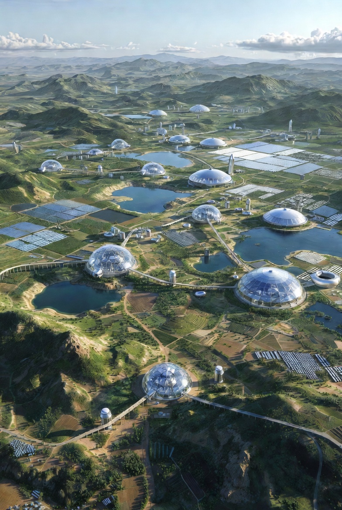

## Introduction

> Traditional estimates suggest terraforming could take 100,000+ years; nano-tech might reduce the warming/ISRU phase to 10–100 years

Describe how could it be done in 10 years? Assume any possible scientific breakthroughs

In a highly optimistic scenario enabled by revolutionary scientific breakthroughs—such as fully mature, self-replicating molecular nanotechnology (MNT), quantum-enhanced AI for global coordination, unlimited fusion/solar energy sources, advanced biotech for rapid ecosystem engineering, and hybrid propulsion for massive cargo deliveries—terraforming Mars could theoretically be accelerated to achieve basic habitability (e.g., liquid water stability, atmospheric pressure sufficient for domed human settlements, and initial microbial life support) within a 10-year window. This compresses the traditional 100,000+ year timeline by leveraging exponential scaling, feedback loops, and in-situ resource utilization (ISRU) at unprecedented rates. The process would start with an initial human or robotic mission deploying "seed" nanofactories, then scale massively. Below, I outline a phased approach, assuming breakthroughs like error-free self-replication (avoiding "gray goo" risks via quantum safeguards), picosecond-precision mechanosynthesis for instant material conversion, and bio-nano hybrids that evolve ecosystems in real-time.

## Phase 1: Deployment and Rapid Warming (Years 1–3)

The foundation relies on engineered nanorods—tiny, 9-micrometer-long particles made from Martian iron or aluminum dust, designed to trap heat 5,000 times more efficiently than CO2 by scattering sunlight downward while blocking infrared escape.

- **Initial Setup (Year 1)**: Launch 100+ Starships carrying seed nanobots and compact fusion reactors. Upon landing at equatorial sites (e.g., Hellas Planitia for low elevation and water ice access), nanobots replicate exponentially, converting regolith into nanorods and dispersal drones. AI oversees global distribution via low-orbit satellites, achieving uniform atmospheric coverage in months.

- **Warming Acceleration (Years 1–2)**: Nanorods raise temperatures by 30–50 Kelvin (54–90°F) within the first year, melting polar caps and subsurface permafrost to release ~10–20% of Mars' frozen CO2 and water reserves. Breakthroughs like adaptive nanorods (self-adjusting shapes via embedded quantum dots) amplify this to 100K+ via positive feedback: Released water vapor and CO2 create natural greenhouse amplification, thickening the atmosphere from 6 millibars to 100–200 millibars (enough for liquid water in lowlands). Orbital mirrors (nano-assembled reflective sails, kilometers wide) focus sunlight on poles for targeted melting. Orbital mirrors (nano-assembled reflective sails, kilometers wide) focus sunlight on poles for targeted melting.

- **Outcomes by Year 3**: Surface lakes form in craters, atmospheric pressure allows unpressurized rovers, and initial dust storms are mitigated by nanobot "scrubbers" that stabilize the regolith.

## Phase 2: ISRU Scaling and Atmosphere Building (Years 3–6)

Nanobots disassemble regolith at atomic scales, exponentially outperforming MOXIE (e.g., producing tons of O2/hour vs. grams). Breakthroughs in bio-nano interfaces allow hybrid systems: Nanobots fused with engineered microbes that photosynthesize under low light, converting CO2 to O2 at rates 1,000x faster than Earth's cyanobacteria.

- **Resource Explosion (Years 3–4)**: Swarms of trillions of nanobots mine regolith for water (from hydrated minerals), oxygen (via electrolysis), and methane fuel (Sabatier reaction enhanced by nano-catalysts). Self-replication turns a single lander into planetary-scale factories, producing habitats, solar farms, and propellant depots. Quantum AI simulates and optimizes extraction, yielding 99% efficiency with zero waste.

- **Atmospheric Engineering (Years 4–6)**: Introduce super-greenhouse gases (e.g., nano-synthesized perfluorocarbons) for sustained warming, pushing pressure to 300–500 millibars. Bio-nano microbes, deployed in billions, begin oxygenation: Breakthrough genetic editing creates strains that thrive in the warming environment, generating O2 layers and ozone for UV protection. Nanobots seed artificial magnetospheres (via superconducting rings at Lagrange points) to shield against solar wind, retaining the new atmosphere.

- **Outcomes by Year 6**: Breathable air in enclosed valleys (O2 at 10–15%), widespread liquid water bodies, and self-sustaining ISRU supporting 1,000+ colonists. Early agriculture in nano-greenhouses produces food via accelerated plant growth (e.g., CRISPR-ed crops with nano-enhanced photosynthesis).

## Phase 3: Ecosystem Stabilization and Human Habitation (Years 6–10)

With basics in place, focus shifts to biodiversity and long-term stability, assuming breakthroughs in ecological AI that models and iterates entire biospheres in simulations.

- **Biosphere Introduction (Years 6–8)**: Release engineered ecosystems: Nano-seeded algae and lichens form soil, while bio-nano insects pollinate. AI-directed nanobots terraform terrain—eroding canyons into fertile plains and creating rivers. Fusion-powered orbital lasers vaporize comets for water imports if needed, accelerating hydrological cycles.

- **Full Integration (Years 8–10)**: Human settlements expand without suits in pressurized zones. Nanobots monitor and adjust: Repairing atmospheric leaks, balancing gases, and evolving species via directed evolution. By year 10, Mars achieves "minimal habitability"—global temperatures above freezing, oceans covering 10–20% of surface, and O2 levels at 5–10% (supplemental breathing gear needed outdoors, but viable for plants and hardy animals).

- **Outcomes by Year 10**: A proto-Earth Mars with microbial-dominated ecosystems, supporting millions of humans in open-air cities. Feedback loops (e.g., plant transpiration adding humidity) make the process self-sustaining.

## Assumptions and Breakthroughs Required

This 10-year feat assumes:

- **MNT Mastery**: Nanobots replicate without errors, scaling from grams to exatons in weeks.

- **Energy Abundance**: Portable fusion or beamed solar power unlimited operations.

- **AI Supremacy**: Quantum AGI predicts climate dynamics with 100% accuracy, avoiding tipping points.

- **Logistics**: Fleets of 1,000+ Starships deliver initial seeds; in-space manufacturing handles the rest.

- **Ethical/Safety Nets**: Reversible tech (e.g., nanorod kill switches) and international governance prevent ecological disasters.

While grounded in concepts like nanorods being 5,000x efficient, this remains highly speculative—real timelines would likely extend to 50–200 years due to unforeseen complexities like dust interference or biological adaptation.

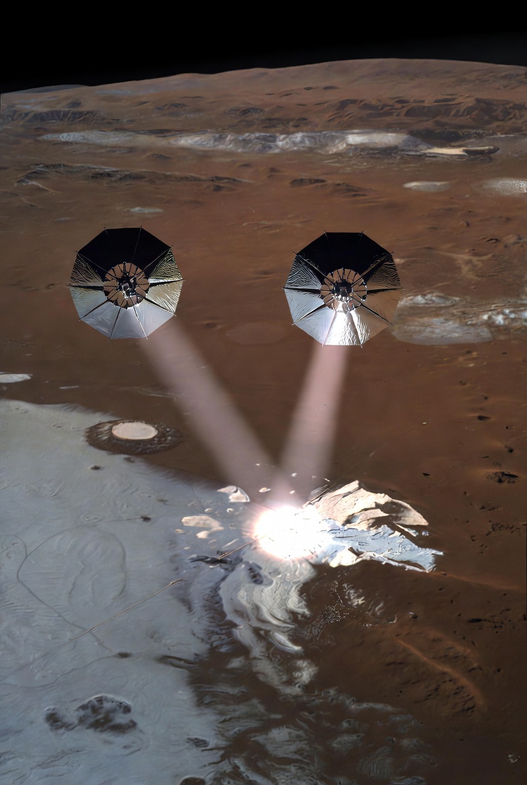

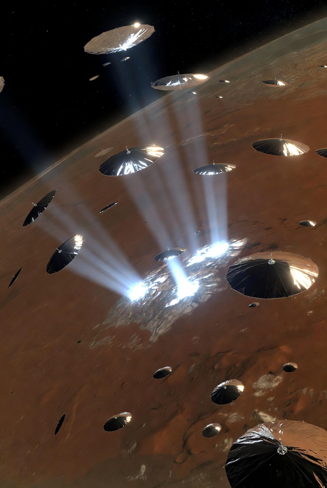

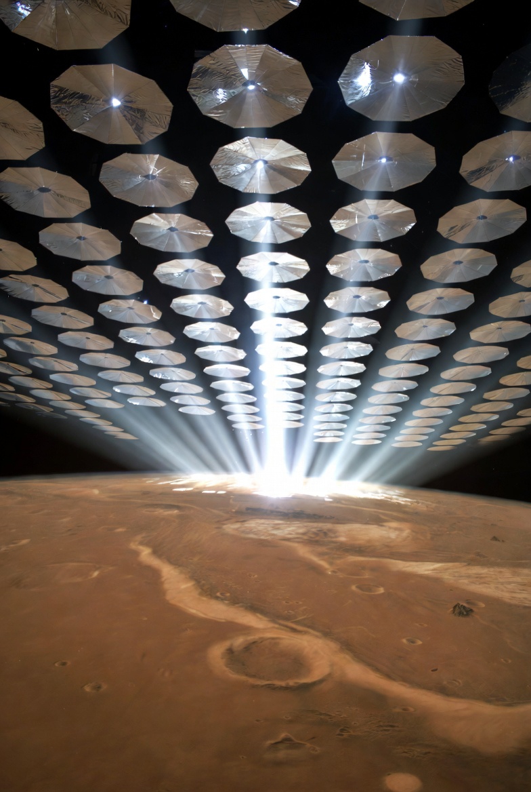

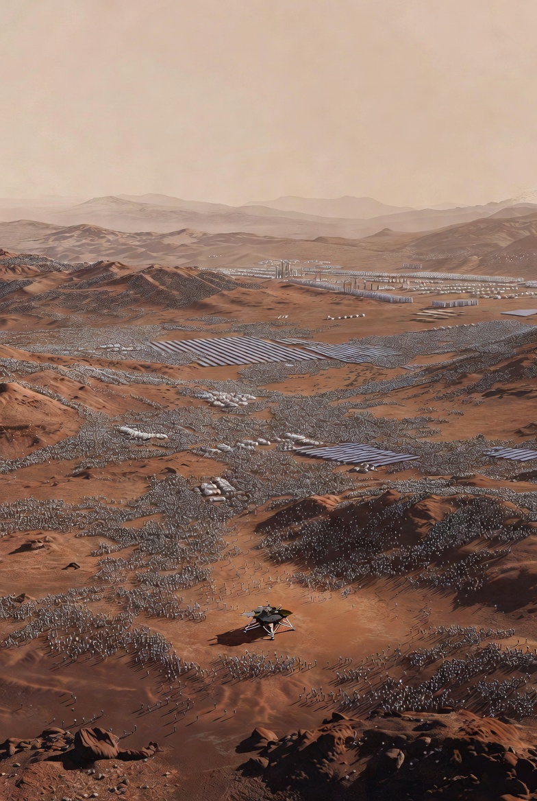

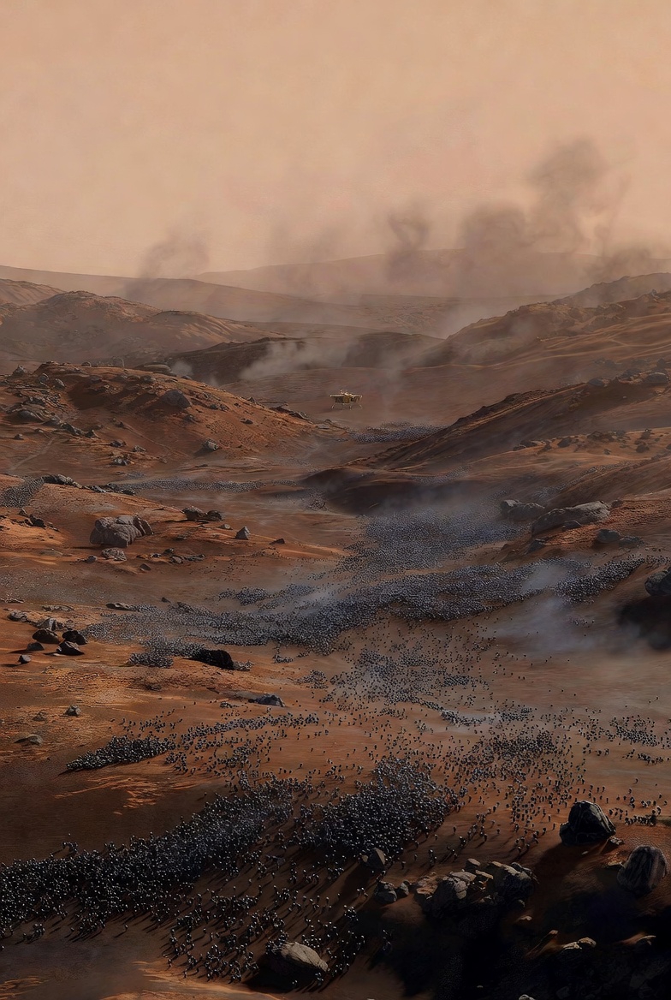

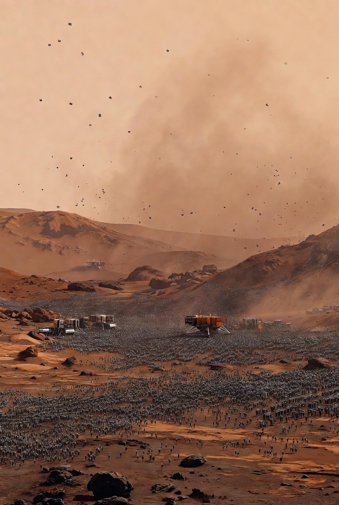

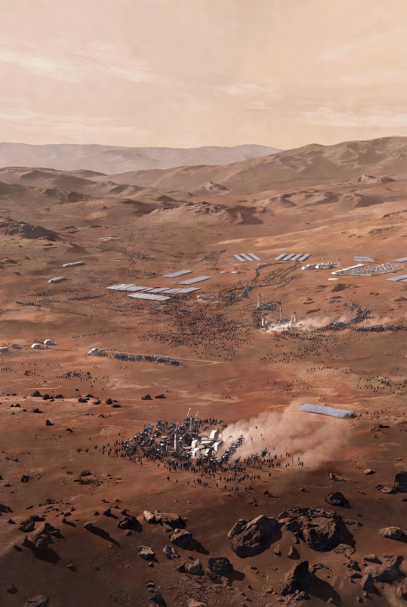

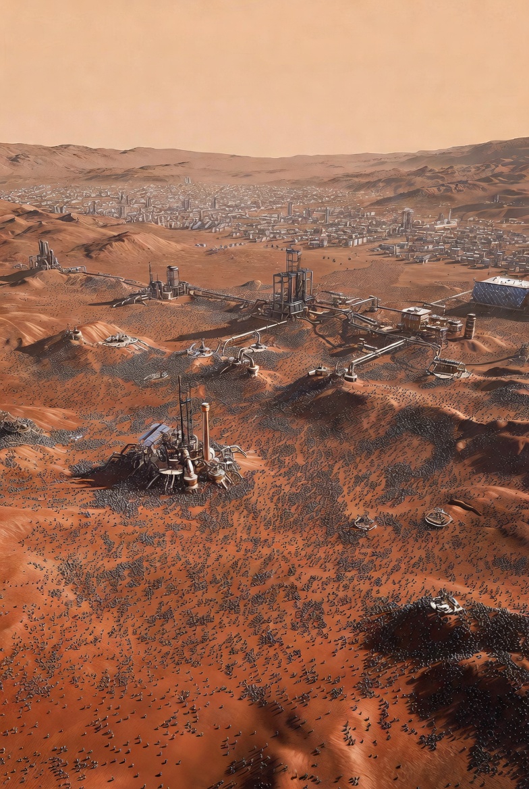

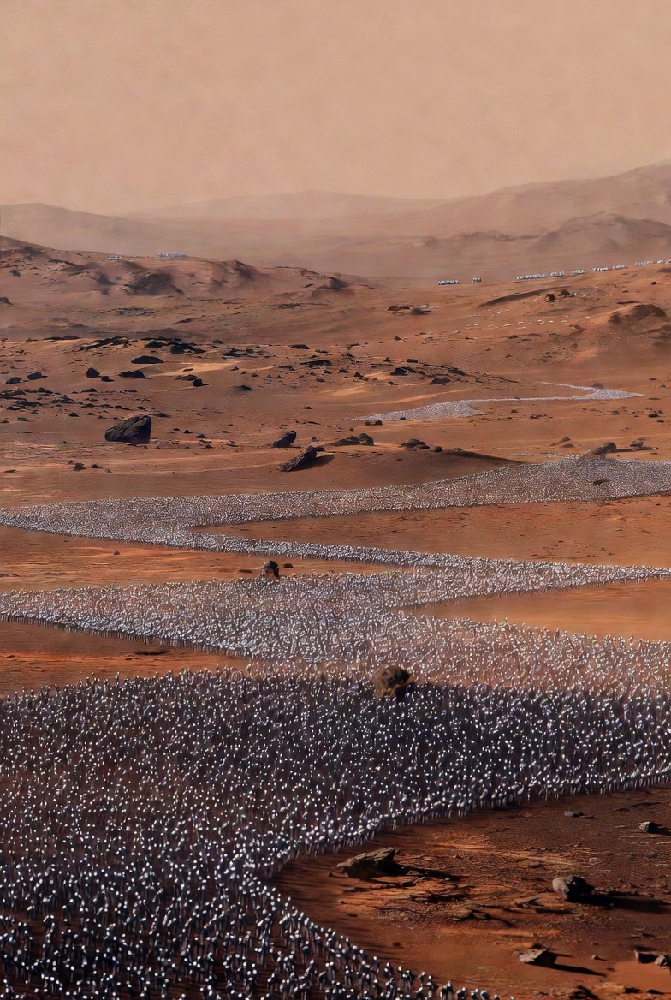

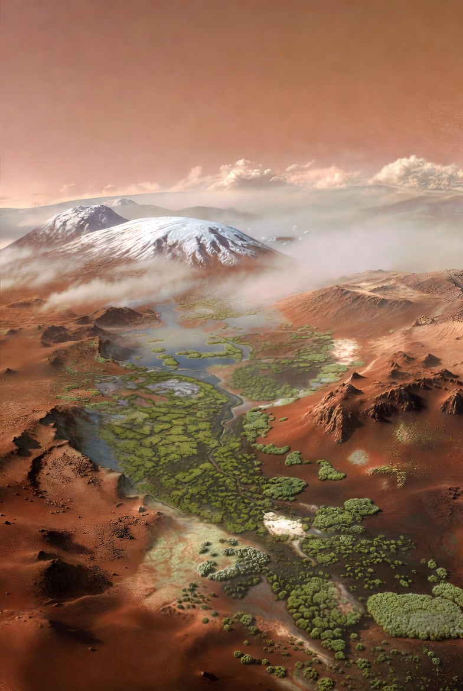

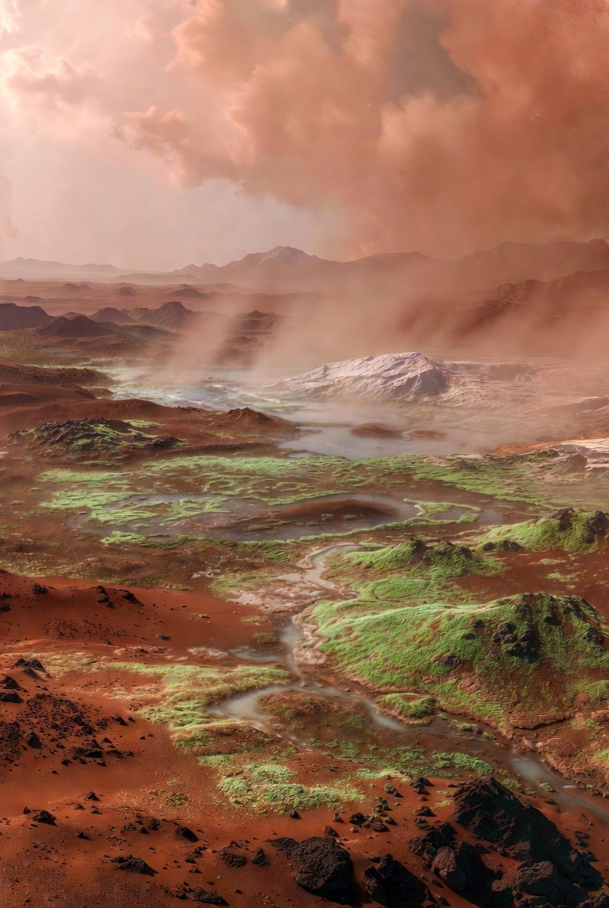

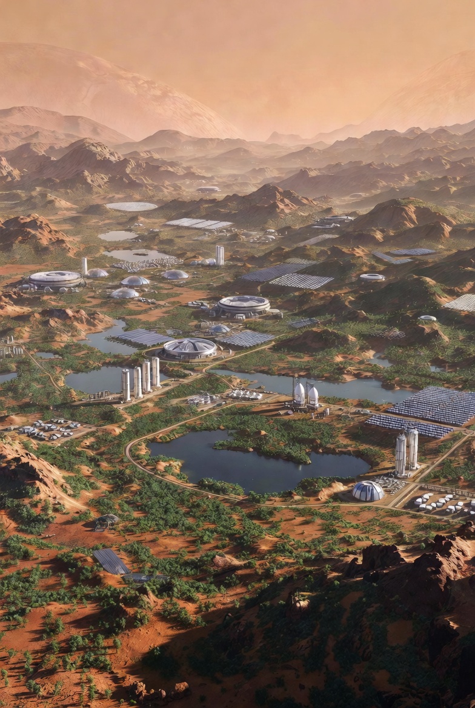

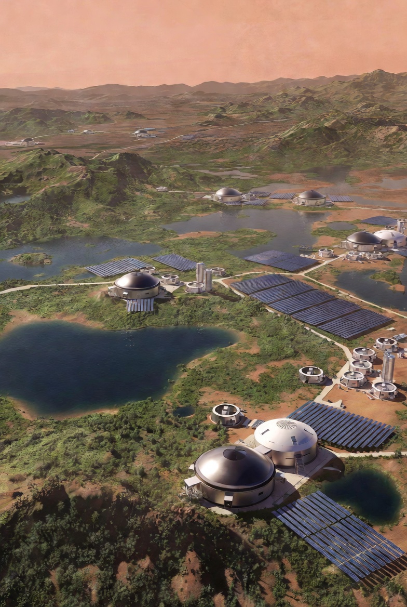

