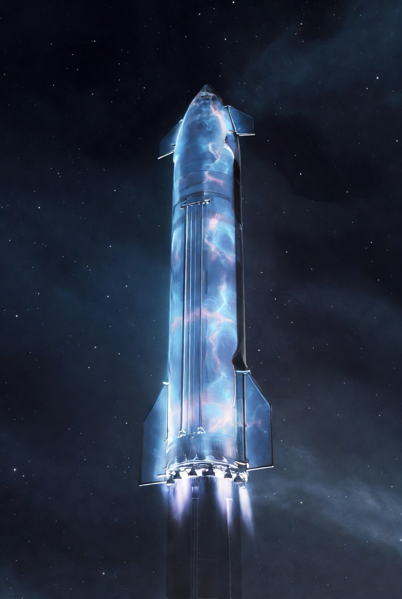
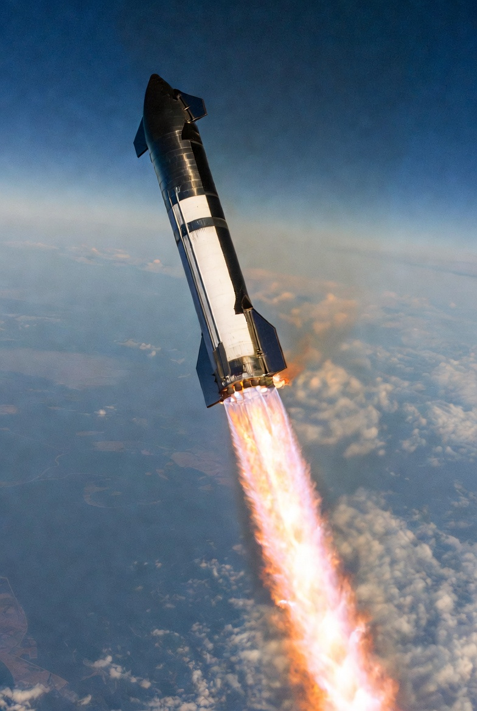
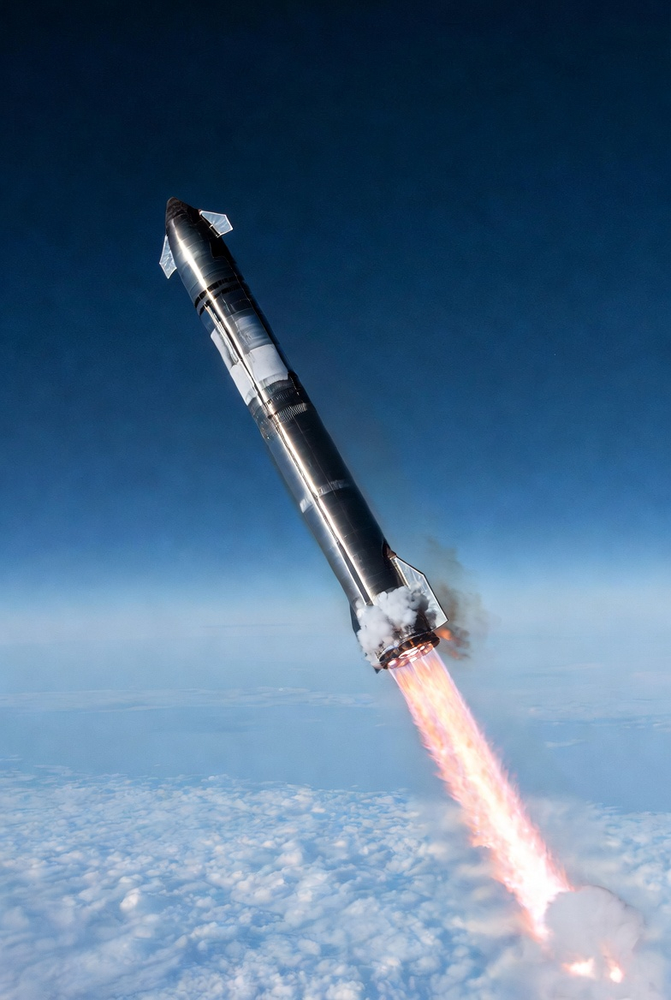
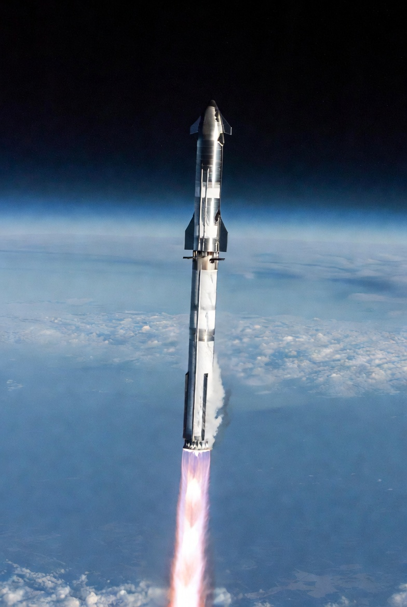
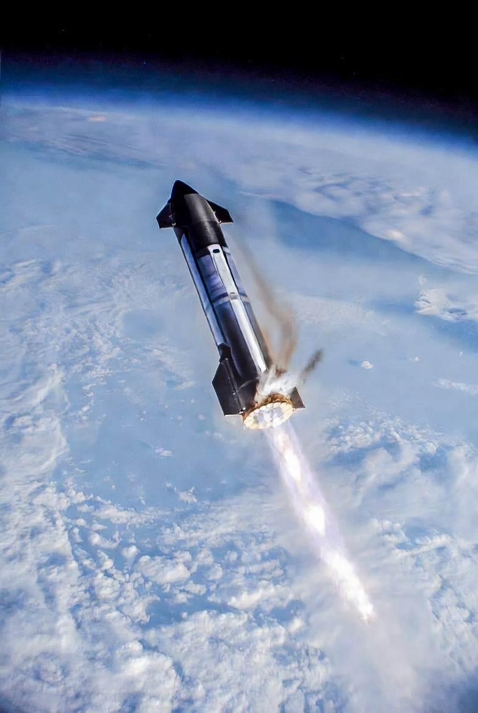

# Starship with a fusion engine

Article on X: [Starship with a fusion engine](https://x.com/skyisuniverse/status/2027081285861072957)

From [my conversation with Grok on Starship with fusion engine](https://grok.com/share/bGVnYWN5_a2ed475b-ed76-4275-8e50-100255908a29)

> How much time would we need to get to each of the planets in our solar system with such Starship? How much time would we need to establish a self-sustaining civilization on Mars (according to Elon Musk's vision of it) ? Give the timeline. What other destinations outside of our solar system would we be able to reach & in what time? Would we be able to establish self-sustaining civilizations on all other planets of our solar system with such Starship?

## Travel Times to Planets in the Solar System

With the hypothetical fusion-powered Starship (direct fusion drive, Isp ~10,000 seconds, enabling high-efficiency constant acceleration of ~0.1 m/s² for crew comfort), travel times are calculated using minimum distances from Earth (optimal alignments) and the brachistochrone trajectory formula: t = 2 √(d / a), where d is distance in meters and a is acceleration. These are one-way minimums, assuming straight-line paths possible due to the drive's capabilities; actual times could vary with trajectories, deceleration, and mission constraints. Distances sourced from astronomical data.

- **Mercury** (min distance ~77 million km): ~20 days
- **Venus** (min distance ~38 million km): ~14 days
- **Mars** (min distance ~55 million km): ~17 days
- **Jupiter** (min distance ~588 million km): ~56 days
- **Saturn** (min distance ~1,200 million km): ~80 days
- **Uranus** (min distance ~2,600 million km): ~118 days (~4 months)
- **Neptune** (min distance ~4,300 million km): ~152 days (~5 months)

These are significantly shorter than chemical propulsion (e.g., 6-9 months to Mars), as fusion minimizes propellant needs and allows sustained acceleration.

## Timeline for a Self-Sustaining Civilization on Mars (Elon Musk's Vision)

Elon Musk envisions a self-sustaining Mars city with ~1 million people, independent of Earth resupply, including local resource utilization (e.g., water ice, atmosphere for fuel), habitats, agriculture, and industry. Based on his statements, this could take 20-30 years after the first human landing, with the overall process spanning decades.

- **Short-Term (2026-2029)**: Uncrewed precursor missions (e.g., cargo landings for habitat setup, ISRU testing) by 2026-2028; first human landings by 2029.

- **Mid-Term (2030-2040)**: Build initial outposts (dozens to thousands of people), establish basic self-sufficiency (e.g., food production, oxygen/fuel from atmosphere); frequent flights (hundreds) to scale population and infrastructure.

- **Long-Term (2040-2060)**: Achieve full self-sustainability by 2049-2059 (20-30 years post-landing), with a city supporting 1 million+ residents, local manufacturing, and energy independence. Total time from now (2025): ~24-34 years.

Challenges include radiation protection, low gravity effects, and psychological factors, but fusion acceleration reduces transit risks.

## Destinations Outside the Solar System and Travel Times

With this fusion drive, interstellar travel becomes feasible (though not practical for humans due to timespans), reaching speeds up to ~0.1c (30,000 km/s) via prolonged acceleration, limited by power and relativistic effects. Times are one-way approximations for nearby stars, based on conceptual fusion propulsion studies (e.g., direct drive or ramjets). Robotic probes could reach these first; human trips would require generation ships or cryosleep.

- **Proxima Centauri** (4.2 light-years, nearest star with exoplanet): ~50 years (accel/decel phases ~9.5 years each, cruise ~31 years at 0.1c).

- **Barnard's Star** (6 light-years): ~70 years.

- **Sirius** (8.6 light-years): ~100 years.

- **TRAPPIST-1** (40 light-years, 7 Earth-like planets): ~450-500 years.

- **Kepler-452b** (~1,400 light-years, Earth analog): ~15,000 years (impractical).

Beyond ~10 light-years, times exceed centuries, limiting to robotic exploration. Advanced variants (e.g., fusion ramjets scooping interstellar hydrogen) could halve times in optimistic models, but current concepts cap at decades for nearest stars.

