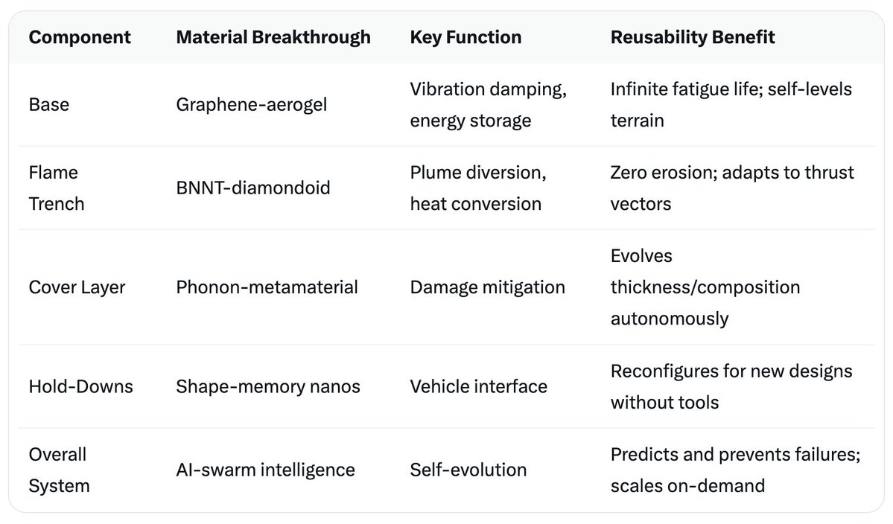

# Design of the nano-assembled Launch Pad for Starships

Article on X: [Design of the nano-assembled Launch Pad for Starships](https://x.com/skyisuniverse/status/2033895020017660122)

From [my conversation with Grok on the Nano-Assembled Launch Pad](https://x.com/i/grok/share/f6ba96b4035a4c0b8f1304b9a5a94857)

From [my conversation with Grok on the Design of a Nano-Assembled Launch Pad](https://x.com/i/grok/share/71c995fc3e624f77a76fd05012701fea)

## Introduction

Building a launch pad entirely from scratch using nanotechnology—leveraging nanobot swarms and mechanosynthesis—represents the pinnacle of assumed scientific breakthroughs. This design assumes advancements like flawless atomic-scale assembly, self-replicating swarms with emergent AI intelligence, unlimited energy harvesting (e.g., from ambient vibrations or solar), and materials with properties defying current physics limits, such as infinite fatigue life and perfect thermal/phonon management. The result is a "living" infrastructure at Starbase: adaptive, indestructible, and capable of infinite reusability with zero downtime. It could be constructed in days from local raw materials (e.g., Texas soil, atmospheric gases), scaling seamlessly for Earth or extraterrestrial sites like Mars.

## Construction Process: Bottom-Up Assembly

The process begins with a seed deployment—a small payload of precursor nanobots (e.g., 10^12 units, each ~10 nm) delivered via drone or capsule. These bots bootstrap by extracting atoms from the environment: silicon from sand, carbon from CO2, metals from trace ores. Using mechanosynthesis, they precisely position atoms to form tools, energy sources, and additional bots, exponentially scaling the swarm to trillions within hours.

- **Phase 1: Site Preparation (Hours 1-6)**: Swarms excavate and level the ground, forming a foundational matrix by mechanosynthesizing a porous aerogel base from silica. This layer absorbs seismic forces and integrates sensors for real-time monitoring.

- **Phase 2: Core Structure Build (Days 1-2)**: Bots assemble the pad layer-by-layer, creating defect-free diamondoid lattices for strength. Parallel processing allows simultaneous construction of the flame trench and surface features.

- **Phase 3: Integration and Activation (Day 3)**:  Embed intelligent subsystems, test self-repair, and "awaken" the pad's AI for ongoing evolution.

This autonomous build eliminates human labor, heavy equipment, and waste, with swarms recycling any errors instantly.

## Core Design Elements

The pad measures ~100m x 100m, optimized for Starship-scale vehicles, but reconfigurable via swarms. It's a monolithic yet modular system, with every atom engineered for synergy.

- **Foundation and Base**: A 5-10m deep substrate of mechanosynthesized graphene-aerogel composite, with a density <1 g/cm³ yet compressive strength >1 GPa. This dampens vibrations and anchors the structure, drawing geothermal energy for power. Embedded capillary networks circulate nanofluids for cooling, preventing soil liquefaction from thrust.

- **Flame Trench**: A bidirectional, U-shaped channel (15m deep, 20m wide, 50m long) mechanosynthesized from boron nitride nanotube (BNNT)-reinforced diamondoid walls. It diverts exhaust plumes at angles to minimize acoustic reflection and erosion. Integrated piezo-harvesters convert shockwaves into electricity, while nanoporous linings allow instant vaporization of water deluge for enhanced cooling—achieving 100% heat dissipation without material loss.

- **Ultra-Advanced Cover Layer**: The surface "skin" (5-10cm thick) is the crown jewel: a non-ablative metamaterial of atomically perfect carbon-BNNT hybrids, with thermal conductivity >5,000 W/m·K and melting point >4,000°C. Phonon-engineered to redirect heat as harmless vibrations or convert it to usable energy, it repels particulates hydroscopically and self-thickens for hotter engines (e.g., auto-evolving from 5cm to 15cm in minutes). Zero-damage is achieved through quantum-locked bonds that reform instantly via dormant nanobots, mitigating all thermal, abrasive, and acoustic insults.

- **Hold-Down and Interface Systems**: Adaptive clamps and umbilicals formed from shape-memory nanomaterials, reconfiguring via swarms to fit any vehicle (e.g., Starship or future variants). They include wireless power/data links and vibration-isolating joints, ensuring precise alignment without wear.

- **Self-Evolution and Intelligence Layer**: An embedded neural network of quantum sensors and AI-driven swarms enables the pad to "learn" from each launch. For instance, it analyzes exhaust patterns to optimize trench geometry or reinforce high-stress zones preemptively. In extreme breakthroughs, it could self-replicate entire pads or integrate with vehicles for symbiotic operations.

## Performance and Reusability

With these breakthroughs, the pad withstands unlimited cycles: >10,000 launches at 10,000+ tons thrust, temperatures >3,000°C, and Mach-speed exhaust without degradation. Turnaround is instantaneous—swarms repair/reconfigure in seconds. Environmental impact is minimal, as the system sequesters carbon during construction and generates surplus energy.

This nanotech launch pad transcends traditional engineering, becoming an ecosystem that evolves with spaceflight demands. While grounded in extrapolated research (e.g., BNNTs, mechanosynthesis), it unlocks Mars colonization by enabling rapid, resource-efficient builds anywhere.