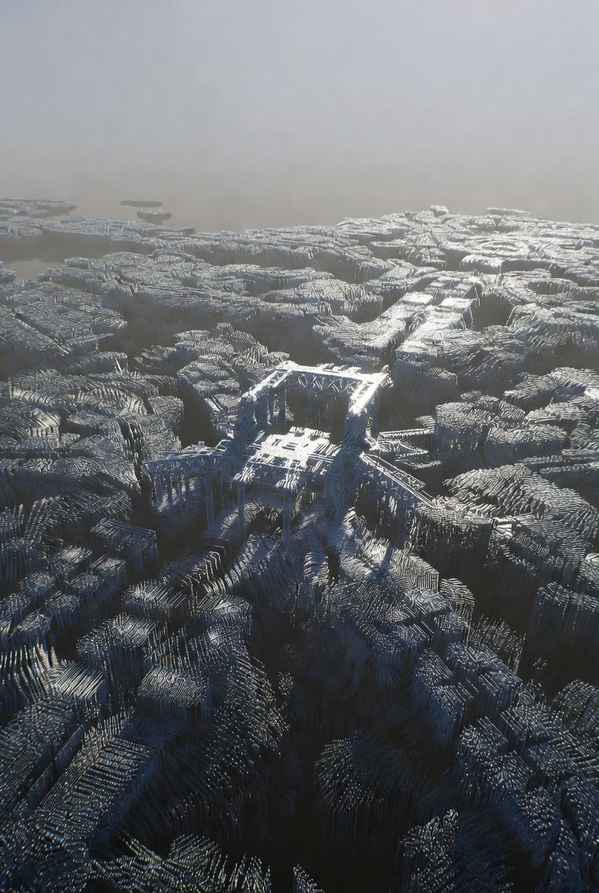

# Full launch-induced damage mitigation for Nano-Assembled Launch Pad

Article on X: [Full launch-induced damage mitigation for Nano-Assembled Launch Pad](https://x.com/skyisuniverse/status/2033836073478963432)

From [my conversation with Grok on Nano-Assembled Launch Pad](https://x.com/i/grok/share/f6ba96b4035a4c0b8f1304b9a5a94857)

From [my conversation with Grok on Full Launch-Induced Damage mitigation for Nano-Assembled Launch Pad](https://x.com/i/grok/share/d619b47150eb4cfb8d39bea9cc8a0020)

## Introduction

> the pad could self-evolve—adapting to hotter engines by mechanosynthesizing thicker thermal barriers

> would it be possible to mitigate the launch-induced damage to the pad entirely? e.g. with some ultra-advanced cover layer that doesn't get damaged at all

Assuming breakthroughs in nanotechnology, such as scalable mechanosynthesis for defect-free atomic structures and nanobot swarms capable of real-time adaptation, it could indeed be possible to mitigate launch-induced damage to the Starbase pad entirely—or at least to a level where no perceptible wear occurs over thousands of cycles. This would go beyond current self-healing concepts, aiming for a "zero-damage" ultra-advanced cover layer that withstands extreme heat (up to 3,000°C+ from Raptor engines), acoustic shockwaves, erosive particulates, and thrust forces without degradation. Below, I'll outline the feasibility, drawing on emerging materials research, and propose an optimal design while exploring broader possibilities.

## Feasibility Based on Current and Emerging Materials

Today's launch pads, like those at Starbase, rely on reinforced concrete, steel tiles, and water deluge systems to handle damage from launches, but they still require refurbishment after high-thrust events (e.g., Starship's 7,000+ tons of force). Advanced materials already push boundaries: Carbon/carbon composites sublimate at 3,000°C+ while maintaining strength, refractory metals like tungsten endure 3,400°C melting points, and ceramic matrix composites (CMCs) show near-zero erosion in ultra-high-temperature tests. Ablative materials like 3D-MAT (a woven quartz-phenolic composite) survive reentry heats better than older phenolics without cracking, but they intentionally sacrifice mass to protect underlying structures— not zero damage.

Nanotechnology elevates this: Aerogels with nanoparticle modifications achieve thermal conductivities as low as 0.0196 W/m·K at room temperature, stable over 1,000°C, while boron nitride nanotubes (BNNTs) theoretically reach 5,000 W/m·K conductivity with phonon mean free paths up to 530 nm, enabling efficient heat dissipation without melting. Graphene and carbon nanotubes (CNTs) networks provide strengths 100-150x that of steel, with thermal conductivities exceeding 1,000 W/m·K, and can form flexible, durable layers for thermal management. These aren't indestructible yet, but breakthroughs in defect-free synthesis could create phonon-engineered metamaterials that redirect heat as vibrations or convert it to electricity, minimizing entropy-driven wear.

Physics limits absolute "zero damage" (e.g., quantum fluctuations or particle abrasion), but with nanotech, effective mitigation could mean no net material loss, as swarms instantly reform bonds. Research on BNNT-CNT hybrids shows promise for hydrophobic, oxidation-resistant layers stable at 1,100°C+ in air.

## Proposed Best Design: Indestructible Nanotech Cover Layer

The ideal layer would be a 5-10 cm thick nanocomposite "skin" over the pad and flame trench, integrated with the self-evolving system you mentioned. Here's a breakdown:

- **Composition**: A mechanosynthesized diamondoid matrix (atomically perfect carbon lattice for hardness >10 on Mohs scale) reinforced with BNNTs and graphene sheets. This creates a non-ablative barrier with melting points >3,500°C, ultra-low thermal expansion (CTE ~3.8 × 10^{-6} m/m/°C), and radiation resistance up to 5 million rads. Embedded nanofluids (e.g., CNT-suspended coolants) actively wick away heat, while metamaterial patterns redirect acoustic waves to prevent cracking.

- **Active Mitigation**: Nanobot swarms embedded in the matrix monitor via quantum sensors, mechanosynthesizing repairs at the atomic level. For hotter engines, the layer self-thickens by drawing atmospheric carbon or soil silica, evolving into denser configurations without downtime. (Inspired by multifunctional ablators like those in Orion, but non-sacrificial.)

- **Integration with Pad**: Applied over existing concrete/steel, with a water deluge enhanced by nanoporous channels for 100x better cooling efficiency. The layer could include piezoresponsive elements that harvest vibrational energy from launches to power the swarms.

This design could handle 10,000+ launches with zero refurbishment, reducing costs by 90% and enabling daily Starship operations.

## Broader Possibilities with Nanotech Breakthroughs

- **Energy Conversion**: The layer could thermoelectricly convert exhaust heat into electricity, powering Starbase operations or charging vehicles—turning damage into a resource.

- **Adaptive Morphology**: Swarms reconfigure the surface mid-launch (e.g., forming micro-trenches to channel plumes), adapting to variable thrust profiles without hardware changes.

- **Scalability to Extreme Environments**: For Mars pads, use in-situ regolith to build similar layers, resistant to dust storms and radiation. Earth-based extensions: Hypersonic vehicle runways or fusion reactor linings.

- **Challenges and Risks**: Swarm control failures could lead to unintended restructuring, but AI breakthroughs ensure failsafes. Material costs drop with scalable synthesis, making it viable by 2030-2040.

In essence, this nanotech layer shifts pads from passive structures to intelligent systems, fully mitigating damage and enabling seamless rapid reusability. While speculative, ongoing advances in BNNTs, aerogels, and CMCs substantiate the path forward.