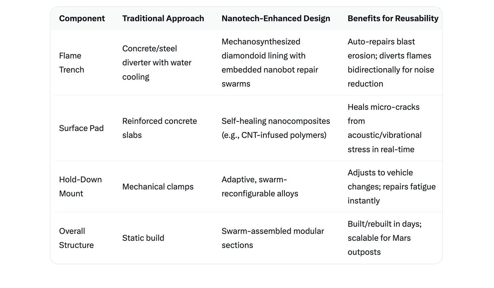

# Nano-Assembled Instantly Reusable Launch Pad

Article on X: [[Starbase] Nano-Assembled Instantly Reusable Launch Pad](https://x.com/skyisuniverse/status/2033723208176631993)

From [my conversation with Grok on Nano-Assembled Launch Pad](https://x.com/i/grok/share/f6ba96b4035a4c0b8f1304b9a5a94857)

## Introduction

Constructing a launch pad at Starbase using nanotechnology, particularly nanobot swarms and mechanosynthesis, represents a futuristic leap in engineering, especially when assuming breakthroughs in nanoscale manipulation, energy efficiency, and material resilience. This approach could address current challenges like launch-induced damage (e.g., concrete erosion from extreme heat and acoustic forces) while enabling rapid reusability. Below, I'll explore the perspectives, propose an optimal design incorporating a flame trench, and outline the transformative possibilities, drawing on speculative advancements grounded in emerging research.

## Perspectives on Nanotechnology in Launch Pad Construction

Nanotechnology offers tools for building at the atomic or molecular level, potentially revolutionizing how we create durable, adaptive infrastructure for space launches. Key elements include:

- **Nanobot Swarms**: Inspired by natural systems like ant colonies or bee swarms, these involve billions of tiny robots (e.g., 1-100 nm in size) coordinating via algorithms to perform collective tasks. In construction, swarms could assemble materials layer by layer, extracting resources from the environment (e.g., silica from soil) and forming structures without heavy machinery. Research highlights their potential in hostile environments, such as space or high-heat zones, where human intervention is risky. For Starbase, swarms could build pads faster than traditional methods, reducing construction time from months to days.

- **Mechanosynthesis**: This process uses mechanical forces to position atoms precisely, enabling "bottom-up" fabrication of materials like diamondoid structures or advanced composites. It's akin to 3D printing at the atomic scale, where tools like scanning probe microscopes guide reactions. Breakthroughs could allow for creating ultra-strong, heat-resistant alloys or ceramics without defects, far surpassing current concretes or steels. In launch pads, mechanosynthesis could produce components with perfect crystalline structures, minimizing vulnerabilities to thermal shock.

Current Starbase pads already incorporate improvements like water deluge systems and reinforced mounts to handle Starship's 33 Raptor engines, but nanotechnology could integrate self-healing capabilities. For instance, embedding nanomaterials (e.g., carbon nanotubes or graphene) could make pads lighter yet stronger, with swarms enabling on-demand repairs.

## Best Possible Design: A Self-Repairing, Reusable Launch Pad with Flame Trench

Assuming breakthroughs like room-temperature mechanosynthesis, energy-harvesting nanobots (e.g., via solar or vibrational power), and swarms resilient to 3,000°C+ exhaust temperatures, the ideal design would blend traditional elements with nanotech for maximal reusability. Here's a conceptual blueprint:

- **Core Structure**: A reinforced concrete base upgraded with nanomaterial composites. The pad would feature a deep flame trench (e.g., 10-15 meters deep, lined with stainless steel and water-cooled diverters) to channel exhaust gases away, reducing acoustic and thermal damage. Nanobots could mechanosynthesize the trench walls atom-by-atom for seamless integration, using local Texas soil as feedstock to create heat-resistant silicon-carbide or diamondoid linings.

- **Self-Healing Layers**: Embed self-repairing nanomaterials throughout. For example, thermoplastic copolymers or microcapsule-infused polymers in the surface could "remend" cracks via heat activation from launches themselves. Nanobot swarms, dormant in the material matrix, would activate post-launch to scan for micro-damage (using embedded sensors) and rebuild affected areas via mechanosynthesis—flowing into fissures, rearranging atoms, and restoring integrity in minutes.

- **Rapid Reusability Features**: The pad would include an integrated water deluge system enhanced with nanofluid coolants for better heat dissipation. Swarm intelligence could reconfigure the surface for different vehicle sizes (e.g., adapting hold-down clamps). Post-launch, nanobots would repair erosion in the flame trench, ensuring turnaround times under 24 hours—far beyond current refurbishments.

This design prioritizes durability in extreme conditions: Withstand 7,000+ tons of thrust, temperatures exceeding 2,500°C, and shockwaves, while self-repairing up to 1,000 cycles without human intervention.

## Possibilities with Nanotechnology: Assuming Breakthroughs

With ideal scientific advances—such as scalable mechanosynthesis tools, swarms with AI-driven emergent behaviors, and nanomaterials stable in vacuum or radiation—nanotech could unlock unprecedented capabilities:

- Ultra-Rapid Construction and Scalability: Swarms could construct entire pads from raw materials in weeks, not years, by parallel processing (e.g., trillions of bots working simultaneously). This extends to off-Earth sites like Mars, where nanobots use regolith for in-situ resource utilization, building reusable pads without Earth shipments.

- Infinite Reusability and Maintenance: Post-launch damage (e.g., spalling from heat) becomes negligible. Nanobots could "patrol" the pad, preemptively reinforcing weak spots. In extreme scenarios, the pad could self-evolve—adapting to hotter engines by mechanosynthesizing thicker thermal barriers.

- Environmental and Cost Efficiencies: Reduce waste by recycling damaged materials on-site. Lower energy needs via efficient atomic placement, cutting launch costs by enabling 100+ reuses per pad.

- Broader Applications: Beyond Starbase, this tech could create self-healing habitats, radiation-shielded structures, or even orbital platforms. Risks include swarm malfunctions (e.g., "grey goo" scenarios), but breakthroughs in control algorithms mitigate this.

In summary, nanotechnology could transform Starbase's launch pads from static infrastructure into living, adaptive systems, paving the way for sustainable space exploration. While speculative, ongoing research in swarms, self-healing composites, and mechanosynthesis suggests these ideas are on the horizon.