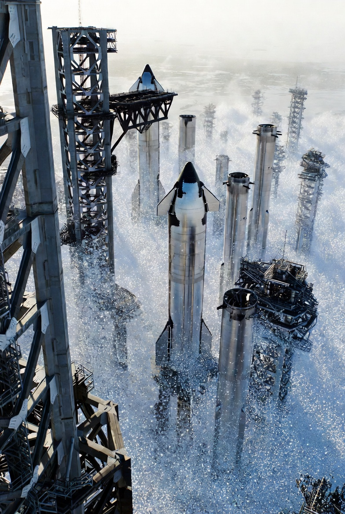

# Nano-Assembled Launch Pad - from Lab to Starbase

Article on X: [Nano-Assembled Launch Pad - from Lab to Starbase](https://x.com/skyisuniverse/status/2033938537389682906)

From [my conversation with Grok on the Nano-Assembled Launch Pad](https://x.com/i/grok/share/f6ba96b4035a4c0b8f1304b9a5a94857)

From [my conversation with Grok on the leap of Nano-Assembled Launch Pad from Lab to Starbase](https://x.com/i/grok/share/4c4b9872fc3b4c0db58c482ae2c763b7)

## Introduction

Scaling the development of a nanotechnology-based launch pad from laboratory demonstrations to a full-scale operational system at Starbase—encompassing nanobot swarms, mechanosynthesis, self-healing materials, and AI-driven evolution—presents monumental challenges, as noted. However, assuming optimal scientific breakthroughs and drawing from established strategies in nanotechnology commercialization, swarm robotics, and advanced manufacturing, it can be achieved through a structured, phased roadmap. This "best possible way" emphasizes interdisciplinary collaboration, iterative risk mitigation, hybrid top-down/bottom-up approaches, and leveraging in-situ resources to minimize costs and timelines. Below, I'll outline a comprehensive plan, grounded in extrapolated research trends, aiming for deployment by 2040-2050 with focused  investment.

## Overarching Principles for Success

To bridge the lab-to-industrial gap effectively:

- **Interdisciplinary Integration**: Combine expertise from nanoscience, robotics, materials engineering, AI, and aerospace (e.g., SpaceX partnerships). Early synchronization of research ("seed") and market needs ("need") accelerates innovation, as seen in accelerated commercialization models.

- **Risk Management and Standardization**: Implement Design for Manufacturing (DFM) principles to address scalability hurdles like impurities, batch variability, and high costs from the outset. Develop  standards for nanomaterial purity (e.g., 99.999%) and swarm safety to build investor confidence.

- **Funding and Partnerships**: Secure investments from xAI, SpaceX. Use phased funding gates to validate milestones, similar to biotech scale-ups.

- **Sustainability Focus**: Prioritize green synthesis methods (e.g., avoiding toxic solvents) and in-situ resource utilization (e.g., Texas soil for diamondoid structures) for environmental and cost efficiency.

- **Simulation and AI Tools**: Employ quantum simulations, machine learning for process optimization, and digital twins to predict scale-up behaviors, reducing physical trials by 50-70%.

## Phased Roadmap: From Lab to Starbase

The optimal path divides into four phases, spanning 15-25 years, with built-in feedback loops for iteration. Each phase includes milestones, challenges, and mitigation strategies, drawing from nanotechnology roadmaps and swarm construction paradigms. Hierarchical swarm designs enhance scalability by allowing small groups to form larger, adaptive units.

### 1: Foundational R&D and Prototyping

- **Phase 1**: Foundational R&D and Prototyping

- **Timeline** (Assuming Start in 2026): 2026-2032 (6 years)

- **Key Milestones**:

    - Develop scalable mechanosynthesis tools for room-temp atomic assembly at grams-per-hour rates.

    - Create self-replicating nanobot swarms (10^6-10^9 units) with AI coordination for micro-scale construction tasks.

    - Synthesize defect-free diamondoid/BNNT prototypes (e.g., 1cm² self-healing pads).

    - Lab demos: Build a 1m² mini-pad enduring simulated Raptor thrust (e.g., 1,000°C heat tests).

- **Challenges**: High impurity rates, energy inefficiency.

- **Mitigations**: Use AI-optimized quantum simulations for purity; hybrid bio-nano methods for replication. / nanosheet scaling

- **Budget**: $500M-$1B, focused on ideation and early scalability.

---

### 2: Pilot-Scale Validation and Integration

- **Phase 2**: Pilot-Scale Validation and Integration

- **Timeline** (Assuming Start in 2026): 2033-2038 (5 years)

- **Key Milestones**:

    - Scale swarms to 10^12 units for 10m x 10m pad construction from local feedstocks.

    - Integrate phonon metamaterials and quantum sensors for zero-damage testing under full thrust simulations.

    - Hierarchical swarms: Low-level bots for atomic assembly, high-level for macro-coordination.

    - Off-site pilot: Construct a functional flame trench at a test facility (e.g., McGregor), validating self-evolution (e.g., auto-thickening barriers).

    - **Challenges**: Batch variability, swarm failures in extremes.

    - **Mitigations**: Pilot batches with mechanistic modeling; robust decentralized controls for fault tolerance.

    - Use cleanrooms for initial builds, transitioning to in-situ.

    - **Budget**: $2B-$5B, with CDMOs for tech transfer.

---

### 3: Full-Scale Demonstration and Optimization

- **Phase 3**: Full-Scale Demonstration and Optimization

- **Timeline** (Assuming Start in 2026): 2039-2045 (6 years)

- **Key Milestones**:

    - Deploy seed swarms at Starbase for on-site 100m x 100m pad build in weeks.

    - Real-world tests: 100+ Starship launches with zero refurbishment, auto-adapting to hotter engines.

    - Energy harvesting integration: Convert thrust vibrations into swarm power.

    - Standards certification for safety (e.g., no "grey goo" risks via replication limits).

- **Challenges**: Infrastructure costs.

- **Mitigations**: Modular equipment for adaptability; frameworks for nanomaterial assurance.

- **Budget**: $10B-$20B, offset by energy efficiencies.

---

### 4: Deployment and Expansion

- **Phase 4**: Deployment and Expansion

- **Timeline** (Assuming Start in 2026): 2046+ (Ongoing)

- **Key Milestones**:
    
    - Operational Starbase pad with infinite reusability.
    
    - Extraterrestrial scaling: Mars pads from regolith.
    
    - Ecosystem evolution: Pads integrate with vehicles for symbiotic ops.
    
    - Commercial spin-offs (e.g., self-healing infrastructure worldwide).

- **Challenges**: Long-term stability, ethical concerns.

- **Mitigations**: Continuous AI monitoring; open-source elements for global adoption.

- **Budget**: Sustained $1B/year for upgrades.

## Enabling Breakthroughs and Innovations

- **Hybrid Scaling Techniques**: Combine bottom-up (atomic assembly) with top-down (e.g., nanoimprint lithography) for throughput. Use microfluidics for initial swarm replication, scaling to industrial reactors.

- **Swarm-Specific Advances**: Employ self-X properties (self-healing, -assembly) for robustness.

- **Economic Feasibility**: Start with high-value applications to fund broader R&D; aim for 10x cost reduction via automation.

- **Timeline Acceleration**: With AI-driven design, cut phases by 20-30% through predictive modeling.

This roadmap transforms the monumental leap into manageable steps, potentially enabling daily Starship launches by mid-century.