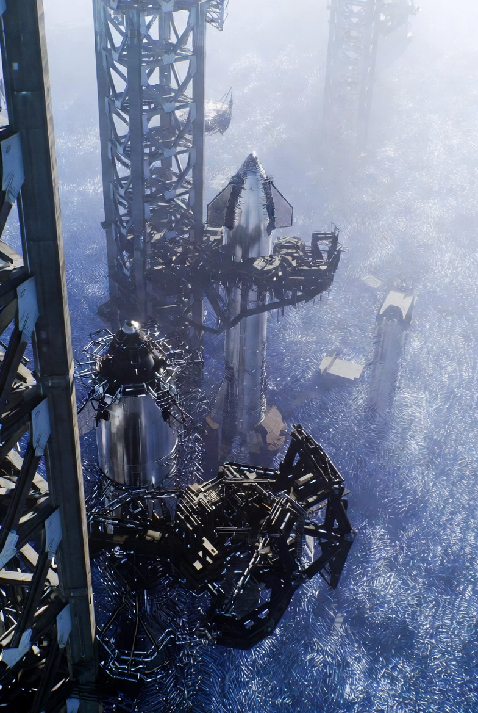

# Scientific Breakthroughs for Nano-Assembled Launch Pad for Starships

Article on X: [Scientific Breakthroughs for Nano-Assembled Launch Pad for Starships](https://x.com/skyisuniverse/status/2033902752573636974)

From [my conversation with Grok on the Nano-Assembled Launch Pad](https://x.com/i/grok/share/f6ba96b4035a4c0b8f1304b9a5a94857)

From [my conversation with Grok on Scientific Breakthroughs for Nano-Assembled Launch Pad](https://x.com/i/grok/share/61af80a0ba8d4a56acf2979ef09f7b7e)

## Introduction

Implementing the proposed nanotechnology-based launch pad at Starbase—constructed from scratch using nanobot swarms, mechanosynthesis, self-healing diamondoid materials, phonon-engineered metamaterials, AI-driven swarm intelligence, nanoscale energy harvesting, and quantum sensors for real-time monitoring—would require transformative scientific breakthroughs across multiple disciplines. While current research provides foundational elements, such as experimental mechanosynthesis at small scales and bio-inspired swarm behaviors, the design assumes capabilities far beyond today's technology. These breakthroughs would need to address scalability, reliability in extreme environments (e.g., high thrust, temperatures >3,000°C), safety (e.g., preventing uncontrolled replication), and integration of quantum effects with classical engineering. Below, I detail the key required advancements, grounded in extrapolations from ongoing research, categorized by core components of the design.

### 1. Mechanosynthesis and Atomic-Scale Assembly

Mechanosynthesis—the precise mechanical positioning of atoms or molecules to build structures—forms the backbone of the pad's bottom-up construction, enabling defect-free diamondoid lattices from raw materials like soil silica or atmospheric carbon.

- **Scalable, High-Throughput Mechanosynthesis Tools**: Current mechanosynthesis is limited to lab-scale demonstrations, such as using scanning probe microscopes to position single atoms or small molecules (e.g., adamantane derivatives) at cryogenic temperatures. Breakthroughs would include room-temperature, high-speed tools capable of assembling trillions of atoms per second, akin to an "atomic 3D printer" with parallel arrays of nanoscale tips. This requires overcoming energy barriers for bond formation without thermal disruption, possibly via advanced force fields or catalytic intermediates. Theoretical models suggest quantum-level simulations could guide this, but experimental validation for macro-scale builds (e.g., 100m x 100m pads) is needed.

- **In-Situ Resource Utilization at Atomic Scale**: Extracting and purifying atoms from heterogeneous environments (e.g., Texas soil) demands breakthroughs in selective atomic sorting and purification. Current top-down (e.g., milling) and bottom-up (e.g., sol-gel) methods produce impurities; future systems must achieve 99.999% purity for defect-free crystals, perhaps using AI-optimized quantum tunneling or enzymatic mimics.

- **Timeline and Challenges**: With current progress in quantum-chemical simulations, breakthroughs could emerge in 20-30 years, but safety protocols to prevent unintended reactions (e.g., "grey goo") are critical.

### 2. Self-Replicating Nanobot Swarms

The design relies on exponential scaling of swarms from a small seed to trillions of bots for rapid construction and repairs.

- **Controlled Self-Replication Mechanisms**: Today's self-replicating systems are conceptual or biological (e.g., DNA-based "xenobots" that replicate kinematically). Breakthroughs must enable mechanical self-replication at nanoscale, using mechanosynthesis to assemble daughter bots from environmental feedstock without errors. This includes error-correcting codes in bot "DNA" (e.g., redundant molecular blueprints) and failsafes like replication limits or external shutdown signals to avoid runaway growth.

- **Swarm Coordination in Harsh Environments**: Swarms need to operate in high-heat, high-vibration settings. Advances in emergent behaviors—drawing from ant colonies or bacterial quorum sensing—must scale to nanoscale, enabling collective tasks like trench excavation or surface reconfiguration. Breakthroughs include robust communication (e.g., acoustic or chemical signaling) resilient to exhaust plumes, with bots surviving >3,000°C via phase-change materials.

- **Timeline and Challenges**: Early prototypes exist in microfluidics, but full self-replication might require 15-25 years of bio-nano hybrid research, with ethical frameworks for containment.

### 3. Advanced Materials: Diamondoid Structures and Phonon Metamaterials

The pad's indestructible cover layer and flame trench demand materials with extreme properties, like zero thermal erosion and infinite fatigue life.

- **Defect-Free Diamondoid Synthesis and Self-Assembly**: Diamondoids (e.g., adamantane) currently form nanowires or small aggregates via functional groups. Breakthroughs would enable micrometer-scale, atomically perfect lattices, perhaps through Monte Carlo-guided self-assembly influenced by rigidity and substituents. For BNNT-diamondoid hybrids, advances in covalent bonding at scale are needed for strengths >1 GPa and melting points >4,000°C.

- **Phonon-Engineered Metamaterials for Thermal Management**: To achieve zero-damage, materials must redirect phonons (heat vibrations) without loss. Current phonon crystals reduce conductivity in SiC nanowires; breakthroughs include non-equilibrium phonon polaritons for 3x copper's conductivity, and metamaterials with tailored anisotropy for bidirectional heat flow. This requires quantum-informed design to convert heat to electricity or vibrations harmlessly.

- **Timeline and Challenges**: With ongoing work in 2D materials, viable prototypes could appear in 10-20 years, but integrating self-healing (e.g., via embedded swarms) adds complexity.

### 4. AI and Swarm Intelligence for Control and Evolution

The pad's self-evolution requires AI to analyze launches and adapt structures in real-time.

- **Emergent AI for Nanoscale Decision-Making**: Current swarm AI handles microrobots in labs; breakthroughs must enable trillion-bot coordination with low latency, using AI for pattern prediction (e.g., exhaust analysis). This includes machine learning for obstacle avoidance and path planning at atomic scales.

- **Autonomic Evolution Algorithms**: AI must "learn" from launches, evolving designs via genetic algorithms or neural networks embedded in swarms. Breakthroughs in bilevel intelligence (autonomic reflexes + heuristic planning) are needed for Mars adaptability.

- **Timeline and Challenges**: AI-robotics integration is advancing; nanoscale versions could take 10-15 years

### 5. Nanoscale Energy Harvesting for Swarm Power

Swarms need ambient power without batteries.

- **High-Efficiency, Multi-Modal Harvesters**: Current piezoelectric/triboelectric nanogenerators harvest vibrations; breakthroughs must achieve mW/cm³ from thrust vibrations, heat, or solar, using CNT-based systems. Integration with swarms for self-sustaining replication is key.

- **Quantum-Enhanced Harvesting**: Advances in subwavelength conversion (e.g., 2D materials) for nuclear/chemical sources.

- **Timeline and Challenges**: Wearable harvesters exist; nanoscale scaling could occur in 5-10 years

### 6. Quantum Sensors for Nanoscale Monitoring and Feedback

Embedded sensors ensure real-time damage detection and adaptation.

- **High-Resolution, Ambient Quantum Sensors**: NV centers in diamond detect fields at nm scales; breakthroughs must enable nanosecond resolution in chips, monitoring stress/magnetic fields during launches. Trapped-ion sensors for forces.

- **Integration with Swarms**: Sensors must feedback to AI for preemptive repairs, requiring entanglement for correlated measurements.

- **Timeline and Challenges**: Lab demos are advancing; full integration might take 10-20 years, with radiation resistance key.

In summary, these breakthroughs could enable the pad by 2040-2050 with focused investment, but interdisciplinary collaboration and risk mitigation (e.g., AI safety, environmental impact) are essential. Current nanoscience trends suggest feasibility, yet the leap from lab to Starbase-scale remains monumental.