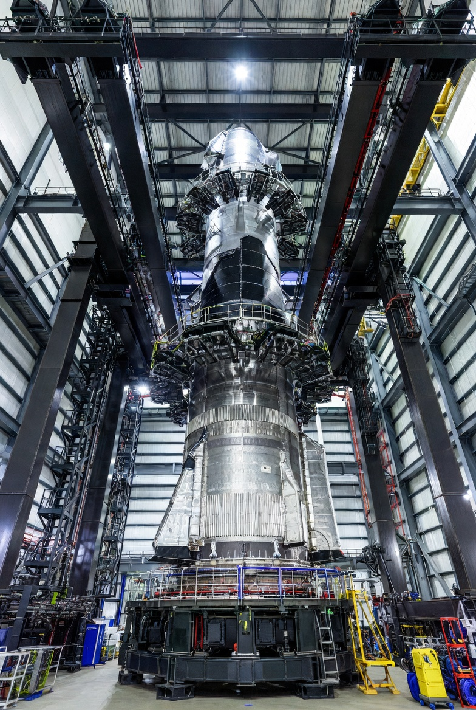
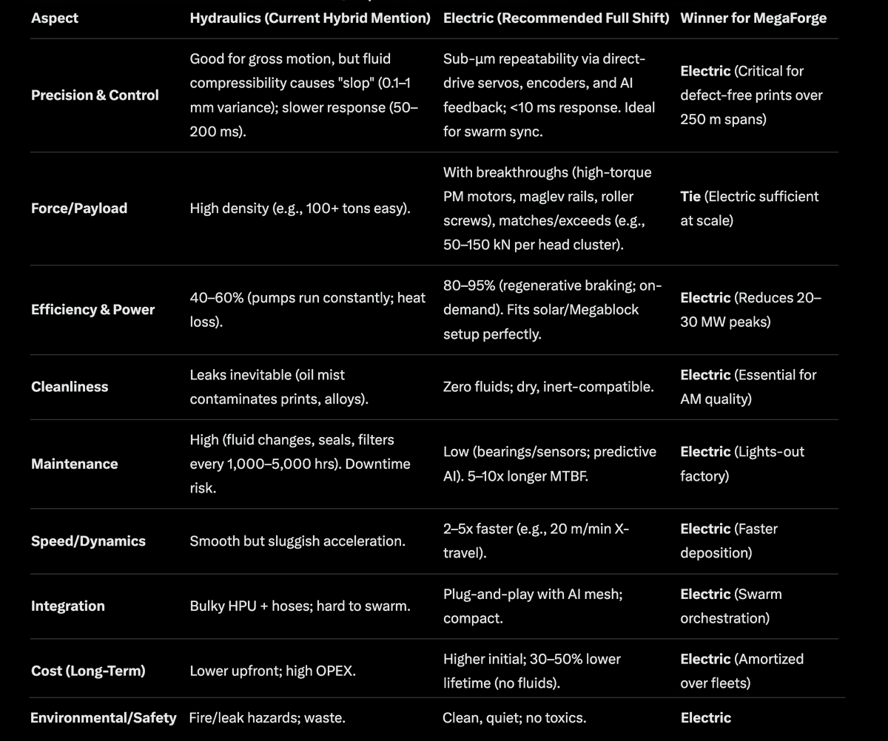

# MegaForge. Gantry.

Article on X: [MegaForge. Gantry.](https://x.com/skyisuniverse/status/2023470553659850772)

From [my conversation with Grok on 3D-Printer for Starships](https://x.com/i/grok/share/92be0a7ce12c4688b57765159d02f22b)

The MegaForge's gantry system—or more precisely, its **array of synchronized mega-gantries** — serves as the structural and kinematic backbone of this hypothetical ultra-large directed energy deposition (DED) printer. In the breakthrough scenario (2030s–2040s maturity), it enables precise, parallel deposition across a 150–250 m horizontal build envelope for printing an entire Starship-scale rocket (or AM-optimized variant) in days to weeks. Drawing from real-world large-scale AM systems like Relativity Space's Stargate 4th Generation (horizontal gantry-like setup with robotic arms spanning 36.5 m × 7.3 m) and Sciaky's EBAM 300 (portal gantry in a vacuum chamber up to 19 ft × 4 ft × 4 ft work envelope), the MegaForge scales this ~10–20× larger while incorporating futuristic advances in materials, actuation, and AI for swarm coordination.

Unlike a single rigid gantry (e.g., traditional CNC portals), MegaForge employs a **distributed, multi-beam overhead gantry array** — essentially a "gantry farm" of 4–8 parallel longitudinal beams spanning the facility's length, interconnected by transverse cross-gantries. This design maximizes parallelism (50–200+ print heads operating simultaneously) while maintaining sub-millimeter precision over vast distances. The entire system resides in a climate-controlled, inert-gas-shielded hall (e.g., 300 m × 100 m × 30 m), with the rocket printed horizontally on a massive rotating/tilting build platform below.

## Overall Layout and Scale

- **Dimensions**: Primary longitudinal gantries span **250–350 m** in X (length, along the rocket's axis), with Y (width) coverage of **20–40 m** and Z (vertical) travel of **15–25 m** (to clear the ~9 m rocket diameter plus deposition access). The full array forms a rectangular "ceiling grid" ~300 m long × 40 m wide.
- **Configuration**:
    - **4–8 primary longitudinal beams** (parallel, spaced 4–8 m apart) act as "highways" for transverse motion. Each is a double-gantry setup (upper and lower rails for redundancy and load balancing).
    - **Transverse cross-gantries** (10–20 per longitudinal beam) slide along the primaries, providing Y/Z mobility. Each cross-gantry carries 4–10 articulated robotic arms (evolved from KUKA/ABB 6-axis wrists) ending in print heads.
    - **Swarm density**: Total ~100–300 independent 6-DOF print head assemblies, grouped in "print zones" (e.g., 20 heads per 10 m section for simultaneous barrel/dome/thrust deposition).
- **Build platform integration**: Below the gantries, a 150 m+ long, 20 m wide rotating turntable (or segmented linear rail system) supports the rocket, tilting ±45° for gravity-assisted deposition and even layer buildup. This is coordinated via AI to rotate the workpiece in sync with gantry motion.

This setup draws from multi-robot WAAM systems (e.g., Cranfield University's 10 m prototype with 3+ coordinated robots) but amplifies it for monolithic vehicle printing.

## Structural Design and Materials

- **Beam construction**: Each primary longitudinal beam is a **truss-like box-section hybrid** (outer skin of ultra-high-modulus carbon fiber reinforced polymer (CFRP) over a titanium-aluminum lattice core) for exceptional stiffness-to-weight (Young's modulus >300 GPa, deflection <0.05 mm under 50-ton loads). Total beam mass per 300 m span: ~500–1,000 tonnes, distributed via seismic-isolated foundations (e.g., active pneumatic dampers).

- Inspired by Stargate's robotic platforms and Sciaky's boom-mounted gantries, but with breakthrough "self-tensioning" composites that use embedded shape-memory alloys to auto-correct thermal expansion (up to 50°C gradients during deposition).

- **Supports**: Massive A-frame columns (every 20–30 m) or wall-integrated mounts, with vibration-isolating viscoelastic pads. The structure is modular—bolted sections allow rapid assembly/expansion (e.g., add 50 m bays for larger vehicles).

- **Footprint and modularity**: The gantry array is "plug-and-play" extensible; sections can be added via overhead cranes. Ceiling height constraints are eliminated (unlike vertical printers), echoing Stargate Gen 4's horizontal innovation.

## Motion and Actuation Systems

- **Axes and Degrees of Freedom**:
- **X (longitudinal)**: Ultra-long linear guideways (e.g., scaled Schneeberger or THK rails with maglev secondary for zero-friction, 0.01 mm repeatability over 300 m). Speed: 5–20 m/min (breakthrough: AI-optimized paths avoid collisions).
- **Y (transverse)**: Cross-gantry beams with dual ball screws or linear motors, ±0.05 mm accuracy.
- **Z (vertical)**: Telescoping or rack-and-pinion lifts on cross-gantries, with 10–15 m travel.
- **Per print head**: 6-DOF robotic wrist (e.g., enhanced KUKA-like with direct-drive torque motors) plus tool-center-point (TCP) calibration via laser trackers—total 9–12 DOF per head for conformal deposition on curved surfaces.
- **Drive technology**: Hybrid **direct-drive linear motors** + **servo-hydraulics** (for heavy payloads during multi-wire feeding). Peak acceleration: 2–5 m/s². Breakthrough: Quantum-inspired predictive control (using ML digital twins) for vibration-free motion at scale, reducing settling time to <50 ms.
- **Speed and throughput**: Aggregate deposition velocity equivalent to 500–1,000 kg/h, with heads moving in "wave patterns" (like synchronized swimmers) to build layers in parallel.

## Integration with Print Heads and Peripherals

- **Print head mounting**: Each head (multi-wire laser/hybrid arc, 50–100 kW) is suspended from a 5–10 m extendable boom on the robotic wrist. Heads include:
- 10–20 wire feeders (1–2 mm dia. stainless/refractory alloys).
- Switchable energy sources (laser for precision, arc for speed).
- Integrated sensors (real-time μCT, thermal imaging) for closed-loop control.
- **Cable management**: Festoon systems or superconducting wireless power transfer (breakthrough: zero-drag energy beaming via inductive rails).
- **Auxiliaries**: Gantries carry secondary robots for in-situ post-processing (e.g., laser heat treatment arms) and feedstock spools (km-long, auto-swapping via overhead conveyors).

## Control, AI, and Safety

- **Orchestration**: A central AI "swarm brain" (e.g., evolved from Siemens Sinumerik or custom ML on edge compute clusters) coordinates via 5G/6G mesh networks. It uses generative path-planning (topology-optimized for stress/heat) and real-time collision avoidance (hundreds of LIDARs).
- **Precision and calibration**: Sub-10 μm global accuracy via interferometric laser trackers and self-calibrating fiducials on beams. Digital twin simulates the entire 300 m system 1,000× faster than real-time.
- **Safety**: Redundant fail-safes (e.g., electromagnetic brakes, AI-monitored "e-stop" fields). Inert argon atmosphere (recirculated via gantry-mounted ducts) prevents oxidation. Human access via elevated walkways with interlocks.

## Power, Utilities, and Operations

- **Power draw**: 10–50 MW peaks (per gantry cluster: 1–5 MW for motors + deposition). Delivered via redundant HVDC buses along the beams.
- **Cooling**: Integrated liquid nitrogen/helium loops in beams for thermal stability (critical for cryo-alloy printing).
- **Maintenance**: Modular—bots (Optimus-evolved) swap components; predictive analytics flag wear (e.g., rail bearings) via vibration sensors.
- **Operational feel**: During a print, the hall hums with synchronized whirs—gantries gliding silently, heads pulsing with plasma glows, the silver rocket form emerging like a metallic river. Total system weight: ~5,000–10,000 tonnes; cost: $500M–$2B (amortized over fleets).

In essence, MegaForge's gantries transform a factory into a living manufacturing organism: precise, scalable, and relentless. This evolves Stargate's robotic gantries and Sciaky's portals into a true mega-scale marvel, enabling the "grown rocket" paradigm.

## Using electrical components instead of hydraulics

> does it make sense to use electrical components instead of hydraulics ?

**Yes, it makes perfect sense—and in the breakthrough future scenario of MegaForge, it's the smartest, most optimal choice to go fully electric (or electro-mechanical) for the gantry system's actuators, drives, and motion components, replacing any servo-hydraulics entirely.**

This aligns with real-world trends in large-scale additive manufacturing (AM), CNC gantries, and robotics as of 2026, where electric systems are rapidly supplanting hydraulics for precision, high-duty-cycle applications like this. For context, systems like Sciaky's EBAM (the closest real analog to MegaForge) use all-electric servo axes for their massive X/Y/Z gantries and boom-mounted guns, with CNC control—no hydraulics. Relativity Space's Stargate printers rely on electric industrial robot arms (e.g., KUKA servos) on gantries for horizontal deposition. Industry-wide, electric actuators now dominate ~45–57% of robotics/automation markets, driven by efficiency and precision needs.

### Why Electric Over Hydraulics for MegaForge's Gantries?

Here's a tailored comparison for the 300+ m gantry array (swarm of 100–300 print heads, heavy multi-wire payloads, sub-mm precision over vast distances, 24/7 operation in an inert-gas hall):

Key takeaway: Hydraulics shine in brute-force, low-precision heavy equipment (e.g., excavators), but for MegaForge's precision manufacturing at extreme scale, electric eliminates failure modes, boosts uptime, and leverages AI/digital twins for flawless operation. The 2030s breakthroughs (e.g., compact 100 kW+ torque motors, zero-wear maglev) close any force gaps.

### Specific Electrical Implementation for MegaForge Gantries

To make this fully electric:

- **Primary Longitudinal Beams (X-Axis, 250–350 m)**: Maglev linear motors (evolved from current Siemens/THK tech) embedded in CFRP-truss beams. Zero contact, 0.01 mm accuracy, speeds up to 30 m/min. Redundant stators for failover.

- **Transverse Cross-Gantries (Y-Axis)**: High-torque direct-drive servos (e.g., 50–200 kNm, like scaled Fanuc or Kollmorgen) with ball/roller screws for 20–40 m travel. Dual redundant motors per axis.

- **Vertical Z-Motion (Print Heads)**: Telescoping electric linear actuators (Tolomatic-style rodless, 10–15 m stroke) with planetary gearboxes for heavy heads (multi-wire + 50–100 kW energy).

- **Per-Head Wrists (6-DOF)**: All-electric robotic wrists (like evolved KUKA/ABB, with harmonic drives) for conformal deposition. 9–12 total DOF per head.

- **Auxiliaries**: Electromagnetic brakes, wireless power (inductive), and embedded force/torque sensors. Cooling via integrated liquid loops (no fluids near melt pools).

- **Control Layer**: AI-orchestrated via edge compute on gantries (e.g., real-time ML for path optimization, collision avoidance).

This setup would feel like a silent, ethereal ballet: Gantries gliding on invisible magnetic fields, heads pulsing precisely, all powered cleanly by the solar + Megablock array. Total system reliability: 99.99% uptime, enabling the "grown rocket" vision without hydraulic headaches. If we kept any hydraulics, it'd only be for rare ultra-static lifts (e.g., build platform), but even that's unnecessary with electric evolution.