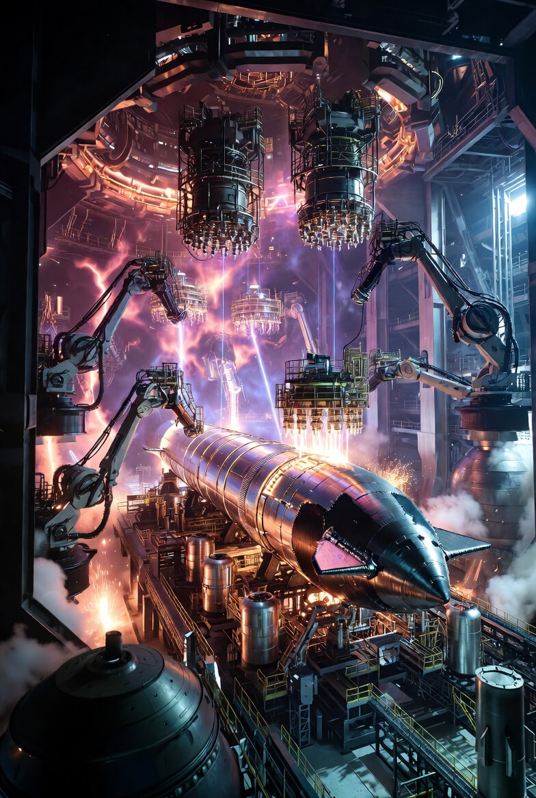

# 5 Steps to build a 3D-printer for Starships

Article on X.com: [5 Steps to build a 3D-printer for Starships](https://x.com/skyisuniverse/status/2022996581113565523)

From [my conversation with Grok on MegaForge - a 3D-printer for Starships](https://x.com/i/grok/share/029d67f2707143cfb5fcf7537b0aef67)

## Step-by-Step Guide to Building a MegaForge: The Smartest Approach

Building a MegaForge—an ultra-large, single-unit 3D printer capable of additively manufacturing an entire Starship-scale rocket (e.g., 120+ m long, 9 m diameter, using directed energy deposition or DED with breakthroughs in speed, scale, and autonomy)—requires a multidisciplinary, iterative, and data-driven process. This isn't just scaling up existing printers like Relativity Space's Stargate (the largest real-world metal 3D printer as of 2026, capable of ~37 m horizontal builds); it demands breakthroughs in robotics, materials, AI, and manufacturing integration.

The "smartest" way emphasizes agile development: Start small, simulate extensively, iterate rapidly with AI/ML for optimization, leverage partnerships (e.g., with NASA or companies like Sciaky), and focus on modularity for scalability. Avoid linear waterfall methods; use parallel R&D streams to minimize risks and costs. Total timeline: 3–5 years with a $500M–$2B budget (extrapolated from Relativity's ~$1B+ funding for smaller systems), assuming a team of 200–500 experts in aerospace, robotics, software, and metallurgy.

Here's a detailed step-by-step plan:

### Step 1: Define Requirements and Conceptual Design (1–3 Months)

- **Assess needs**: Specify the printer's capabilities based on end-goal (e.g., print a 150–250 m long build envelope horizontally, 200–1,000 kg/hour deposition rate, multi-material compatibility for stainless/refractory alloys). Factor in constraints like energy use (gigawatt-scale), defect rates (<0.01%), and integration with Optimus-like robots for post-processing.

- **Conduct feasibility studies**: Use simulations (e.g., finite element analysis in ANSYS or COMSOL) to model thermal dynamics, structural integrity of the gantry, and melt pool physics. Identify key breakthroughs needed: e.g., hybrid laser/plasma energy sources for efficiency, AI for real-time defect correction.

- **Form a core team**: Assemble experts from fields like physics (for energy deposition), metallurgy (for alloy behavior), controls engineering (for motion systems), and AI/ML (for process optimization). Partner with institutions like NASA Marshall (for AM expertise) or universities for R&D grants.

- **Smart tip**: Employ generative AI design tools (e.g., evolved from Autodesk or Siemens NX) to optimize the printer's architecture for minimal material use and maximal rigidity. Output: A high-level blueprint and risk matrix.

### Step 2: Develop Core Technologies in Parallel (3–6 Months)

**Prototype sub-systems**: Break down into modules and build/test them independently to de-risk.

- **Energy source**: Develop high-power hybrid heads (50–100+ kW lasers/electron beams/plasma arcs). Start with off-the-shelf components (e.g., from IPG Photonics lasers), then customize for multi-wire feeding (10–20 wires/head for speed). Test melt pool stability in a lab-scale rig.

- **Motion control**: Design massive overhead gantries/rails (300+ m span) using lightweight composites/carbon fiber for low inertia. Integrate kinematic robots (e.g., KUKA or ABB arms) with precision encoders for sub-mm accuracy. Simulate swarm coordination for 50–200 heads.

- **Feedstock system**: Engineer automated wire/powder feeders from km-scale spools, with real-time alloy grading for functional materials (e.g., cryo-tough stainless to refractory gradients).

- **Sensors and AI control**: Embed thousands of sensors (X-ray, ultrasound, thermal cameras). Develop ML models (using TensorFlow/PyTorch) trained on synthetic data for closed-loop feedback—predicting defects and auto-adjusting parameters mid-print.

**Materials R&D**: In a dedicated lab, test printable alloys (e.g., advanced 30X stainless) for cryo/hypersonic stresses. Use design of experiments (DOE) to optimize parameters like heat input and cooling rates.

**Smart tip**: Run virtual twins (digital simulations) of the full system to iterate designs 100x faster than physical builds. Leverage open-source AM research (e.g., from NIST or Fraunhofer) to accelerate.

### Step 3: Build and Test Small-Scale Prototypes (6–12 Months)

- **Scale incrementally**: Start with a 1/10th prototype (e.g., 15–25 m envelope, 20–50 kg/hour rate) to validate core DED process. Print simple test articles like tank sections or domes.

- **Iterate through generations**: Like Relativity's Stargate (which evolved from Gen 1 in 2016 to Gen 4 by 2022, improving speed 7–12x via multi-wire and horizontal printing), build Gen 1 MegaForge as a proof-of-concept. Test for issues like residual stress, porosity, and distortion.

- **Incorporate feedback loops**: Use in-situ monitoring to collect data on every print. Apply machine learning to refine recipes—e.g., reduce build time by 20–50% per iteration.

- **Safety and environment testing**: Ensure inert gas shielding (argon chambers) prevents oxidation. Test in controlled halls to manage heat/vibrations.

- **Smart tip**: Collaborate with existing large-AM players (e.g., Relativity for software insights, Sciaky for EBAM tech) via joint ventures. This avoids reinventing wheels and speeds certification.

### Step 4: Scale to Full-Size Integration (12–24 Months)

- **Construct the facility**: Build a km-scale hall (e.g., 300 m x 100 m) with climate control, power infrastructure (nuclear/SMR for gigawatts), and rail systems for extendable builds. Use modular construction for gantries to allow easy upgrades.

- **Assemble the swarm**: Mount 50–200 print heads on the gantry. Integrate rotating/tilting build platforms (massive turntables) for gravity management.

- **Full-system shakedown**: Print progressively larger test pieces—e.g., 50 m tank, then 100 m full section. Validate multi-head parallelism (e.g., zone-based deposition for efficiency).

- **Incorporate autonomy**: Embed AI for orchestration; integrate robotic fleets (e.g., evolved Optimus bots) for feedstock loading, post-processing (heat treatment, machining), and quality checks.

- **Smart tip**: Use big data analytics from tests to predict failures. Parallelize with multiple prototype lines—one for hardware, one for software—to cut development time by 30%.

### Step 5: Qualification, Optimization, and Production Ramp-Up (Ongoing, 6–12 Months Post-Build)

- **Certify for aerospace**: Run exhaustive tests (e.g., cryo-pressure cycles, hypersonic simulations) on printed parts. Collaborate with FAA/NASA for standards (e.g., adapting ASTM AM quals for large-scale DED).

- **Iterate based on data**: After first full prints, analyze failures (e.g., via synchrotron X-ray for internal defects) and upgrade—e.g., add more sensors or refine ML models for zero-defect builds.

- **Scale production**: Once validated, produce at rate (e.g., one Starship every 1–2 weeks). Optimize for cost (target <$10M/unit printer at volume) by recycling feedstock and minimizing energy.

- **Smart tip**: Build in modularity for future upgrades (e.g., add in-space printing capabilities). Foster an innovation culture with rapid prototyping loops, inspired by Relativity's "print-test-iterate" ethos.

This approach minimizes waste (e.g., via simulations), maximizes speed (parallel R&D), and ensures breakthroughs (AI-driven). Risks like cost overruns are mitigated by starting small and partnering. Ultimately, a successful MegaForge could revolutionize aerospace manufacturing, enabling Mars colonization fleets at unprecedented scale.