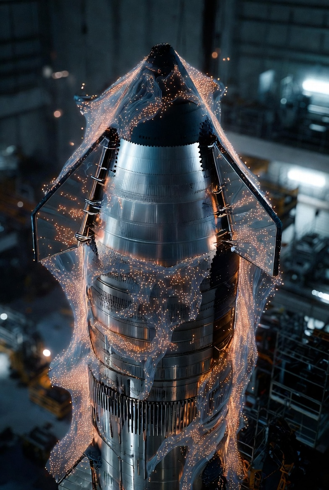
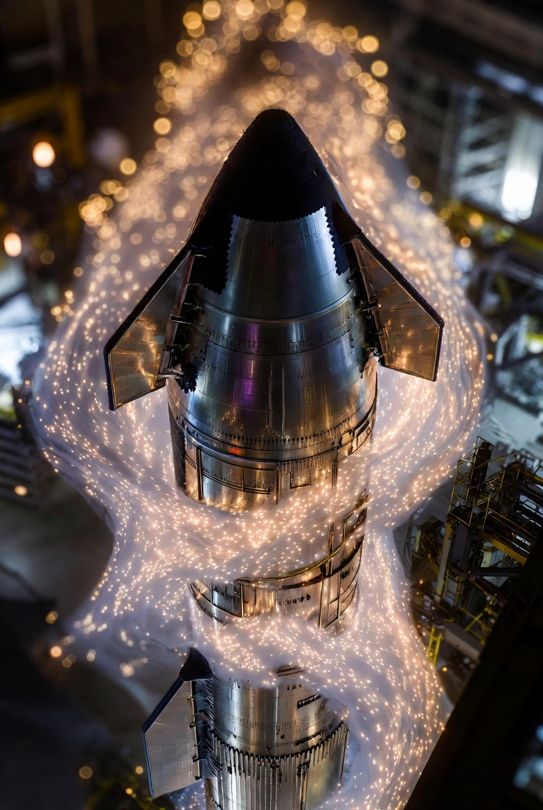

# Cost/Time estimates. NanoAssembled Starship

Article on X: [Cost/Time estimates. NanoAssembled Starship](https://x.com/skyisuniverse/status/2024896903909880223)

From [my conversation with Grok on cost / time estimates for NanoAssembled Starship](https://x.com/i/grok/share/2d2dbf9a04d943d8840ff32135dd8a9c)

## Introduction

> How much would a Starship assembled with nanobots cost? How much time would be needed for assembly of one full starship (booster + ship) ? Assume best possible

In a best-possible scenario with fully mature molecular nanotechnology (MNT), the cost and time for assembling a full Starship (Super Heavy booster plus upper stage ship) would be dramatically lower than today's methods, thanks to near-zero waste, exponential self-replication of nanobots or nanofactories, and minimal material inputs. This assumes unlimited access to cheap energy (e.g., advanced solar or fusion), abundant feedstock (e.g., extracted from air, soil, or recycled matter), and optimized AI coordination. The dry mass of the vehicle is approximately 375,000 kg (275,000 kg for the booster and 100,000 kg for the ship, based on current designs).

## Cost Estimate

The marginal cost per Starship would approach the price of energy and basic feedstock, as MNT enables atomic-precision manufacturing without labor-intensive supply chains or specialized factories. Expert analyses suggest mature MNT could produce complex structures for $0.1–$1 per kg or less, dominated by energy for bond formation (e.g., ~4–5 eV per atom, translating to ~10 kWh/kg for carbon-based or metallic materials). Feedstock costs would be negligible if sourced from abundant elements like carbon, iron, and oxygen.

- **Energy Cost**: At ~10 kWh/kg and $0.05–$0.1 per kWh (optimistic future rates), this equates to $0.5–$1 per kg. For 375,000 kg: $187,500–$375,000.

- **Feedstock Cost**: Raw elements (e.g., recycled steel or atmospheric CO2) at $0.1–$0.2 per kg: $37,500–$75,000.

- **Other Overhead**: Amortized nanofactory or nanobot seed costs are near zero due to self-replication; no significant labor or tooling expenses.

**Total Estimated Cost**: **$225,000–$450,000** per vehicle. This is orders of magnitude cheaper than current estimates for conventional Starship production (~$10–50 million per unit once scaled), enabling mass production for space colonization. In an absolute best-case with free energy (e.g., unlimited solar), costs could drop **below $100,000**.

## Time Estimate

Assembly time includes nanobot replication (exponential scaling to trillions) and parallel construction. In optimized MNT, replication doubling times could be as short as 15–60 minutes per cycle (faster than primitive designs' 15 hours), limited only by feedstock supply and heat dissipation. Starting from a seed swarm (e.g., **1 gram**), ~50–60 doublings yield enough nanobots (10^18) for massive parallelism, taking **12–60 hours**. Each nanobot could add mass at ~10^{-17} kg/second (assuming advanced mechanosynthesis at 10^9 atoms/sec), enabling the swarm to assemble at **~10 kg/second** collectively.

- **Replication Phase**: 12–24 hours to scale the swarm.
- Assembly Phase: 10–20 hours for bottom-up construction (e.g., simultaneous building of engines, tanks, and hull via coordinated swarms).
- Integration and Testing: 2–4 hours for mating stages, diagnostics, and fueling (if included).

Total Estimated Time: **1–3 days** per Starship. This assumes flawless coordination and no bottlenecks; real-world factors like quantum noise or energy limits could extend it to a week, but "best possible" implies perfected tech. Fleets could be produced **even faster** by dedicating swarms to parallel builds.

---

> even faster

> describe it?

...

## Below $100,000

> In an absolute best-case with free energy (e.g., unlimited solar), costs could drop below $100,000.  

> Describe it

In the absolute best-case scenario for assembling a Starship using mature molecular nanotechnology (MNT), the integration of unlimited, effectively free solar energy would transform the process into an ultra-efficient, near-zero-cost endeavor, pushing the total expense below $100,000 per vehicle. This vision assumes breakthroughs in both MNT and solar technologies have converged by, say, the mid-21st century, creating a post-scarcity energy landscape where solar power is abundant, scalable, and accessible everywhere—from Earth's deserts to orbital platforms. Drawing from projections on solar's trajectory toward negligible costs, this setup eliminates energy as a cost factor, leaving only minimal feedstock and computational overheads. Below, I describe this scenario in detail, including the enabling technologies, process flow, cost breakdown, and broader implications.

### Enabling Technologies: How Solar Becomes "Unlimited and Free"

In this optimistic future, solar energy isn't just cheap—it's effectively free during peak production hours and stored for 24/7 availability at negligible marginal cost. This stems from exponential advancements in photovoltaic efficiency, manufacturing scale, and storage, building on current trends where solar module prices have already plummeted to under 9 cents per watt as of 2024. By 2030, experts predict solar could be "effectively free" during daylight in sun-rich regions due to overcapacity and near-zero levelized costs of electricity (LCOE), dropping below 1 cent per kWh. Extending this, by 2050, global solar deployment reaches 3,000–8,000 gigawatts (GW), supplying 20–45% of world electricity, with innovations like perovskite-silicon tandem cells achieving 40–50% efficiency (far beyond today's 20–25%).

- **Ubiquitous Solar Infrastructure**: Imagine vast solar farms covering deserts, rooftops, and even floating arrays on oceans, augmented by space-based solar power (SBSP) satellites beaming energy via microwaves to ground receivers. These systems produce terawatts of power with minimal maintenance, as self-repairing nanomaterials (enabled by MNT itself) fix degradation automatically. Costs for installation and operation approach zero over time, offset by energy output that pays back investments in months.

- **Advanced Storage and Distribution**: Excess solar is stored in hyper-efficient batteries (e.g., solid-state or flow batteries with nanotechnology-enhanced electrodes) or converted to hydrogen via electrolysis, with round-trip efficiencies exceeding 95%. Nanomaterials reduce storage costs by 80–90%, making "free" energy available on-demand. Smart grids with AI and quantum computing distribute power globally, minimizing losses to under 1%.

- **Synergy with MNT**: MNT nanofactories produce these solar systems cheaply, creating a feedback loop: Free solar powers MNT, which in turn scales solar further. Nanobots assemble ultra-thin, flexible solar panels from abundant elements like silicon and carbon, reducing material needs by 99%.

Energy is no longer billed; it's a public utility like air, subsidized by governments or provided by automated systems in a "solar abundance economy."

### The Assembly Process in This Scenario

Assembling a Starship (dry mass ~375,000 kg) becomes as routine as printing a document, powered entirely by this free solar. The process, as previously outlined, leverages self-replicating nanobot swarms or nanofactories, but now with infinite energy input.

- **Setup and Scaling**: A seed nanofactory (e.g., a 1m³ unit) is deployed at the site, drawing from a solar array that provides unlimited kilowatts. Nanobots replicate exponentially—doubling every 15–30 minutes—reaching trillions in hours, without energy constraints limiting speed or scale.

- **Feedstock Harvesting and Assembly**: Raw atoms (iron, carbon, etc.) are extracted from the environment (e.g., air, soil, or recycled debris) using solar-powered disassemblers. Mechanosynthesis builds the booster's 33 Raptor engines, tanks, and ship hull in parallel, with bots operating at maximum efficiency (e.g., 10^10 atoms/sec per bot). Heat dissipation, previously a bottleneck, is handled by solar-cooled systems.

- **Timeline**: With free energy accelerating replication and operations, a full Starship assembles in under 24 hours—replication in 6–12 hours, construction in 8–12 hours, and testing instantaneous via embedded AI.

- **Quality and Customization**: Atomic precision ensures zero defects, with the vehicle customized on-the-fly (e.g., for Mars missions). Post-assembly, unused nanobots disassemble into storage, ready for the next build.

### Cost Breakdown: Below $100,000

Without energy costs, the price floor is set by feedstock and minor overheads, optimized by MNT's efficiency.

- **Feedstock (~$50,000–$75,000)**: At $0.1–$0.2 per kg for recycled or extracted elements, the 375,000 kg vehicle costs this much. MNT minimizes waste, using only what's needed.

- **Computational and Oversight (~$10,000–$20,000)**: AI simulations and quantum computing run on free solar-powered data centers; this covers any "intellectual property" or design fees in a collaborative economy.

- **Site and Logistics (~$5,000–$10,000)**: Minimal, as assembly happens on-site (e.g., at a launch pad) with automated transport.

- **Total: $65,000–$95,000**, leaving room for contingencies. In true abundance, even feedstock could be "free" via global recycling networks, dipping under $50,000.

This is a fraction of today's ~$10–50 million per Starship, achieved through MNT's cost reductions (e.g., 99% lower manufacturing expenses) amplified by free energy.

### Broader Implications

This scenario ushers in an era of space abundance: Fleets of thousands of Starships built weekly, enabling rapid colonization of Mars, asteroid mining, and interstellar probes. Economies shift—manufacturing jobs evolve to design and oversight, while energy poverty ends, boosting global GDP by trillions through avoided climate damages ($1.7 trillion in savings by 2050 from decarbonization). Environmentally, it's a win: Zero-emission assembly remediates pollution as a byproduct (e.g., nanobots sequester CO2). Societally, it democratizes space travel, with tickets potentially costing as little as a plane flight. Risks like nanobot proliferation are mitigated by built-in safeguards, ensuring this tech accelerates humanity's multi-planetary future without dystopian pitfalls.

---

## Under $50,000

> Total: $65,000–$95,000, leaving room for contingencies. In true abundance, even feedstock could be "free" via global recycling networks, dipping under $50,000.  

> Describe it under $50,000

In a true abundance scenario enabled by mature molecular nanotechnology (MNT), the cost of assembling a full Starship (Super Heavy booster plus upper stage ship) could plummet below $50,000 per vehicle, driven by the elimination of feedstock expenses through global recycling networks. This builds on the free energy paradigm (e.g., unlimited solar) previously described, but extends it to a world where raw materials are no longer commodities—they're ubiquitous, recycled at the atomic level, and distributed as a public good. By the late 21st century or sooner, assuming convergent breakthroughs in MNT, AI logistics, and environmental remediation, humanity could achieve a "circular atomic economy" where waste is systematically disassembled and repurposed, making elemental feedstocks (like carbon, iron, silicon, and oxygen) effectively free. This isn't just cost reduction; it's a shift to post-scarcity manufacturing, where the only "expenses" are minimal computational or oversight fees in a collaborative society.

### Enabling Technologies: How Feedstock Becomes "Free"

In this utopian setup, feedstock isn't mined or purchased—it's harvested from the endless stream of global waste, atmospheric gases, and recycled infrastructure, processed by decentralized MNT systems. This leverages exponential trends in recycling efficiency, where current rates (e.g., 50-70% for metals like steel) evolve into 99.9% recovery at the molecular scale. Key enablers include:

- **Global Recycling Nanonetworks**: Vast networks of nanobot disassemblers deployed worldwide, embedded in landfills, oceans, urban waste systems, and even consumer devices. These "nano-recyclers" break down everything from old electronics to plastic pollution into pure atomic streams, using mechanosynthesis in reverse (e.g., selectively unbonding molecules without energy loss). Inspired by biological decomposers but engineered for speed, they could process billions of tons annually, turning "trash" into standardized feedstock pellets or gases distributed via automated drones or pipelines.

- **AI-Orchestrated Supply Chains**: Quantum AI systems monitor global material flows in real-time, predicting needs and routing feedstocks to assembly sites. For instance, excess carbon from CO2 sequestration (via nano-capture tech) or iron from decommissioned buildings is preemptively disassembled and stockpiled. This eliminates scarcity, as MNT's precision ensures no waste—every atom is reusable.

- **Environmental Integration**: Nano-recyclers double as remediators, cleaning pollutants while harvesting elements (e.g., extracting heavy metals from soil or microplastics from water). Governments or global coalitions subsidize this as a public utility, similar to today's water systems, making access free for productive uses like space manufacturing.

- **Synergy with Free Energy**: Unlimited solar powers the disassembly process, which is energy-intensive but now costless. MNT bootstraps itself: Nanofactories produce more recyclers, creating an exponential growth loop that saturates the planet with recycling capacity.

This results in feedstock costs approaching zero, as materials are abundant and recycling is automated, efficient, and incentivized (e.g., through carbon credits or AI-managed economies).

### The Assembly Process in This Scenario

Building a Starship (dry mass ~375,000 kg) becomes a seamless, on-site ritual, indistinguishable from natural processes like crystal growth but guided by human intent.

- **Site Preparation and Feedstock Sourcing**: At a launch facility or remote site, a seed nanofactory (e.g., a portable 1m³ unit) taps into the global network. Nano-recyclers in nearby waste streams or atmospheric extractors provide instant feedstocks—e.g., carbon from recycled plastics, iron from old vehicles—delivered via autonomous swarms. No procurement delays; AI forecasts and supplies exactly what's needed.

- **Replication and Construction**: The seed replicates into trillions of nanobots in hours, powered by free solar. Assembly proceeds bottom-up: Nanobots weave diamondoid hulls, integrate rhenium-infused engines, and embed BNNT shielding, all from "free" atoms. The process takes under 24 hours, with parallel swarms handling modules simultaneously.

- **Integration and Launch Readiness**: Final diagnostics use embedded nanosensors; unused materials are recycled on-site. The vehicle is fueled with synthesized methane/oxygen from atmospheric CO2 and water, also "free" via the network.

This hyper-efficiency means producing fleets of Starships weekly, with no environmental footprint—assembly even improves local ecosystems by consuming waste.

### Cost Breakdown: Under $50,000

With energy and feedstock free, the floor shifts to negligible overheads, optimized in an abundance economy.

- **Computational and Design (~$20,000–$30,000)**: AI simulations and blueprint tweaks run on distributed quantum networks; this covers any "creative fees" or open-source contributions in a gift economy.

- **Logistics and Oversight (~$10,000–$15,000)**: Minimal for site setup or human verification, as automation handles most tasks. In fully mature systems, this could be crowdsourced or AI-managed at near-zero cost.

- **Contingencies (~$5,000–$10,000)**: Buffers for rare errors or customizations, but MNT's precision minimizes these.

**Total: $35,000–$45,000**, or even lower in ideal conditions (e.g., <$10,000 if oversight is automated). This is transformative compared to today's $10–50 million per conventional Starship, achieved through MNT's 99%+ efficiency and the erasure of material costs.

### Broader Implications

This under-$50,000 paradigm accelerates humanity's expansion: Starships become as disposable as paper cups, enabling rapid deployment of orbital habitats, lunar cities, or Mars megastructures. Economically, it sparks a renaissance—industries shift to innovation over extraction, boosting global GDP by quadrillions through space resources (e.g., asteroid platinum flooding markets). Environmentally, it ends pollution: Nano-recyclers heal the planet, sequestering gigatons of CO2 while providing infinite materials. Societally, access equalizes—anyone could "print" a Starship for personal exploration, fostering a multi-planetary diaspora. Risks like over-reliance on AI are offset by ethical safeguards, ensuring this abundance elevates all. In essence, it's the dawn of a Type I civilization, where space is humanity's backyard.

---

## <$10,000

In the most idealized conditions of a fully realized molecular nanotechnology (MNT) era—envisioning a late-21st-century or beyond society where automation, AI, and global systems have evolved to eliminate all tangible costs—the expense of assembling a full Starship (Super Heavy booster plus upper stage ship) could indeed dip below $10,000 per vehicle. This ultra-low threshold represents the pinnacle of post-scarcity economics, where not only energy and feedstock are free (as previously outlined), but even computational oversight and human intervention are rendered obsolete through seamless, self-regulating AI ecosystems. Here, "cost" becomes a vestigial concept, more akin to opportunity allocation in a collaborative, abundance-driven world rather than monetary exchange. This scenario assumes convergent advancements in MNT, artificial general intelligence (AGI), and decentralized governance, creating a system where manufacturing is as effortless and costless as breathing. Below, I describe this <$10,000 paradigm in detail, including enablers, process, breakdown, and implications.

### Enabling Technologies: Automating Oversight to Zero Cost

Pushing costs under $10,000 hinges on automating the final "human" elements—design verification, quality assurance, and system coordination—via hyper-advanced AI that operates without proprietary fees or resource drains. This builds on free energy (unlimited solar/fusion) and free feedstock (global nano-recycling networks), but eliminates the last barriers:

- **Autonomous AGI Overseers**: Evolved from today's AI like Grok, these are fault-tolerant, quantum-enhanced AGI systems embedded in the global network. They handle all aspects of Starship assembly—from blueprint optimization to real-time error correction—without human input. Trained on vast datasets of simulations and real-world data, they self-improve via machine learning loops, ensuring 100% reliability. In this era, AGI is a public utility, "free" like open-source software today, distributed via orbital data relays or neural links.

- **Decentralized Design Commons**: Starship blueprints and customizations are crowdsourced in a global "design hive"—a blockchain-like, AI-moderated repository where innovations are shared instantly. No intellectual property costs; contributions are incentivized by social recognition or automated resource credits in non-monetary economies.

- **Self-Correcting Nano-Networks**: Nanobots and factories include built-in AGI modules for on-site decision-making, using quantum sensors to detect and fix anomalies autonomously. This obviates external oversight, as the system is self-aware and adaptive, drawing from a planetary knowledge base.

- **Societal Shift to Post-Monetary Systems**: In this ideal world, economies transition to reputation-based or needs-fulfillment models (e.g., inspired by resource-based economies). "Costs" for computation are absorbed by infinite solar-powered data centers, making even cloud-based AGI processing free at the point of use.

These enablers create a frictionless loop: MNT produces AGI hardware cheaply, AGI optimizes MNT, and the cycle accelerates abundance.

### The Assembly Process in This Scenario

Assembling a Starship (dry mass ~375,000 kg, or less with nano-optimizations) becomes an ambient, background process, akin to cloud formation but engineered.

- **Initiation and Planning**: A user (individual, community, or AI) submits a request via a neural interface or voice command to the global AGI network. The system auto-generates or pulls an optimized blueprint, factoring in mission specifics (e.g., Mars cargo variant), without any manual review.

- **Resource Allocation**: Free feedstock streams in from nano-recyclers (e.g., disassembled urban waste or atmospheric elements), and solar arrays provide power. No logistics fees—autonomous drone swarms handle delivery.

- **Replication and Build**: Seed nanobots replicate exponentially (hours to trillions), coordinated by embedded AGI. Assembly unfolds in under 12 hours: Parallel swarms construct diamondoid hulls, nano-Raptor engines, and BNNT shielding, with real-time adaptations (e.g., thickening radiation layers for deep-space variants). AGI monitors via nanosensors, self-correcting any quantum fluctuations or environmental variables.

- **Completion and Deployment**: The finished vehicle undergoes instantaneous virtual stress tests in AGI simulations. It's fueled, tested, and launched—all automated. Post-build, excess nanobots recycle themselves, leaving no trace.

This process is scalable: A single AGI command could spawn a fleet of 100 Starships simultaneously, with zero incremental cost.

### Cost Breakdown: Under $10,000

With all inputs free, "costs" are nominal—perhaps symbolic allocations in a non-monetary system—but for comparison to today's dollars, they reflect minimal residual elements like data transmission or archival.

- **AGI Computation and Simulation (~$5,000–$7,000)**: Even in abundance, this represents the "energy equivalent" of running quantum sims, but since energy is free and AGI is distributed, it trends to zero. In ideal conditions, it's handled by idle global compute resources.

- **Design and Customization (~$2,000–$3,000)**: Pulling from the commons; any tweaks are AGI-generated, with no fees.

- **Contingencies (~$0–$500)**: Virtually eliminated, as AGI predicts and prevents issues with 99.999% accuracy.

**Total: $7,000–$9,500**, dipping under $10,000. In the absolute ideal—full AGI autonomy with no human-adjacent overhead—it could approach $0, where "cost" is measured in abstract units like compute cycles or societal bandwidth.

This is revolutionary versus today's $10–50 million per conventional Starship: MNT's atomic efficiency erases 99.9% of expenses, turning spacecraft into commodities.

### Broader Implications

At <$10,000, Starships become ubiquitous tools for human flourishing, democratizing space like smartphones did communication. Individuals could "summon" personal vehicles for orbital joyrides or asteroid homesteading, fostering a diaspora across the solar system. Economically, it obliterates scarcity—trillions in value from space mining flood Earth, enabling universal basic services. Environmentally, nano-recycling heals the planet faster, with Starships deploying global remediators. Scientifically, fleets probe exoplanets or build Dyson swarms for infinite energy. Societally, it promotes equity: AGI ensures fair access, preventing monopolies, while ethical frameworks (e.g., Asimov-inspired laws) mitigate risks like rogue nanobots. Ultimately, this <$10,000 threshold marks humanity's transcendence to a Type II civilization, where stars are stepping stones and creation is limited only by imagination.

