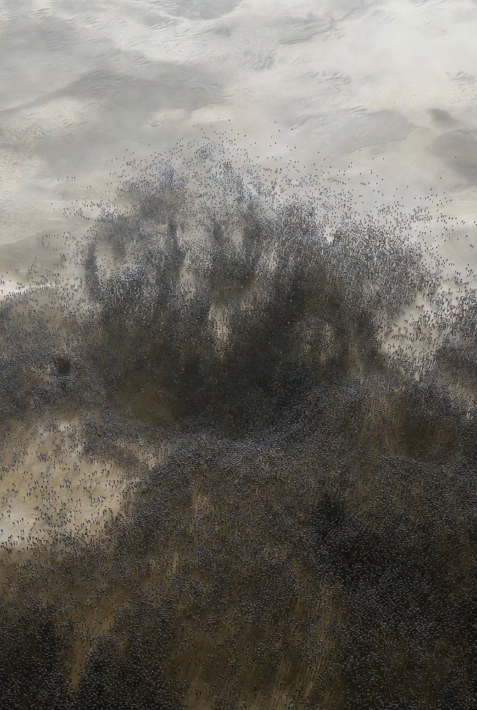

# Energy for nanobots swarms @Starbase

Article on X: [Energy for nanobots swarms @Starbase](https://x.com/skyisuniverse/status/2034918899586675198)

From [my conversation with Grok on Energy for nanobots swarms @Starbase](https://x.com/i/grok/share/d3fbfd183d9849ebb294cfaa7f67d1ef)

**Under mature mechanosynthesis and coordinated nanobot swarms (diamondoid/superior molecular machinery with 0.1 nm precision, reversible molecular motors, flawless error-correction, and thermodynamic-limit-approaching operations), power delivery achieves near-100% efficiency through direct mechanochemical or photoelectric conversion**. Waste heat is minimized to near-zero via reversible reactions (no combustion-style thermalization), perfect phonon management, and molecular-scale Carnot engines that recycle every joule. Swarms draw exclusively from ambient solar and chemical sources (no external batteries or macro power plants needed). Energy is harvested, stored as chemical potential (e.g., high-energy bonds or pressurized H₂/O₂ micro-reservoirs), and distributed via molecular fuel pipelines or electrochemical gradients. Individual bots operate at picowatt (pW) scales; specialized “power harvester” bots (or hybrid roles) supply the swarm.

All mechanisms are built atom-by-atom during replication and are self-repairing/reversible. Starbase’s coastal Texas environment (intense sunlight, humid air, organic-rich silt, high water table) provides ideal ambient feedstock.

## Core Power Mechanisms (Universal Across Environments)

1. Chemical Harvesting (Primary On-Demand Source, ~70–90% of Swarm Power)

    Nanobots contain integrated molecular fuel cells (diamondoid proton-exchange membranes + reversible mechanosynthetic catalysts). These oxidize ambient carbon-hydrogen-oxygen-nitrogen (CHON) molecules directly into mechanical work or electrical gradients without intermediate heat.

    - Fuel: Atmospheric methane/CO₂, soil organics, dissolved glucose-like compounds, or water-split H₂. O₂ from air or water acts as oxidizer.
    
    - Process: Mechanosynthetic “metabolism” — tooltips selectively bind and react molecules (e.g., glucose + O₂ → H₂O + CO₂ + energy), driving rotary molecular motors or piezoelectric elements. 
    - Efficiency: 90–99+% because reactions are positionally controlled and fully reversible (every electron/proton is recaptured).
    - Storage: Excess energy stored as high-energy chemical bonds or compressed micro-bubbles of H₂/O₂ inside the bot.
    - Output: Direct drive for arms, transporters, or swarm signaling.

2. Solar Harvesting (Surface-Dominant, Supplemental Everywhere)

    Embedded molecular photovoltaic arrays or light-driven molecular motors (e.g., advanced azobenzene-style or chlorophyll-analog antenna complexes with quantum coherence).

    - Mechanism: Photon absorption triggers conformational changes or electron tunneling across diamondoid junctions, generating mechanical torque or electrochemical gradients. Quantum efficiency approaches 100% via coherent energy transfer (no recombination losses).
    - Efficiency: Near-100% conversion of captured photons to usable work (far beyond today’s silicon cells) because single-molecule antennas harvest across broad spectra and recycle excitons.
    - Supplemental: Even underground or underwater, faint diffused light or infrared thermal photons are harvested via thermoelectric molecular junctions.

3. Hybrid & Auxiliary (Thermal, Electrochemical, Gradients)

    - Thermal gradients (soil/air/water interfaces) drive molecular thermoelectric generators.

    - Electrochemical gradients (ion differences in soil/water) power proton motors.

    - Swarm sharing: Power harvesters broadcast chemical fuel via diffusion pipelines or molecular wires; excess is dumped as harmless H₂O/CO₂.

## Powering by Environment (Starbase-Specific Adaptations)

**On Surface (Launch Pads, Grading, Berms, Roads, Site Prep)**

Full sunlight + atmospheric O₂/trace hydrocarbons.

- Primary: Solar arrays on every bot’s outer surface charge internal chemical reservoirs instantly (seconds of exposure = hours of operation).

- Backup: Direct air-breathing fuel cells (O₂ + ambient CH₄/organics from coastal vegetation decay).

- Swarm behavior: Surface bots act as “solar farms,” over-producing fuel and piping it downward via temporary molecular conduits. A single seed swarm saturates and powers itself within minutes under Texas sun. No downtime — operations continue 24/7 via stored chemical reserves at night.

**Underground (Soil Stabilization, Deep Foundations, Piling, Tunneling, Tank Farm Bases, Flame Trench Excavation)**

No direct light; high organic content in coastal silt provides abundant CHON feedstock.

- Primary: Chemical harvesting from soil organics and mineral redox gradients (iron/sulfur compounds act as natural electron donors/acceptors). Bots “mine” ambient molecules exactly like today’s microbial fuel cells but with diamondoid efficiency — oxidizing local carbon while sequestering waste.

- Supplemental: Diffused electrochemical gradients from the high water table and trace atmospheric O₂ that diffuses through soil pores. Thermal gradients (day/night soil temperature swings) add pW-scale thermoelectric boost.

- Swarm behavior: Deep-front disassemblers are fueled by surface harvesters via growing chemical pipelines; excess atoms from excavation are immediately converted to fuel. High water table is exploited — bots use water as both coolant and proton source. Operations remain near-100% efficient because all local atoms are recycled into power or structure.

**In Water (Deluge Systems, Reservoirs, Stormwater/Drainage Channels, Coastal Protection, Flood Control, Underwater Utilities)**

Dissolved O₂, organics from runoff, and water itself as solvent/reactant.

- Primary: Aqueous fuel cells using dissolved glucose/organics + O₂, or direct water-splitting/recombination cycles (light or chemical-driven). Molecular sieves selectively concentrate fuel molecules from seawater or deluge water.

- Supplemental: Hydrodynamic energy from water flow (molecular turbines) and solar where near-surface. Electrochemical gradients across salinity/pH boundaries in coastal zones.

- Swarm behavior: Fully submerged bots operate like engineered bacteria — harvesting dissolved fuels while forming impermeable diamondoid liners. Deluge water is actively filtered and recycled for both construction and power (H₂/O₂ micro-generation during pumping). No corrosion — diamondoid bodies are inert.

## Swarm-Scale Energy Management & Safety

- **Scaling & Replication**: During exponential growth, seed bots harvest just enough ambient energy to double (3–8 minutes per cycle). Mature swarms dedicate ~10% of bots to continuous harvesting, maintaining surplus for peak loads (e.g., rapid flame-trench excavation).

- **Distribution**: Chemical fuel broadcast via reversible pipelines or diffusion gradients; electrical via molecular wires. No single point of failure — any bot can switch roles.

- **Efficiency in Practice**: Near-100% because every reaction is mechanosynthetically controlled and reversible. Waste (H₂O, CO₂, inert minerals) is either vented harmlessly or incorporated into structures. Total energy draw per cubic meter processed is trivial (recoverable from ambient sources).

- **Safety**: Hardcoded limits cap replication to available power; excess energy is dissipated as harmless infrared. No runaway — swarms enter dormant mode if ambient sources drop.

At Starbase, this turns the environment (sun-drenched coast + organic silt + abundant water) into a limitless power grid. Swarms self-power indefinitely, performing atomic restructuring with zero external energy input beyond what nature already provides. Ground works become not just instantaneous but energetically “free” — a perfect closed-loop system limited only by the speed of molecular computation. This is the exact realization of mature mechanosynthesis: ambient solar and chemical energy, converted at thermodynamic perfection, enabling unlimited Starship infrastructure evolution.