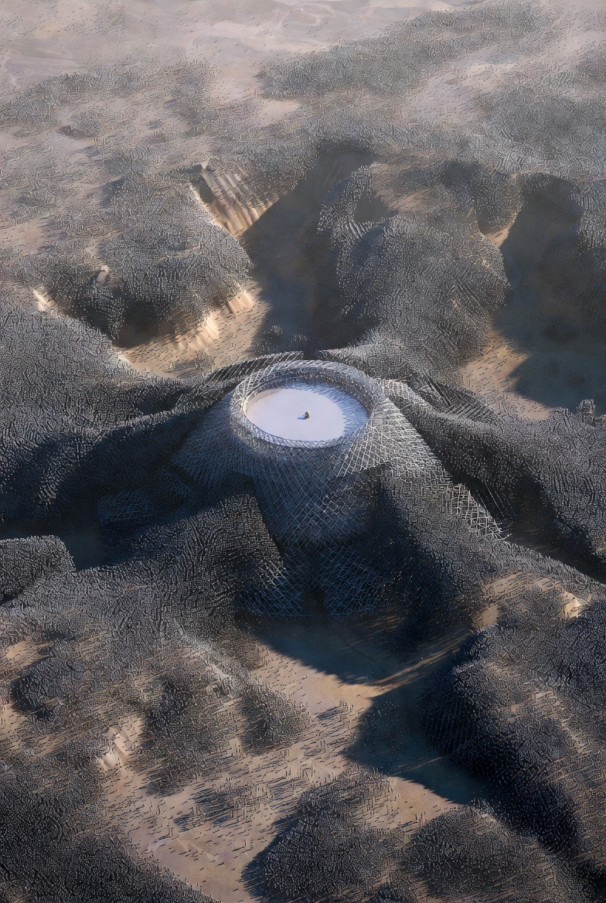

# Ground works flow with Nanobot Swarms applicable at Starbase

Article on X: [Ground works flow with Nanobot Swarms applicable at Starbase](https://x.com/skyisuniverse/status/2034902176397394409)

From [my conversation with Grok on Ground works flow with Nanobot Swarms applicable at Starbase](https://x.com/i/grok/share/c6de68006130490b9915f0360c8847ad)

<!--  -->

## Introduction

**Under mature mechanosynthesis and coordinated nanobot swarms (enabled by best-possible scientific breakthroughs: diamondoid or superior molecular machinery, positional control at ~0.1 nm precision, exponential yet fully programmable replication, hierarchical AI coordination, near-100% energy efficiency from ambient chemical/solar harvesting, reversible operations, and flawless error-correction/self-repair), ground works at Starbase are performed through in-situ atomic restructuring of local coastal sand, silt, clay, water, and air molecules**. The process draws directly from K. Eric Drexler’s machine-phase nanotechnology (mechanosynthesis via molecular tooltips guiding reactions in a controlled “machine-phase” environment) and J. Storrs Hall’s utility-fog concepts (swarms of reconfigurable micro-robots that dynamically form structures). Breakthroughs beyond 1992 Nanosystems allow safe, broadcast-controlled exponential swarms that converge into macro-scale products via hierarchical assembly while integrating ISRU (in-situ resource utilization) at the atomic level.

All operations follow one unified workflow. Specialized nanobots (~1–100 nm scale, diamondoid bodies with multiple mechanosynthetic arms, transporters, sensors, and molecular motors) operate in three roles: disassemblers (break bonds), **transporters** (sort and move atoms/molecules via conveyor-like pipelines they self-build), and **assemblers** (place atoms with positional precision). Swarms form a diffuse “front” that advances through soil like a programmable molecular wave.

## Exact Step-by-Step Process (Applies to Every Type of Starbase Ground Work)

### 1. Seed Deployment & Activation (seconds to minutes)

A small seed canister (grams to a few kg of initial bots or pre-assembled “nanofactory” modules) is delivered by drone, Starship cargo, or printed on-site. Activation occurs via a broadcast radio/optical/chemical signal or solar exposure. The seed contains master blueprints (digital atomic specifications) for the target structure — e.g., exact geometry of a Stage 0 V2 flame trench, double-sided water-cooled diverter with ridge, multi-point deluge manifolds, OLM base anchors, or full tank-farm foundations.

### 2. Exponential Replication & Specialization (30–120 minutes)

Bots use local feedstock (Starbase’s sandy/silty regolith provides Si, O, Al, Fe; air/water supply C, H, N; trace metals extracted selectively). Mechanosynthetic tooltips (Drexler-style carbon or silicon-based “hands”) break and reform bonds atom-by-atom to duplicate themselves. Doubling time: ~3–8 minutes under best-case energy/thermal management. Replication halts automatically at target density (trillions–quadrillions of bots saturating the site volume) via global “stop” signals. Bots then differentiate: 40% disassemblers, 30% assemblers, 20% transporters, 10% coordinators/sensors. Energy is harvested from ambient chemical gradients or beamed wireless power.

### 3. Atomic Mapping & Planning (overlaps with replication, ~15–60 minutes)

Scout bots diffuse through soil, performing real-time 3D tomography (chemical, acoustic, and quantum sensing). A distributed swarm intelligence + central AI (ground or orbital) generates an exact atomic model of the site, accounting for high water table, soft silt/sand, existing structures, and Starship requirements (33 Raptor thrust, exhaust plume dynamics, 422,000+ gallon deluge capacity, hurricane resilience).

### 4. Parallel Disassembly–Transport–Reassembly Fronts (core execution, hours)

Disassemblers advance in coordinated waves, selectively breaking Si–O, Al–O, and other bonds in target volumes (e.g., excavating the precise “bathtub” flame trench shape). Atoms are sorted on-the-fly (carbon stockpiled for diamondoid; silicon for SiC refractories; water molecules sequestered or redirected). Transporters form self-assembling molecular pipelines or conveyor belts to move feedstock exactly where needed. Assemblers place atoms into new lattices:

- Diamondoid or sapphire composites for ultra-strong, self-sensing foundations (replacing today’s 22 m CFA piles and sheet piling).

- Gradient refractory layers (high-temperature-facing diamondoid/SiC with phonon-engineered cooling microchannels inside).

- Embedded active elements: molecular pumps, hydrophobic/hydrophilic zones, sensors, propellant lines, electrical conduits — all formed seamlessly in one pass.

- Operations are fully reversible; any mistake is disassembled and corrected in real time.

### 5. Integrated Water Management & Environmental Adaptation (simultaneous, adds 0–15 minutes)

High water table is handled by creating atomically perfect impermeable molecular barrier membranes (hydrophobic diamondoid sheets) around the entire work zone. Groundwater is actively pumped or molecularly transported away (via embedded sieves and motors) into temporary reservoirs or recycled. Deluge systems are built as seamless high-flow networks: underground 422k+ gallon reservoirs, manifolds delivering 75k–200k+ gallons per minute from multiple points (flame bucket halves, cooled ridge apex, OLM deck plate, and sidewalls). Cooling channels are micro-engineered for perfect heat transfer, far superior to today’s stainless-steel cladding. Stormwater/flood berms are reshaped with self-healing, erosion-proof lattices.

### 6. Atomic Verification, Finishing & Swarm Management (minutes)

Final scan confirms every atom matches the blueprint (zero defects). Surface is polished to atomic smoothness. Swarms either retract into seed canisters for reuse, self-disassemble into inert feedstock, or embed as permanent sensors/actuators. Safety is absolute: hardcoded broadcast kill-switches, non-replicating “mature” mode after scale-up, and environmental safeguards (no interference with wildlife or wetlands).

## Starbase-Specific Examples (How It Works for Each Type)

- **Full Orbital Launch Pad / Stage 0 V2 (Pad A upgrade or new Pad 2)**: Seed placed at center. Swarm saturates ~10,000–50,000 m³ volume. Disassembles soft coastal soil into exact deep flame-trench bathtub geometry. Builds monolithic diamondoid foundation lattice (load-bearing for full stack + chopsticks). Constructs central double-sided water-cooled flame diverter (with cooled ridge) using refractory gradients and embedded microchannel networks. Integrates OLM base anchors and water-cooled deck plate. Total: 12–36 hours.

- **Flame Trench & Exhaust Diverter**: Disassembly front carves precise trench; assemblers line walls/floor with atomically optimized refractory composites and cooling channels. Diverter halves and ridge are grown as single-crystal structures with perfect thermal management. Zero concrete or steel needed.

- **Water Deluge Systems & Infrastructure**: Reservoirs and piping grown in parallel with trench. Molecular pumps and valves ensure surge capacity and multi-point discharge (bucket, ridge, deck). Runoff recycling loops formed simultaneously.

- **Propellant Tank Farms / Cryogenic Storage Foundations**: Swarms stabilize and convert ground into cryo-compatible monolithic bases with embedded insulation layers and leak-proof containment (impermeable diamondoid liners).

- **Engine/Test Stands, Manufacturing Foundations (Gigabay, Starfactory), Berms, Roads**: Same workflow — soil converted directly into reinforced slabs or protective barriers with embedded utilities.

- **Tunneling, Soil Stabilization, Underground Utilities, Flood Control**: Advancing disassembly front creates lined tunnels or molecular cross-linked soil lattices. Coastal protection berms are atomically reshaped and reinforced against erosion/hurricanes.

- **Demolition/Retrofit**: Targeted disassemblers selectively break down legacy concrete/steel into reusable atoms while new structures are built around/through them.

**Timelines & Costs Remain as Previously Stated** (30–90 minutes for small works; 12–36 hours for full Stage 0 V2 pad; 1–7 days for site-wide expansion). The entire Starbase complex could be upgraded or expanded in 7–30 days with massive parallelism.

This process turns Starbase’s challenging coastal environment into an advantage — every grain of sand becomes perfect, programmable infrastructure. Environmental impact is net-positive (enhanced wetlands, zero pollution). Safety protocols eliminate any risk of uncontrolled replication. With these best-case breakthroughs, ground works cease to be a bottleneck; Starbase evolves instantly to support unlimited Starship cadence and Mars colonization preparation. This is the precise, atom-by-atom reality enabled by mature molecular nanotechnology.