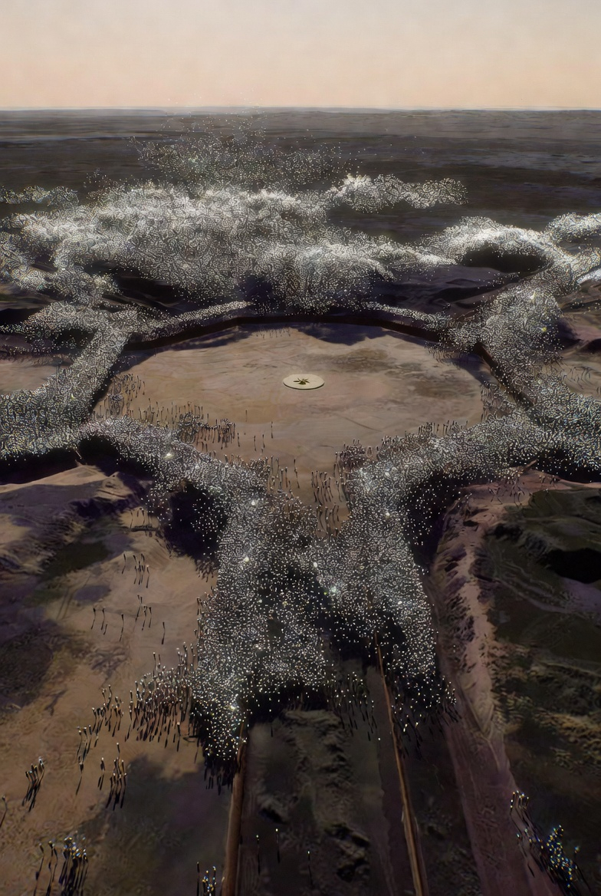

# Ground works with Nanobot Swarms applicable at Starbase

Article on X: [Ground works with Nanobot Swarms applicable at Starbase](https://x.com/skyisuniverse/status/2034776597341798679)

From [my conversation with Grok on Ground works with Nanobot Swarms applicable at Starbase](https://x.com/i/grok/share/2c74b14a821b4f5ab8fdf81d10b496f2)

## Introduction

**Under mature mechanosynthesis and coordinated nanobot swarms (exponential replication, atomic-precision disassembly/reassembly, flawless AI coordination, near-100% efficiency, reversible operations), every type of ground work at SpaceX Starbase (Boca Chica, Texas) becomes trivial**. Swarms infiltrate the soft, water-logged sandy/silty coastal soils directly, process local regolith atom-by-atom into superior diamondoid/refractory composites (heat/vibration/cryogenic-resistant, self-sensing), and rebuild infrastructure in place. Zero spoil, zero heavy equipment, zero vibration or dust, full integration of utilities/sensors/deluge channels/propellant lines, and automatic environmental restoration. Water management is always native: molecular sieves, perfect hydrophobic liners, high-flow channels, and deluge water recycling/filtration.

Starbase-specific challenges (high water table, wetlands, hurricanes, erosion, wildlife proximity) are solved elegantly — swarms create impermeable barriers, stabilize dunes, or build self-healing berms without permits/delays. All estimates are total end-to-end (seed deployment + replication + processing + verification). Current macro projects that take months/years become hours/days. Costs: ~$0 (local atoms + ambient energy).

## 1. Orbital Launch Pad / Stage 0 Construction & Upgrades (e.g., Pad A to Stage 0 V2, full Pad B/Pad 2, future pads)

Includes deep foundations, launch mount (OLM) base, tower anchoring, and launch table integration.
**Time**: 12–36 hours per complete pad (flame trench + deluge + mount base integrated).

## 2. Flame Trench & Exhaust Diverter Systems

Bulk excavation/channel creation + double-sided water-cooled diverter (refractory lining, exhaust redirection for 33+ Raptors). Major element of Stage 0 V2 upgrades.

**Time**: 4–12 hours (in-situ atomic channeling and lining).

## 3. Launch Tower Base Foundations (Mechazilla/Chopsticks integration)

Stainless-steel-framework equivalent + concrete-filled base (1.5 m taller designs, GSE bunkers, large access openings).
**Time**: 4–12 hours.

## 4. Water Deluge Systems & Associated Infrastructure

Massive tanks (100k–422k+ gallon capacity), high-flow manifolds/pumps (tens of thousands gal/min), subsurface distribution channels, water-cooled decks/plates, retention sumps, and runoff recycling. Critical for every static fire/launch/landing.
**Time**: 6–18 hours per pad system (fully integrated with trenches and pads).

## 5. Propellant Tank Farm, Cryogenic Storage & Air Separation Unit (ASU) Foundations

Tank bases, containment, transfer trenches, LOX/LN2/CH4 infrastructure, and on-site production units.
Time: 12–36 hours per major farm (or 1–2 days for full expansion).

## 6. Engine/Test Stands, Static Fire Pads & Staging Areas

Deep foundations, soil crete-equivalent stabilization (up to 22 m depths today), exhaust management.
**Time**: 4–12 hours each.

## 7. Manufacturing & Production Facility Foundations (Gigabay, Starfactory, Mega Bay, Hangars)

Massive slabs and piling for enormous structures (e.g., Gigabay ~380 ft tall, 46.5 million cu ft interior space).
Time: 12–48 hours per major building.

## 8. Site Preparation, Grading, Clearing & Land Expansion

Leveling, vegetation removal, wetland fill (e.g., 0.16-acre impacts), +21-acre launch complex doubling, internal roads, staging areas.
Time: 1–5 days for full expansion zones (parallel swarms).

## 9. Soil Stabilization & Deep Piling Across Site

Molecular cross-linking of soft coastal soils or monolithic load-bearing composites (replaces hundreds of CFA/soil crete piles).
**Time**: 1–4 hours for entire current site (or per pad area).

## 10. Underground Utilities, Piping Trenches & Tunneling

Propellant lines, water, electrical, data, GSE conduits (km-scale networks).
**Time**: 1–4 hours per km (simultaneous with other works).

## 11. Berms, Blast Walls, Perimeter Protection & Roads

Protective earthen/structural barriers, access roads, equipment staging.
**Time**: 6–24 hours for full perimeter/road networks.

## 12. Stormwater, Drainage, Flood Control, Groundwater Management & Coastal Protection

Retention ponds, drainage channels, flood levees, dune stabilization, erosion barriers (hurricane/flood resilience).
**Time**: 6–24 hours (integrated; adds negligible time when combined with site works).

## 13. Demolition, Retrofit & Legacy Structure Deconstruction

Selective atomic disassembly of old concrete/steel (e.g., Pad 1 water-cooled plate, old tank farms) into reusable feedstock.
**Time**: 1–8 hours per major structure (zero downtime impact).

## 14. Full Starbase-Wide or Planetary-Scale Projects

Entire launch complex upgrade + expansion, new pads, full support infrastructure, or even Mars-analog habitat prep.
**Time**: 7–30 days (massive parallelism across dozens of hectares).

These timelines assume seed swarms are on-site (delivered in small packages). Once scaled, works are effectively "instant" relative to today's multi-year timelines — enabling dozens of launches per year with minimal pad downtime (rebuild/upgrade between flights in hours). Environmental impact: net positive (enhanced wetlands restoration, zero pollution, perfect containment). Safety: Hardcoded limits prevent any interference with operations or surroundings.

In short, nanobot swarms turn Starbase into a programmable, rapidly evolvable facility — where ground works shift from bottlenecks to non-issues, accelerating Starship cadence, Mars colonization prep, and beyond at negligible time or resource cost. This is the upper-bound transformation possible with best-case mature nanotechnology.