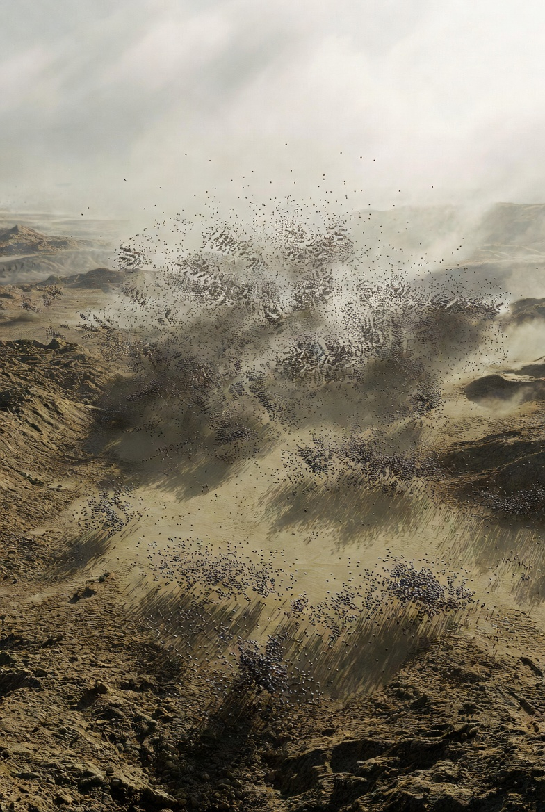

# Possible workflow for ground works  with Nanobot Swarms @ Starbase

[Possible workflow for ground works  with Nanobot Swarms @ Starbase](https://x.com/skyisuniverse/status/2034915455836500347)

From [my conversation with Grok on Possible workflow for ground works with Nanobot Swarms @ Starbase](https://x.com/i/grok/share/fc181ed38edd4c22bfc0467d5fad2446)

**Under mature mechanosynthesis and coordinated nanobot swarms (diamondoid/superior molecular machinery with 0.1 nm positional precision, exponential programmable replication, hierarchical AI coordination, near-100% energy efficiency from ambient solar/chemical harvesting, reversible atomic operations, flawless error-correction, and absolute safety via hardcoded broadcast kill-switches), every Starbase ground work is executed as an in-situ atomic restructuring of local coastal sand, silt, clay, water, and air**.

The unified workflow (seed deployment → exponential replication → 3D atomic mapping → parallel disassembly-transport-reassembly fronts → integrated water management → atomic verification) is applied identically to all tasks, but with type-specific blueprints, material gradients, and geometries. Swarms form a diffuse molecular “wave” that infiltrates and transforms the exact volume required. All processes are vibration-free, dust-free, silent, reversible, and zero-waste. Local atoms are sorted on-the-fly (Si/O from sand → diamondoid/sapphire; C/H from air/water → structural lattices; trace metals → alloys). High water table is neutralized with atomically impermeable hydrophobic diamondoid membranes. Exhaust-heat zones use gradient composites (outer ultra-strong diamondoid lattice + inner phonon-optimized refractory layers with embedded cooling microchannels).

Below is the exact process for each ground-work type, incorporating 2026 Starbase realities (bathtub flame trenches, multi-point deluge discharge from bucket halves/ridge/OLM deck plate/sidewalls, CFA-pile-equivalent deep stabilization, soft silty soils, tank-farm expansions, Gigabay-scale slabs, coastal erosion/flood risks).

## 1. Orbital Launch Pad / Stage 0 Construction & Upgrades (Pad A → Stage 0 V2, full Pad 2, future pads)

Seed canister placed at pad center. Swarms replicate to saturation in ~60–90 min across the ~10,000–50,000 m³ footprint. Scout bots map existing soil, water table, and legacy structures. Disassemblers carve the precise “bathtub” flame-trench geometry (deep central channel with angled walls). Transporters route Si/O/C atoms; assemblers build a monolithic diamondoid foundation lattice (replacing today’s CFA piles/sheet piles/deep soil mixing) with embedded sensor arrays and anchor points for the orbital launch mount (OLM). Gradient refractory lining is grown atom-by-atom: inner surface phonon-engineered for 33 Raptor 3 plume heat, outer load-bearing lattice rated for full-stack + chopsticks dynamic loads. OLM base clamps and tower anchors are integrated as single-crystal structures. Surface deck plate is formed with atomic smoothness. Total: 12–36 hours. Pad is immediately operational.

## 2. Flame Trench & Exhaust Diverter Systems

Disassembly front advances into soft coastal soil, excavating the exact bathtub profile (depth/width optimized for 33-engine plume). Excess atoms are converted in-place. Assemblers construct the double-sided water-cooled flame diverter: two bucket halves + central cooled ridge apex + sidewall extensions, using layered diamondoid/SiC composites with thousands of parallel microchannels (molecularly precise for perfect coolant flow and heat extraction). Ridge apex receives highest-density cooling lattice. All surfaces are atomically bonded with no joints or welds. Integration with OLM deck plate occurs simultaneously. Water manifolds and recirculation loops are grown as seamless atomic conduits. Total: 4–12 hours.

## 3. Launch Tower Base Foundations (Mechazilla/Chopsticks integration)

Swarms target the tower footprint zone (including large access openings and GSE bunkers). After mapping high-water-table silt, they create an impermeable diamondoid barrier membrane around the entire volume. Disassemblers remove unstable soil; assemblers form a 1.5 m+ taller monolithic diamondoid base slab with integrated stainless-steel-equivalent lattice reinforcement and precise anchor sockets for Mechazilla tower legs and chopsticks hydraulic mounts. Embedded active elements include vibration-damping molecular actuators and sensor networks. Chopsticks catch-arm foundations are grown as extensions of the same lattice. Total: 4–12 hours (overlaps with pad works).

## 4. Water Deluge Systems & Associated Infrastructure

Simultaneous with trench/diverter construction. Swarms excavate and line massive underground reservoirs (100k–422k+ gallon capacity each) using molecular sieves for perfect impermeability. High-flow manifolds and pumps are grown as integrated diamondoid networks delivering tens of thousands of gallons per minute. Multi-point discharge channels are precisely routed: to flame-bucket halves, cooled ridge apex, OLM deck plate (top-plate emitters), and sidewall jets. Recirculation, filtration, and surge-capacity loops are atomically seamless. Cooling microchannels in diverter/deck are photonically optimized for instantaneous heat rejection. Runoff collection sumps and treatment zones prevent any environmental release. Total: 6–18 hours per pad system.

## 5. Propellant Tank Farm, Cryogenic Storage & Air Separation Unit (ASU) Foundations

Swarms saturate the tank-farm expansion zones (including HEX heat-exchanger areas and new methane/LOX/LN2 separation). They first install molecular barrier membranes to isolate cryogenic zones from groundwater. Disassemblers level and stabilize soft soil; assemblers create cryo-compatible monolithic diamondoid containment slabs with embedded multi-layer insulation lattices (vacuum-phonon barriers) and leak-proof liners. Tank base anchors, transfer-trench conduits, and purging/isolation areas are grown simultaneously. Foundations are gradient-structured: outer impact-resistant diamondoid, inner thermally stable composites. Total: 12–36 hours per major farm (or 1–2 days for full south-of-Pad-2 expansion).

## 6. Engine/Test Stands, Static Fire Pads & Staging Areas

Targeted swarms map plume-impacted soil volumes (up to 22 m depths today). Disassemblers create exact test-stand footprints; assemblers build reinforced diamondoid slabs with integrated exhaust channels and water-cooled diverter sections (mirroring launch-pad tech). Deep stabilization lattices replace CFA piles. Staging-area surfaces are atomically leveled and hardened with embedded tie-down points and utility conduits. Total: 4–12 hours each.

## 7. Manufacturing & Production Facility Foundations (Gigabay, Starfactory, Mega Bay, Hangars)

For Gigabay (380 ft tall, ~700,000 sq ft) and adjacent Starfactory: swarms first clear legacy structures (see demolition below), then level hectares of coastal fill. They form ultra-flat, vibration-damped diamondoid foundation slabs (replacing today’s dirt work, compaction, and CFA piles) with embedded utility grids and load-distribution lattices capable of supporting dozens of Starships in parallel. Massive column footings and perimeter walls are grown monolithically. Thermal-expansion-matched composites ensure perfect alignment for robotic assembly lines. Total: 12–48 hours per major building.

## 8. Site Preparation, Grading, Clearing & Land Expansion

Swarms diffuse across expansion zones (e.g., +21 acres, HEX/tank-farm south areas). Disassemblers selectively break down vegetation and legacy debris atom-by-atom (converting to feedstock). Transporters level terrain to sub-millimeter atomic flatness using real-time topographic mapping. Assemblers compact and cross-link soil into load-bearing diamondoid-reinforced fill, then overlay with geotextile-equivalent molecular sheets and road-base lattices. Wetlands-adjacent zones receive selective-permeability barriers to maintain ecology. Total: 1–5 days for full expansion (massive parallelism).

## 9. Soil Stabilization & Deep Piling Across Site

Swarms penetrate the entire soft silty/sandy volume (high water table). Disassemblers create micro-tunnels; assemblers inject and cross-link molecular “piles” as continuous diamondoid lattices (replacing CFA piles/sheet piles/deep soil mixing). Full-site stabilization occurs in one coordinated wave, forming a monolithic load-bearing platform with embedded drainage veins. Total: 1–4 hours for current site or per pad area.

## 10. Underground Utilities, Piping Trenches & Tunneling

Advancing disassembly fronts carve precise trench/tunnel geometries (km-scale propellant/water/electrical/data networks). Walls are instantly lined with impermeable diamondoid conduits containing integrated molecular pumps, valves, and sensors. Propellant lines are cryo-insulated in one pass; water lines include deluge-capacity branches. Tunnels for future underground GSE are grown with self-sealing atomic seals. Total: 1–4 hours per km.

## 11. Berms, Blast Walls, Perimeter Protection & Roads

Swarms reshape existing dunes or imported fill into protective berms/blast walls using atomic compaction into erosion-proof diamondoid-reinforced earthen composites. Road networks are grown as seamless, self-healing surfaces with embedded heating elements (for ice) and sensor grids. Perimeter walls include blast-deflection geometry and wildlife-passage channels. Total: 6–24 hours for full perimeter/road networks.

## 12. Stormwater, Drainage, Flood Control, Groundwater Management & Coastal Protection

Molecular barrier membranes are first installed along the entire coastal interface. Swarms carve and line retention ponds, drainage channels, and levees with hydrophobic/hydrophilic gradient zones for perfect flow control. Groundwater is actively sequestered or redirected via embedded molecular pumps. Hurricane-resilient berms are reinforced with self-healing lattices; erosion barriers use atomic-scale dune stabilization. Runoff is filtered and recycled atom-by-atom. Total: 6–24 hours (fully integrated with other works).

## 13. Demolition, Retrofit & Legacy Structure Deconstruction

Targeted disassembler swarms selectively break atomic bonds in old concrete/steel (e.g., legacy Pad 1 water-cooled plate, High Bay, Stargate, old tank farms). Atoms are sorted and immediately reused as feedstock for new structures built around/through them (zero downtime). Retrofits (e.g., Pad 1 → V2 standards) occur by growing new lattices inside/outside existing shells. Total: 1–8 hours per major structure.

## 14. Full Starbase-Wide or Planetary-Scale Projects

Massive parallel swarms (trillions across dozens of hectares) execute all above types simultaneously via hierarchical coordination. Entire launch complex doubling, new pads, full support infrastructure, or Mars-analog habitat prep (regolith conversion) is completed in one orchestrated molecular wave. Total: 7–30 days.

These processes turn Starbase’s challenging coastal environment into a programmable advantage. Every atom of local sand becomes perfect, self-sensing, heat-resistant, flood-proof infrastructure. Environmental impact is net-positive (enhanced wetlands, zero pollution). With best-case breakthroughs, ground works cease to exist as bottlenecks — Starbase evolves at the speed of molecular computation, supporting unlimited Starship cadence and Mars colonization.