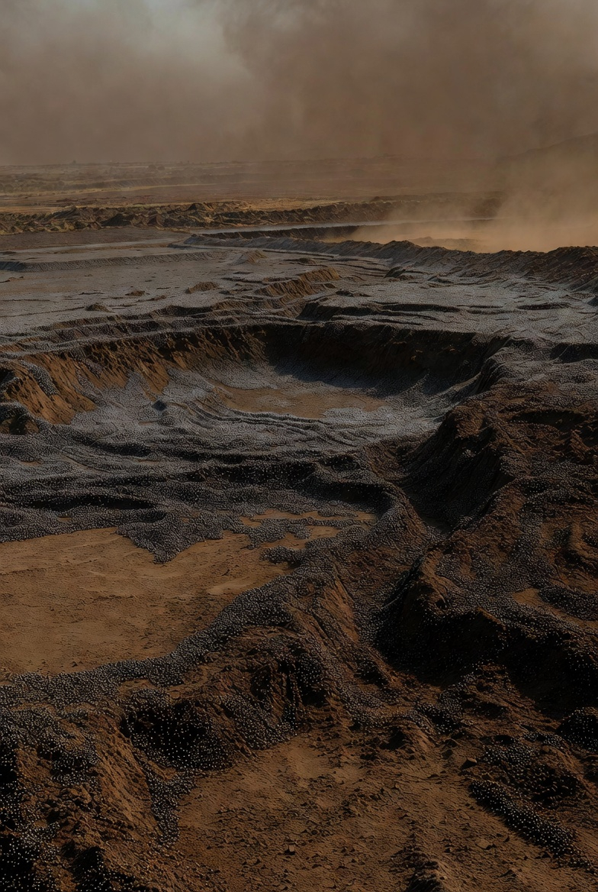

# Time/Cost estimates for ground works with Nanobots Swarms

Article on X: [Time/Cost estimates for ground works with Nanobots Swarms](https://x.com/skyisuniverse/status/2034763246528266577)

From [my conversation with Grok on Time/Cost estimates for ground works with Nanobots Swarms](https://x.com/i/grok/share/92d3a446289a4dd28317c82f0363c318)

## Introduction

**Under mature mechanosynthesis and coordinated nanobot swarms (best-case breakthroughs: exponential replication, atomic-precision disassembly/reassembly, AI-optimized parallelism, near-100% energy efficiency via chemical/solar harvesting, perfect thermal management, and reversible operations), all ground works become in-situ molecular processes**. Swarms infiltrate soil/rock, break bonds atom-by-atom, sort/relocate atoms, and rebuild into optimized structures (foundations, liners, channels, reinforcements) with zero waste, no spoil, no vibration, and full integration of utilities/sensors. No macro equipment needed.

**Core performance benchmarks** (from molecular manufacturing literature):

- A seed swarm (grams of bots) replicates exponentially (doubling every ~1–10 minutes) to trillions–quadrillions in <1–4 hours, saturating any site volume.

- Throughput: Primitive desktop nanofactories achieve ~0.1–1+ kg product/hour per kg of machinery; advanced systems scale to kg/kg/hour or better via convergence and parallelism. Entire US-scale infrastructure (roads, bridges, cities — trillions of tons) replicable in ~1 week.

- Effective processing: Atomic operations enable rapid volume transformation (meters-scale effective "excavation" per hour per swarm section once scaled). Limits are heat dissipation, energy input, and coordination — not mechanics.

**Costs**: Near-zero in post-scarcity abundance. Local atoms are free; energy use ~10–100 kWh/ton processed (recoverable in advanced designs) equates to pennies per ton today, or effectively $0. Energy is the only marginal input; swarms self-power via ambient sources. No labor, transport, or disposal costs.

**Times** are total end-to-end (deployment + replication + processing + verification/restoration). Water management is always integrated (nanobots create atomically perfect drainage channels, impermeable diamondoid liners, pumps, or selective-permeability zones simultaneously with other works). Estimates are conservative practical bounds; best-case could be 5–10× faster.

## 1. Site Clearing, Preparation, and Grading/Earthmoving

Swarms selectively disassemble vegetation/structures, level/reshape terrain, and compact/reinforce soil into load-bearing composites.

- **Small residential (single-family home, ~100–500 m³ moved)**: 15–45 minutes.

- **Low-rise/multi-family or commercial (~1,000–5,000 m³)**: 1–2 hours.

- **High-rise/skyscraper or industrial (~10,000+ m³)**: 2–6 hours.

- **Large-scale (e.g., airport site, dam foundation, thousands of hectares)**: 1–3 days (parallel swarms across area).

## 2. Excavation (Foundations, Basements, Trenches for Utilities)

Atom-by-atom removal and relocation; excess atoms converted in-place to fill, beams, or infrastructure.

- **Residential shallow foundations/basements (~100–1,000 m³)**: 20–60 minutes.

- **High-rise deep basements (~5,000–50,000 m³)**: 4–12 hours.

- **Utility trenching (km-scale for residential/commercial developments)**: 1–4 hours per km (integrated pipes/cables formed simultaneously).

- **Industrial/heavy foundations**: 6–24 hours.

## 3. Soil Stabilization, Ground Improvement, and Piling/Drilling

Molecular cross-linking of particles into diamondoid-reinforced lattices or embedded sensor arrays; "piles" formed as integrated monolithic structures.

- **Any scale (residential to high-rise)**: 30–90 minutes post-excavation (overlaps with excavation).

- **Slope stabilization or liquefaction-prone sites**: Same as above; full site in <2 hours.

## 4. Tunneling and Shafts

Swarms advance like a molecular boring front, lining with perfect composites and integrating ventilation/rail in one pass.

- **Small utility/service tunnels (residential or building connections, <1 m diameter)**: 1–2 hours per 100 m.

- **Vehicular/subway tunnels (5–10 m diameter)**: 12–48 hours per km (parallel front + replication along length).

- **Large infrastructure shafts/underground parking (high-rise)**: 4–12 hours.

## 5. Water Management (Dewatering, Drainage, Stormwater, Flood Control, Groundwater Barriers)

Fully integrated: Swarms create molecular sieves, channels, pumps, or hydrophobic/hydrophilic zones; pump or molecularly sequester water; form perfect liners or aquifers.

- **Site dewatering (any building excavation, handling groundwater inflow)**: Simultaneous with excavation — adds 0–15 minutes.

- **Residential drainage systems (foundations, yards)**: 10–30 minutes (embedded perforated channels + collection reservoirs).

- **Commercial/high-rise stormwater management (basement waterproofing, retention)**: 1–3 hours.

- **Large-scale (levees, flood barriers, km-scale drainage networks, dams/reservoirs)**: 1–7 days (parallel swarms reshape entire watersheds; atomically perfect impermeable cores with embedded sensors).

- **Aquifer remediation or artificial recharge**: Hours for site-scale; days for regional.

## 6. Large-Scale or Specialized Ground Works (Applicable Across Building Types or Standalone)

- **Mining/quarrying for building materials**: Selective atomic extraction — hours for building-scale volumes (integrated with foundation works).

- **Land reclamation/coastal stabilization**: Days for hectares (builds artificial terrain + barriers).

- **Dam/embankment construction**: 3–14 days for major structures (full atomic build from local sediment).

- **Planetary/continental terraforming (extreme best-case)**: Weeks–months for continent-scale reshaping.

**Scaling notes by building type** (all include full water management):

- **Single-family residential**: Total ground works (clearing + excavation + stabilization + drainage + utilities): 30–90 minutes. Cost: ~$0.

- **Low-rise/multi-family**: 1–4 hours.

- **High-rise/commercial skyscraper**: Deep works + integration: 6–24 hours.

- **Industrial/warehouse**: Larger footprints but shallow: 4–12 hours.

- **Infrastructure-linked (bridges, transit hubs)**: Adds tunneling/earthmoving — 1–3 days.

These timelines assume mature swarms are available on-site (delivered as seed packages). Ramp-up is the main variable; once at scale, works are effectively "instantaneous" relative to today (years → hours). Safety protocols (hard limits, kill-switches, non-replicating designs) ensure zero runaway risk. Environmental impact: positive — sites can be restored to pristine or enhanced states instantly.

This represents the upper-bound transformation: ground works shift from heavy industry to programmable molecular choreography, enabling arbitrary projects at negligible time/cost.