# NanoAssembly-boosted SpaceX

Article on X: [NanoAssembly-boosted SpaceX](https://x.com/skyisuniverse/status/2026208185590161639)

From [my conversation with Grok on possible benefits for SpaceX from NanoAssembly](https://x.com/i/grok/share/ae0d88f43f1947af9203c1fb0303edec)

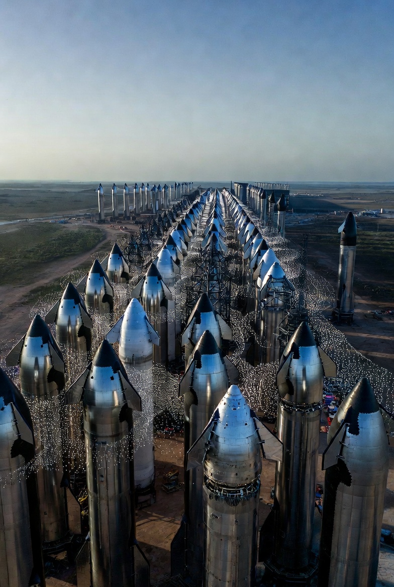

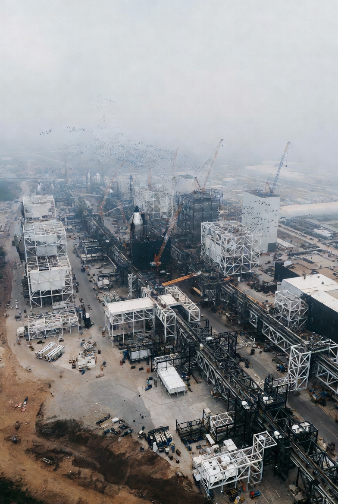

> If nanoassembly would become mature, well developed and stable as a technology and would be implemented at SpaceX wherever applicable (for production, construction, etc.), what outcomes would it enable? What resources would it free up / enable? How could those be directed towards Mars mission?

If nanoassembly—referring to mature molecular nanotechnology (MNT) enabling atomic-precision manufacturing via programmable nanobots or assemblers—were fully integrated into SpaceX's operations, it could revolutionize the company's capabilities in production, construction, and mission execution. This technology, as explored in visionary works like K. Eric Drexler's "Engines of Creation" and NASA studies, would allow bottom-up assembly of complex structures from raw atoms or molecules, bypassing traditional top-down methods like welding or machining. Drawing from expert analyses, including NASA's 1997 report on MNT applications and recent reviews of nanomaterials in space, implementation could lead to exponential efficiency gains, enabling unprecedented scales of space exploration. Below, I outline the key outcomes, freed/enabled resources, and how they could be redirected toward Mars missions, assuming stable MNT by mid-century or sooner.

## Enabled Outcomes

Nanoassembly would permeate SpaceX's ecosystem, from Starship factories to orbital and Martian outposts, yielding transformative results:

- **Ultra-Efficient Production and Construction**: Vehicles like Starship could be assembled in days (e.g., 1–3 days per unit) at costs under $100,000, using self-replicating nanobot swarms to build from elemental feedstocks (e.g., carbon from CO2, iron from recycled materials). This extends to rapid prototyping of Raptor engines with 99% efficiency and diamondoid materials 10–100x stronger than steel, reducing mass by 50%+ while enhancing durability. On-site construction (e.g., habitats or fuel depots) becomes feasible anywhere, with nanobots fabricating structures from local regolith or asteroids, enabling "print-on-demand" infrastructure.

- **Advanced Material and System Innovations**: Spacecraft hulls could incorporate self-healing nanocomposites (e.g., carbon nanotubes and graphene) for radiation shielding, blocking 95%+ of cosmic rays without added mass, crucial for long-duration flights. Nanosensors woven into structures would provide real-time health monitoring, while nanorobots enable in-flight repairs or propellant synthesis from atmospheric gases. For Mars-specific tech, engineered nanorods could accelerate atmospheric restoration by trapping heat 5,000x more efficiently than CO2, potentially raising temperatures by 30K in years and enabling liquid water stability.

- **Scalable In-Situ Resource Utilization (ISRU)**: On Mars, nanobots could disassemble regolith to produce oxygen, fuel, or building materials exponentially faster than current MOXIE-like systems, supporting self-sustaining colonies. This includes hybrid propulsion for Mars missions (e.g., combining chemical and solar-electric thrusters for 400-ton crewed trips) and adaptive heat shields resistant to Mars' CO2 plasma during entry.

- **Broader Mission Capabilities**: Fleets of thousands of Starships could launch annually, enabling mega-payloads (500+ tons to orbit) for asteroid mining or interstellar probes. Nano-enabled microcraft or nanorobots could explore Martian subsurface for life or resources, while quantum-enhanced avionics boost autonomy.

These outcomes align with NASA's vision of MNT enabling large-scale space colonization by addressing challenges in materials, sensors, and robotics.

## Resources Freed Up or Enabled

MNT would liberate vast resources currently bottlenecked by conventional manufacturing:

- **Financial Resources**: Production costs could drop 100–1,000x (e.g., Starships at <$100,000 vs. $10–50M today), freeing billions in capital. Supply chain dependencies vanish, as nanobots use abundant elements, reducing raw material expenses by 99%+ via zero-waste recycling.

- **Human and Labor Resources**: Automation eliminates most manual labor in factories, freeing engineers (e.g., SpaceX's 13,000+ workforce) for innovation. Assembly times shrink from months to days, enabling rapid iteration and reducing downtime.

- **Material and Energy Resources**: Lighter, efficient designs cut propellant needs by 30–50%, while in-space manufacturing accesses infinite solar system resources (e.g., asteroid metals). Energy efficiency improves via nano-optimized solar panels or fusion components.

- **Time and Scalability**: Exponential replication allows parallel production of fleets, compressing timelines for missions like Artemis or Starship tests.

Overall, MNT could enable abundance, turning scarcity-driven constraints into surplus, as noted in NSS position papers on space settlement.

## Directing Resources Toward Mars Missions

Freed resources could supercharge SpaceX's Mars ambitions, accelerating the goal of a self-sustaining city by decades:

- **Accelerated Fleet Buildup and Launches**: Billions saved on production could fund 10x more Starships (e.g., 1,000+ vehicles/year), enabling frequent cargo/crew missions. This supports rapid ISRU setup on Mars, with nanobots producing habitats from regolith, freeing human settlers for science/exploration.

- **Enhanced Mission Safety and Sustainability**: Redirected R&D could focus on nano-shielding for radiation (e.g., BNNT layers reducing doses to <40 mSv per trip) and atmospheric engineering (e.g., nanorods for terraforming feedback loops). Freed labor could develop hybrid propulsion for shorter transits (e.g., 850-day round trips with 400-ton payloads).

- **Colony Bootstrapping**: Surplus materials/energy enable on-Mars nanofactories, producing everything from solar arrays to life support, reducing Earth dependency. Financial windfalls could invest in global partnerships or talent acquisition for Mars city planning.

- **Long-Term Vision**: Ultimately, this could achieve multi-planetary status faster, with nano-enabled megastructures (e.g., orbital rings) facilitating mass migration.

In summary, MNT at SpaceX would catalyze a cascade of efficiencies, propelling Mars colonization from aspirational to inevitable, with resources redirected to scale, safety, and sustainability.

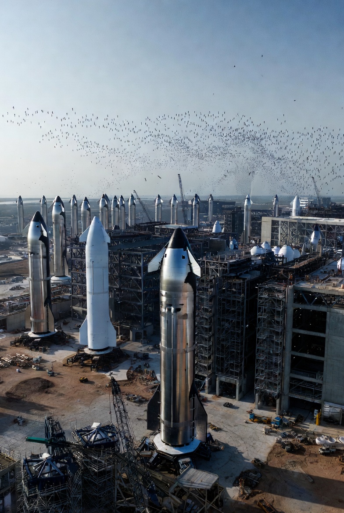

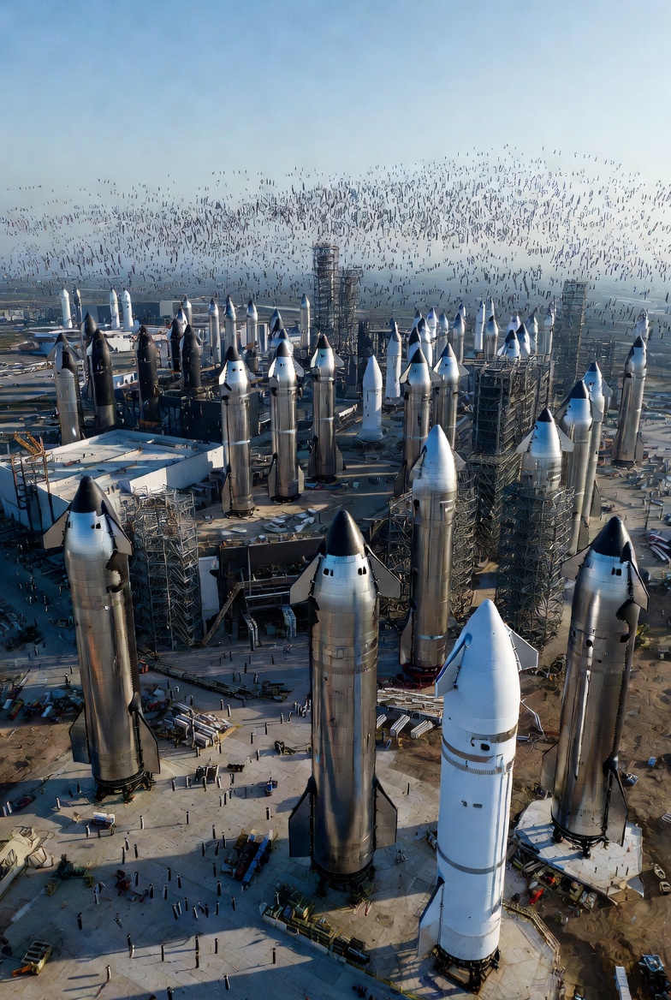

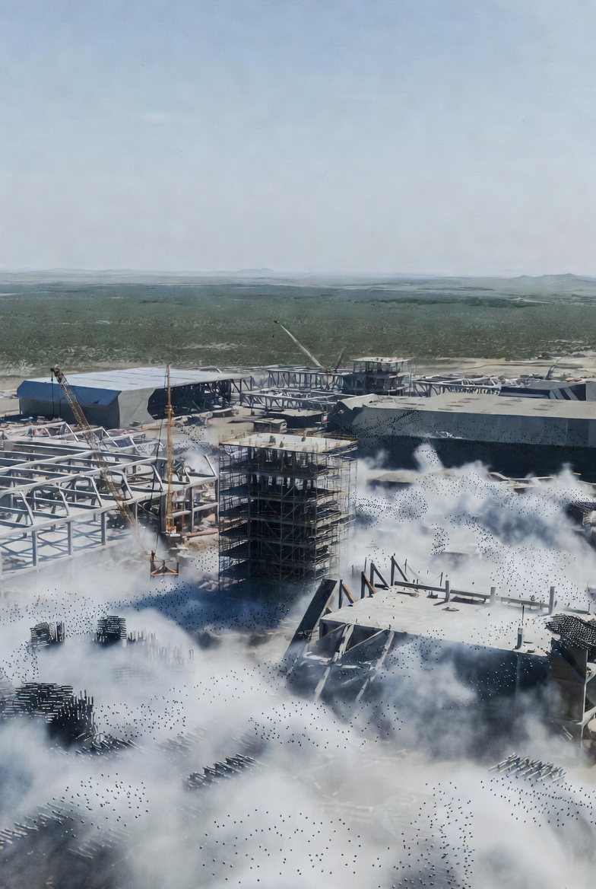

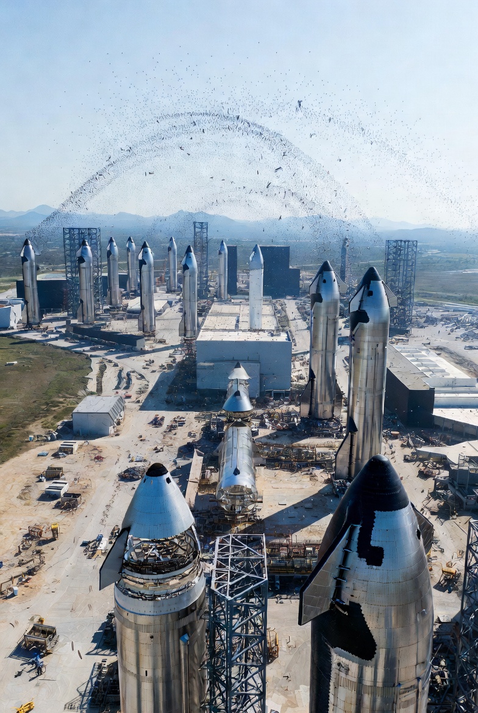

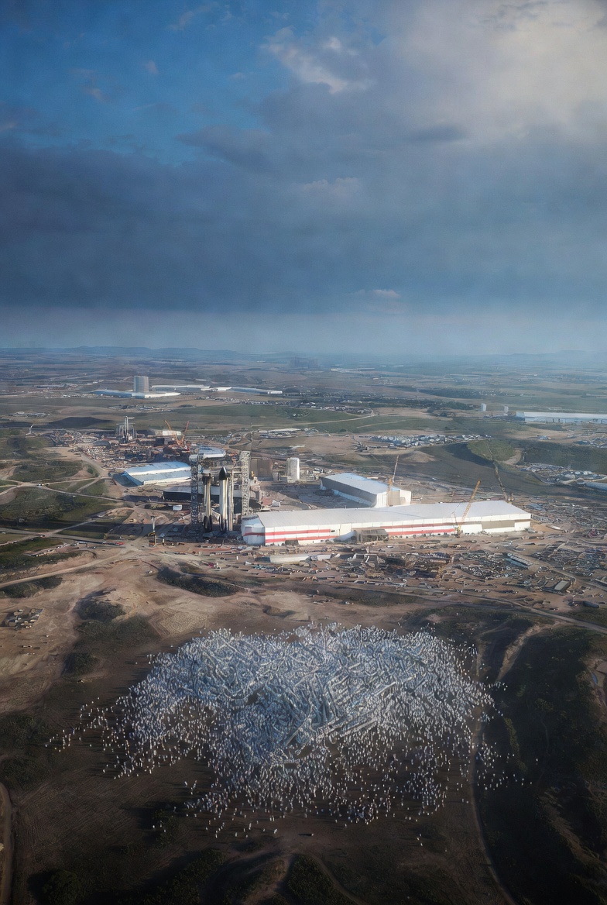

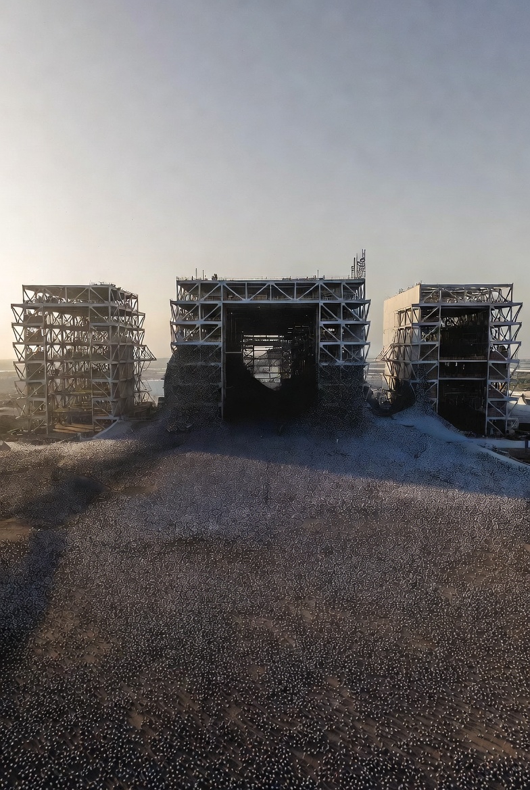

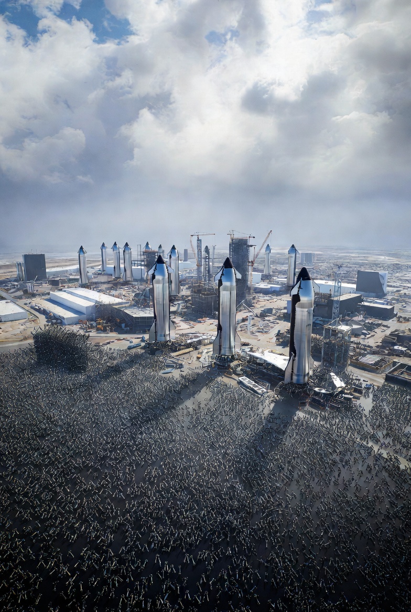

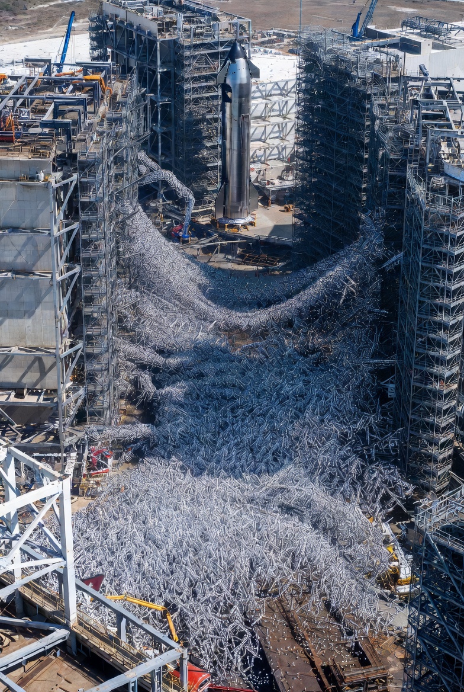

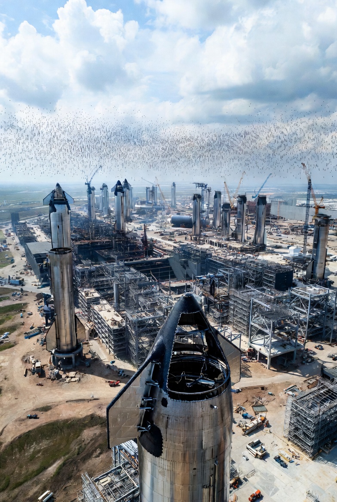

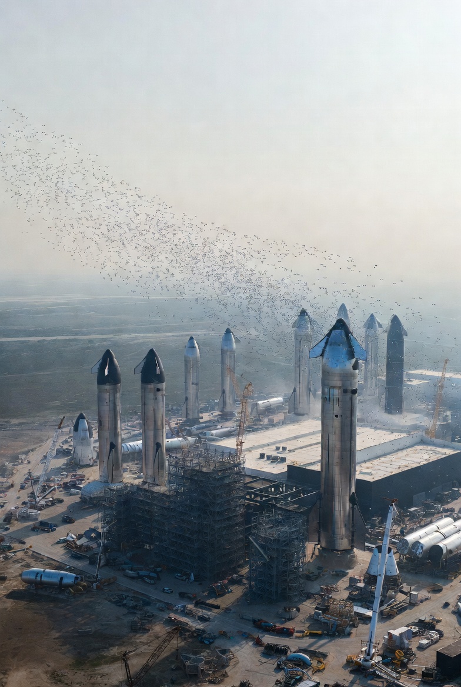

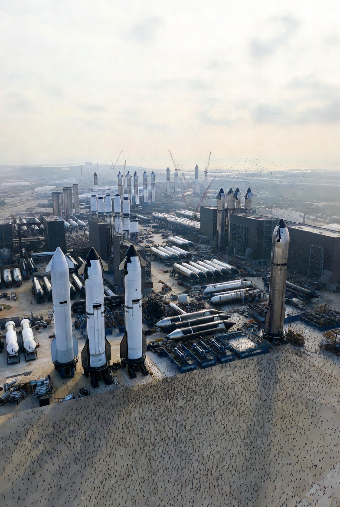