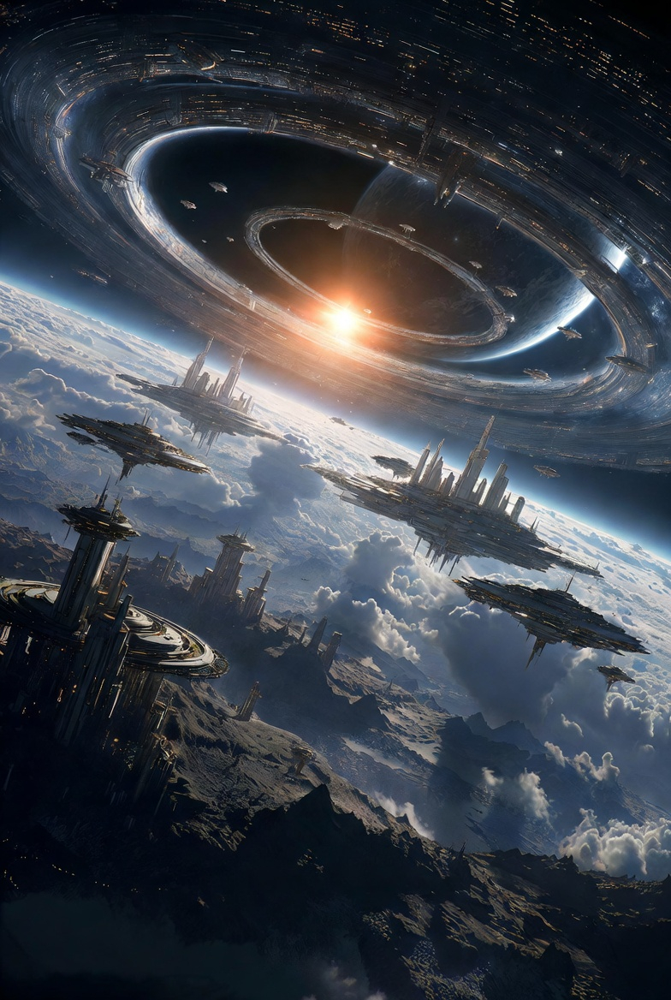

# Perspectives of planet colonization based on planet composition

Article on X: [Perspectives of planet colonization based on planet composition](https://x.com/skyisuniverse/status/2027090901940473891)

From [my conversation with Grok on Starship with fusion engine](https://grok.com/share/bGVnYWN5_a2ed475b-ed76-4275-8e50-100255908a29)

From [my conversation with Grok on perspectives of planet colonization with fusion-powered Starship](https://x.com/i/grok/share/a758b095ee3b42679a451fe1a0f2aa33)

From [my conversation with Grok on Perspectives of Planet Colonization based on Planet Composition](https://x.com/i/grok/share/742e7032e8944794b5016e01618e82aa)

## Introduction

> Now explore perspectives of colonization (and possible forms, shapes of it? modalities of human presence?) based on the planet composition (e.g. based on whether it is a gas or has ground, etc.)

**Planet composition** — rocky/terrestrial (solid crust), icy (frozen volatiles with possible subsurface oceans), or gaseous/icy-giant (dense fluid envelopes with no accessible solid surface)—dictates the fundamental engineering, resource strategy, human experience, and long-term viability of colonization. Fusion-powered Starship (with its fast commutes and abundant onboard/planetary energy) removes the energy barrier, allowing creative, composition-specific modalities that range from grounded bases to buoyant megastructures or orbital rings. This shifts perspectives from "survival in hostile environments" to "tailored habitats optimized for each world's physics and chemistry."

Human presence can manifest as:

- **Permanent self-sustaining colonies** (multi-generational, ISRU-driven cities).

- **Scientific outposts** (rotating crews, telerobotics).

- **Industrial/extraction nodes** (automated or lightly crewed).

- **Mobile or transient habitats** (airships, submarines, orbital cyclers).

- **Hybrid or generational** (low-g adaptation, bio-engineered humans, or artificial gravity via rotation).

Below, grouped by compositional category with planet-specific examples.

## 1. Solid-Surface Worlds (Rocky or Icy Bodies with Accessible Ground)

**Mercury, Mars, Venus surface (marginal), and icy moons (Titan, Enceladus, Callisto, Titan, Triton, Uranian/Neptunian moons)**. Composition offers regolith/rock/ice for radiation shielding, construction, and ISRU (metals on Mercury, water ice/volatiles everywhere, hydrocarbons on Titan).

**Modalities and forms**:

- **Grounded habitats**: Inflatable domes, 3D-printed regolith structures, lava-tube or crater-rim cities (natural shielding). Underground bunkers or tunnel networks for radiation protection.

- **Subsurface/oceanic (icy moons)**: Under-ice or underwater bases—drilled habitats in Europa/Enceladus oceans or Titan's subsurface liquids; submarine-like modules for exploration.

- **Mobile**: Rovers, wheeled/flying vehicles, or ice-melting crawlers on Enceladus.

**Perspectives**:

- **Engineering/Resource**: Direct mining and shielding (pile regolith overhead). Fusion melts ice or sinters regolith easily. Titan's thick atmosphere + organics enables "Earth-like" chemistry for plastics/food.

- **Human Experience**: Gravity varies (0.04–0.9 g); Venus/Mars near-ideal or manageable, but tiny moons cause severe low-g health issues (requiring centrifuges or genetic/tech adaptations). Direct "walking on ground" gives psychological anchoring.

- **Scientific/Economic**: Prime for geology/astrobiology (subsurface oceans on Enceladus/Europa/Uranian moons may host life). Industrial bases (Mercury metals, Titan chemistry).

- **Challenges/Debate**: Dust/permafrost on Mars, acid on Venus surface, extreme cold/radiation on outer moons. Fusion enables heated, shielded "oasis" domes or ocean cities.

## 2. Atmospheric / Buoyant Modalities (Dense Gas Envelopes)

**Venus upper clouds, and gas/ice giant atmospheres (Jupiter, Saturn, Uranus, Neptune)**. No solid ground; composition is mostly H/He (gas giants) or H/He + ices (Uranus/Neptune), enabling buoyancy but with crushing pressures, high winds, and (for Jupiter) lethal radiation deeper down.

**Modalities and forms**:

- **Floating aerostats/cloud cities**: Breathable-air balloons or rigid blimps (Venus: air lifts better than helium on Earth; Saturn: similar at certain altitudes). Multi-kilometer platforms or "bubblehabs" with dangling tethers for resource extraction.

- **Mobile sky cities**: Dirigible-style habitats that navigate wind layers or "float" at constant-pressure altitudes.

- **Speculative deep-atmosphere**: For gas giants, habitats in calmer, Earth-gravity zones (Zubrin concepts), though radiation and convection are extreme.

**Perspectives**:

- **Engineering/Resource**: Buoyancy is "free" lift—entire volume can be habitable on Venus/Saturn. Fusion provides power for propulsion against winds and extraction of D/He-3 (Saturn/Uranus/Neptune as "Persian Gulf" per Zubrin—fuel for the whole solar system). Jupiter harder due to radiation.
- **Human Experience**: Near-Earth gravity possible at right altitudes; stunning cloudscapes and "infinite" sky views. Mobility is 3D—cities drift or steer. But turbulence, lightning (Jupiter), and acid (Venus) require robust designs. Psychological "no ground" effect mitigated by artificial horizons or rotation.
- **Scientific/Economic**: Direct sampling of planetary atmospheres; fuel export economy for outer planets. Venus cloud cities often debated as "easier than Mars surface" due to pressure/temperature.
- **Challenges**: Winds can exceed 100 m/s; radiation on Jupiter demands shielding or higher-altitude ops. Fusion Starship enables heavy initial lift and ongoing station-keeping.

## 3. Orbital / Levitated Structures (Around Any Planet, but Especially Useful for Gas Giants)

**Applicable everywhere, but compositionally ideal for gas/ice giants** where surface access is impossible.

**Modalities and forms**:

- **Orbital habitats/stations**: Rotating cylinders or toroids (artificial gravity) in high orbit.

- **Orbital rings or skyhooks** (Paul Birch concept): Equatorial rings levitated magnetically or by rotation, with lower edges dipping into atmosphere for resource scooping and upper edges for space access. Ideal for Saturn/Uranus/Neptune (Earth-like gravity at cloud-top altitudes).

**Perspectives**:

- **Engineering/Resource**: Rings allow continuous extraction from gas envelopes without landing. Fusion powers magnetic levitation and mass drivers.

- **Human Experience**: Full artificial gravity via spin; panoramic planetary views. Serves as "spaceport" hub connecting moon bases or atmospheric cities.

- **Economic**: Logistics backbone—fuel depots, manufacturing in micro-g.

- **Challenges**: Massive scale (engineering megastructures); orbital debris risks. Fusion makes construction and maintenance feasible far from Earth.

## Cross-Cutting Perspectives Shaped by Composition

- **Resource Economics**: Solid worlds favor mining/manufacturing; gas giants favor atmospheric scooping for fusion fuels (D/He-3 from Saturn–Neptune could power the entire solar economy).

- **Radiation & Protection**: Solid surfaces allow cheap regolith burial; gas envelopes require altitude management or magnetic shielding (fusion-powered).

- **Gravity & Health**: Venus (0.9 g) or orbital rings offer near-Earth norms; everywhere else needs countermeasures (centrifuges, pharma, or long-term adaptation). Tiny icy moons are worst.

- **Mobility & Expansion**: Solid worlds support surface roads/rail; atmospheres enable free-floating traffic; rings connect everything.

- **Scientific Value**: Composition dictates targets—rocky for geology, icy for astrobiology (subsurface oceans), gaseous for planetary formation and fusion physics.

- **Ethical/Social**: "Grounded" colonies feel more like "new Earths"; floating/orbital ones emphasize humanity as sky-dwellers. Isolation scales with distance (20 days Mercury vs. 5 months Neptune), but fusion Starship enables family rotations and virtual-Earth links.

- **Timeline with Fusion Starship**: Inner solid worlds (Mercury/Venus/Mars) first for scale; gas-giant moons/atmospheres next for resources; outermost icy moons last as specialized outposts. Hybrid systems (e.g., Titan surface + Saturn orbital ring) become standard.

In all cases, fusion power turns composition from limitation into asset—melting ice, floating cities, or scooping fuels become routine. The solar system becomes a palette of habitats: grounded fortresses on rock, buoyant metropolises in skies, and spinning rings in orbit. Human presence evolves from "visitors in suits" to "natives" adapted to each world's unique physics, with composition no longer a barrier but the defining character of each new home.