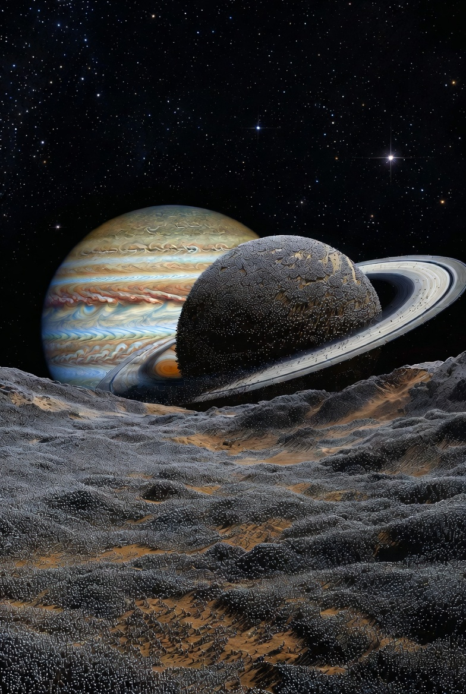
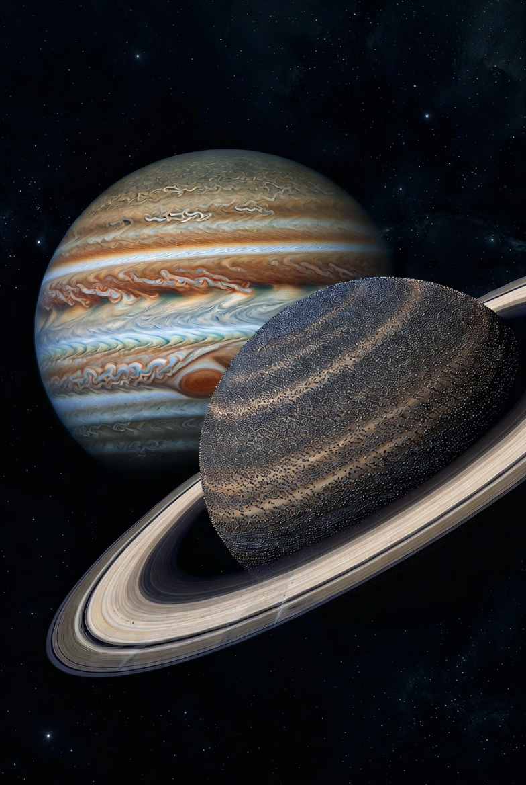
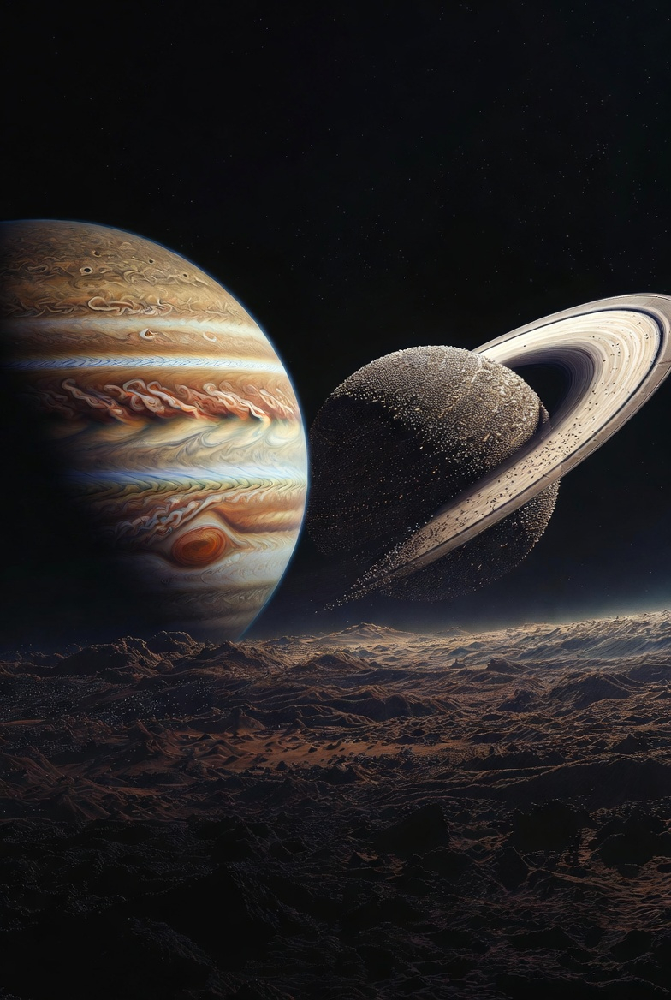
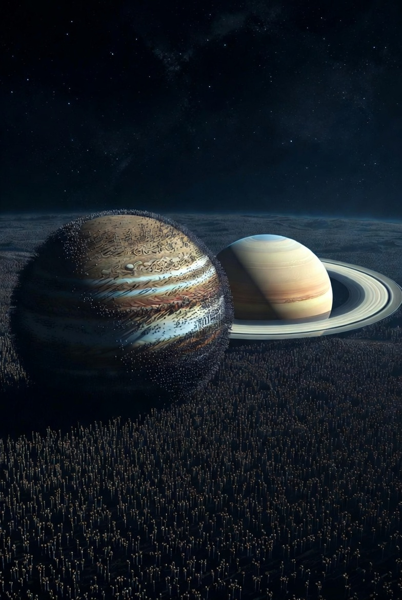
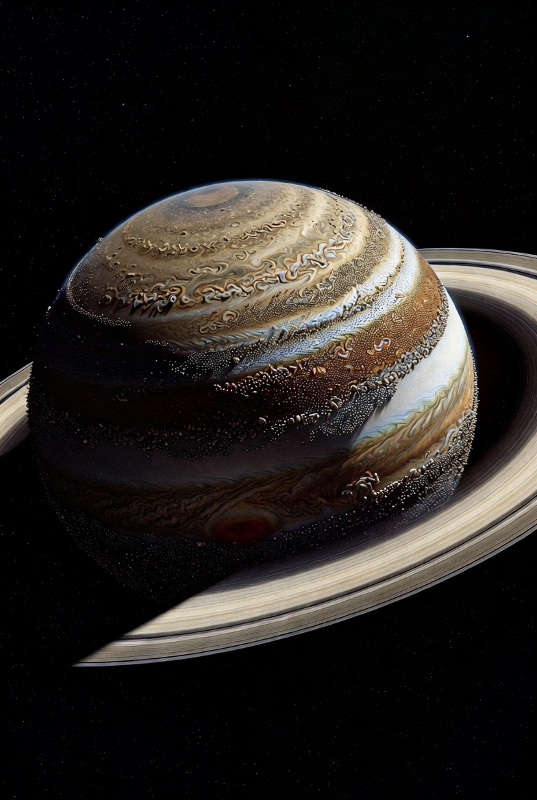

# Restructuring Planets (Terraforming Context) 

Article on X: [Restructuring Planets (Terraforming Context)](https://x.com/skyisuniverse/status/2027100128478126408)

From [my conversation with Grok on Starship with fusion engine](https://grok.com/share/bGVnYWN5_a2ed475b-ed76-4275-8e50-100255908a29)

From [my conversation with Grok on perspectives of planet colonization with fusion-powered Starship](https://x.com/i/grok/share/a758b095ee3b42679a451fe1a0f2aa33)

From [my conversation with Grok on Perspectives of Planet Colonization based on Planet Composition](https://x.com/i/grok/share/742e7032e8944794b5016e01618e82aa)

From [my conversation with Grok on Possibilities for Terraforming Planets in Solar System](https://x.com/i/grok/share/ed4e099c8a4b4b94812c7e3dddaecf59)

From [my conversation with Grok on Perspectives of Restructuring Gas Giants (Jupiter, Saturn, Uranus, Neptune)](https://x.com/i/grok/share/6bd7ef07a4a94925bf4820360657443e)

From [my conversation with Grok on Restructuring Planets in Terraforming Context](https://x.com/i/grok/share/8aeef814888c4a8a9a29662e21745992)

---

## Introduction

> Remove the gaseous envelope to expose or enhance the rocky/icy core.  Do gaseous planets have a core? Tell about it

> Do gaseous planets have a core? Tell about it

---

**Yes, all four gaseous planets in our Solar System—Jupiter and Saturn (the gas giants) and Uranus and Neptune (the ice giants)—have central cores**. However, these cores are nothing like Earth’s solid iron-nickel core. They are smaller relative to the planet’s total size, formed under extreme conditions, and often “fuzzy” or diluted rather than sharply defined. Modern spacecraft data (NASA’s Juno for Jupiter, Cassini for Saturn) have overturned older textbook models and given us a much more nuanced picture.

## What the Cores Are Like

All giant planets formed through a process called core accretion (or a mix with disk instability for some cases). Tiny rocky and icy particles in the young solar nebula clumped together first, building a seed core. Once the core grew massive enough (~5–10 Earth masses), its gravity pulled in huge amounts of hydrogen and helium gas (for gas giants) or ices + gas (for ice giants). The core is therefore the “original seed” that everything else built upon.

## Jupiter and Saturn (Gas Giants)

**Core characteristics**: They have large, “fuzzy” or diluted cores that blend gradually into the surrounding layers rather than having a sharp boundary.

- Jupiter’s core region extends to roughly 30–60% of the planet’s radius and is enriched in heavy elements (rock + ice) mixed with a lot of hydrogen and helium—so it’s more like “dirty metallic hydrogen” than pure rock. Total heavy-element mass is estimated at 20–60 Earth masses.
S- aturn’s is similar but somewhat more compact and rock/ice-rich (15–18 Earth masses of heavy elements).

**Structure around the core** (from outside in):

- Gaseous atmosphere (H₂ + He).
- Liquid molecular hydrogen.
- Metallic hydrogen layer (under crushing pressure, hydrogen behaves like a liquid metal and conducts electricity—source of the strong magnetic fields).
- The fuzzy core transition zone.

**Why “fuzzy”**? Juno and Cassini gravity measurements show no sharp density jump. The heavy material is mixed outward, possibly from giant impacts during formation or slow mixing over billions of years. There may be a tiny, denser innermost “seed” (a few Earth masses of rock/metal), but it’s not required by the data.

## Uranus and Neptune (Ice Giants)

**Core characteristics**: They have more distinct (though still uncertain) rocky or rocky/icy cores, surrounded by a thick mantle of “ices” (water, ammonia, methane in supercritical fluid form).

- Cores are thought to be 5–15 Earth masses of rock + ice.
- Recent models suggest they could be more rock-dominated than water-dominated, or even methane-rich (“methane planets”), because the outer Solar System planetesimals they accreted were refractory-rich (rock/organics) rather than pure ice.

**Structure around the core**: Thin H/He atmosphere → ice mantle (hot, dense fluid ices) → core.

**Key difference from gas giants**: Less total gas envelope (only ~10–20% of mass), so the core/mantle makes up a larger fraction of the planet.

## Why This Matters for Radical Restructuring (Terraforming Context)

In the scenario of stripping the gaseous/icy envelope to expose or enhance the core:

**The core is real and massive** — Jupiter’s fuzzy core alone is super-Earth sized in mass. With MNT and unlimited fusion energy, you could theoretically:

- Mine away the outer layers (exporting hydrogen as fuel).

- Sculpt the exposed core material into a solid surface.

- Add atmosphere, water, and biosphere using MNT nanoassembly and imported volatiles.

Result: Turn the core into a new rocky/icy super-Earth with 1 g gravity and open-air habitability. The stripped gas becomes raw material for habitats elsewhere or fusion fuel.

**Current scientific consensus (2024–2026 data)**:

- Juno and Cassini revolutionized our view: no compact solid cores as once drawn in textbooks. Instead, fuzzy, extended, compositionally mixed central regions.

- This makes stripping more complex (no clean “peeling” of layers), but MNT is ideal for handling gradual transitions—nanobots could sort and reassemble atoms precisely.

- Uranus/Neptune cores are even more promising targets because their envelopes are thinner.

In short: **Yes, gaseous planets have cores** — they are the dense, heavy-element-rich hearts that seeded the planets’ growth. They are fuzzy and diluted in Jupiter and Saturn, and more ice/rock-dominated in Uranus and Neptune. This internal structure is exactly why radical restructuring concepts (exposing the core, building shells around it, or mining it entirely) are physically plausible with sufficiently advanced technology, even if they remain multi-millennia projects.

The latest missions have made the cores more interesting, not less: they are dynamic, mixed regions full of surprises that future probes (and future civilizations) will continue to explore.

