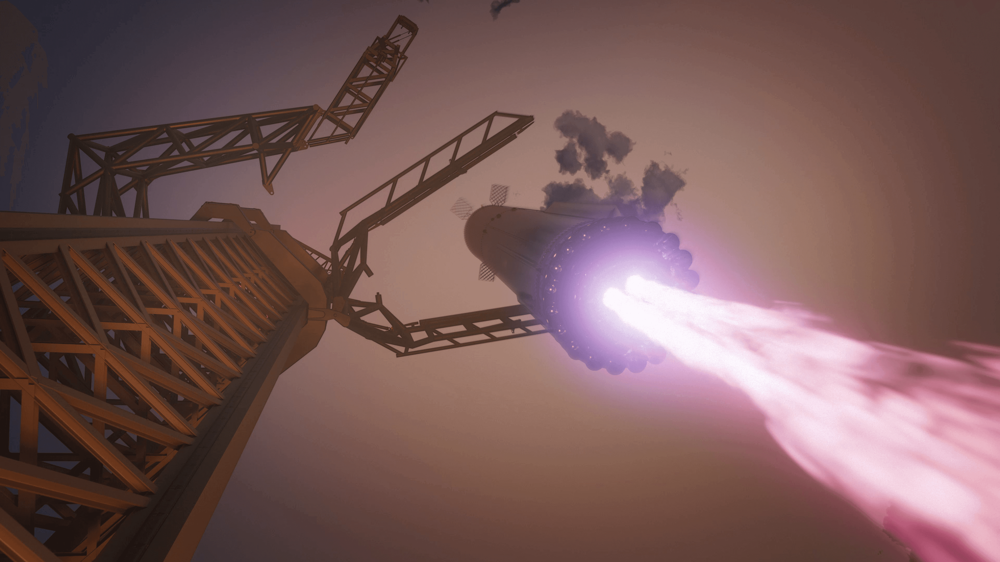

# Scientific breakthroughs for 3D-Printing Starships

Article on x.com: [Scientific breakthroughs for 3D-Printing Starships](https://x.com/skyisuniverse/status/2019823655442624522)

From [my conversation with Grok on 3D-Printed Starship](https://x.com/i/grok/share/119aec79908b4ddaba9a34e872f70ceb)

To achieve **100% printing of a Starship**-class rocket (full monolithic or near-monolithic structure, integrated engines like complete Raptors, avionics/embedded systems, heat shield interfaces, flaps, plumbing, and all subsystems) using a hypothetical megaforge-scale 3D printer, several major scientific and engineering breakthroughs would be required. These build on current 2026 progress (e.g., NASA's blown-powder directed energy deposition for large nozzles, Relativity Space's horizontal Stargate printers for major sections and engines, SpaceX's advanced metal AM in Raptor iterations, and emerging multi-material/large-format capabilities), but the full leap to a single-campaign or minimally-assembled vehicle at ~9 m diameter and 50–70 m height involves overcoming fundamental physics, materials, and process limits.

## Breakthroughs

Here are the key breakthroughs needed, grouped by category, with explanations of why they're essential and what specific advances would enable them:

### 1. Extreme Scale and Build Volume in Metal Additive Manufacturing

- **Gigantic, distortion-free large-format printers**: Current systems (e.g., Stargate Gen4 or similar robotic DED/WAAM) handle sections up to tens of meters but face sagging, thermal warping, and layer inconsistencies in very tall/ massive prints. Breakthrough: Hybrid robotic swarms or gantry systems with real-time adaptive support (e.g., in-process temporary scaffolds or magnetic/electromagnetic levitation aids) to build vertically/horizontally without gravity-induced defects. AI-driven predictive distortion compensation (using digital twins and ML) to adjust energy input/layer paths dynamically.

- **Ultra-high deposition rates with fine resolution**: Printing a full stage in weeks/months requires 100–1000× faster rates than today's ~kg/hour for large metal parts, while retaining sub-mm features (e.g., cooling channels). Breakthrough: Multi-laser/multi-wire hybrid DED or advanced electron-beam systems with parallel heads, plus plasma/laser stabilization for consistent melt pools at scale.

### 2. Materials Science for Cryogenic, High-Thrust, and Multi-Extreme Environments

- **Advanced printable alloys with wrought-equivalent properties**: Stainless steels, Inconels, copper alloys (e.g., GRCop variants), and titaniums printed today often suffer from anisotropy (directional weakness, 20–30% lower strength in build direction), porosity, residual stresses, and reduced fatigue life under cryogenic cycling/thrust loads. Breakthrough: Novel powder/wire feedstocks with nano-engineered microstructures (e.g., oxide-dispersion strengthened or gradient alloys) that achieve isotropic properties post-build, rivaling forgings. In-situ alloying during deposition to create functionally graded materials (FGMs) – e.g., high-conductivity copper cooling channels seamlessly transitioning to high-strength nickel superalloys in engine zones.

- **Printable high-temperature ceramics and ablatives**: For heat shields (replacing ~18,000 tiles) and reentry protection. Breakthrough: Large-scale direct ceramic AM or hybrid metal-ceramic co-printing with graded interfaces to prevent cracking/delamination under thermal shock (>2000 K gradients).

### 3. True Multi-Material and Functional Integration at Scale

- **Seamless multi-material large-format printing**: Current AM is mostly single-material or limited gradients; full avionics embedding needs metals + ceramics + polymers + conductors. Breakthrough: Advanced multi-material DED or fused deposition with nanoscale control (e.g., aerosol jetting for conductors, simultaneous deposition of dielectrics/electronics). This enables printed wiring channels, sensors (strain/temperature), solid-state batteries, and RCS micro-nozzles directly in structural walls.

- **Monolithic engine printing with moving/compliant parts**: Raptors require turbopumps, valves, gimbal actuators. Breakthrough: Printing of dynamic features (e.g., compliant mechanisms for gimbals, lattice-cooled turbine blades) or post-print minimal assembly. Full integration of injectors, preburners, and nozzles as one piece, eliminating brazes/welds.

### 4. In-Process Intelligence, Quality Assurance, and Certification

- **Real-time, zero-defect monitoring and correction**: Porosity, cracks, or inclusions are catastrophic in cryogenic/high-pressure parts. Breakthrough: Integrated multi-sensor arrays (X-ray, ultrasound, thermal imaging, acoustic emission) with AI/ML for instant defect detection + adaptive correction (e.g., re-melting layers or adjusting parameters). Probabilistic qualification models for "born-certified" parts.

- **Post-processing at gigascale**: Hot isostatic pressing (HIP), heat treatment, and machining for critical surfaces (e.g., nozzle throats). Breakthrough: Stadium-sized HIP autoclaves or in-printer cryogenic/thermal environments to minimize distortion.

### 5. Physics and Environmental Challenges for Monolithic Builds

- **Microgravity/vacuum/radiation-tolerant processes** (if extending to in-space printing): Not strictly needed for Earth-built Starship, but for future orbital refueling/repair. Breakthrough: Adapted AM for vacuum (no outgassing issues) and radiation-hardened electronics/materials.

- **Thermal management during massive builds**: Heat buildup causes warping/cracking in large volumes. Breakthrough: Active cooling integrated into printer (e.g., cryogenic shrouds) and gradient energy deposition.

## Timeline and Realism (as of February 2026)

Many pieces exist in prototype form (e.g., NASA's DED for large nozzles with fine channels in months, monolithic thrust chambers reducing parts from 100+ to ~5, Relativity's path to printing major rocket sections with 100× fewer parts). The full 100% monolithic Starship would likely require 10–30+ years of converging advances, driven by AI-optimized design, quantum-accelerated materials discovery, and massive investment (similar to how chip fabs scaled). It would transform rocketry into a near-"grown" artifact: seamless, optimized, ultra-light, with radical simplicity and production speeds enabling fleets rather than single vehicles.

This pathway represents a manufacturing revolution, but it hinges on solving the interplay of scale, material fidelity, and integrated functionality.