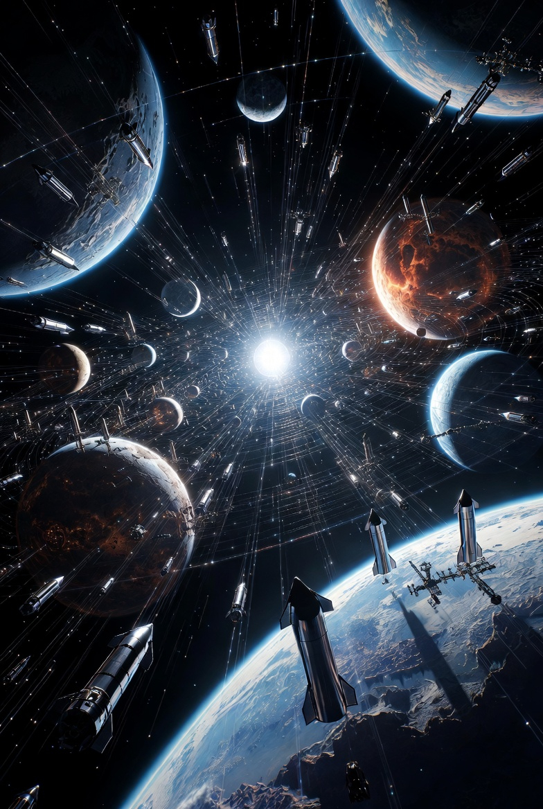

# Perspectives of planet colonization with fusion-powered Starship

Article on X: [Perspectives of planet  colonization with fusion-powered Starship](https://x.com/skyisuniverse/status/2027087760926876085)

From [my conversation with Grok on Starship with fusion engine](https://grok.com/share/bGVnYWN5_a2ed475b-ed76-4275-8e50-100255908a29)

From [my conversation with Grok on perspectives of planet colonization with fusion-powered Starship](https://x.com/i/grok/share/a758b095ee3b42679a451fe1a0f2aa33)

## Introduction

> Explore perspectives of colonization of each planet in the Solar System based on the assumption of fusion-powered Starship and these commute times for planets: Mercury (min distance ~77 million km): ~20 days Venus (min distance ~38 million km): ~14 days Mars (min distance ~55 million km): ~17 days Jupiter (min distance ~588 million km): ~56 days Saturn (min distance ~1,200 million km): ~80 days Uranus (min distance ~2,600 million km): ~118 days (~4 months) Neptune (min distance ~4,300 million km): ~152 days (~5 months)

Fusion-powered Starship transforms solar system colonization by slashing one-way commute times to weeks or months (per the provided minimum-distance estimates) and delivering abundant, compact energy anywhere. This removes two historic barriers: slow chemical-rocket travel (years for outer planets) and power scarcity (solar flux drops to ~1% of Earth's at Neptune). With fusion, habitats gain reliable electricity, propulsion, life-support recycling, and in-situ resource utilization (ISRU) at scale—making even distant outposts logistically viable.

Perspectives on colonization now span **scientific** (unique environments, potential subsurface oceans, astrobiology), **economic** (resources for fusion fuels, metals, volatiles; manufacturing in low-g or micro-g), **strategic/human-survival** (multi-planetary backup against Earth risks), **technological** (testing closed-loop biospheres, radiation shielding, low-g health solutions), and **ethical/philosophical** (expanding life vs. preserving pristine worlds; long-term isolation psychology). Challenges remain universal: radiation exposure, micro-/low-gravity health effects (bone/muscle loss, fluid shifts—worst on small moons), psychological isolation (communication lags up to hours in the outer system), and the need for fully closed ecosystems. Venus stands out with near-Earth gravity; everywhere else requires countermeasures or generational adaptation.

Below are planet-by-planet perspectives, focusing on the planet or its most relevant moons/atmospheres for realistic settlement.

## Mercury (~20 days)

**Closest and fastest-access terrestrial planet**. Extreme temperature swings (430 °C day / –180 °C night, 58-Earth-day "day"), no atmosphere, intense solar radiation/flares—but polar craters hold water ice and volatiles, and solar flux is 5–10× Earth's.

**Colonization concepts**: Underground or polar-rim bases (natural radiation shielding and near-constant sunlight via orbital mirrors or elevated solar arrays). Abundant iron, silicates, and metals for heavy industry; orbital solar-power satellites beaming energy system-wide.

**Perspectives**:

- **Economic/Industrial**: "Giant factory" or mining hub—export metals and solar energy. Proximity enables frequent crew rotations and resupply.
- **Scientific**: Ideal for Sun-weather studies and extreme-environment tech testing.
- **Human**: 0.38 g (Mars-like) avoids worst micro-g issues; short commute reduces isolation. Overlooked gem among futurists (e.g., concepts from Universe Today, ToughSF, and Isaac Arthur communities highlight self-sustaining colonies via local volatiles and power).
- **With fusion Starship**: Energy surplus + fast trips make Mercury a "solar-system battery and workshop" rather than a hardship post.

(Conceptual surface/habitat bases—polar crater sites would use similar shielded domes.)

## Venus (~14 days)

**Shortest commute and near-Earth gravity (0.9 g)**. Surface is hellish (460 °C, 92 bar, sulfuric acid), but at 50–60 km altitude the atmosphere offers Earth-like temperature (20–30 °C), pressure (~1 bar), and breathable air (N₂/O₂ mix) as a lifting gas—stronger buoyancy than helium on Earth.

**Colonization concepts**: Floating aerostat cities or cloud platforms (NASA HAVOC study, Geoffrey Landis proposals). Cities drift in super-rotating winds; telerobots explore the surface. No surface terraforming needed initially.

**Perspectives**:

- **Human/Settlement**: Often called "easier than Mars" by advocates—full Earth gravity prevents bone/muscle loss; Earth-like air/pressure simplifies habitats. Mobile cloud cities could house thousands, with solar power abundant above the clouds.

- **Scientific**: Perfect laboratory for runaway-greenhouse climate science and atmospheric chemistry; potential for aerial life searches.

- **Economic**: Atmospheric resources (CO₂, sulfur compounds); possible export of refined materials or tourism.

- **Debate**: Reddit/futurology communities and papers contrast it favorably vs. Mars domes. Challenges include acid corrosion, high winds, and slow rotation (243-Earth-day "day").

- **With fusion Starship**: 14-day trips enable commuter-scale crews; fusion powers station-keeping, manufacturing, and ascent vehicles.

## Mars (~17 days)

**Best-studied and most politically visible target**. Thin CO₂ atmosphere, global water ice, ~24-hour day, but cold (–60 °C avg), dusty, high radiation (no global magnetic field), toxic perchlorates, and 0.38 g.

**Colonization concepts**: Surface/underground habitats with ISRU (oxygen from CO₂, methane fuel, sulfur-based "Martian concrete," aeroponics/algae farms). Long-term terraforming debated (thickening atmosphere, introducing greenhouse gases).

**Perspectives**:

- **Settlement/Expansion**: Primary focus for NASA, SpaceX, and many agencies—feasible first "new world." Fusion enables rapid buildup of heavy industry and shielded cities.

- **Scientific**: Ancient habitability clues, potential extant microbes in ice.

- **Economic**: Resources for propellant and construction; stepping-stone to asteroids.

- **Challenges**: Dust storms, low-g health (still unsolved long-term), psychological factors in isolated domes. Recent papers (e.g., 2024 PMC blueprint) emphasize radiation shielding (0.66 Sv round-trip minimum without advances) and sustainable food/power.

- **With fusion Starship**: 17-day transits + onboard fusion power turn Mars into a thriving outpost within decades rather than centuries.

## Jupiter (~56 days)

**Gas giant—no solid surface**. Extreme radiation belts (worst in the system from its magnetic field), crushing gravity, and high winds make direct atmospheric floating habitats speculative and hazardous.

**Colonization focuses on moons**:

- Callisto (lowest radiation, possible subsurface ocean).

- Ganymede (largest moon, own magnetic field, possible ocean).

- Europa (subsurface ocean—high astrobiology interest—but intense radiation).

**Perspectives**:

- **Scientific**: Prime astrobiology target (potential life in oceans); radiation and magnetosphere studies.

- **Resource**: Hydrogen/helium for fusion fuel, though extraction risky.

- **Human**: Radiation demands massive shielding or subsurface habitats on moons; low-g (0.13–0.18 g) issues. ToughSF and worldbuilding discussions note Callisto as safest Galilean outpost.

- **With fusion Starship**: 56 days is manageable; fusion power could enable magnetic shielding or beamed energy for moon bases.

## Saturn (~80 days)

Rich in deuterium and helium-3 for fusion. Milder radiation than Jupiter; atmospheric floating colonies possible in theory (Earth-like gravity at certain depths, but high winds).

Prime moons:

- **Titan**: Thick N₂/CH₄ atmosphere (1.5 bar), hydrocarbon lakes/rivers, –180 °C, all life elements present, 0.14 g.

- **Enceladus**: Easy-access water plumes from subsurface ocean, organics.

**Perspectives**:

- **Economic**: Fusion-fuel "refinery" for the outer system; Titan's organics and nitrogen ideal for life support and plastics.

- **Human/Settlement**: Titan often ranked most hospitable outer body—dense atmosphere eases landing, protects from radiation; potential for "Earth-like" surface habitats under domes or with imported heat. Enceladus offers abundant water.

- **Scientific**: Titan's prebiotic chemistry; Enceladus astrobiology.

- **Challenges**: Cold, low-g on moons, methane haze. Zubrin and others envision a developed Saturn system exporting fusion fuels.

- **With fusion Starship**: 80 days still allows regular traffic; local fusion makes self-sufficiency rapid.

## Uranus (~118 days / ~4 months)

**Ice giant**. No surface; atmosphere rich in helium-3 (easier delta-v extraction than Jupiter per some analyses). Extreme axial tilt (98°) creates bizarre seasons.

**Moons** (Miranda, Ariel, Umbriel, Titania, Oberon): Icy, possible subsurface oceans (recent reanalysis of Voyager 2 data + modeling), abundant water ice/volatiles, very low radiation.

**Perspectives**:

- **Economic**: Fusion-fuel source; ice for propellant and life support.

- **Scientific**: Ice-giant formation clues; potential habitability of moon oceans.

- **Human**: Low-g (0.04 g on larger moons) and extreme cold demand fusion-powered habitats. Zubrin groups it with Saturn/Neptune as outer "Persian Gulf." Distance makes it a long-term outpost.

- **With fusion Starship**: 4-month trips feasible for committed crews; fusion solves power in the dim sunlight (~0.3% Earth's).

## Neptune (~152 days / ~5 months)

**Farthest major planet**. Similar to Uranus—fusion-fuel reservoir; Triton (largest moon) is a captured Kuiper-Belt object with nitrogen geysers, thin atmosphere, possible subsurface ocean, and the solar system's coldest surface (~–235 °C).

**Perspectives**:

- **Economic/Strategic**: Ultimate fusion-fuel depot and deep-space waypoint; Triton offers nitrogen and ice.

- **Scientific**: Dynamic geology on Triton; ice-giant mysteries.

- **Human**: Extreme isolation (communication lag ~4 hours one-way); low-g (Triton 0.08 g). Concepts treat it as a research/mining outpost rather than mass settlement.

- **With fusion Starship**: 5-month transits become routine supply runs; local fusion enables permanent bases where solar power is negligible.

**Overall outlook**: Inner planets (Mercury–Mars) suit early, large-scale human expansion due to short trips and varied resources. Outer planets shine for specialized roles—fusion-fuel economies (Saturn–Neptune) and astrobiology. Fusion Starship democratizes access, shifting the debate from "Can we reach it?" to "What do we build once there?" and "How do we ethically steward these worlds?" Long-term, a networked solar-system civilization could emerge, with regular traffic, shared resources, and humanity no longer single-planet-bound. The biggest unknowns remain human adaptation to partial gravity and the psychology of truly isolated communities—but abundant energy and fast travel make those solvable engineering and social challenges rather than show-stoppers.