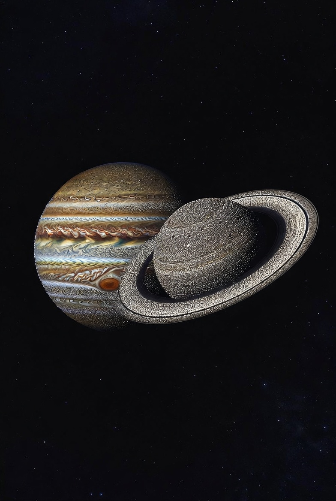

# Perspectives of restructuring gas giants (Jupiter, Saturn, Uranus, Neptune)

Article on X: [Perspectives of restructuring gas giants (Jupiter, Saturn, Uranus, Neptune)](https://x.com/skyisuniverse/status/2027096443907952835)

From [my conversation with Grok on Starship with fusion engine](https://grok.com/share/bGVnYWN5_a2ed475b-ed76-4275-8e50-100255908a29)

From [my conversation with Grok on perspectives of planet colonization with fusion-powered Starship](https://x.com/i/grok/share/a758b095ee3b42679a451fe1a0f2aa33)

From [my conversation with Grok on Perspectives of Planet Colonization based on Planet Composition](https://x.com/i/grok/share/742e7032e8944794b5016e01618e82aa)

From [my conversation with Grok on Possibilities for Terraforming Planets in Solar System](https://x.com/i/grok/share/ed4e099c8a4b4b94812c7e3dddaecf59)

From [my conversation with Grok on Perspectives of Restructuring Gas Giants (Jupiter, Saturn, Uranus, Neptune)](https://x.com/i/grok/share/6bd7ef07a4a94925bf4820360657443e)

## Introduction

**Radical restructuring of gas and ice giants** (Jupiter, Saturn, Uranus, Neptune) goes far beyond paraterraforming (floating cloud cities or aerostats in the existing atmosphere). With unlimited fusion energy and molecular nanotechnology (MNT)—self-replicating assemblers that can break down and rebuild matter atom-by-atom, plus complementary breakthroughs in synthetic biology, AI planetary control, exotic materials, and mass manipulation—it becomes possible to treat the entire planet as raw feedstock and re-engineer it into fundamentally new habitable architectures.

These projects operate on **millennia timescales** (1,000–10,000+ years) even with exponential MNT replication, simply due to the masses involved (Jupiter is 318 Earths; even disassembling “just” the outer layers is a planetary-scale endeavor). Physics is not violated—conservation of mass/energy holds—but the engineering is god-like in scope. Here are the main possibilities, ordered from “ambitious but grounded” to “truly exotic.”

## 1. Shell Worlds / Enclosed Megastructures (Most Plausible Radical Option)

Build a rigid, lightweight outer shell (diamondoid, graphene composites, or MNT metamaterials) at a carefully chosen radius where surface gravity is Earth-like (~1 g). The original gas giant (or its remnant) sits inside like a yolk.

**Construction**:

- MNT swarms mine the upper atmosphere for carbon, hydrogen, and trace elements, then extrude the shell layer-by-layer. Fusion-powered mass drivers or laser arrays lift material into place. Internal supports or active buoyancy systems prevent collapse.

**Habitability Features**:

- Inner surface becomes “ground”: MNT-synthesized soil, oceans, and atmosphere (imported or manufactured volatiles).

- Artificial lighting via internal fusion lamps or sunlight piped through the shell.

- Contained biosphere with designer ecosystems—potentially engineered for low-gravity gigantism or novel biomes.

- Radiation shielding built into the shell; magnetic fields generated by superconducting loops.

**Examples**:

- A Jupiter-sized shell could offer hundreds of times Earth’s surface area.
- Saturn’s rings provide ready-made construction material.
- Uranus/Neptune are easier (more ices, less extreme radiation).

**Timeline**: 1,000–5,000 years after seeding MNT factories. First habitats appear in centuries as partial shells or “sky islands.”

## 2. Artificial Solid Surfaces / Floating Continents or Platforms

Create stable “ground” within or on the fluid layers without fully enclosing the planet.

**Methods**:

- MNT extrudes vast diamondoid or composite platforms that float at constant-pressure altitudes (buoyancy tuned via active systems).

- Anchor them with tethers or magnetic levitation to deeper layers.

- Layer-by-layer deposition: convert metallic hydrogen or imported rock into a crust kilometers thick.

**Habitability**:

- Traditional surface cities, farms, and geology on the platforms.

- Vertical cities descending into the atmosphere for resource access.

- Mobile continents that can migrate to optimal wind zones.

**Best For**: Saturn (milder radiation, beautiful ring views) or ice giants (more solid building blocks).

**Timeline**: Centuries for initial large platforms; millennia for continent-scale coverage.

## 3. Atmospheric Stripping & Core Exposure

Remove the gaseous envelope to expose or enhance the rocky/icy core.

**Process**:

- Fusion-powered mass drivers, laser sails, or MNT “skyhooks” eject hydrogen/helium (exported as fusion fuel or habitat material elsewhere).

- For Jupiter/Saturn: Reveal the ~10–20 Earth-mass core and terraform it into a super-Earth (add atmosphere, water, biosphere via MNT).

- For Uranus/Neptune: Easier—cores are larger and icier; less gas to remove.

**Outcome**: A new solid planet where none existed, with Earth-like gravity and open-air habitability.

**Timeline**: 2,000–10,000 years (ejecting planetary masses is the bottleneck, even with exponential replicators).

## 4. Full Disassembly into Habitat Swarms or Ringworlds

The most transformative: completely dismantle the giant and repurpose every kilogram.

**Methods**:

- MNT disassemblers break down the atmosphere and core.

- Rebuild the material into:
    - Billions of O’Neill cylinders or Stanford torii in orbit around the remnant.
    - A full Ringworld (Niven-style) using the planet’s mass for the ring structure.
    - A Dyson swarm of habitats powered by the Sun (or fusion from the stripped hydrogen).

- **Habitability**: Millions of customizable Earth-like worlds with perfect 1 g rotation, any climate desired, and total surface area dwarfing all solid planets combined.
- **Timeline**: 5,000–20,000+ years. Starts with atmospheric mining and scales outward.

## Practical and Philosophical Considerations

- **Energy & Replication**: Unlimited fusion solves power; MNT replication (one seed → planetary workforce in months) solves labor. The real limit is heat dissipation and coordination—AI swarms handle this.
- **By-Products**: Stripped hydrogen becomes an inexhaustible fuel export for the rest of the Solar System. Radiation (especially Jupiter) is managed with MNT shielding during construction.
- **Comparison to Paraterraforming**: Floating cities are quicker (centuries) and reversible. Radical restructuring is for when population pressure or ambition demands planetary-scale real estate.
- **Ethics & Alternatives**: Irreversible destruction of the original world raises questions about scientific value (Jupiter’s magnetosphere, possible deep chemistry) or aesthetics. Many scenarios prefer terraforming the moons (Callisto, Titan, etc.) while using the giant as a fuel mine—less disruptive and faster.
- **Human Adaptation**: Inhabitants on new shells or platforms could be baseline humans or genetically/MNT-enhanced for the environment (e.g., low-g tolerance during transition).

In visionary futures (e.g., Orion’s Arm-style settings or far-future hard sci-fi), gas giants are routinely restructured into “Ymir-class” shell worlds or disassembled into habitat swarms. A single Jupiter could become the equivalent of thousands of Earths. With MNT and fusion, the gas giants cease being “uninhabitable” and become the largest canvases in the Solar System—raw material for humanity’s next great engineering era.

These are not near-term projects, but they are physically credible extensions of the same technologies that make Mars and Venus fully terraformable in centuries. The Solar System’s gas giants, once barriers, become opportunities for the ultimate expression of planetary engineering.