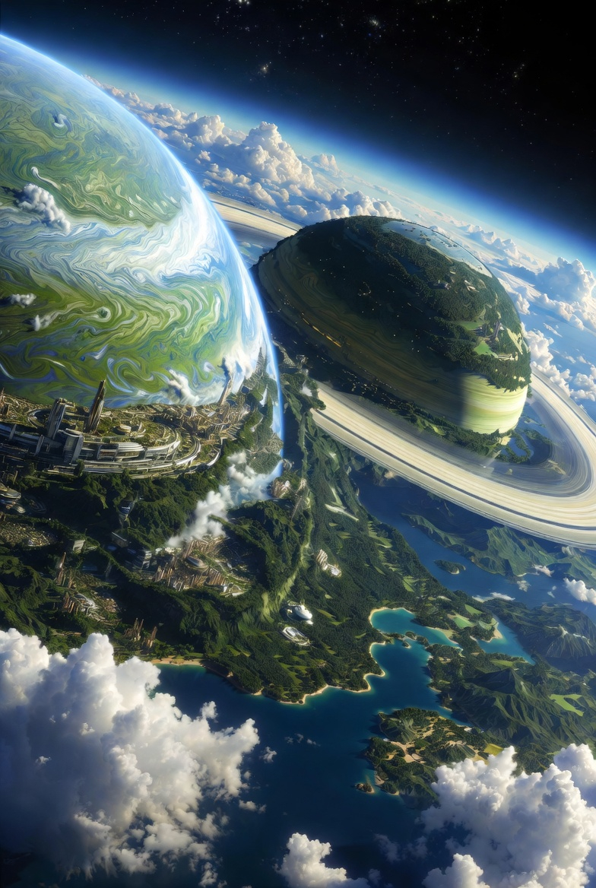

# Possibilities for Terraforming Planets in the Solar System

Article on X: [Possibilities for Terraforming Planets in the Solar System](https://x.com/skyisuniverse/status/2027093955439923634)

From [my conversation with Grok on Starship with fusion engine](https://grok.com/share/bGVnYWN5_a2ed475b-ed76-4275-8e50-100255908a29)

From [my conversation with Grok on perspectives of planet colonization with fusion-powered Starship](https://x.com/i/grok/share/a758b095ee3b42679a451fe1a0f2aa33)

From [my conversation with Grok on Perspectives of Planet Colonization based on Planet Composition](https://x.com/i/grok/share/742e7032e8944794b5016e01618e82aa)

From [my conversation with Grok on Possibilities for Terraforming Planets in Solar System](https://x.com/i/grok/share/ed4e099c8a4b4b94812c7e3dddaecf59)

## Introduction

> Explore the possibilities for terraforming planets in the Solar System and making them habitable based on all possible scientific breakthroughs (including nanotech with MNT and nanoassembly and other) (given stable fusion and limitless free energy)

**With stable fusion providing limitless, cheap energy anywhere and molecular nanotechnology (MNT)—self-replicating assemblers capable of atom-by-atom construction and disassembly—plus complementary breakthroughs (synthetic biology, advanced AI for planetary modeling/control, designer organisms, exotic materials, and genetic engineering), terraforming the Solar System becomes not just feasible but a spectrum of engineering projects with dramatically shortened timelines.**

Unlimited energy powers planetary-scale interventions: orbital mirror arrays or laser arrays for heating/cooling, mass drivers for material transport, atmospheric processors running at gigawatt scales, and fusion-powered rockets for comet/asteroid redirection. MNT enables precise, exponential changes—swarms of nanobots can scrub atmospheres molecule-by-molecule, synthesize custom soils or greenhouse gases, build self-repairing infrastructure, or engineer ecosystems from raw elements. Synthetic biology adds living tools: microbes that convert CO₂ to O₂ at industrial rates or plants engineered for alien conditions. AI optimizes every step in real time.

Ethical and practical caveats apply: preserving potential native life (e.g., Mars or Europa), avoiding unintended consequences, and human adaptation (genetic or technological) for partial-gravity worlds. Timelines assume aggressive deployment post-2050–2100; actual pace depends on societal will.

## Mars (Most Feasible: Decades to Centuries for Full Open-Air Habitability)

Mars is the poster child. Current issues: thin CO₂ atmosphere (~0.6% Earth pressure), average –60 °C, high radiation, toxic perchlorates, low gravity (0.38 g).

**Step-by-Step with Breakthroughs**:

- **Warming & Thickening Atmosphere** (Years–Decades): Fusion-powered orbital mirrors or ground heaters melt polar CO₂ caps. MNT swarms release stored volatiles and manufacture super-greenhouse gases (e.g., custom perfluorocarbons). Comets redirected for water/ammonia.

- **Oxygen & Soil Creation** (Decades): Engineered cyanobacteria and nanobots convert CO₂ to O₂ while breaking down perchlorates. MNT assembles fertile regolith from minerals, creating topsoil at scale.

- **Hydrosphere & Biosphere** (Decades–Centuries): Liquid oceans form in basins (e.g., Hellas, northern lowlands). Synthetic biology seeds algae, then complex plants/animals. AI-managed ecosystems stabilize climate.

- **Radiation & Gravity Mitigation**: Magnetic shields (fusion-powered superconducting loops at L1 point) or orbital dust rings reduce radiation. Low-g addressed via genetic tweaks or rotating habitats during transition.

**Outcome**: Breathable N₂/O₂ atmosphere, stable liquid water, forests, and open skies. Full Earth-like conditions possible in 100–300 years. Maps show a blue-green world with oceans covering ~30–50% of the surface. Habitats evolve from domes to open cities. With MNT, self-replicating infrastructure accelerates everything exponentially.

## Venus (Challenging but Transformative: Centuries)

Extreme greenhouse (460 °C surface, 92 bar CO₂, sulfuric acid clouds). Rotation is slow and retrograde.

**Breakthrough Pathway**:

1. **Cooling** (Decades): MNT-built solar shades (trillions of lightweight reflectors at L1) block sunlight. Fusion-powered atmospheric "scrubbers" (nanobot swarms or floating factories) disassemble CO₂ into carbon structures (graphene, diamondoid) and oxygen. Sulfuric acid is neutralized or precipitated.

2. **Water Import & Hydrosphere** (Decades–Centuries): Redirect icy bodies from outer Solar System (MNT-guided precision impacts). Hydrogen + oxygen reactions create oceans.

3. **Atmosphere & Rotation** (Centuries): MNT converts excess CO₂/N₂ into breathable mix. Speculative mass drivers or asteroid flybys gradually spin up the planet for Earth-like day length.

4. **Biosphere**: Designer microbes seed the new atmosphere; nanotech builds soil on the cooled surface.

**Outcome**: A water world with continents, oceans, and blue skies. Floating cloud cities (already viable today) transition to surface megacities. Full habitability in 200–500 years. MNT makes material recycling and precise chemistry trivial.

## Mercury (Partial Terraforming Feasible: Decades–Centuries for Polar/Equatorial Zones)

Extreme temperature swings, no atmosphere, high radiation, but abundant metals and polar ice.

**Pathway**:

- MNT swarms excavate and process regolith for a thick atmosphere (imported volatiles + local materials).

- Orbital mirrors create "eternal daylight" zones; fusion cooling for nights.

- Underground or crater-rim habitats expand into open settlements under a manufactured magnetosphere and atmosphere.

- Full global terraforming harder due to proximity to Sun and slow rotation, but habitable "oases" or domed continents possible.

## Icy Moons (Europa, Enceladus, Titan, Triton, Uranian/Neptunian Moons: Variable, Often Subsurface-First)

These have abundant water ice/volatiles and potential subsurface oceans.

**General Approach**:

- Fusion/mirrors to melt surface ice or thicken atmospheres.
MNT to engineer ocean access (drilling through ice shells with nanobots) or surface crusts.

- Titan: Warm and add O₂ to existing thick N₂/CH₄ atmosphere; engineer methane cycle into water-based.

- Europa/Enceladus: Protect/expand subsurface oceans with life-seeding; build surface or under-ice habitats that become open-air with imported atmosphere.

- Result: Earth-like surface or ocean worlds in 50–300 years. MNT allows precise ecosystem design without contaminating potential native life.

## Gas/Ice Giants (Jupiter, Saturn, Uranus, Neptune: Paraterraforming or Extreme Speculation)

No solid surface—mostly fluid H/He or ices.

**Realistic Options**:

- **Atmospheric Engineering**: MNT floating factories extract D/He-3 while building vast aerostat biospheres or "cloud continents" with engineered buoyancy and ecosystems. Fusion stabilizes platforms against winds.
- **Moons-First Strategy**: Fully terraform the solid moons (e.g., Callisto, Titan) as primary habitats, using the giant for fuel export.
- **Wild-Card Speculation** (Millennia+): MNT disassembles outer layers or builds artificial "shells"/platforms around cores. Create floating ring-worlds or engineered solid surfaces from imported/extracted material. With unlimited energy and nanoassembly, physics allows "Dyson-scale" habitats within the atmosphere, but gravity gradients and radiation (Jupiter) remain huge challenges.

**Overall Feasibility Ranking & Timelines** (Aggressive Scenario):

- Mars: 50–200 years for open air.

- Venus: 200–600 years.

- Icy moons: 50–400 years (subsurface faster).

- Mercury: 100–300 years for regional habitability.

- Gas giants: Centuries for paraterraforming; millennia for radical restructuring.

**Game-Changing Role of MNT + Fusion**:

- Traditional terraforming (mirrors, algae, comets) is slow and brute-force. MNT turns it exponential: a single replicator seed can grow into a planetary workforce in weeks.

- Unlimited energy removes all power constraints—run continent-sized processors indefinitely.

- Hybrid human adaptation (nanotech implants, genetic redesign) allows earlier habitation during partial stages.

In this future, the Solar System could host trillions of humans across multiple fully Earth-like worlds, with gas giants serving as infinite fuel reservoirs and the entire system managed like a garden. The limiting factors shift from physics and energy to ethics, governance, and the desire to preserve pristine environments. With these breakthroughs, "making planets habitable" becomes a solvable engineering challenge rather than science fiction.