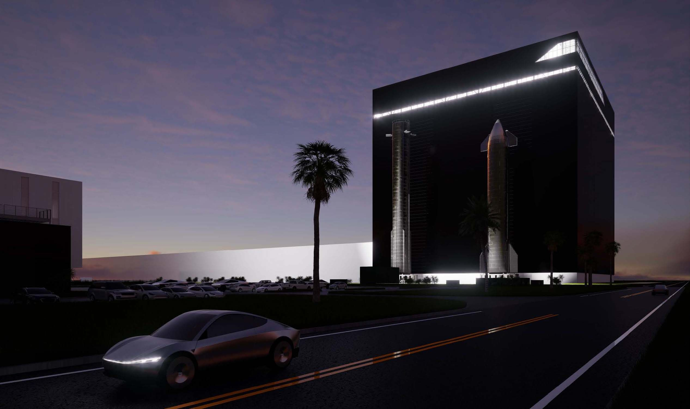

# SpaceX automated with Optimi

Article on x.com: [SpaceX automated with Optimi](https://x.com/skyisuniverse/status/2020114234130964540)

From [my conversation with Grok on automating SpaceX with Optimi robots](https://x.com/i/grok/share/f736837b930f4297b0286610c8263d9b)

## Introduction

If all **SpaceX** operations—including rocket manufacturing (Falcon 9, Starship), Starlink satellite production and assembly, engine production (Raptor), factories (Hawthorne, Starbase/Boca Chica, McGregor, etc.), launch site operations, integration, testing, supply chain handling, and administrative/support roles—were fully automated using Tesla's **Optimus** humanoid robots deployed at scale, the impacts would be transformative. This assumes mature, reliable Optimus robots (Gen 3+ by 2026+) capable of complex, dexterous, variable tasks in aerospace environments, with AI/software handling supervision, quality control, and adaptation.

## Current scale

SpaceX's current scale (as of early 2026) provides a baseline:

- Revenue: Approximately **$15–16 billion** in 2025 (Starlink ~60–70%, or ~$10–12 billion; launches/contracts the rest).
- Employees: Roughly **13,000–16,000** total (e.g., ~7,600 in Hawthorne/LA area alone in 2025, plus thousands in Texas, Florida, etc.).
- Profit: ~$8 billion EBITDA/profit in recent reports.
- Valuation: Private estimates ~$800 billion to $1.5+ trillion potential at IPO.

## Labor and Cost Savings Estimates

Aerospace manufacturing/engineering roles at SpaceX involve skilled labor (welding, assembly, machining, inspection, logistics). Average employee compensation (salary + benefits) likely ranges **$100,000–$130,000/year** (manufacturing engineers ~$90k–$113k base, higher for seniors/specialists; overall average ~$100k–$128k from reports).

Assuming ~12,000–15,000 workers in operational/manufacturing roles (excluding high-level engineers/execs that might remain for oversight):

- Annual labor cost: **$1.2–2 billion** (conservative; total payroll could be higher including benefits/overhead).
- Optimus replacement: If 1 robot replaces ~0.8–1.2 human FTE (accounting for 24/7 operation minus maintenance/downtime, vs. human shifts), SpaceX might need **10,000–20,000** Optimus units for full coverage (factories run multiple shifts; robots enable continuous production).

Per-unit costs (based on Musk/targets and analyst estimates):

- Production/BOM cost: **$30,000–$60,000** initially (2025–2026), dropping to **$20,000–$30,000** at scale (long-term target <$20,000).
- Upfront capital for 15,000 units: **$450 million–$900 million** (at $30k–$60k each), amortized over 5–10+ years (robots durable, upgradable via software).

Payback: Robots operate ~3–5× longer hours than humans with low marginal cost (energy/maintenance ~$5k–$10k/year/unit?). Annual savings from labor elimination: **$1–2 billion** (plus reduced HR, training, safety incidents, unions). Payback in **<1–2 years** after deployment.

Ongoing: Maintenance/energy/software updates might cost **$200–500 million/year**, but net savings **$800 million–$1.5+ billion/year**.

## Economic and Operational Impacts

- **Cost structure transformation**: Labor is ~10–15% of costs in advanced manufacturing. Full automation could cut operating expenses by **20–40%** (labor + related overhead), boosting margins dramatically. Profit could rise from ~$8 billion to **$12–15+ billion** on similar revenue (assuming no volume drop).

- **Production scaling**: 24/7 error-reduced operations → higher throughput. Starship/Starlink production could accelerate 2–5× faster (e.g., more satellites launched/month, more Starships built/year), potentially doubling revenue growth rate. Starlink subscribers (already ~9 million in late 2025) could expand faster to underserved/global markets.

- **Revenue upside**: Faster/cheaper launches → more contracts (NASA, DoD, commercial). Starlink deployment/repairs automated → lower capex per satellite, higher margins (already high-margin business). Hypothetical: Revenue could reach **$25–40+ billion** within 3–5 years post-automation (vs. current ~15–20% growth projections).

- **Valuation impact**: SpaceX trades at high multiples (~50–100× revenue) due to growth/moat. With 30–50%+ margins and accelerated scaling, valuation could surge to **$2–5+ trillion** (comparable to extreme AI/robotics hype scenarios). This aligns with Musk's vision where robotics drives massive value.

## Broader Macro/Economic Effects

**Productivity boom**: Space access cheaper/faster → accelerated space economy (satellite services, tourism, Mars prep). Global GDP lift from cheaper connectivity (Starlink) and space tech.

- Initial capex: $1–2 billion for robots + infrastructure retrofits.
- Technical: Optimus must handle precision tasks (e.g., Raptor welding, cleanroom satellite assembly); early versions limited.
- Energy: Factories need massive power for 24/7 robots.

In summary, full Optimus automation could save **$1–2 billion/year** in labor, boost margins/profits by **50%+**, and enable explosive scaling, potentially adding **trillions** to valuation long-term while transforming SpaceX into a near-fully robotic aerospace giant. This remains visionary/speculative—dependent on Optimus achieving reliable dexterity and cognition at scale—but aligns with Elon Musk's integrated Tesla/SpaceX roadmap.

## Dispersing ungrounded fears (due to lack of knowledge)

In scenarios of massive productivity gains from automation (like full-scale Optimus deployment across factories, assembly, testing, logistics, and even some launch ops), history shows companies rarely just "fire everyone and pocket the savings." Instead, they often **reinvest the freed-up resources** (time, capital, bandwidth) into acceleration, new projects, and expansion, which creates net new roles—often higher-skill, more creative, or strategic ones.

### Why Net Job Creation (Rather Than Pure Displacement) Is Plausible Here

SpaceX is already in hyper-growth mode, driven by Starship cadence goals, Starlink global expansion, new orbital data center ambitions (recently merged with xAI plans), potential Mars missions, point-to-point Earth transport concepts, and more frequent/lower-cost launches opening entirely new markets (e.g., in-space manufacturing, large constellations beyond Starlink, lunar/planetary infrastructure).

- **Historical pattern at SpaceX/Tesla**: Both companies have repeatedly used efficiency gains (reusable rockets, vertical integration, software automation) to **increase output dramatically** rather than shrink headcount. SpaceX workforce has grown steadily even as Falcon 9 became highly automated/reusable—employee numbers rose from ~5,000–6,000 in the early 2020s to estimates of **13,000–18,000+** by late 2025/early 2026 (with Hawthorne still at ~7,600–7,700 in 2025, Starbase pushing toward 8,000 planned for 2026, and overall figures varying by source but trending upward). Starbase alone is targeting nearly doubling its local workforce soon, supporting tens of thousands of indirect jobs in South Texas.

- **Automation enables scale that humans alone couldn't achieve**: If Optimus handles repetitive/dangerous/24/7 tasks (welding Raptors, assembling thousands of Starlink v3+ satellites per month, quality inspections, material handling), the bottleneck shifts to **human-led innovation, design iteration, complex problem-solving, regulatory navigation, new program development, and oversight of robotic swarms**. This could look like:
    - a) 5–10× faster Starship production → dozens of ships/year instead of handfuls → more test flights, orbital refueling demos, crewed missions → entirely new departments/teams for Mars surface ops, orbital habitats, etc.
    - b) Starlink subscriber base exploding (already millions; cheaper/faster deployment → billions in potential revenue) → new teams for ground infrastructure, regulatory per-country deals, enterprise sales, AI-optimized constellation management.
    - c) Emerging projects (e.g., orbital AI data centers requiring millions of satellites) → massive new engineering, software, manufacturing oversight, and deployment roles.

### Revised Job Impact Estimates in an Expansion Scenario

Assuming full Optimus automation of current repetitive/operational roles (~10,000–15,000 positions in manufacturing, integration, testing, logistics at Hawthorne, Starbase, McGregor, etc.):

- **Short-term (1–3 years post-deployment)**: Some displacement in routine roles (e.g., line assembly workers, basic technicians), but offset by:
    - a) Retraining/upskilling programs (SpaceX already invests heavily in this).
    - b) Net retention or modest growth as output ramps → perhaps **net zero to +2,000–5,000 jobs** initially, shifting toward engineers, robot fleet managers, AI trainers, simulation specialists, mission planners.

- **Medium-term (3–7 years)**: With 2–5× (or more) productivity, revenue could double or triple faster than baseline projections. This funds:
    - a) New factories/launch sites (e.g., more Starbases globally or offshore platforms).
    - b) New vehicle variants/programs (e.g., Starship derivatives for cargo, crew, fuel depots).
    - c) Result: **Net job creation of +10,000–30,000+** across SpaceX and ecosystem (supply chain, partners, new space economy startups). Local areas like Hawthorne (still major engineering hub) and Starbase (explosive growth) likely see **economic boom**, not hardship—higher tax base from expanded ops, more indirect jobs (construction, services, suppliers).

- **Long-term macro view**: In Musk's worldview (and economic theory like "abundance" from AI/automation), productivity explosions create wealth that funds new frontiers. Space access at 10–100× lower cost unlocks industries we can't yet imagine, employing far more people than displaced. SpaceX wouldn't shrink; it would evolve into a much larger, more diversified entity (rockets + satellites + in-space infrastructure + data/AI services).

Automation isn't about firing people; it's about **unlocking orders-of-magnitude more ambitious work** that requires even more talented humans to dream up and execute. The company would likely end up **larger and employing more people** overall, just in higher-leverage, more interesting roles. Local economies in California and Texas would benefit from the acceleration, not suffer short-term hits.