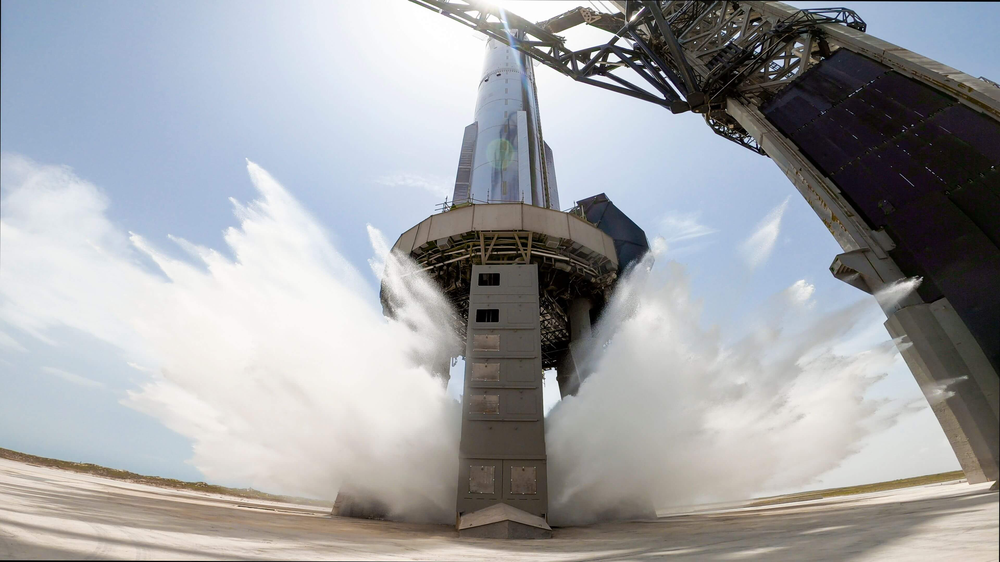

# Starship Forge AI

Article on x.com: [Starship Forge AI](https://x.com/skyisuniverse/status/2019910379820712206)

From [my conversation with Grok on AI for Designing Starships](https://x.com/i/grok/share/3c229eb4cab0445e80e074b87677a779)

## AI For Designing Starships

A hypothetical AI-powered tool for rocket development would be an in-browser, prompt-driven platform that transforms natural language descriptions into functional rocket designs, simulations, and manufacturing outputs. Let's call this conceptual tool "StarshipForge.ai" or similar, built on frontier multimodal AI agents (like advanced versions of Grok) combined with integrated physics engines, CAD generators, simulation suites, and direct interfaces to additive manufacturing systems.

### Description of the Tool

**Core Workflow** — Users (engineers, designers, or even program managers) start with high-level prompts in plain English, such as: "Design an optimized methane-LOX full-flow staged combustion engine with 300+ tons thrust, simplified plumbing like Raptor 3, integrated with a 9 m diameter stainless steel Starship upper stage using 30X alloy, including full thermal protection system (TPS) tile layout, avionics bay with redundant flight computers, and payload bay for 150 t to LEO reusable." The AI agent(s) would:

- Reason step-by-step across requirements (performance targets, mass budgets, structural loads, thermal constraints, reusability goals).
- Generate or iterate on 3D CAD models (e.g., in formats compatible with SolidWorks, NX, or open-source like FreeCAD/Onshape equivalents) for the entire vehicle: tanks, domes, thrust structure, engines (including turbopumps, injectors, nozzles), avionics, wiring harnesses, TPS tiles, flaps, catch interfaces, etc.
- Run integrated simulations: structural FEA (finite element analysis), CFD (computational fluid dynamics) for aerodynamics/propulsion, thermal modeling during reentry, trajectory optimization, and even basic control system simulations.
- Autonomously debug issues (e.g., "This injector face is overheating—reroute coolant channels and re-simulate").
- Output manufacturable files: sliced models for mega-scale 3D printers (e.g., directed energy deposition or wire-arc additive manufacturing for large stainless steel parts), welding paths, assembly sequences, and bills of materials.

### Key Features

- Multi-agent architecture: Switch between specialized agents (e.g., one for propulsion, one for structures, one for avionics).
- All-in-one infrastructure: Built-in access to high-fidelity sim tools, version history, collaboration (team workspaces), and direct export to production systems like SpaceX's Starfactory tools or hypothetical "megaforge" 3D printers for rocket-scale parts.
- Autonomous iteration: Reduces "error loops" in design (analogous to Bolt's 98% fewer coding errors) by self-correcting based on physics constraints and prior flight/test data.
- Scalability: Handle "1000x bigger projects" — full vehicle with 100,000+ parts vs. early prototypes.
- Integration: Pull real-world data (e.g., from Starship flight telemetry, material databases) and push designs to physical testing or additive manufacturing queues.

This tool would democratize advanced rocket engineering, allowing rapid "vibe designing" where you describe performance goals and get production-ready models in hours/days instead of months/years.

### Influence on Starship Development

- **Massive Acceleration in Design Iteration** — Instead of months between design freezes and prototypes, engineers could explore dozens/hundreds of variants per week (e.g., flap shapes for better catch reliability, engine gimbal optimizations, lighter tank domes). This compresses the iterative learning from flight tests, as more failures are caught in sims first. Starship could reach mature Block 3/4/5 designs faster, potentially shaving years off the path to high flight rate (e.g., weekly launches targeted ~12 months from certain points).
- **Shift Toward Generative/Production-Ready Designs** — Direct generation of CAD + manufacturing files for megaforge-style 3D printers could bypass much traditional fabrication (rolling/welding large cylinders). Entire ring sections, thrust structures, or even integrated engine mounts could be additively manufactured with minimal post-processing, reducing labor, welds (failure points), and lead times. This aligns with SpaceX's goal of extreme mass production (thousands/year eventually) but makes scaling smoother earlier.
- **Reduced Prototyping Waste and Cost** — Fewer physical "test articles" destroyed in early failures; more virtual validation. Combined with real flight data feedback loops into the AI, designs improve exponentially faster.
- **Production Rate and Scalability** — Current ops aim for high cadence through parallel factories and automation, but assembly remains labor-intensive. The tool enables "one-prompt" variants for different missions (e.g., tanker vs. crew vs. HLS), with automated generation of custom tooling/assembly paths. This could push toward true "1 ship per day" sooner by streamlining from design to fab, especially if integrated with robotic welding/assembly lines.
- **Potential Drawbacks/Limits** — Physical realities (material certs, extreme environments, regulatory certification for human-rated flight) still require real tests. AI hallucinations in physics could lead to bad designs if not validated. Early versions might excel at subsystems (e.g., engines, flaps) but struggle with full-system integration initially.

Overall, such a tool could transform Starship from an empirical, test-heavy program into something closer to rapid software-like iteration — dramatically shortening development timelines, slashing costs per iteration, enabling bolder optimizations, and accelerating the path to the high launch rates (dozens to hundreds per year) needed for lunar bases, Mars cities, and global point-to-point transport. It would represent a step toward "AI-native" aerospace engineering.