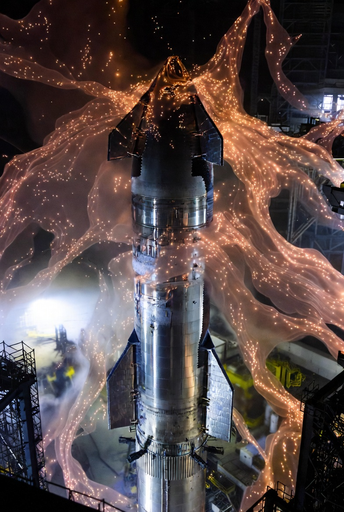
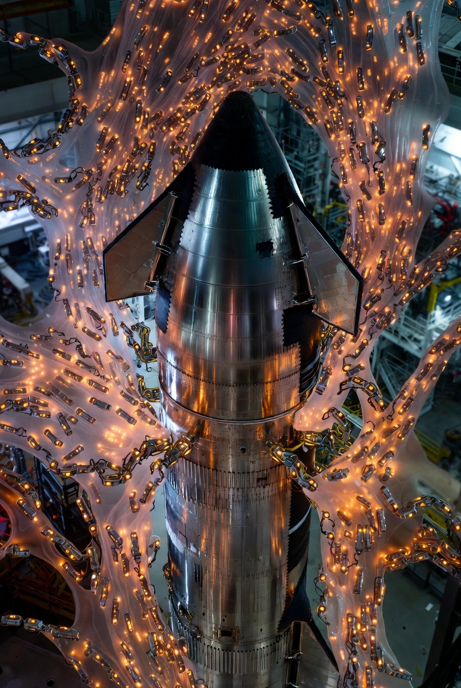
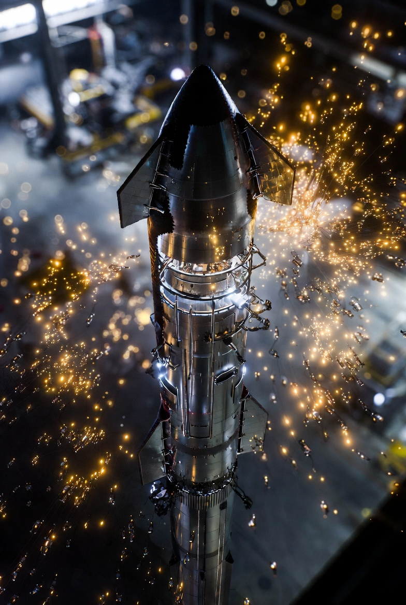
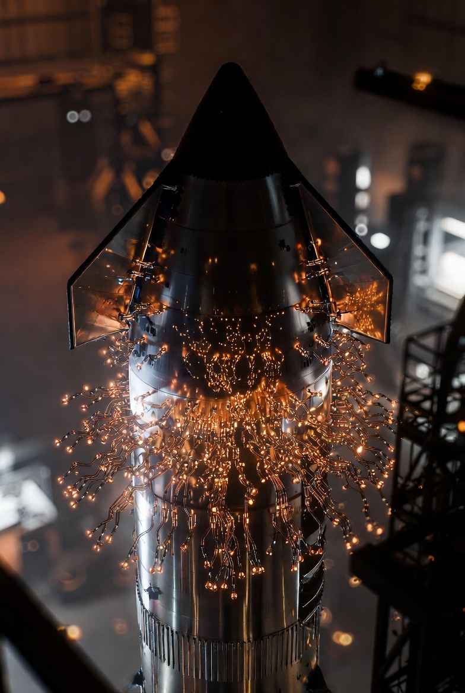
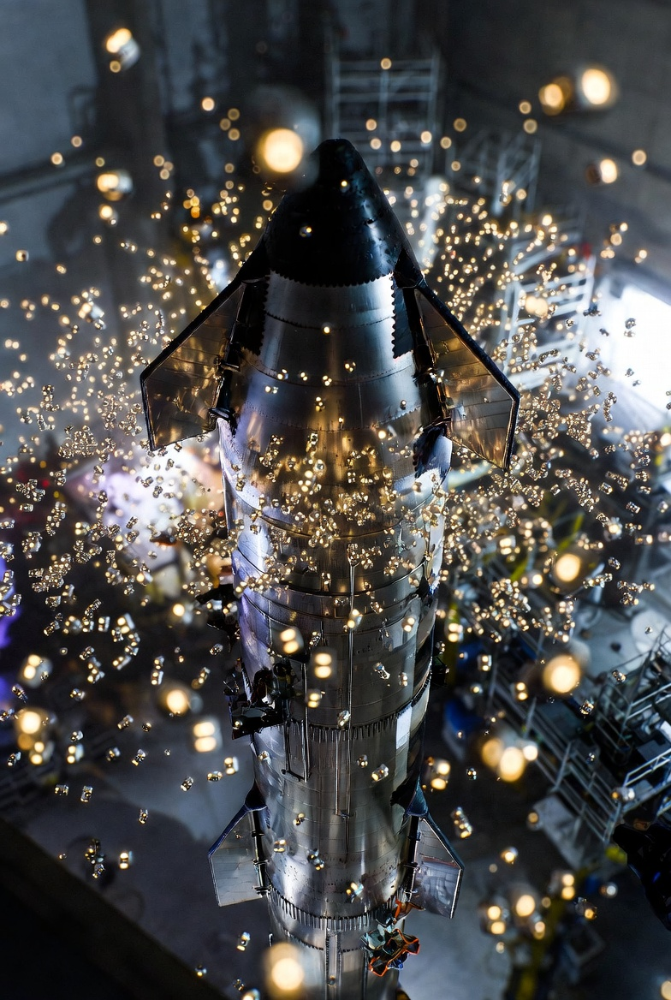
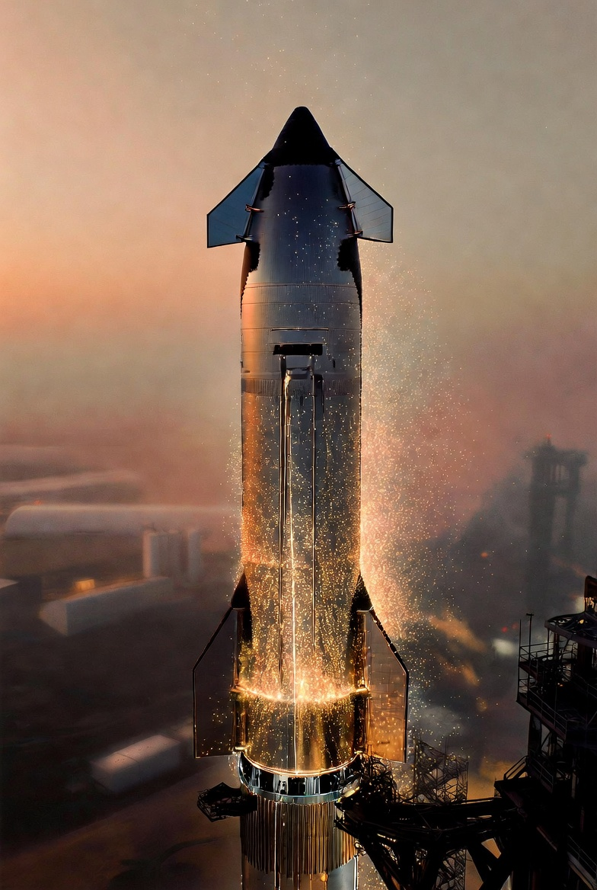
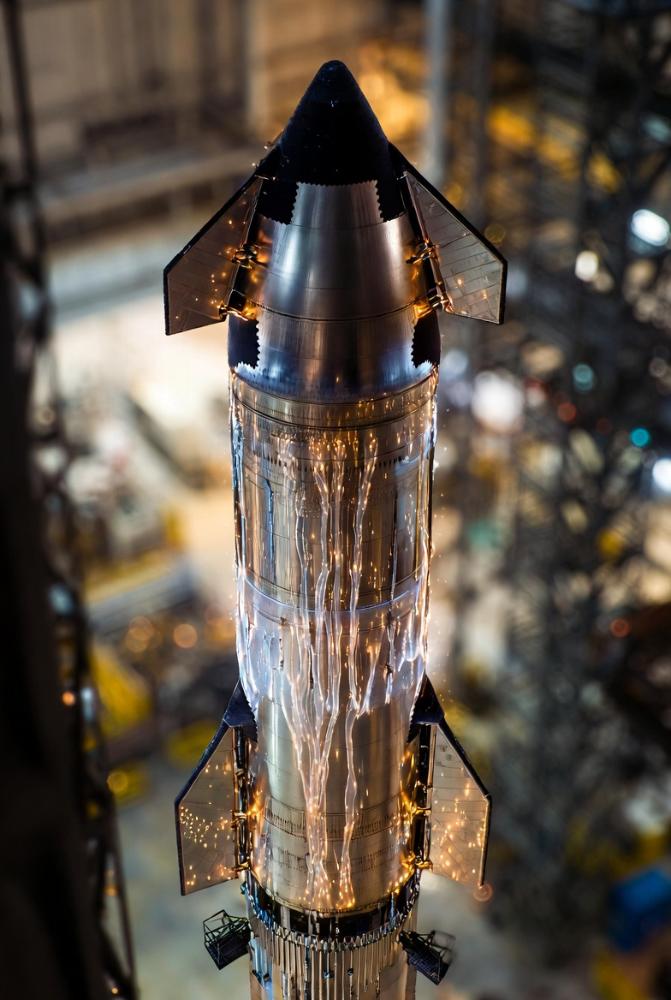
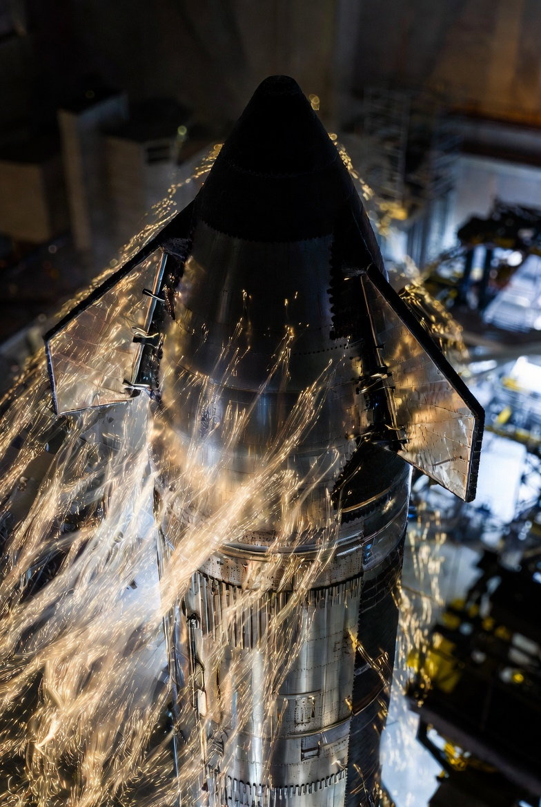

# Starship Nano-Assembly

Article on X: [Starship Nano-Assembly](https://x.com/skyisuniverse/status/2024740090635800926)

From [my conversation with Grok on nano-assembly of Starships](https://x.com/i/grok/share/6d5f1d872b464ab286210ce20cd10e6d)

## Hypothetical Assembly of a Full Starship Using Molecular Nanotechnology

In a future where molecular nanotechnology (MNT) is fully realized—enabled by breakthroughs in quantum control, AI-driven molecular simulation, and self-replicating nanobots—assembling a massive structure like SpaceX's Starship (comprising the Super Heavy booster and the Starship upper stage) could be a streamlined, on-demand process. This would bypass traditional manufacturing, welding, and assembly lines, instead using trillions of programmable nanobots to manipulate matter at the atomic scale. The entire rocket, standing about 120 meters tall and weighing millions of kilograms when fueled, could be built from raw elemental feedstocks (e.g., iron, carbon, oxygen, silicon) extracted from the environment or recycled materials. Think of it as 3D printing on steroids, but at the molecular level, with zero waste and perfect precision.

Here's a step-by-step description of how this might unfold, assuming a mature MNT system with nanobots capable of mechanosynthesis (chemically bonding atoms one by one) and self-replication. The process could take days to weeks, depending on the scale of the nanobot swarm, energy availability, and computational oversight.

### 1. Preparation and Feedstock Acquisition

- **Raw Material Gathering**: Start with a "feedstock reservoir"—a vat or environmental extractor containing abundant elements like carbon (from CO2 in the air or graphite), iron (from ore or recycled steel), chromium and nickel (for stainless steel alloys), and trace elements for specialized components like engine nozzles. Nanobots could disassemble nearby scrap metal, soil, or even atmospheric gases to harvest atoms, using energy from solar panels or fusion reactors to break bonds.

- **Design Input**: Upload a digital blueprint of the Starship into an AI overseer. This model includes every detail: the booster's 33 Raptor engines, the ship's heat shield tiles (made from advanced ceramics), cryogenic tanks for liquid methane and oxygen, avionics, and structural reinforcements. The AI optimizes for MNT, breaking the design into modular atomic "recipes."

- **Seed Nanobot Deployment**: Introduce a small batch of "seed" assemblers—perhaps a few million nanobots, each about 100 nanometers in size, equipped with manipulator arms, sensors, and replication modules. These could be produced in a lab-scale nanofactory and transported to the assembly site (e.g., a launch pad or orbital platform).

### 2. Nanobot Replication and Swarm Formation

- **Exponential Scaling**: The seed nanobots begin self-replicating using the feedstock. Each bot assembles copies of itself by precisely placing atoms to form stiff diamondoid structures (carbon-based lattices stronger than steel). This phase is exponential: starting with millions, the swarm could grow to trillions in hours, limited only by energy and material supply.

- **Coordination Setup**: The swarm organizes into specialized teams via wireless quantum entanglement or chemical signaling. An AI "conductor" oversees the process, assigning tasks and monitoring for errors (e.g., using built-in quantum error correction to counter thermal vibrations).

- **Site Preparation**: A subset of bots clears and levels the assembly area, perhaps building a temporary scaffold from self-assembling polymers to support the growing structure.

### 3. Bottom-Up Component Assembly

#### Building the Super Heavy Booster:

- **Structural Skeleton**: Nanobots start at the base, assembling the cylindrical body from stainless steel alloys atom by atom. They form molecular chains of iron, carbon, and chromium, cross-linking them into sheets that self-curve into the 9-meter-diameter tank sections. This bottom-up approach ensures flawless welds—no seams or weak points, as the material is grown continuously.

- **Engine Integration**: Simultaneously, specialized bot teams construct the 33 Raptor engines. For each, they assemble turbopumps from high-strength alloys, combustion chambers from heat-resistant rhenium or ceramics, and nozzles with embedded cooling channels. Atoms are placed with picometer precision to optimize thrust and efficiency. Wiring and plumbing (e.g., methane/oxygen lines) are woven in as molecular conduits.

- **Tank and Insulation**: The massive fuel tanks are built with layered walls: inner liners for cryogenic containment, insulation foams grown from polymer precursors, and outer skins reinforced with carbon nanotubes for strength. Bots could embed sensors directly into the material for real-time structural health monitoring.

#### Building the Starship Upper Stage:

- **Hull and Heat Shield**: Similar to the booster, but with added reentry features. Nanobots assemble the stainless steel body, then apply heat shield tiles—each a custom ceramic composite (e.g., silicon carbide with boron additives) precisely shaped and bonded. Tiles could self-heal via embedded repair bots.

- **Engines and Systems**: Six Raptor engines (three sea-level, three vacuum-optimized) are built in parallel. Avionics bays get populated with quantum chips and wiring harnesses grown from conductive nanomaterials. Solar panels and batteries are assembled from photovoltaic molecules and lithium-ion lattices.

- **Interior Features**: For crewed variants, bots could furnish habitats: assembling bunks, life support systems (e.g., oxygen recyclers from catalytic membranes), and even food printers from molecular extruders.

Throughout, assembly happens in a massively parallel fashion. Imagine a shimmering "fog" of nanobots swarming over the structure, adding layers at rates of billions of atoms per second per bot. Energy is supplied via beamed power or chemical fuels converted on-site.

#### 4. Integration and Final Assembly

- **Stacking the Stages**: Once components are ready, larger "macro-bots" (assembled from nanobot clusters) lift and mate the Starship onto the booster. Molecular bonding ensures a seamless join, stronger than mechanical clamps.

- **System-Wide Integration**: Bots weave in cross-stage connections like umbilicals and data lines. Fuel systems are tested by simulating flows at the molecular level.

- **Quality Assurance**: A diagnostic swarm scans the entire vehicle, atom by atom, for defects. Any flaws are disassembled and rebuilt instantly. AI simulations run virtual stress tests, incorporating real-time material data.

#### 5. Completion and Launch Readiness

- **Fueling and Activation**: With the structure complete, bots could even produce and load propellants—synthesizing methane from carbon and hydrogen, and liquefying oxygen from the air—directly into the tanks.

- **Post-Assembly**: The nanobot swarm deactivates or disassembles itself, recycling into storage for future use. The finished Starship stands ready, potentially in a fraction of the time and cost of today's methods (e.g., weeks instead of months, with no supply chain dependencies).

- **Scalability**: This tech could enable mass production: replicate the process for fleets of Starships, or even assemble them in space using asteroid-derived materials.

This scenario leverages MNT's strengths—precision, efficiency, and adaptability—to make Starship assembly as routine as printing a document. However, challenges like managing heat dissipation during rapid assembly or preventing unintended replication would need robust safeguards. In practice, early versions might hybridize with current tech, like using nanobots for critical components while traditionally building the bulk structure. If we achieve this, it could accelerate space colonization by making mega-rockets abundant and customizable.

