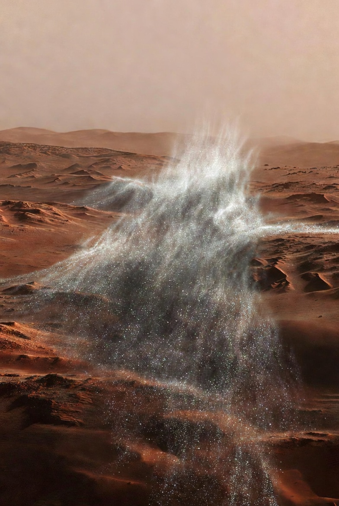
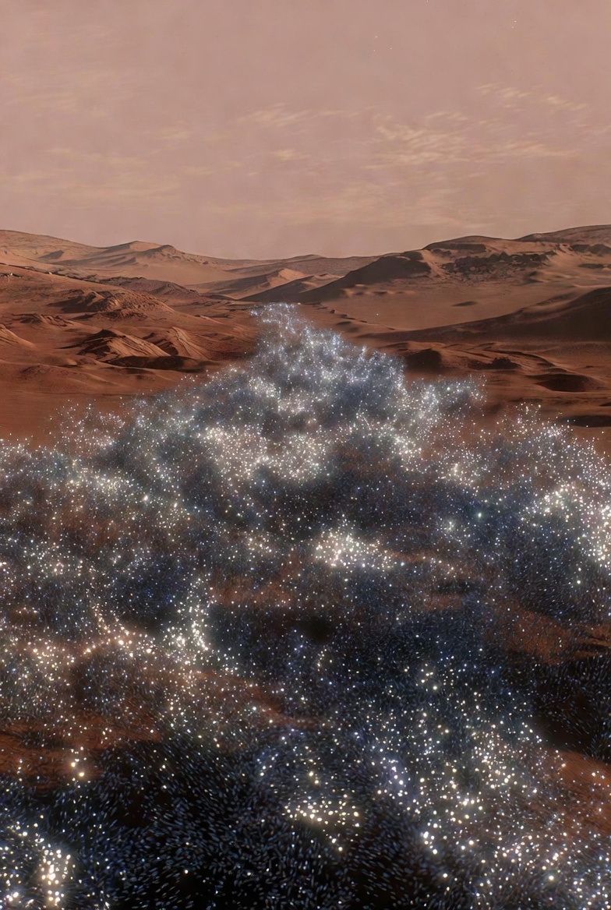
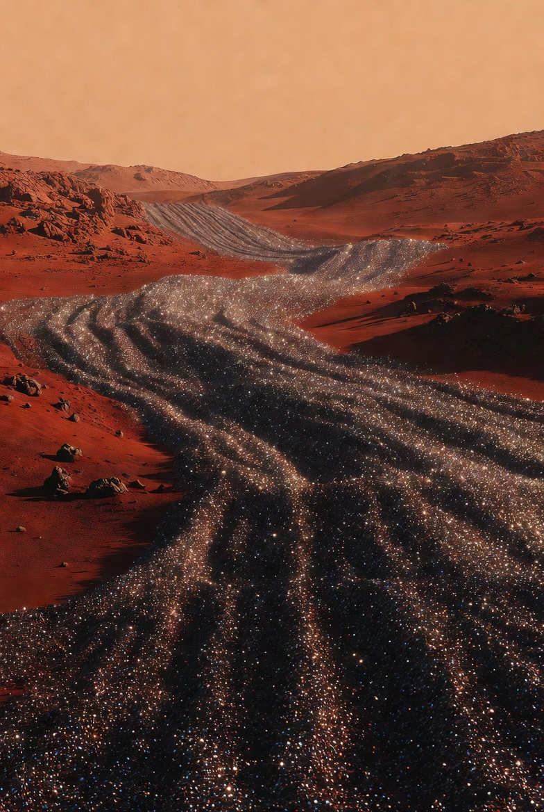
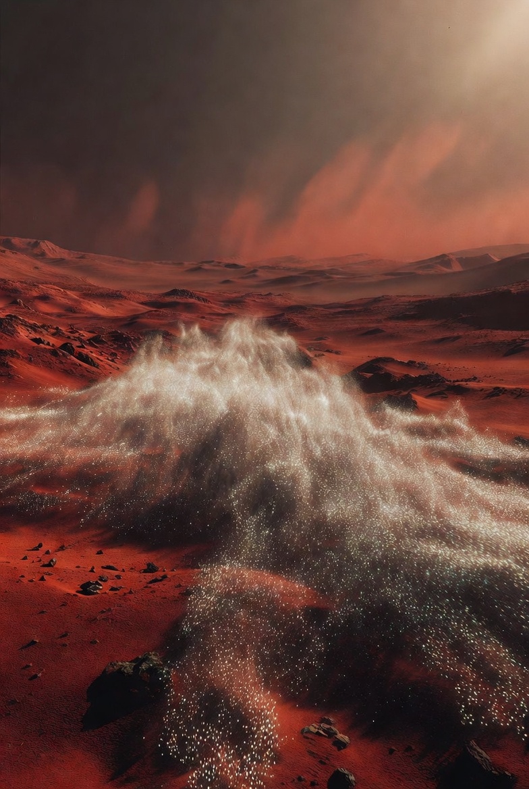

# Terraform Mars in 10 years

Article on X: [Terraform Mars in 10 years](https://x.com/skyisuniverse/status/2026243231386636408)

From [my conversation with Grok on Terraforming Mars with Nanobots & NanoAssembly](https://x.com/i/grok/share/061fbc706e7e4ad19922b5e451636a00)

> For Mars-specific tech, engineered **nanorods** could **accelerate atmospheric restoration** by trapping heat **5,000x more efficiently** than CO2, potentially raising temperatures by 30K in years and enabling liquid water stability.

> On Mars, **nanobots** could **disassemble regolith to produce oxygen, fuel, or building materials** exponentially faster than current MOXIE-like systems, supporting self-sustaining colonies.

What could it mean for terraforming Mars?

---

## Introduction

Terraforming Mars—transforming its cold, thin, CO2-dominated atmosphere and barren surface into a more Earth-like environment capable of supporting human life and ecosystems—has long been a speculative goal in planetary science. It typically involves steps like global warming to release frozen volatiles (e.g., CO2 and water ice), increasing atmospheric pressure, creating liquid water, and eventually producing breathable oxygen through biological or industrial processes. With mature nanoassembly technologies like engineered nanorods for heat trapping and nanobots for regolith processing, this process could be accelerated from geological timescales (thousands to millions of years) to potentially decades or centuries, making it feasible within human planning horizons. Below, I outline the key implications based on recent research, focusing on the quoted technologies.

## Accelerated Atmospheric Warming and Greenhouse Enhancement

Engineered nanorods—tiny, rod-shaped particles (~9 micrometers long, with a 60:1 aspect ratio) made from abundant Martian materials like iron or aluminum—could act as artificial aerosols to trap heat far more efficiently than natural greenhouse gases. These particles would forward-scatter incoming sunlight toward the surface while blocking outgoing thermal infrared radiation, mimicking but outperforming Mars' natural dust storms (which cool the planet due to their composition and size). Models suggest they could be over 5,000 times more effective than super-greenhouse gases like chlorofluorocarbons, as they settle 10 times slower than native dust, allowing longer atmospheric lifetimes (up to 10 years).

- **Temperature and Pressure Increases**: Releasing nanorods at a rate of ~30 liters per second (manufactured on-site from Martian dust) could raise global temperatures by more than 30 Kelvin (about 54°F) within months to years. This warming would melt polar ice caps and subsurface permafrost, releasing trapped CO2 and water vapor, thickening the atmosphere from its current ~6 millibars (0.6% of Earth's) toward levels supportive of liquid water (requiring ~6-10 millibars minimum pressure). Liquid water stability could emerge in low-lying regions like Hellas Planitia, enabling primitive ecosystems or agriculture in domed habitats.

- **Kickstarting a Habitable Cycle**: The initial warming feedback loop could transition Mars from a frozen desert to a "wet" phase, where surface water flows, erosion reshapes landscapes, and hydrological cycles begin. This might allow introduction of extremophile microbes (e.g., cyanobacteria) to start oxygen production, though full oxygenation could still take centuries. Compared to traditional methods (e.g., orbital mirrors or importing gases), nanorods are resource-efficient, using in-situ materials and avoiding massive imports from Earth.

- **Challenges and Risks**: While potent, nanorods could cause uneven heating, dust buildup on solar panels, or unintended cooling if not optimized. Ethical concerns include altering Mars' pristine environment or potential "runaway" greenhouse effects, requiring reversible designs.

## Enhanced In-Situ Resource Utilization (ISRU) for Self-Sustaining Colonies

Nanobots—programmable, self-replicating molecular machines—could exponentially speed up regolith (Martian soil) processing for oxygen, fuel, water, and building materials, far surpassing current systems like NASA's MOXIE (which produces ~10 grams of O2 per hour from CO2). By disassembling regolith at the atomic level (e.g., via mechanosynthesis or bio-hybrid methods), they enable rapid extraction of iron, silicon, aluminum, and hydrated minerals.

- **Resource Production and Colony Support**: Nanobots could convert regolith into O2 (via electrolysis of extracted water) and methane fuel (from CO2 and hydrogen) at rates orders of magnitude faster than MOXIE, supporting propellant for return trips or local energy. Building materials like sintered bricks or 3D-printed metals (e.g., from microbially extracted iron) could create habitats, roads, and greenhouses, reducing Earth shipments by 90%+. This fosters self-sustaining colonies, where nanobots replicate to scale operations, turning Mars into a resource hub.

- **Terraforming Synergies**: Extracted water vapor could seed clouds for further warming, while O2 production contributes to breathable air over time. Combined with nanorods, this creates a virtuous cycle: Warmer conditions expose more regolith resources, accelerating ISRU. Long-term, nanobots could introduce bioengineered organisms to bind soil, prevent dust storms, or generate biomass for ecosystems.

- **Challenges and Risks**: "Gray goo" scenarios (uncontrolled replication) require safeguards, and regolith's abrasiveness could wear down nanobots, necessitating robust designs.

## Broader Implications for Mars Terraforming

- **Timeline Compression**: Traditional estimates suggest terraforming could take 100,000+ years; nano-tech might reduce the warming/ISRU phase to 10–100 years, with full habitability in 200–1,000 years. This enables multi-generational human presence, starting with domed cities and expanding to open-air habitats.

- **Economic and Strategic Benefits**: Lower costs (e.g., no massive imports) make Mars viable for colonization, mining, or research, potentially supporting Earth's resource needs.

- **Ethical and Scientific Considerations**: Terraforming raises questions about preserving Mars' geology or potential native life. It could also provide insights into Earth's climate engineering.

In essence, these nano-technologies could make Mars terraforming a practical pathway to multi-planetary humanity, shifting from survival outposts to thriving, Earth-independent worlds.

