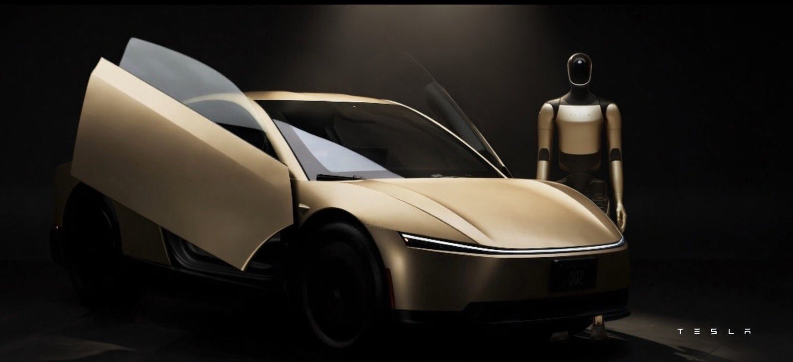
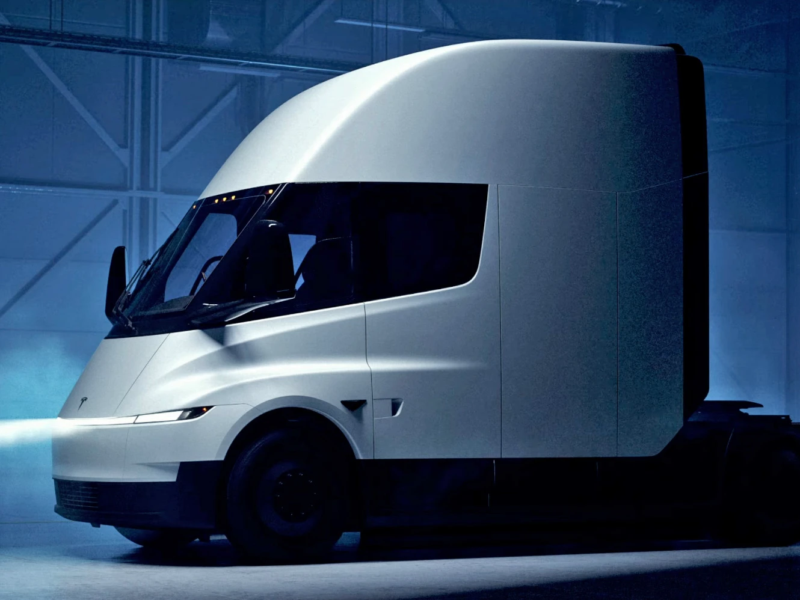
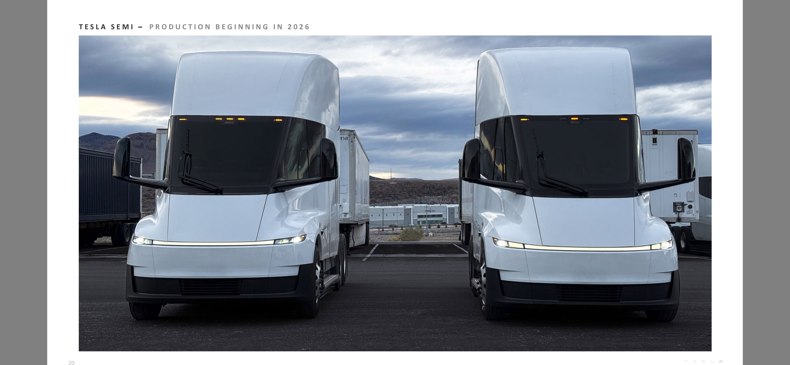

# Faster factories w/ Optimus, Semi & Cybercab

Article on X.com: [Faster factories w/ Optimus, Semi & Cybercab](https://x.com/skyisuniverse/status/2020034971948171457)

From [my conversation with Grok on building factories faster with Optimus, Semi & Cybercab](https://x.com/i/grok/share/dcd4a56b06ee4aaf9b459cfb28392a2a)

In a hypothetical future scenario (aligned with the current date of early 2026 and Tesla's ongoing advancements in robotics and autonomy), building a new large-scale factory like a Tesla Gigafactory (e.g., ~4-5 million square feet, similar to Giga Texas) using primarily **Optimus humanoid robots** for construction labor, **Tesla Semis** in autonomous platooning mode for material transport, and **Cybercabs** (or similar FSD-enabled small vehicles) for site logistics and worker transport could dramatically transform the process.

This vision assumes mature, scaled production and reliable Full Self-Driving (FSD) for heavy-duty applications, with Optimus capable of general-purpose construction tasks (e.g., framing, assembly, welding, material handling), Semis handling autonomous long-haul and platooned delivery fleets, and Cybercabs for on-site mobility. Below is a comparison to current (2024-2025 era) methods, based on historical Tesla Gigafactory examples and industry benchmarks.

## Hypothetical Robot-Led Future Scenario Impacts

Assuming Optimus at scale ($20,000-30,000 per unit long-term manufacturing cost, with thousands to tens of thousands deployed), autonomous Semis ($150,000-200,000 per unit, platooning reduces effective driver costs to near-zero), and Cybercabs (low ~$20-30k estimated vehicle cost, ultra-low ~$0.20/mile operation) are available in large fleets.

### **Time Reduction** — Potentially **50-80% faster**.

- Robots work 24/7 without fatigue, breaks, or weather slowdowns (assuming suitable conditions/tools).
- Parallel tasks: Hundreds/thousands of Optimus could swarm sites (e.g., simultaneous foundation pouring, framing, MEP installation).
- Autonomous logistics: Semis platoon (e.g., 3-5 trucks with minimal/no human oversight) for just-in-time material delivery, reducing wait times.
- Cybercabs enable rapid on-site movement of small teams/tools/supervisors.
- **Estimated time: 3-6 months** to initial production (vs. 9-24 months today), closer to Shanghai's record but scaled and more consistent.

### **Cost Reduction** — Potentially **30-60% lower** total construction **cost**.

- **Labor savings** — Biggest impact. Human labor is 20-40% of costs → near-elimination (replaced by robot depreciation/energy/maintenance). If labor is 30% of a $2B project ($600M), robot fleets could cut this dramatically after initial capex.

    - a) Optimus fleet example: 1,000-5,000 units at ~$25,000 average = $25-125M (amortized over multiple projects; robots reusable).
    - b) Maintenance/energy: Far lower than wages/benefits (human construction wages + overhead often $50-100+/hour per worker).

- **Logistics/transport** — Semis platooning → **~30-50% lower per-mile costs** vs. diesel/human-driven (Tesla estimates ~$0.80/mile platooned vs. ~$1.50 diesel; full autonomy lower). Reduced delays/idle time.
- **Other** — Fewer safety incidents/delays, less rework from human error, optimized material use via AI planning.
- **Upfront capex** — Higher initially (robot/Semi/Cybercab fleets: potentially $100M-$500M+ for a large project), but amortized across many factories → net savings.
- **Estimated total cost: 40-70% of current** (e.g., $800M-$1.4B vs. $2B+), with ongoing reductions as robot costs fall.

### Other Impacts

- **Safety/Quality** — Dramatically improved (no human falls, fatigue errors; precise AI coordination).
- **Scalability** — Tesla could build factories much faster globally, accelerating expansion.
- **Environmental** — Lower emissions (electric Semis/Cybercabs/Optimus), less waste from errors.
- **Challenges/Risks** — Initial tech maturity (e.g., Optimus dexterity for complex tasks like welding in variable conditions), regulatory approval for fully autonomous construction sites, energy infrastructure for charging fleets, and upfront investment.

Overall, this future would make Gigafactory-style megaprojects far cheaper and faster — potentially turning what is now a multi-year, multi-billion-dollar endeavor into a sub-year, sub-billion-dollar one. The biggest leaps would come from labor replacement and 24/7 autonomous operations, aligning with Tesla's vision of AI/robotics enabling exponential scaling. Real-world rollout would depend on achieving reliable autonomy and robot capabilities at scale.

