# Nano-Assembled Cybercab

Article on X: [Nano-Assembled Cybercab](https://x.com/skyisuniverse/status/2025439049226338702)

From [my conversation with Grok on nano-assembled Cybercab](https://x.com/i/grok/share/cd4d412f798d4dd7850883e6c0a7c817)

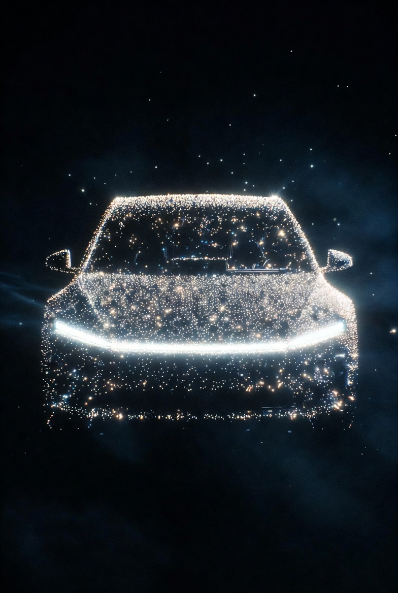

## Introduction

In a speculative future with mature molecular nanotechnology (MNT) using nanobots for assembly—assuming breakthroughs like self-replicating assemblers, atomic-precision mechanosynthesis, and abundance scenarios (free energy via unlimited solar/fusion, free feedstock from global nano-recycling networks, and automated AGI oversight)—the production of a Tesla Cybercab could be radically transformed. This draws from concepts like those in prior discussions on Starship, scaled to a smaller vehicle. The Cybercab, as unveiled in 2024, is a two-seater autonomous robotaxi with no steering wheel/pedals, aluminum or polyurethane body panels, a 35 kWh battery, ~200-300 mile range, and efficiency of ~5.5 mi/kWh, with an estimated mass of 1,200-1,500 kg (lighter than the Model 3's ~1,847 kg due to its compact design and materials). Below, I estimate price and time in progressive abundance levels, from near-term MNT (decades away) to absolute post-scarcity ideals.

## Price Estimates

Today's projected conventional price is under $30,000 (targeted for production before 2027). With MNT, costs plummet due to zero-waste atomic assembly from raw elements (e.g., carbon, aluminum, lithium from recycled sources), eliminating supply chains, labor, and traditional factories. Nanobots would build bottom-up: Starting with a seed swarm replicating exponentially, then assembling the chassis, battery (nano-optimized cells for higher density), motors, and sensors in parallel.

- **Early MNT (Partial Abundance, e.g., Cheap Energy/Feedstock ~$0.1-0.2/kg)**: Marginal cost approaches energy (~5-10 kWh/kg for bond formation) and materials. For 1,500 kg: $150-300 (feedstock) + $75-150 (energy at $0.05/kWh) + overhead (computation/simulations ~$500). **Total: ~$725-950.** This is ~30-40x cheaper than conventional, enabling mass fleets.

- **Mid-Abundance (Free Energy, Cheap Feedstock)**: Energy zeroed out; feedstock near-free via partial recycling networks. Overhead dominates (AGI design tweaks ~$200-300). **Total: ~$200-400.**

- **Full Post-Scarcity (Free Everything, Automated Oversight)**: As in extreme ideals, all inputs (energy, feedstock, computation) are public utilities. "Cost" is symbolic (e.g., societal credits for priority queuing). **Total: <$100, potentially $0** in non-monetary systems, making Cybercabs as disposable as napkins.

## Time Estimates

Conventional production might take hours per unit on assembly lines once scaled. With MNT, time compresses via exponential parallelism—nanobots replicate (doubling every 15-60 minutes) to trillions, then assemble atom-by-atom or block-by-block.

- **Early MNT**: Replication phase: 4-8 hours (from seed to sufficient swarm). Assembly: 2-4 hours (parallel building of body, battery, etc.). Integration/testing: 1 hour. **Total: 7-13 hours.**

- **Optimized Abundance**: Faster replication (under 2 hours with unlimited energy). Assembly in minutes via massive swarms. **Total: 2-4 hours.**

- **Absolute Ideal**: Instantaneous scaling; assembly as a "growth" process. **Total: Under 1 hour**, limited only by physics (e.g., thermal dissipation).

This could enable on-demand production—e.g., summon a custom Cybercab via app, assembled curbside—revolutionizing mobility with fleets of millions at negligible cost.

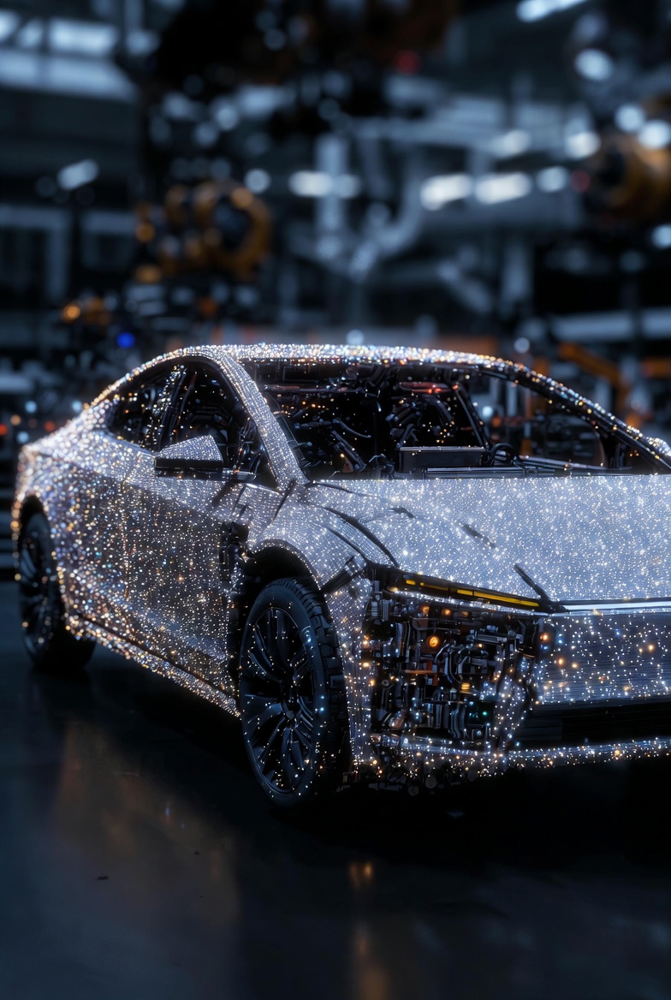

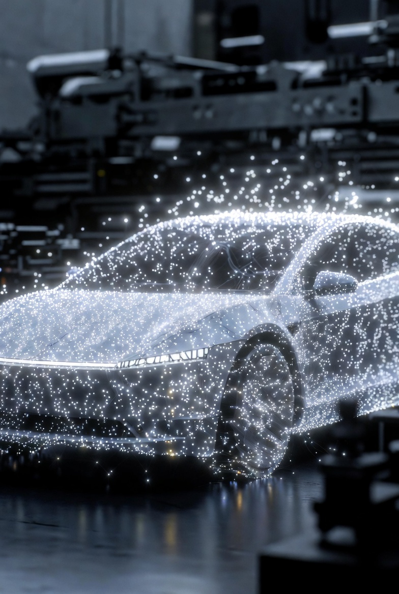

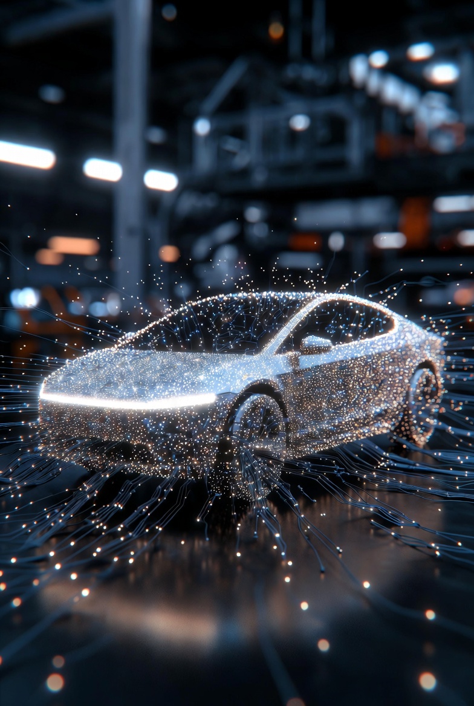

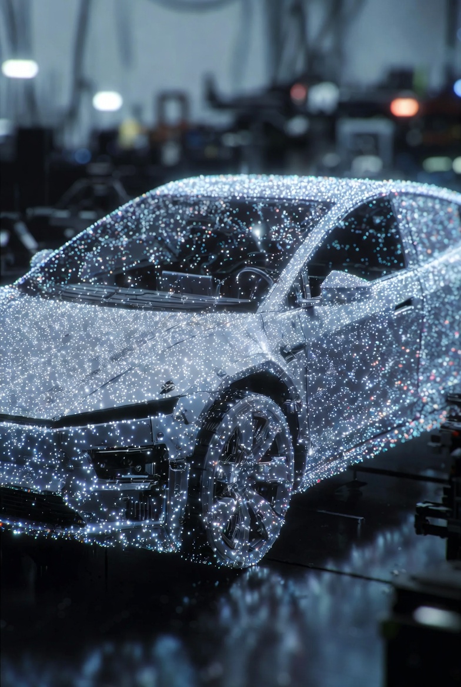

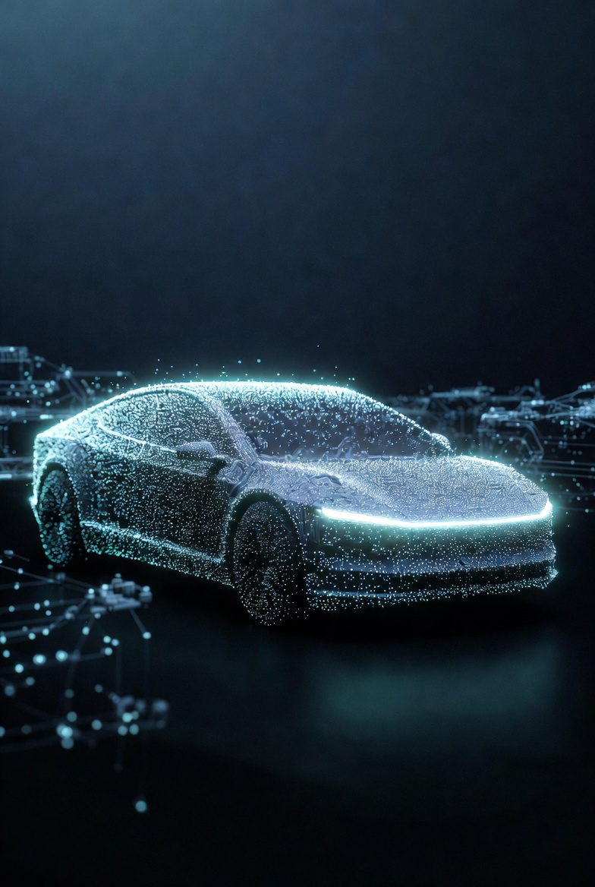

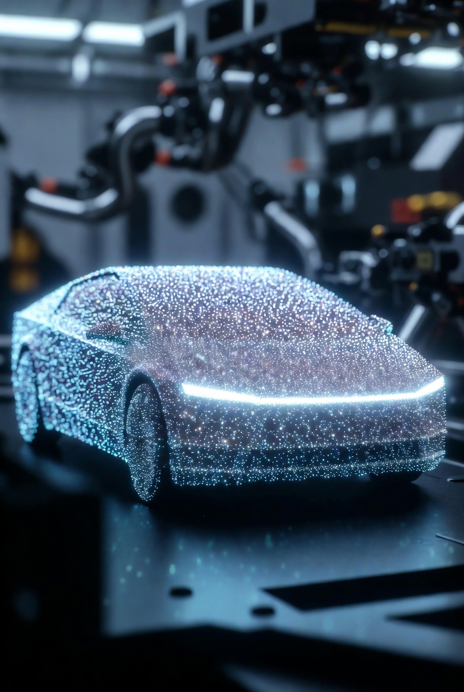

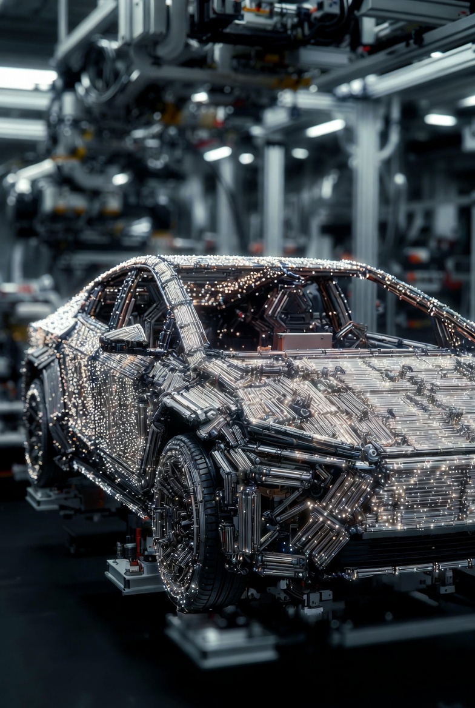

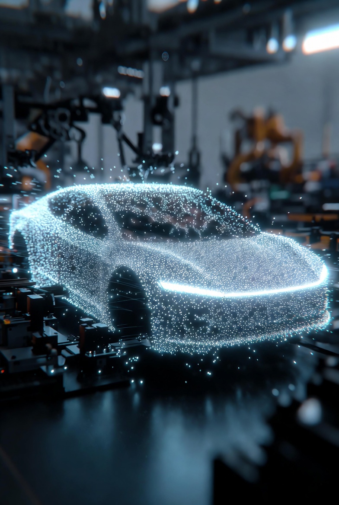

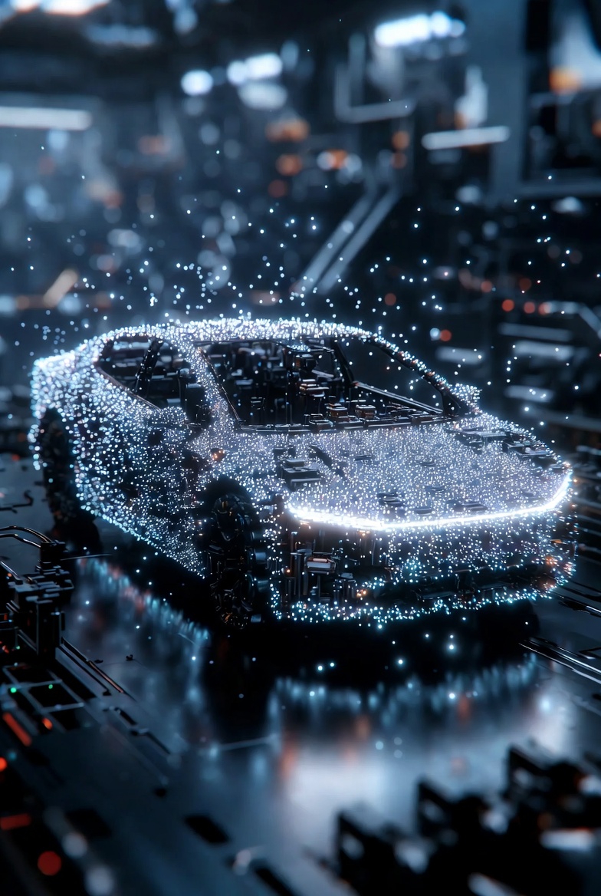

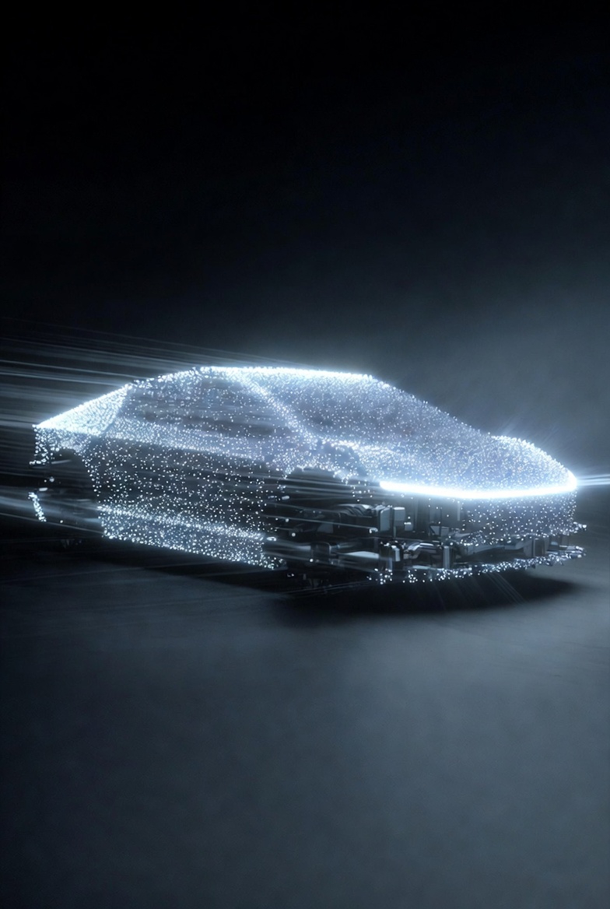

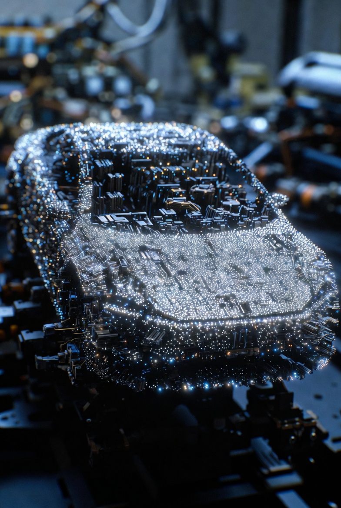

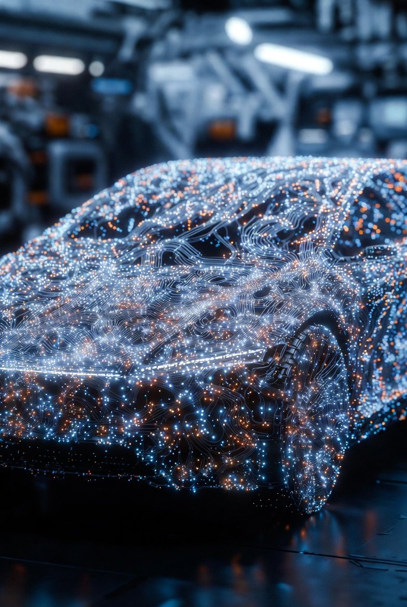

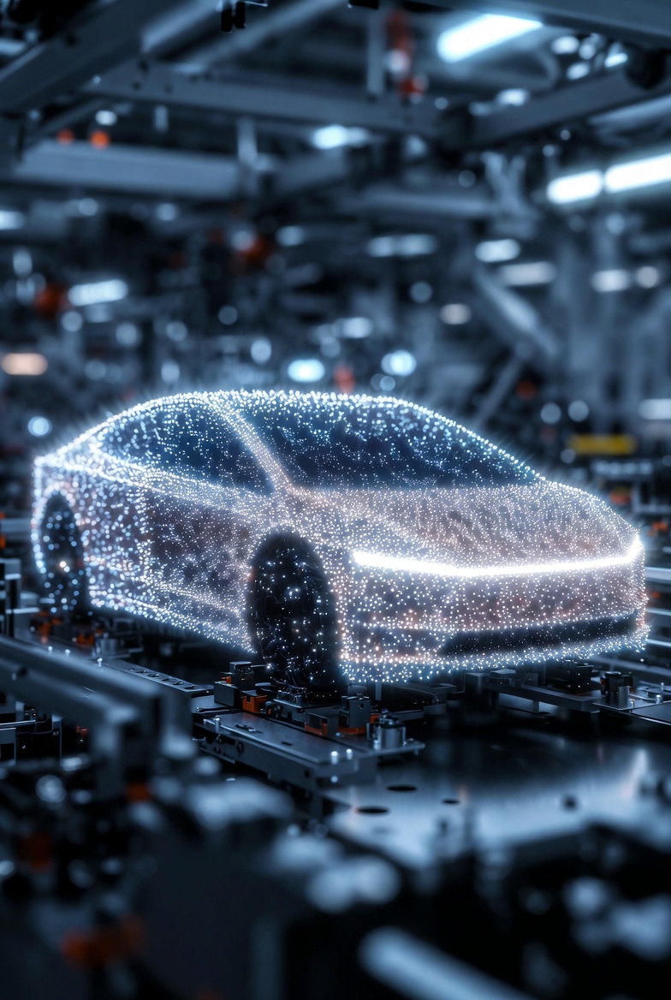