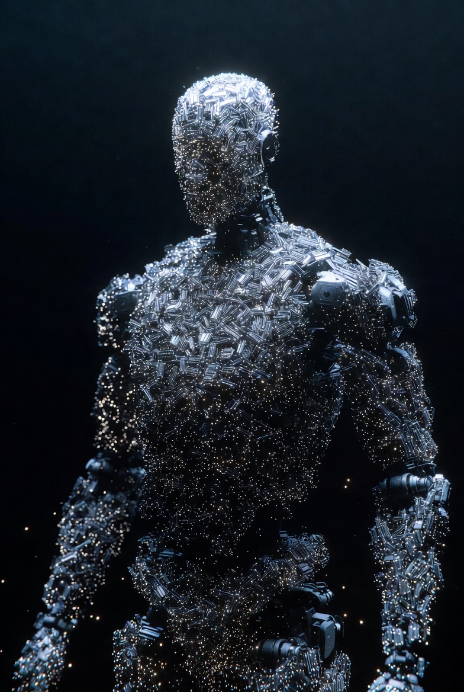
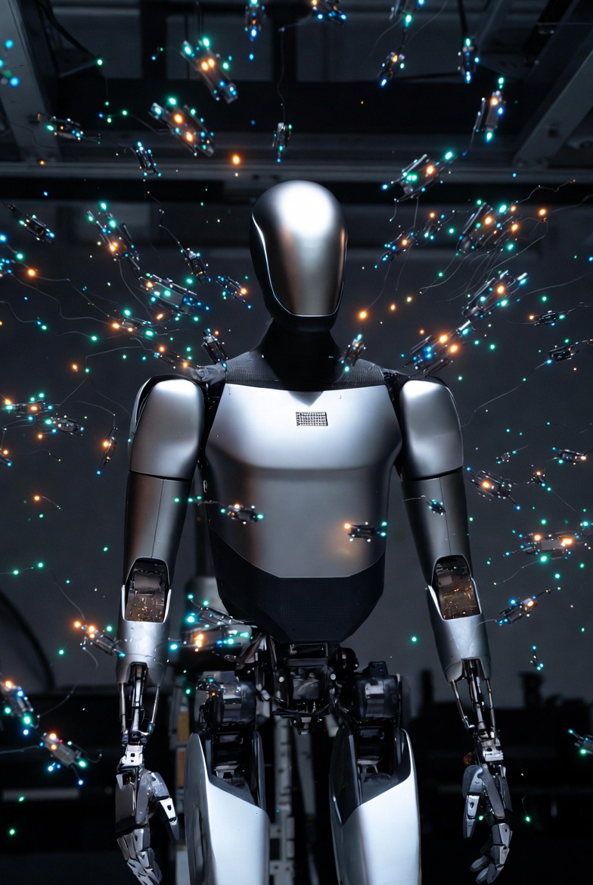
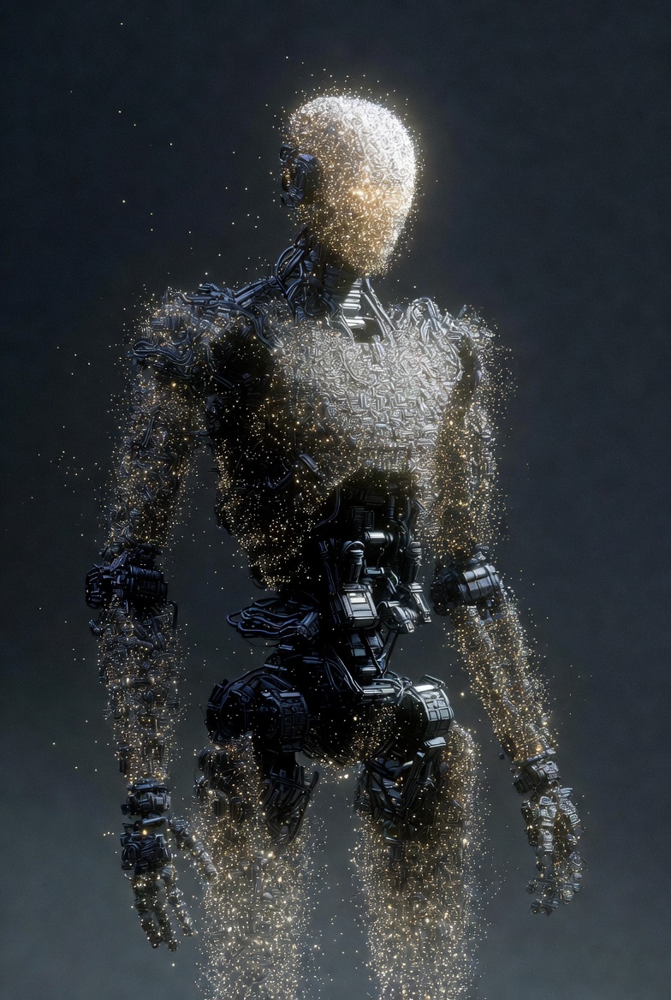

# Nano-Assembled Optimus

Article on X: [NanoAssembled Optimus](https://x.com/skyisuniverse/status/2025427928993919481)

From [my conversation with Grok on nano-assembled Optimus](https://x.com/i/grok/share/cd4d412f798d4dd7850883e6c0a7c817)

## Price Estimates for a Nano-Assembled Optimus Robot

In a speculative future with mature molecular nanotechnology (MNT) using nanobots—assuming atomic-precision assembly from raw elements like carbon, silicon, aluminum, and lithium sourced via recycling or extraction—the cost of producing a Tesla Optimus humanoid robot would be drastically reduced. As of February 2026, the conventional Optimus (Gen 3) stands at 173 cm (5'8") tall, weighs approximately 57 kg (125 lbs), has a carrying capacity of 20 kg, a walking speed of up to 8 km/h (5 mph), a 2.3 kWh battery, and 22 degrees of freedom per hand, with a targeted production price of $20,000–$30,000 (long-term under $20,000). With MNT, nanobots would enable bottom-up construction: replicating exponentially from a seed swarm, then assembling the lightweight frame (diamondoid-reinforced for enhanced durability and reduced weight), actuators, battery (nano-optimized cells for 2–3x density), sensors, and AI hardware in parallel, with zero waste.

Costs scale with mass (~57 kg), but in abundance scenarios (free energy from solar/fusion, free feedstock from global nano-recycling, automated AGI oversight), they become negligible. Estimates across progressive stages:

- **Early MNT (Partial Abundance, e.g., Cheap Energy/Feedstock ~$0.1–0.2/kg)**: Dominated by minimal material and energy inputs (~5–10 kWh/kg for assembly). For 57 kg: $6–11 (feedstock) + $3–6 (energy at $0.05/kWh) + overhead (computational simulations ~$200). **Total: ~$209–217.** This is 100x+ cheaper than current targets, enabling personal robot ownership.

- **Mid-Abundance (Free Energy, Cheap Feedstock)**: Energy eliminated; feedstock near-free via recycling. Overhead (AGI design/customization) ~$50–100. **Total: ~$50–100.**

- **Full Post-Scarcity (Free Everything, Automated Oversight)**: All elements as public utilities; "cost" is abstract (e.g., priority in AGI queues). **Total: <$20**, potentially $0 in non-monetary systems, making Optimus robots as commonplace as smartphones.

## Time Estimates for Assembly

Conventional production might take days per unit once scaled. MNT compresses this via parallelism: Nanobots replicate (doubling every 15–60 minutes) to billions, then build hierarchically (nano-blocks to macro-structures).

- **Early MNT**: Replication: 2–4 hours (scaling swarm for compact robot). Assembly: 1–2 hours (parallel construction of limbs, torso, neural wiring). Integration/testing: 30–60 minutes. **Total: 3.5–7 hours.**

- **Optimized Abundance**: Accelerated replication (under 2 hours with unlimited resources). Assembly in minutes via massive swarms. **Total: 1–3 hours.**

- **Absolute Ideal**: Near-instant scaling; assembly like organic growth. **Total: Under 30 minutes**, limited by physical constraints (e.g., heat dissipation during rapid bonding).

This could transform society: On-demand, customizable Optimus robots assembled anywhere, with nano-upgrades for specialized tasks like elder care or exploration, accelerating a robot-assisted economy.

