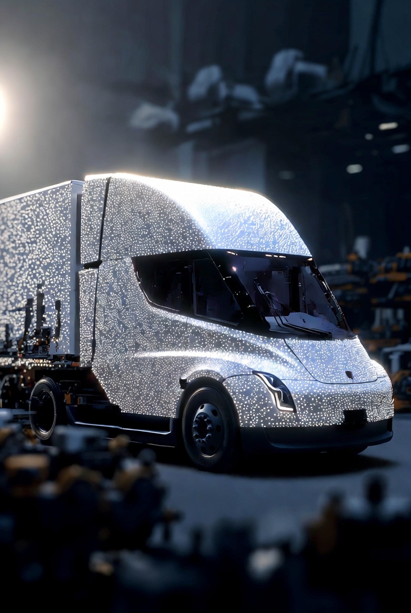
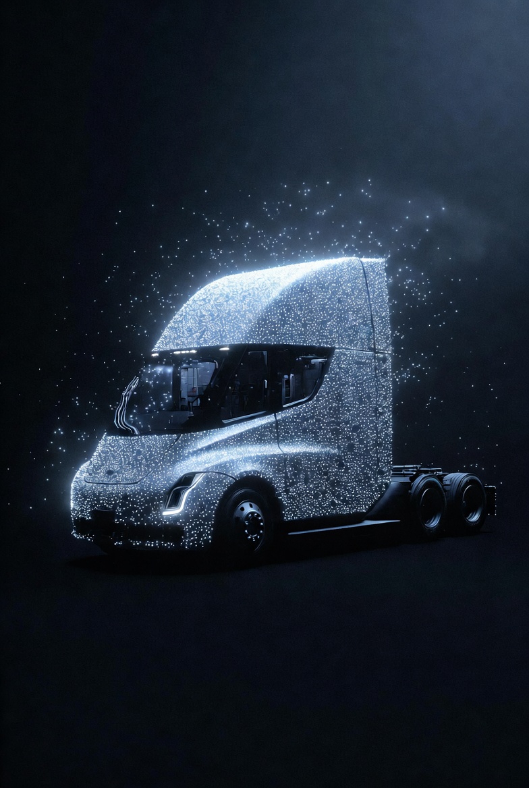
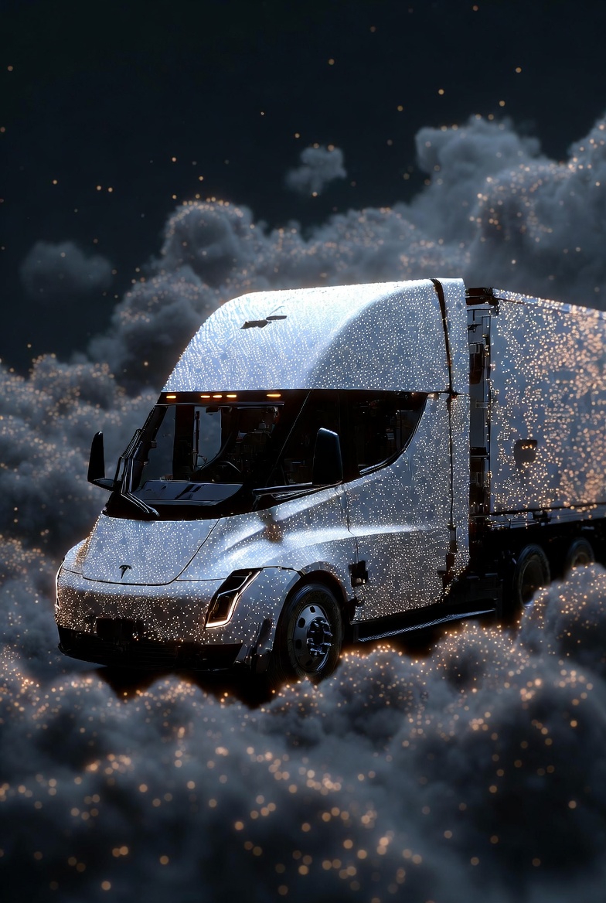
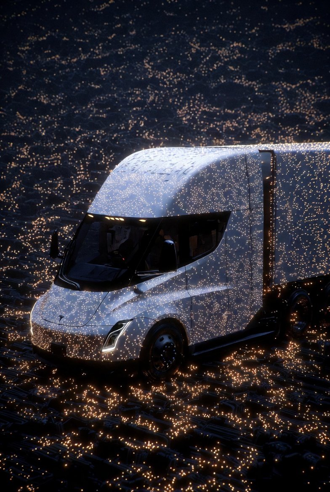
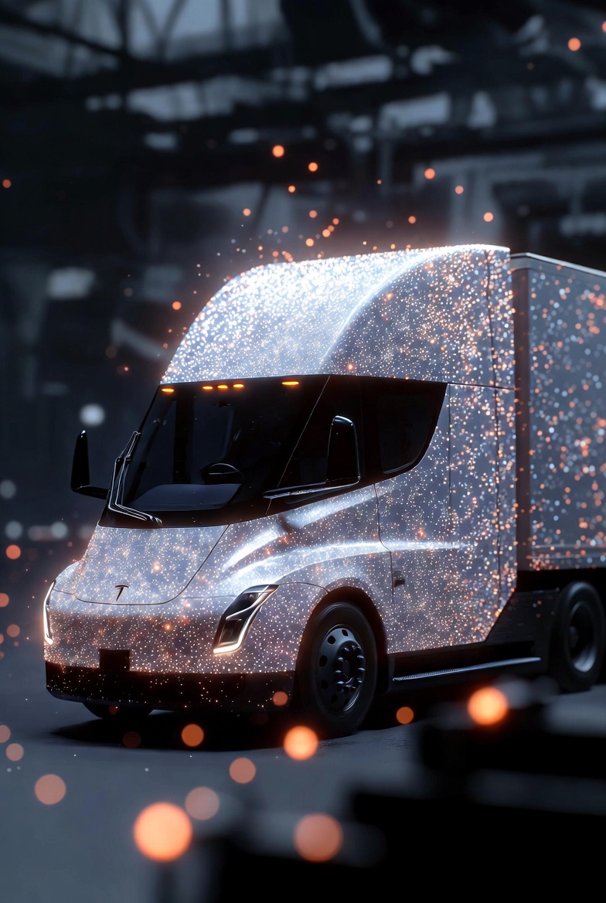
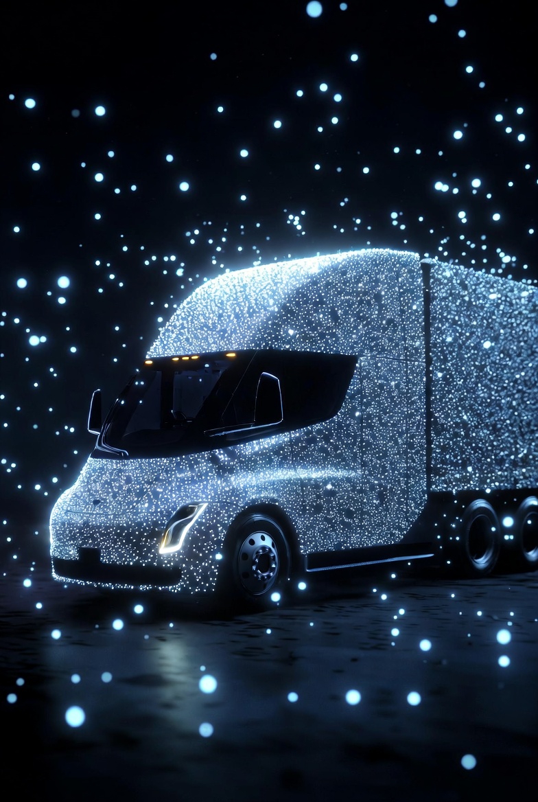
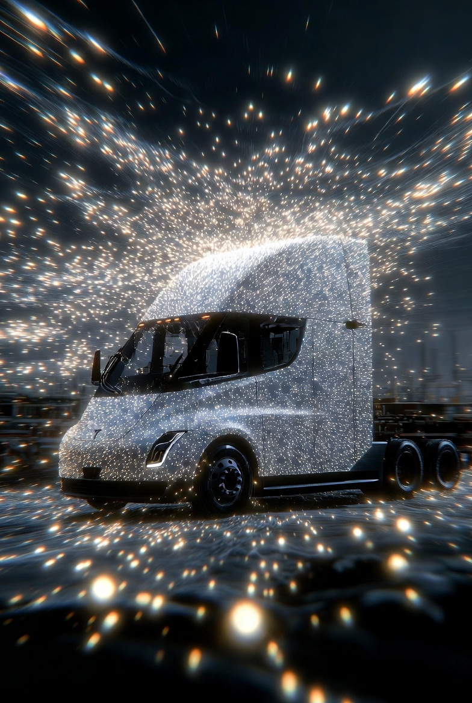

# Nano-Assembled Tesla Semi

Article on X: [Nano-Assembled Tesla Semi](https://x.com/skyisuniverse/status/2025435597104406942)

From [my conversation with Grok on nano-assembled Tesla Semi](https://x.com/i/grok/share/cd4d412f798d4dd7850883e6c0a7c817)

## Price Estimates for a Nano-Assembled Tesla Semi

In a future with mature molecular nanotechnology (MNT) using nanobots—assuming atomic-precision assembly from raw elements like carbon, aluminum, lithium, and silicon sourced via recycling or extraction—the cost of producing a Tesla Semi would drop dramatically. As of 2026, the conventional Tesla Semi comes in two trims: a Standard Range (325 miles) at around $250,000–$260,000 and a Long Range (500 miles) at $290,000, with a curb weight of under 20,000 lbs (9,000 kg) for Standard and 23,000 lbs (10,400 kg) for Long Range, a gross combination weight of 82,000 lbs (~37,195 kg), and an estimated battery size of 500–900 kWh. With MNT, nanobots would enable bottom-up construction: replicating exponentially from a seed swarm, then assembling the chassis (diamondoid-reinforced for lighter weight), battery (nano-optimized cells for higher density, e.g., 2–3x energy storage), motors, and sensors in parallel, with zero waste.

### Costs scale

Costs scale with mass (~10,000 kg average), but in abundance scenarios (free energy from solar/fusion, free feedstock from global nano-recycling, automated AGI oversight), they approach negligible levels. Estimates across progressive stages:

- **Early MNT (Partial Abundance, e.g., Cheap Energy/Feedstock ~$0.1–0.2/kg)**: Dominated by minimal material and energy inputs (~5–10 kWh/kg for assembly). For 10,000 kg: $1,000–2,000 (feedstock) + $500–1,000 (energy at $0.05/kWh) + overhead (computational simulations ~$1,000). **Total: ~$2,500–4,000.** This is 60–100x cheaper than current prices, enabling affordable fleets for logistics.

- **Mid-Abundance (Free Energy, Cheap Feedstock)**: Energy eliminated; feedstock near-free via recycling. Overhead (AGI design/customization) ~$500–1,000. **Total: ~$500–1,000.**

- **Full Post-Scarcity (Free Everything, Automated Oversight)**: All elements as public utilities; "cost" is abstract (e.g., priority in AGI queues). **Total: <$200, potentially $0** in non-monetary systems, making Semis ubiquitous for global transport.

## Time Estimates for Assembly

Conventional production might take days per unit on assembly lines. MNT compresses this via parallelism: Nanobots replicate (doubling every 15–60 minutes) to billions/trillions, then build hierarchically (nano-blocks to macro-structures).

- **Early MNT**: Replication: 6–12 hours (scaling swarm for larger vehicle). Assembly: 4–8 hours (parallel construction of cab, trailer interfaces, battery packs). Integration/testing: 2 hours. **Total: 12–22 hours.**

- **Optimized Abundance:** Accelerated replication (under 4 hours with unlimited resources). Assembly in hours via optimized swarms. **Total: 4–8 hours.**

- **Absolute Ideal:** Near-instant scaling; assembly like organic growth. **Total: Under 2 hours**, limited by physical constraints (e.g., heat dissipation during rapid bonding).

