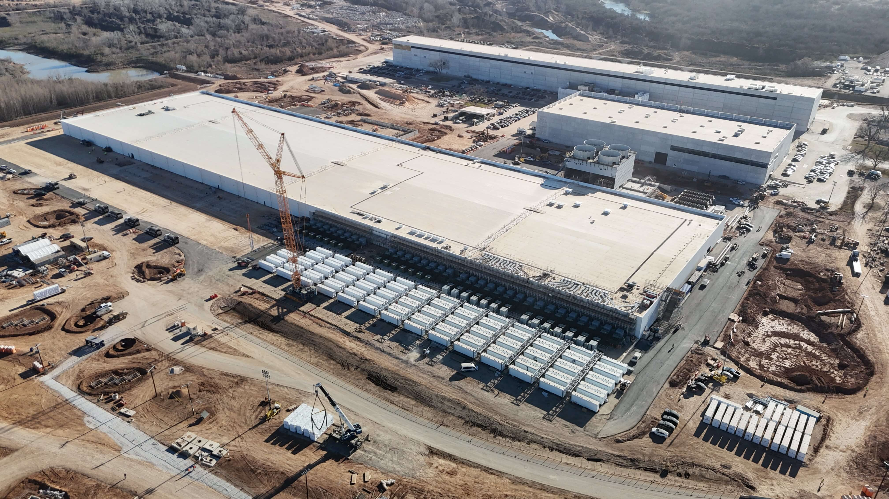

# Tesla powered with latest solar

Article on x.com: [Tesla powered with latest solar](https://x.com/skyisuniverse/status/2020097700515995943)

From [my conversation with Grok on powering Tesla with latest solar energy tech](https://x.com/i/grok/share/3308fb5e21b04d63a8f612805339e65b)

The impact of powering **all of Tesla's operations** (factories/Gigafactories, offices, Superchargers, etc.) entirely with solar energy using the latest top technology—including **perovskite-silicon tandem solar cells** — would be transformative in sustainability terms, though challenging in scale and cost. Tesla already sources a high percentage of renewable energy and deploys solar at sites like Giga Shanghai (producing ~11 million kWh/year from rooftop solar) and aims for 100% renewables, but full on-site or dedicated solar powering remains partial today.

## Key Assumptions and Estimates

Tesla does not publicly disclose a single precise total annual electricity consumption figure for all operations in recent reports (e.g., 2023–2025 Impact Reports or Q4 2025 updates focus more on products and avoided emissions). Historical and indirect data suggest a range:

- Older estimates for major Gigafactories (e.g., Nevada Giga 1 at ~35–50 GWh battery output) pointed to ~1–2 TWh/year (1,000–2,000 GWh) total for large sites, based on ~50 kWh electricity per kWh battery produced and scaling.

- Broader operations (multiple Gigafactories in Nevada, Shanghai, Berlin, Texas; Fremont; Superchargers; etc.) likely consume in the low single-digit TWh/year range as of 2025–2026. This aligns with Tesla's massive scale (vehicle production >2 million/year, energy storage deployments ~46.7 GWh in 2025 alone, plus AI/compute at sites like Cortex).

- Conservative midpoint estimate for analysis: **~2–5 TWh/year** (2,000–5,000 GWh) total electricity use across all Tesla facilities and operations. This is rough, as vehicle manufacturing is energy-intensive but factories are designed for efficiency (e.g., 35% less energy per vehicle in Shanghai vs. Fremont).

Latest perovskite-silicon tandem cells achieve lab efficiencies of **~34–35%** (e.g., LONGi records of 34.85% in 2025, certified). Commercial modules would be lower (28–32% initially, improving rapidly), but assume "top technology" deployment at **30–33%** effective module efficiency (accounting for real-world losses, area utilization, etc.). This is roughly 1.5–2× better than standard commercial silicon panels (~20–22%).

Average solar irradiance at major sites varies:

- Nevada (high desert): ~1,800–2,200 kWh/m²/year
- Texas: ~1,800–2,100 kWh/m²/year
- Shanghai: ~1,200–1,400 kWh/m²/year
- Berlin: ~1,000–1,200 kWh/m²/year

Global weighted average for Tesla sites: ~1,500–1,800 kWh/m²/year.

## Land/Area Requirements

To generate ~3 TWh/year (midpoint estimate) with ~30% efficient panels and ~1,600 kWh/m²/year average irradiance:

- Annual energy per m² of panel: ~480 kWh/m²/year (1,600 × 0.30).
- Required panel area: 6.25 million m² (6.25 km² or ~1,540 acres) for panels alone.
- With spacing, mounting, access roads, inverters, etc. (typical utility-scale solar footprint factor 2–3× panel area): **12–18 km²** (~3,000–4,500 acres or ~5–7 square miles) total land.

This is feasible (comparable to a large solar farm), but challenging if all on-site/rooftop (many factories have limited roof space; e.g., Giga Texas roof could support hundreds of MW but not TWh-scale). Likely mix: rooftop + adjacent/nearby dedicated solar farms + storage (Tesla Megapacks) for 24/7 reliability.

## Economic Impact

- **Capital cost**: Utility-scale solar (even advanced) ~$0.8–1.2/W in 2025–2026. For ~1–2 GW nameplate capacity needed (to deliver ~2–5 TWh/year at ~20–30% capacity factor): **$1–3 billion** upfront (plus storage for night/clouds, adding 20–50%).

- **Savings**: Grid electricity costs vary ($0.05–0.15/kWh industrial rates). At ~$0.10/kWh average, 3 TWh/year costs **$300 million/year** in electricity bills. Solar LCOE (levelized cost) for advanced systems could be <$0.03–0.05/kWh → **$100–200 million/year** savings long-term after payback (5–10 years).

- **Other**: Reduced exposure to grid price volatility, potential incentives/tax credits, but high initial capex diverts from EV/AI investment.

## Other Impacts

- **CO₂ emissions reduction**: Manufacturing electricity is a major Scope 2 emitter. Offsetting 2–5 TWh/year grid power (average grid 400–500 g CO₂/kWh) avoids **0.8–2.5 million metric tons CO₂e/year** (equivalent to ~200,000–600,000 passenger cars off the road annually). Accelerates Tesla's net-zero goal.

- **Energy independence/resilience**: On-site/ dedicated solar + Megapacks enables microgrid operation, reducing blackout risks (e.g., Texas events) and supporting AI compute demands.

- **Challenges**: Intermittency requires massive storage (hundreds of GWh, costly). Perovskite tech stability/durability improving but not fully commercial at scale yet (degradation risks). Land use (if not rooftop) could face permitting/environmental pushback.

- **Broader**: Demonstrates feasibility for industrial-scale solar, accelerates perovskite adoption, aligns with Tesla's mission (Master Plan emphasizes sustainable energy).

In summary, full solar powering is technically achievable with 30%+ efficient tandem cells, requiring gigawatt-scale deployment and billions in investment, but yields major long-term savings (hundreds of millions $/year), emissions cuts (millions tons CO₂e/year avoided), and strategic resilience. Tesla is already progressing toward this via rooftop solar and renewables matching.