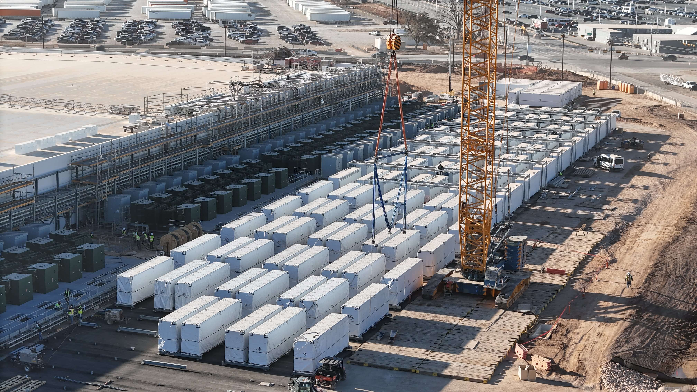
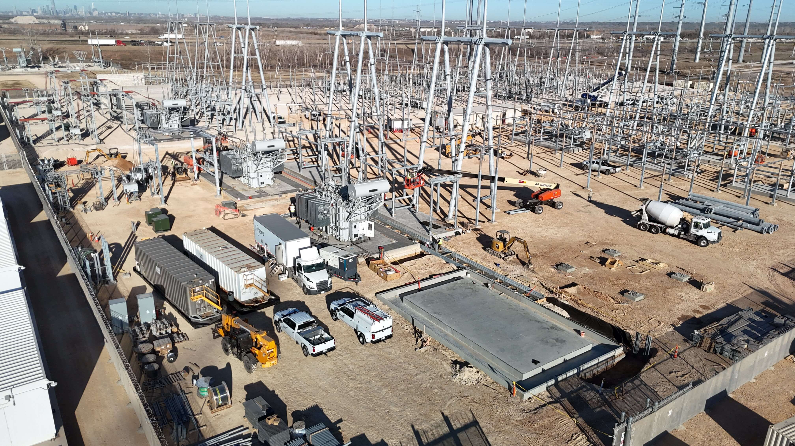
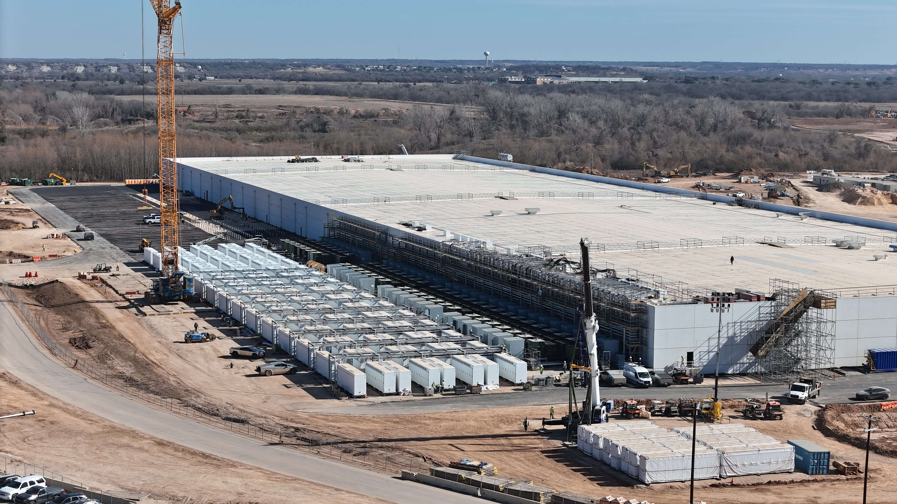

# Tesla automated with Optimi

Article on x.com: [Tesla automated with Optimi](https://x.com/skyisuniverse/status/2020106454506590245)

From [my conversation with Grok on automating Tesla with Optimi robots](https://x.com/i/grok/share/270f86fd0a394ff28a3318cbf668e2cd)

If all Tesla factories (Fremont, Giga Texas, Giga Shanghai, Giga Berlin, Giga Nevada, etc.) were **fully automated** with Optimus humanoid robots deployed at true scale—meaning the vast majority of repetitive, dexterous, and even moderately complex manual labor replaced by fleets of Optimus units—this would represent one of the most dramatic manufacturing transformations in industrial history. As of early 2026, Tesla is in the early stages of internal deployment (hundreds to low thousands of units performing tasks like battery cell sorting, parts handling, and logistics at sites like Fremont and Giga Texas), with aggressive ramp-up plans underway, but full end-to-end automation across all factories remains a multi-year (likely 5–10+ year) vision rather than an immediate reality.

Here's a breakdown of what such a scenario would realistically look like, its timeline implications, upsides, downsides, and broader ripple effects.

## Near-term status (2026 perspective)

Tesla's current trajectory (based on recent announcements):

- 2025–early 2026: Limited internal production and deployment → thousands of Optimus units (Gen 3) active across factories by end-2026, focused on unsafe/repetitive/boring tasks.

- Mid-2026 onward: Pilot → modest scaling lines running; Fremont partially repurposed (Model S/X lines winding down to make space for Optimus production targeting ~1 million units/year long-term capacity there).

- 2027+: Giga Texas dedicated high-volume Optimus lines (ambitious targets of 10 million units/year eventually mentioned in some reports/plans).

- External sales likely starting late 2027, but internal factory saturation would come first.

Full-factory automation would require **tens to hundreds of thousands** of reliable Optimus units per major Gigafactory (depending on the site size and task density), plus massive supporting infrastructure (charging/swapping stations, AI coordination systems, safety redundancies, and continuous neural-net training from real-world data).

### Key operational & economic impacts if achieved at scale

#### Manufacturing cost structure revolution

- Human labor costs → near zero for most line roles (no wages, benefits, overtime, unions, breaks, sick days, turnover).
- 24/7/365 operation becomes default → factories could theoretically double or triple effective output with the same footprint (Optimus works 10–12 hour shifts on one charge, but could swap batteries or recharge in rotation for near-continuous uptime).
- Variable costs drop dramatically → marginal cost per vehicle/cell/pack falls toward materials + energy + depreciation of robots.
- Tesla could price vehicles radically lower (potentially sub-$15k–20k mass-market cars sustainable) or maintain pricing and capture enormous gross margins (70–90% possible in theory).

#### Productivity & quality leaps

- Perfect consistency: No fatigue errors, no variation in torque application, no "Monday morning" slowdowns.
- Data flywheel accelerates: Every robot hour feeds Tesla's AI training loop → faster iteration on dexterity, task generalization, error recovery.
- New layout freedom: Factories redesigned without human safety corridors, ergonomic stations, or break rooms → denser, more efficient lines.

#### Workforce & societal effects inside Tesla

- Shift to higher-skill jobs: Robot fleet maintenance, AI oversight, end-of-arm tooling design, simulation engineers, charging infrastructure techs.
- Potential for "lights-out" sections of factories (dark, no humans needed for long periods).

#### Broader ripple effects

- Competitive moat: Other automakers (and eventually other industries) face existential pressure unless they license Optimus-like tech or develop their own (very hard catch-up given Tesla's vertical integration + data advantage).
- Supply chain re-optimization: Less need for proximity to low-cost labor → potential re-shoring or new factory locations based purely on energy, logistics, and raw materials.
- Energy demand spike: Millions of 2–3 kWh battery robots charging daily → Tesla becomes one of the world's largest electricity buyers (synergy with energy storage business).
- Global labor market shock: If Optimus proves general-purpose and scales beyond Tesla (home use, other factories, logistics), millions of manual jobs worldwide become obsolete over 10–20 years.

#### Bottom line in 2026 terms

If "at scale" means 50,000–500,000+ Optimus units per major factory running most production tasks, we're realistically looking at **late 2020s to mid-2030s** for the first factory to approach full humanoid automation, and **2035–2045** before all Tesla factories are predominantly robot-operated (absent a breakthrough acceleration).When it happens, though, it would mark the point where physical manufacturing becomes closer to software scaling—near-marginal-zero labor cost, infinite up-time potential, and relentless year-over-year capability improvement. Tesla's vehicle output could explode, turning the company into something more like an AI/robotics foundry that happens to make cars as its flagship product.This is still speculative science-fiction-adjacent territory today—but the trajectory from 2021 prototype to 2026 factory-floor thousands-of-units reality has been faster than almost anyone (outside Tesla) expected.

### Hypothetical impacts

If all Tesla factories were fully automated with Optimus robots deployed at true scale—meaning the majority of repetitive, dexterous, and semi-skilled manual labor replaced by humanoid fleets—this would trigger profound economic shifts. As of February 2026, Tesla is in the early ramp phase: Gen 3 Optimus is entering mass production lines (starting at Fremont), with internal deployment in the low thousands to perhaps low tens of thousands by year-end, far from full-factory saturation. Full automation across all sites (Fremont, Giga Texas, Shanghai, Berlin, Nevada, etc.) remains a 2030s scenario in realistic timelines, but here's a quantified breakdown of the hypothetical impacts if achieved.

#### Scale of Deployment Required

Tesla's major vehicle factories have combined annual production capacity of roughly **2.5–3 million vehicles** (based on 2025 output ~1.65 million delivered, with underutilized lines). A typical large auto assembly plant requires 5,000–15,000 workers for full shifts, depending on automation level.

- Tesla's total workforce: **~135,000** employees globally in 2025–2026 (up slightly after prior reductions).
- Manufacturing/operations roles likely represent **60–80%** (~80,000–110,000), concentrated in factories (e.g., Fremont ~20,000+, Giga Texas ~20,000+, Shanghai ~20,000+, Berlin ~11,000).
- Full Optimus automation could displace **50,000–100,000** production-line jobs across sites, requiring **tens to hundreds of thousands** of Optimus units (e.g., 50,000–200,000+ per major Gigafactory for dense coverage, plus spares/rotations for 24/7 operation).

#### Direct Labor Cost Savings

Current US automotive manufacturing wages average **$19–$33/hour** (production workers ~$20–$28/hour base; Tesla often near the higher end with benefits).

- Assume average fully-loaded labor cost per factory worker: **$60,000–$80,000/year** (wage + benefits/overhead/taxes/training/turnover).
- Annual labor savings at scale: **$3–$8 billion/year** globally (from eliminating 50,000–100,000 roles), potentially higher with overtime/24/7 premiums eliminated.
- Per vehicle impact: If Tesla produces ~ 2–3 million vehicles/year, labor cost per vehicle drops from **~$2,000–$4,000** (rough industry estimate) toward **near zero** for replaced tasks → **$1,000–$3,000** direct reduction in COGS per car.

Optimus itself has a target manufacturing cost of **$20,000–$30,000/unit** at scale (Elon Musk's consistent "north star," with long-term aspirations under $20,000). Amortized over 5–10 years of service (with maintenance), per-robot annual cost could be **$2,000–$6,000** (depreciation + energy/repairs), often cheaper than human equivalents when factoring 24/7 uptime.

#### Productivity & Output Gains

- 24/7 operation (with battery swaps/charging rotations) could boost effective factory throughput **50–150%** without new buildings.
- Example: Current ~1.65 million vehicles delivered in 2025; full automation could push toward **3–5+ million/year** from existing footprint (synergizing with next-gen unboxed processes).
- Quality/consistency gains: Reduced defects/scrap (human error ~1–5% in lines) → potential **5–15% material/yield savings**.
- Gross margin uplift: Tesla's current automotive gross margin ~18–20%; full labor elimination + efficiency could drive toward **40–60%+** (approaching software-like margins), adding **tens of billions** in annual profit at scale.

#### Capital & Energy Requirements

- Fleet cost: 100,000–500,000 Optimus units at $20k–$30k each → **$2–$15 billion** initial capex (phased over years; Tesla's 2026 capex already guided >$20 billion, much toward AI/robotics).
- Energy demand: Each Optimus uses ~2–3 kWh per shift; millions of robot-hours/day could add **hundreds of GWh/year** demand → major boost for Tesla's energy storage/solar business (potential new revenue stream via on-site Megapacks).

#### Broader Economic & Market Impacts

- Vehicle pricing power: Lower costs enable sustainable sub-$20,000–$25,000 mass-market EVs, potentially expanding global EV TAM by **20–50%** through affordability.
- Tesla valuation shift: Elon Musk has claimed Optimus could represent **80%+** of future company value; if factories become near-zero marginal labor cost, - Tesla transitions toward an AI/robotics platform → potential multi-trillion-dollar market cap uplift (from current ~$1T range).
- Global ripple: If Optimus scales beyond Tesla (external sales starting late 2026–2027), manufacturing labor markets face disruption (millions of jobs at risk worldwide over 10–20 years), but productivity gains could expand GDP significantly (Elon Musk's vision: economy 10–100× larger via abundance).

In summary, full Optimus automation would slash Tesla's labor costs by **billions annually**, boost output/margins dramatically, and position vehicles as ultra-low-cost commodities—potentially adding **$50–$200+ billion/year** in economic value to Tesla alone once mature. This remains visionary, but the trajectory from prototypes to production lines in ~2–3 years keeps the possibility alive.

### Dispersing ungrounded fears (due to lack of knowledge)

> Massive reduction in hourly manufacturing headcount (Tesla currently employs tens of thousands in factories globally; full automation could cut this by 70–90% for production roles).

> Global ripple: If Optimus scales beyond Tesla (external sales starting late 2026–2027), manufacturing labor markets face disruption (millions of jobs at risk worldwide over 10–20 years), but productivity gains could expand GDP significantly (Musk's vision: economy 10–100× larger via abundance).

Elon Musk has repeatedly framed the transition not as net job destruction, but as a path to radical abundance where human labor becomes optional, poverty is eliminated, and society shifts toward higher-value, creative, or voluntary pursuits. He has described work in the future as something people might do for fulfillment (like "growing your own vegetables" as a hobby rather than necessity), with robots handling most repetitive or undesirable tasks.

#### Tesla-Specific Headcount Dynamics

Tesla's current global headcount (as of late 2025 / early 2026 data) stands at approximately **134,785** employees (up 7% from 2024's 125,665 after prior reductions). Factory/operations roles make up a substantial portion—likely **60–80%** historically, with major sites like Fremont (20,000+), Giga Texas (20,000+), Shanghai (20,000+), and Berlin (~10,000–11,000) employing tens of thousands in production.

- **Direct displacement** of repetitive line work (assembly, handling, logistics) could indeed eliminate **70–90%** of traditional hourly production roles, as those tasks become robot-performed at scale.

- However, Tesla has a track record of redeploying talent rather than pure net cuts in growth phases:
    - The company emphasizes internal mobility, training programs (e.g., Manufacturing Development Program, Tesla START for technicians), and shifting people to higher-skill areas like AI oversight, robot fleet maintenance, simulation engineering, end-effector design, data annotation for training, charging infrastructure scaling, new product lines (e.g., next-gen vehicles, energy products, Optimus production itself), and expansion into new factories or markets.
- Musk's public narrative is that Optimus enables Tesla (and humanity) to do **far more** with the same or growing human workforce—e.g., accelerating vehicle output to 5–10+ million/year, launching robotaxi networks, scaling energy storage massively, producing/selling Optimus externally, and entering new domains (humanoid-assisted construction, mining, home services). This could create **new job categories** that didn't exist before, potentially offsetting or exceeding displaced roles within Tesla.

If Tesla aggressively pursues this:
- Net headcount might **not decline** long-term—or could even rise—as the company evolves into a broader AI/robotics/energy platform.
- Displaced factory workers could transition to roles supporting robot operations (e.g., troubleshooting edge cases, quality validation of robot-performed tasks, programming new behaviors via Tesla's data flywheel).
- Elon Musk has suggested Optimus could "eliminate poverty" and enable "universal high income," implying societal mechanisms (e.g., abundance-driven wealth redistribution) to support people beyond traditional employment.

#### Broader Global Ripple Effects

Your point extends logically to the world economy:

- Historical automation waves (e.g., industrial robots in auto plants since the 1980s) displaced specific roles but created others (robot programmers, maintenance techs, upstream/downstream jobs) and expanded overall economic output/GDP.
- Musk's extreme vision: Millions to billions of Optimus-like robots create "sustainable abundance," where productivity grows so exponentially (10–100× economy size) that most humans no longer need to work for survival. Jobs become pursuits of passion, creativity, exploration, science, art, or leisure.
- In this scenario, "millions of jobs at risk" transforms into "millions of jobs evolving or becoming optional," with net societal gain via cheaper goods/services, longer lifespans (e.g., robot-assisted medicine), and focus on meaningful human endeavors.
- Caveats: The transition could still be disruptive short-to-medium term (10–20 years), requiring reskilling, policy adaptations (e.g., UBI pilots or "high income" frameworks Musk mentions), and avoiding inequality if gains concentrate narrowly.

In summary, no net reduction in fulfilling human activity at Tesla or globally, but a redefinition where people are freed for "new interesting things" while robots handle the drudgery. Tesla's culture of rapid iteration and internal redeployment supports this internally, and if Optimus scales as hoped, the abundance effect could make widespread job loss a temporary illusion on the path to much larger opportunity. Whether reality matches this vision depends on execution speed, societal adaptation, and avoiding dystopian pitfalls.

