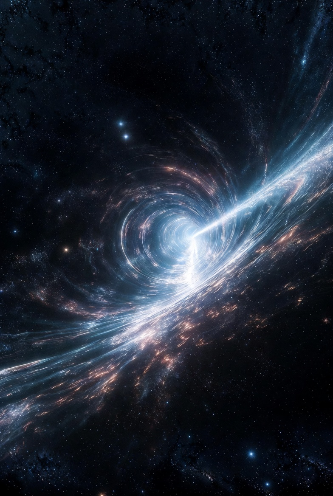
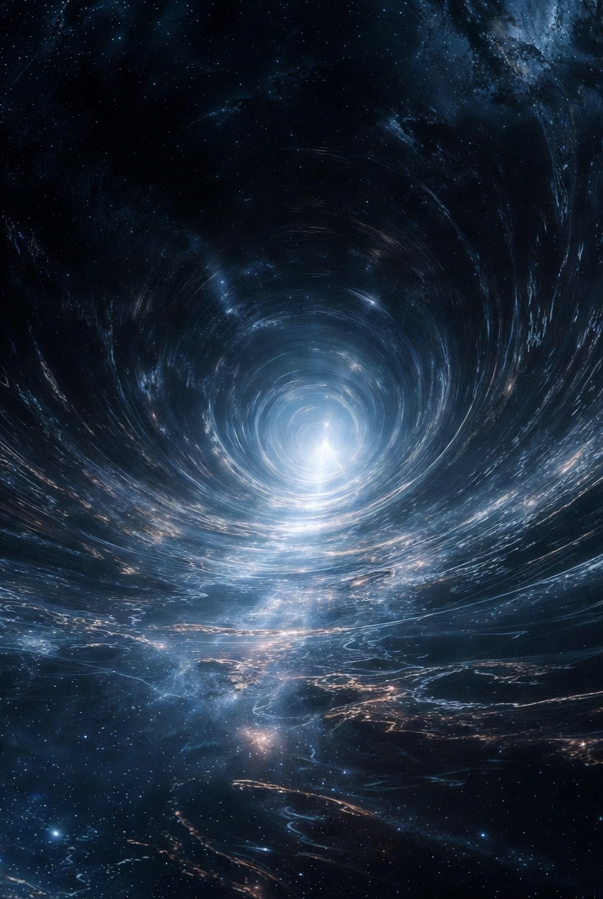
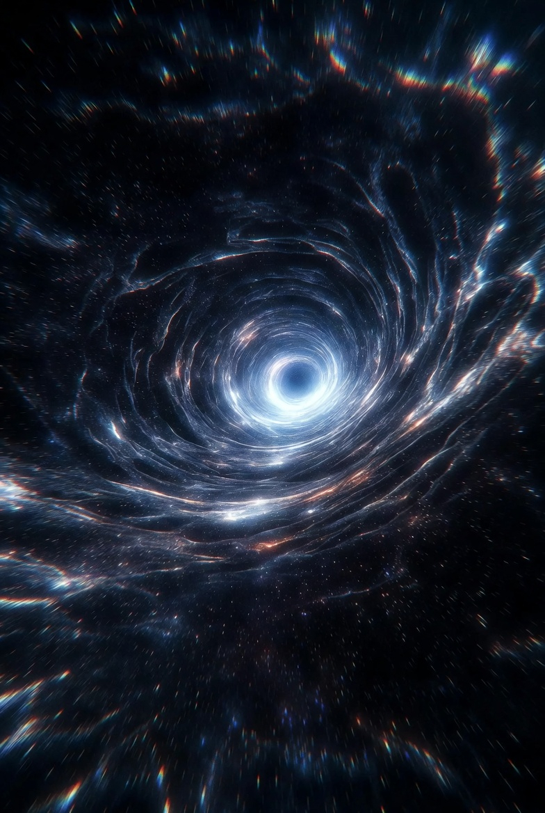
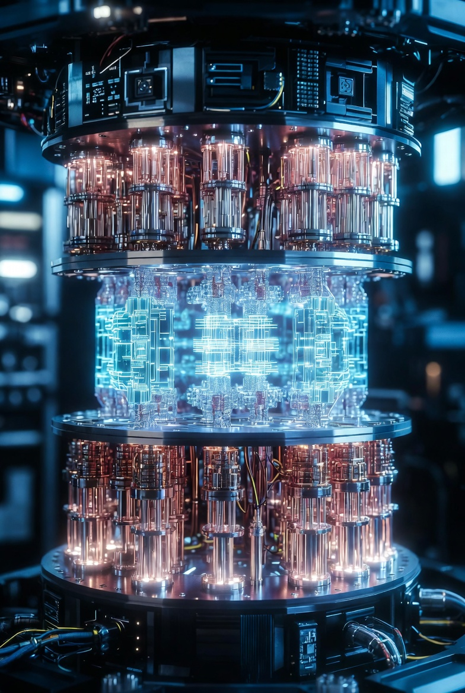
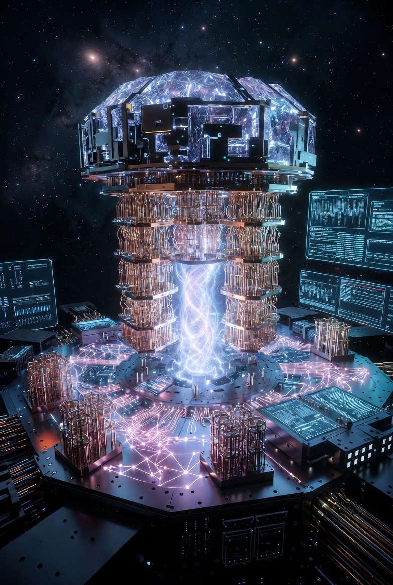

# Artificial Spacetime Manipulation

[Artificial Spacetime Manipulation](https://x.com/skyisuniverse/status/2028485555726532864)

From [my conversation with Grok on Warp-drived Starship](https://x.com/i/grok/share/cdc1453c68324134beb8e748ef73cd8f)

From [my conversation with Grok on artificial SpaceTime manipulation](https://x.com/i/grok/share/430315bd5e234f54a75796c10e988a83)

## Introduction

In general relativity, spacetime curvature is inherently tied to the distribution of mass, energy, momentum, and stress via the stress-energy tensor. Artificially creating or manipulating curvature would require breakthroughs in physics that allow us to engineer this tensor on demand. While current technology limits us to observing natural curvature (e.g., around stars or black holes), hypothetical advancements could enable direct control. These include discovering exotic forms of matter, harnessing quantum effects, or developing high-energy systems. Below, I outline plausible methods based on theoretical models, assuming breakthroughs like stable negative energy production or quantum gravity unification.

## 1. Exotic Matter and Negative Energy Densities

Exotic matter—hypothetically possessing negative mass or energy density—could warp spacetime in ways that defy classical intuition, enabling effects like faster-than-light travel or stable wormholes. Negative energy would violate the weak energy condition in general relativity, allowing spacetime to curve "upward" instead of the usual "downward" dent caused by positive mass.

- **Warp Drives (Alcubierre Metric and Variants)**: Proposed by Miguel Alcubierre in 1994, this involves creating a "warp bubble" where spacetime contracts in front of a spacecraft and expands behind it. The ship remains stationary within flat spacetime inside the bubble, but the bubble moves at superluminal speeds relative to outside observers. Breakthroughs could include generating exotic matter via quantum fluctuations (e.g., amplified Casimir effect, where virtual particles between plates create negative energy). Recent models refine this: A 2024 study suggests warp bubbles using stable matter shells and positive energy distributions, reducing exotic matter needs. Another 2021 proposal by Erik Lentz uses soliton-like structures (self-sustaining waves in spacetime) powered by positive energy alone. A 2025 paper from Applied Physics introduces a physical warp drive model using floating spacetime bubbles, bypassing negative energy entirely.

- **Wormholes**: Traversable wormholes (Einstein-Rosen bridges) could connect distant points by extreme curvature. They require exotic matter to keep the throat open, preventing collapse. Advances might involve threading wormholes with quantum-entangled particles or using dark energy manipulation to stabilize them.

## 2. Electromagnetic and High-Energy Field Generation

Since electromagnetic fields contribute to the stress-energy tensor (per the equivalence principle), intense fields could induce detectable curvature.

- **Superconducting Electromagnets**: A 2016 proposal by André Füzfa suggests stacking large superconductors (like those in the LHC) to create magnetic fields that bend spacetime weakly, measurable via interferometers. Breakthroughs in room-temperature superconductors or fusion power could scale this up, generating artificial gravitational fields for propulsion or levitation.

- **Particle Accelerators and Micro Black Holes**: Future colliders beyond the LHC might achieve energies high enough to form microscopic black holes, which evaporate quickly but demonstrate localized extreme curvature. Manipulating these could involve quantum control to stabilize or direct the curvature.

## 3. Quantum Analog Systems and Simulations

Laboratory analogs simulate curved spacetime without actual gravitational masses, paving the way for real manipulation.

- **Bose-Einstein Condensates (BECs)**: Heidelberg University experiments use ultracold atomic clouds as quantum field simulators. By tuning interactions with magnetic fields, they create effective curved spacetimes where wave propagation mimics gravitational effects like particle production from expanding space. Scaling this with quantum computing breakthroughs could allow "programming" curvature for applications like analog gravity devices.

- **Robophysical Models**: A 2023 study maps robot motion on deformable terrain to relativistic dynamics, tunable via material elasticity and speed. This could evolve into metamaterials that actively warp spacetime at macroscopic scales.

## 4. Reverse-Engineering General Relativity

Using computational methods to design custom spacetimes.

- **Backward Einstein Equations**: Run field equations in reverse to specify desired curvature (e.g., Earth-like gravity inside a spaceship, flat outside) and compute required stress-energy sources. With AI and quantum computers, we could optimize exotic or conventional matter distributions to achieve this, perhaps via nanoscale energy lattices.

## Challenges and Ethical Considerations

These methods face hurdles: Vast energy requirements (e.g., warp drives initially needing Jupiter's mass in energy, though optimized models reduce this), causality violations (e.g., time loops), and horizon problems (e.g., inability to control the bubble from inside). Breakthroughs in quantum gravity (e.g., string theory or loop quantum gravity) could resolve these by quantizing spacetime itself. Ethically, manipulating spacetime risks unintended cosmic effects, like gravitational wave pollution or altering universal expansion.

In summary, while speculative, these approaches leverage extensions of known physics. Future discoveries in exotic matter, quantum tech, or high-energy engineering could make artificial curvature a reality, revolutionizing travel, energy, and our understanding of the universe.

