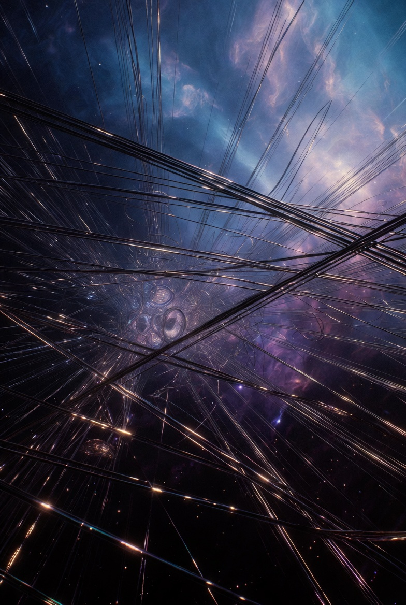
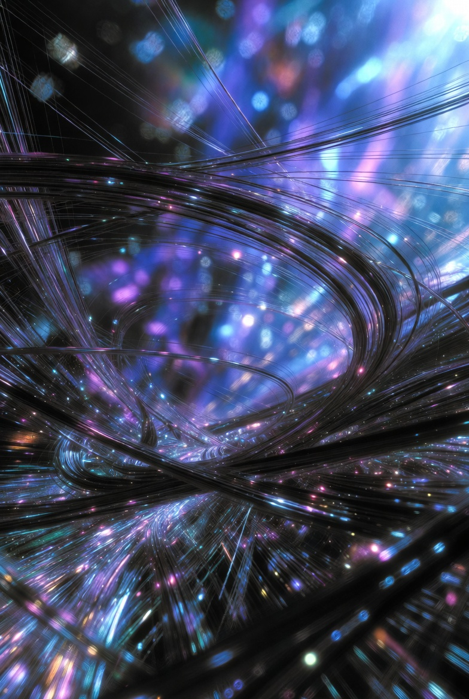
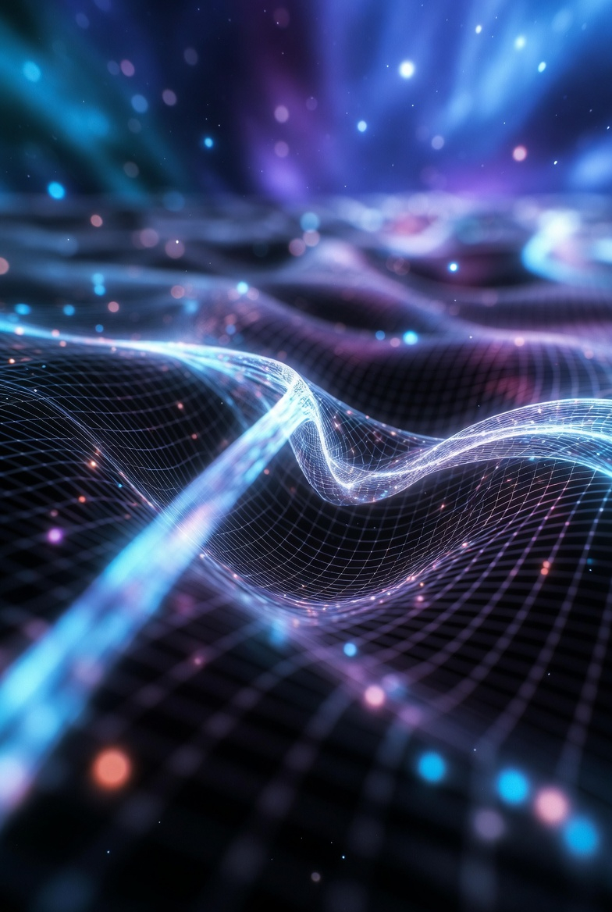

# Encoding Matter as Strings

Article on X: [Encoding Matter as Strings](https://x.com/skyisuniverse/status/2027811869533082106)

From [my conversation with Grok on instant space-travel](https://x.com/i/grok/share/4189c48036d341cb8a11beacd196be5a)

From [my conversation with Grok on Encoding Matter as Strings](https://x.com/i/grok/share/251f752cc8c04b218f91d4c9c095bc42)

## Introduction

In the context of string theory—a theoretical framework in physics aiming to unify quantum mechanics and general relativity—"encoding matter as strings" refers to the idea that all fundamental particles and forms of matter are not point-like entities (as in standard particle physics) but rather manifestations of tiny, one-dimensional vibrating "strings." These strings are the most basic building blocks of the universe, vibrating in higher dimensions (typically 10 or 11 in string theory variants like M-theory) at different frequencies and modes to produce what we observe as different particles, such as electrons, quarks, photons, or even gravitons (the hypothetical carriers of gravity).

## Key Concepts Explained

- **Strings as Fundamental Entities**: Unlike traditional quantum field theory, where particles are excitations of fields (e.g., an electron is a ripple in the electron field), string theory posits that everything arises from these strings themselves. Strings can be open (with endpoints) or closed (loops), and their vibrations determine properties like mass, charge, and spin. For example, a string vibrating in one mode might appear as a photon (light particle), while another mode could manifest as a quark (building block of protons).

- **Excitations and Vibrations**: The term "excitations" here means the quantized vibrational states of the string, similar to how notes on a guitar string vary based on how it's plucked or fretted. hese modes encode the particle's characteristics—higher energy excitations correspond to heavier particles, and the theory naturally includes gravity by producing a spin-2 graviton mode.

- **Encoding Matter**: In a speculative application (like the wormhole transmission we discussed), "encoding matter as strings" would involve mapping the quantum configuration of complex matter (e.g., atoms or objects) back to these fundamental string vibrations, essentially "digitizing" it into a pattern of string states for processes like teleportation or reconstruction. This isn't literal "making" matter into strings (since, in theory, it already is) but representing its structure in string-theoretic terms.

Strings aren't "made of" anything smaller—they're fundamental, though some models explore ideas like "string bits" (point-like components forming strings) or ties to consciousness (more philosophical than scientific). The theory remains unproven experimentally but resolves issues like quantum gravity infinities by giving particles finite size.

---

## Practical Feasibility of Encoding Matter as Strings

From [my conversation with Grok on Practical Feasibility of Encoding Matter as Strings](https://x.com/i/grok/share/70fb86e0df6042f499493c4e7a75b3cd)

> how could encoding matter as strings be practically done? (assuming any possible scientific breakthroughs)

In the highly speculative context of advanced string theory applications—assuming breakthroughs in quantum gravity, nanotechnology, holographic computing, and unified field manipulation—encoding matter as string excitations would involve translating the quantum state of physical objects (from subatomic particles to macroscopic structures) into a representational format based on fundamental string vibrations. This isn't about literally converting atoms into strings (since string theory posits that all matter is already composed of such strings at the Planck scale, approximately 10^{-35} meters) but rather digitizing or mapping their configurations into a "string code" that captures vibrational modes, energies, and interactions for purposes like teleportation, simulation, or reconstruction. Below, I'll outline a practical pathway, step by step, extending theoretical concepts into hypothetical engineering, with breakthroughs enabling scalability from particles to complex systems.

### Theoretical Foundation 

String theory views particles as excitations (vibrational patterns) of one-dimensional strings, where different modes correspond to properties like mass, charge, and spin. For instance, a low-energy excitation might manifest as an electron, while higher modes could represent heavier particles or forces like gravity (via gravitons). Encoding matter practically would leverage this by treating the entire quantum wavefunction of an object as a symphony of these string modes, compressible into data packets. Breakthroughs in quantum simulation (e.g., via advanced quantum computers) and holography (where information is encoded on boundaries) would make this feasible.

### Practical Steps for Encoding

Assuming technologies like Planck-scale scanners (extending current atomic force microscopy), universal quantum simulators (scaled from today's qubit systems), and AI-driven compression algorithms, the process could unfold as follows:

#### 1. Quantum State Scanning and Decomposition:

- Use a hypothetical "String Resonator Scanner"—a device combining ultra-high-resolution quantum tomography (building on current techniques for qubit readout) with nanoscale probes to non-destructively measure the full quantum state of the matter. This would map particles and their interactions (e.g., molecular bonds or entanglement) into effective field theory descriptions, then reduce them to string-theoretic modes via unified equations.

- Breakthrough: Advances in loop quantum gravity or M-theory simulations allow "decomposition" algorithms to translate particle wavefunctions into string oscillator states (e.g., using Fourier-like transforms for vibrations). For a simple atom, this might involve exciting it with calibrated lasers to reveal hidden dimensional resonances, encoding it as a set of mode numbers (n=1 for ground state, higher n for excitations).

#### 2. Mapping to String Vibrational Patterns:

- Employ holographic encoding, inspired by AdS/CFT correspondence, where the 3D matter configuration is projected onto a lower-dimensional "boundary" as string data. AI (e.g., neural networks trained on string landscape simulations) would optimize the mapping, assigning vibrational frequencies, tensions, and orientations in extra dimensions to represent the original structure.

- For complex matter like a biological cell, breakthroughs in quantum biology allow bundling entangled states into "superstring packets," where collective excitations (e.g., for DNA) are encoded as closed-loop string modes. This step ensures fidelity, preserving quantum coherence to avoid information loss.

#### 3. Data Compression and Storage:

- Compress the string code using topological invariants (e.g., from Calabi-Yau manifolds in string theory's extra dimensions) to reduce exponential data volumes. Hypothetical quantum storage media, like entangled photon arrays or brane-inspired metamaterials, hold the encoded patterns without decoherence.

- Breakthrough: Error-correcting codes from bootstrap methods in string theory ensure robustness against noise.

#### 4. Verification and Reconstruction (for Practical Testing):

- Simulate the encoded strings in a quantum computer to verify the mapping, then "excite" vacuum fluctuations (via high-energy fields) to reconstruct the matter, confirming the encoding's accuracy. For applications like wormhole transport, transmit the code through entangled channels.

### Enabling Technologies and Challenges

- **Device Example**: A portable "String Encoder" integrated with nanotech swarms for scanning, powered by zero-point energy taps, could handle human-scale objects in seconds.

- **Hurdles Overcome by Breakthroughs**: Energy scales (Planck-level precision requires immense power) via dark energy harnessing; dimensionality (accessing extra dimensions) via artificial branes; and tachyons/instabilities via supersymmetric stabilizations.

This remains purely theoretical today, as string theory lacks experimental validation, but these steps provide a roadmap if breakthroughs occur.

